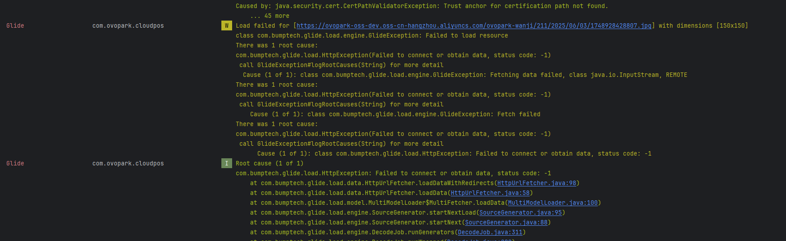
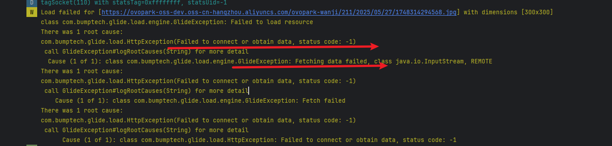
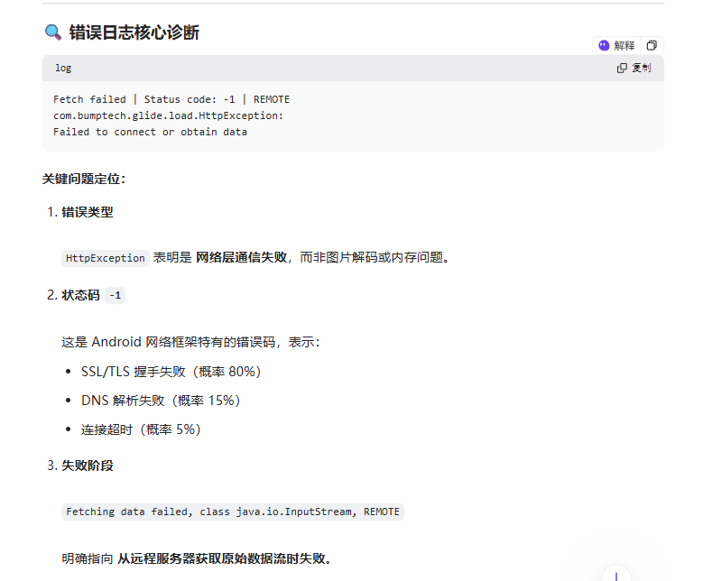
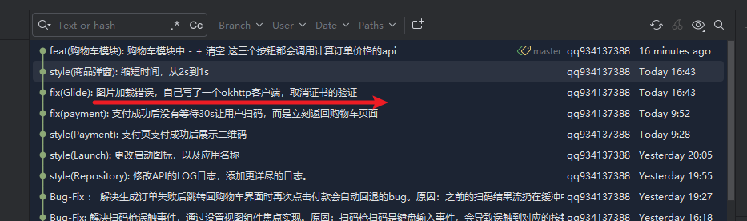
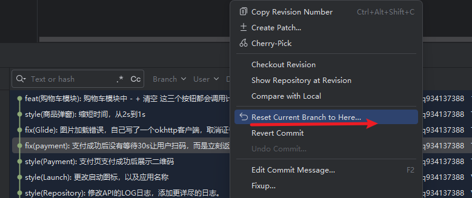
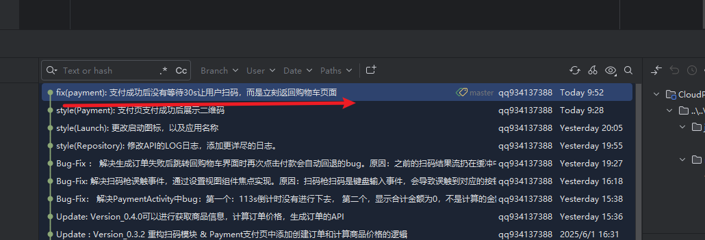

[toc]

## 01.问题记录

- **[严重级别] **

  - [ ] ⚠️ 阻断 (Blocker)：系统崩溃、核心功能完全不可用
  - [ ] 🔴 严重 (Critical)：核心功能受损，无可用替代方案
  - [ ] 🟠 高 (High)：主要功能受影响，但有临时解决方案
  - [x] 🟡 中 (Medium)：次要功能问题，影响用户体验
  - [ ] 🟢 低 (Low)：界面问题或轻微异常，不影响功能

- **问题简要描述**

  - **Bug ID**：`BUG-20240606-001`  
  - **发现日期**：2025-06-06  
  - **影响版本**：v0.4.0 (build 450)  
  - **提交人**：@panruiqi  
  - **状态**：⌛ 修复中

- **问题现象**

  - MainActivity中多次重复点击- 或 +号导致

  - 系统日志报错：
    - 
  - 06/04日采用自建OkHttp客户端，并取消对应的握手检测，成功接收到图片。但是仍然无法处理加载出入码，因此回滚到最初的状态。
  - 在Android 13设备出现

- **环境特征**

  - 设备型号: rk3562_t
  - OS版本: Android 13 (API 34)
  - 网络环境: 公司内网
  - 用户账户: primary_user (ID:0)
  - 触发时机: 系统启动时

## 02.问题分析

### 2.1 日志分析

- 

### 2.2 根本原因推理

- 核心问题：SSL证书验证失败

  - ```
    Trust anchor for certification path not found
    ```

  - 这个错误表示：Android系统在验证阿里云OSS服务器的SSL证书时，无法找到证书链中根证书对应的"信任锚点"。

- 为什么会出现这问题？

  - 证书验证过程：

    - 服务器提供SSL证书 → 证书链验证 → 查找根证书 → 检查是否在系统信任列表中

  - 可能的原因：

    - 阿里云OSS的证书链不完整

    - 证书的根CA不在Android系统的信任存储中

    - 证书可能使用了较新的CA，旧版Android系统不认识

    - 网络环境问题（代理、防火墙等）

- Glide和这个问题的关联

  - ```
    Glide.load(url) → HttpUrlFetcher → HttpURLConnection → SSL握手 → 证书验证失败
    ```

  - Glide本身只是图片加载库

  - 底层网络请求使用Android系统的HttpURLConnection

  - SSL验证是Android系统层面的行为

  - Glide只是"受害者"，真正的问题在网络层

- 初步问题判断：

  - 

## 03.代码分析

### 3.1 关联代码路径

### 3.2 可疑修改点

## 04.复现步骤


## 05.原因初步分析

### 5.1 第一次分析

- 机器本身错误，包含：机器 + 内网这两个部分。非程序的问题，因此需要去开一个浏览器验证。
- 内网部分：

### 5.2 第二次分析

- 主机中缺少对应的证书。


## 06.解决方案尝试

### 6.1 已尝试方案

| 尝试方案        | 执行命令 | 结果   | 验证时间         |
| :-------------- | :------- | :----- | :--------------- |
| 更换网口        |          | ❌ 失败 | 2025-06-04 11:20 |
| 转换https为http |          | ❌ 失败 | 2025-06-04 14:20 |
|                 |          |        |                  |

### 6.2 推荐方案

- 打算
- 
- 
- 


## 07.根本原因和修复

### 7.1 最终定位

- 

- 

### 7.2 修复方案


## 08.经验总结

### 8.1 技术原理

### 8.2 预防措施

### 8.3 卸载规范

### 8.4 调试技巧

