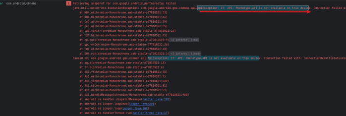

[toc]

## 01.程序自启动失败

- 现象：平板启动后，应用程序通过service检测网络状态，网络连接成功则自启动，也就是调用startActivity。

- 日志：

  - ```
    2025-06-04 10:54:58.654  1446-1446  (LogManager.kt:149) i   com.ovopark.cloudpos                 I  (MyApplication.kt:40) onCreate() Application onCreate completed
    2025-06-04 10:54:58.664  1446-1446  (LogManager.kt:149) i   com.ovopark.cloudpos                 I  (MyApplication.kt:56) logNetworkStatus() 当前网络状态: 已连接
    2025-06-04 10:54:58.670  1446-1446  (LogManager.kt:149) i   com.ovopark.cloudpos                 I  (MyApplication.kt:60) logNetworkStatus() 网络类型: 以太网
    2025-06-04 10:54:58.678  1446-1446  (LogManager.kt:149) i   com.ovopark.cloudpos                 I  (BootReceiver.kt:21) onReceive() 系统启动完成，检查网络连接
    2025-06-04 10:54:58.684  1446-1446  (LogManager.kt:149) i   com.ovopark.cloudpos                 I  (BootReceiver.kt:24) onReceive() 网络已连接，启动应用
    2025-06-04 10:54:58.690  1446-1446  (LogManager.kt:149) i   com.ovopark.cloudpos                 I  (BootReceiver.kt:66) launchApp() 获取到启动 Intent: ComponentInfo{com.ovopark.cloudpos/com.ovopark.cloudpos.ui.splash.SplashActivity}
    2025-06-04 10:54:58.695  1446-1446  (LogManager.kt:149) i   com.ovopark.cloudpos                 I  (BootReceiver.kt:69) launchApp() 开始启动应用...
    2025-06-04 10:54:58.700   508-783   ActivityTaskManager     system_server                        I  START u0 {act=android.intent.action.MAIN cat=[android.intent.category.LAUNCHER] flg=0x10000000 pkg=com.ovopark.cloudpos cmp=com.ovopark.cloudpos/.ui.splash.SplashActivity} from uid 10083
    2025-06-04 10:54:58.702   508-783   ActivityTaskManager     system_server                        W  Background activity start [callingPackage: com.ovopark.cloudpos; callingUid: 10083; appSwitchState: 2; isCallingUidForeground: false; callingUidHasAnyVisibleWindow: false; callingUidProcState: RECEIVER; isCallingUidPersistentSystemProcess: false; realCallingUid: 10083; isRealCallingUidForeground: false; realCallingUidHasAnyVisibleWindow: false; realCallingUidProcState: RECEIVER; isRealCallingUidPersistentSystemProcess: false; originatingPendingIntent: null; allowBackgroundActivityStart: false; intent: Intent { act=android.intent.action.MAIN cat=[android.intent.category.LAUNCHER] flg=0x10000000 pkg=com.ovopark.cloudpos cmp=com.ovopark.cloudpos/.ui.splash.SplashActivity }; callerApp: ProcessRecord{b31f3f9 1446:com.ovopark.cloudpos/u0a83}; inVisibleTask: false]
    2025-06-04 10:54:58.720  1446-1446  (LogManager.kt:149) i   com.ovopark.cloudpos                 I  (BootReceiver.kt:71) launchApp() 应用启动命令执行成功！
    2025-06-04 10:54:58.725  1446-1446  Choreographer           com.ovopark.cloudpos                 I  Skipped 31 frames!  The application may be doing too much work on its main thread.
    2025-06-04 10:54:59.042   508-989   ActivityManager         system_server                        I  com.android.managedprovisioning is exempt from freezer
    2025-06-04 10:54:59.063   508-549   ActivityManager         system_server                        I  Start proc 1669:com.android.managedprovisioning/u0a15 for broadcast {com.android.managedprovisioning/com.android.managedprovisioning.BootReminder}
    
    ```

- 分析：

  - BootReceiver 正常工作

    - ```
      10:54:58.678 - 系统启动完成，检查网络连接
      10:54:58.684 - 网络已连接，启动应用  
      10:54:58.690 - 获取到启动 Intent: ComponentInfo{com.ovopark.cloudpos/com.ovopark.cloudpos.ui.splash.SplashActivity}
      10:54:58.720 - 应用启动命令执行成功！
      ```

  - 系统确实执行了启动

    - ```
      10:54:58.700 ActivityTaskManager - START u0 {act=android.intent.action.MAIN...cmp=com.ovopark.cloudpos/.ui.splash.SplashActivity}
      ```

  - 但是后台启动限制警告：

    - ```
      Background activity start [callingPackage: com.ovopark.cloudpos...allowBackgroundActivityStart: false]
      ```

  - 这说明 Android 系统阻止了后台启动 Activity。这是 Android 10+ (API 29+) 的安全限制。

## 02.**启动谷歌浏览器下载内容失败**

- 优先级：低，这个问题可以往后放，因为这不是你们的问题，可以通过装一个夸克浏览器解决。
- 现象描述：C**hrome浏览器启动了，但遇到多个Google Play Services相关错误** **ApiException: 17: API: Phenotype.API is not available on this device** **猜测是：****Chrome在该设备上可能缺少必要的Google服务支持**

- 日志：
  - 