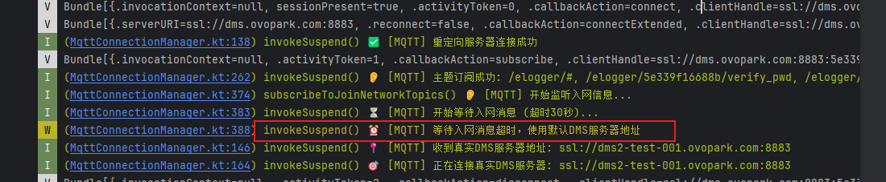
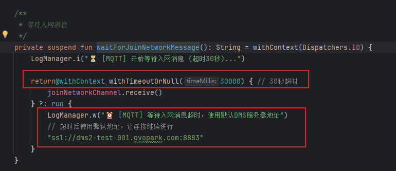
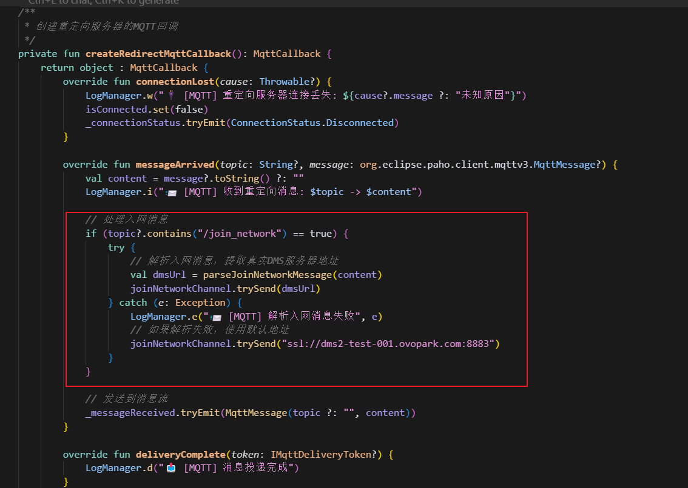
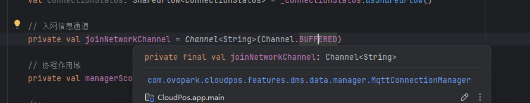
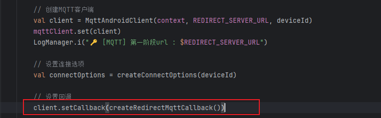
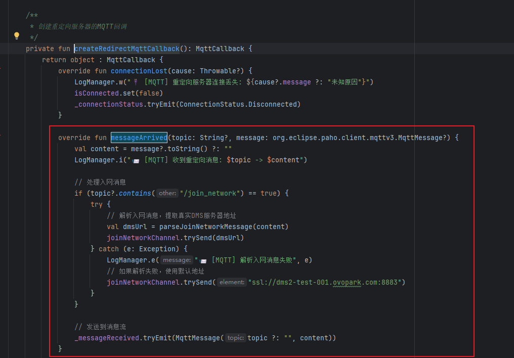

[toc]

## 01.功能概述

- **[优先级] **

  - [ ] ⚠️ 阻断 (Blocker)：系统崩溃、核心功能完全不可用
  - [ ] 🔴 严重 (Critical)：核心功能受损，无可用替代方案
  - [ ] 🟠 高 (High)：主要功能受影响，但有临时解决方案
  - [ ] 🟡 中 (Medium)：次要功能问题，影响用户体验
  - [ ] 🟢 低 (Low)：界面问题或轻微异常，不影响功能

- **问题简要描述**

  - **Bug ID**：`BUG-20240630-001`  
  - **发现日期**：2025-06-30
  - **影响版本**：v0.2.0
  - **提交人**：@panruiqi
  - **状态**：
    - [x] ⌛ 修复中 /
    - [ ] ✅ 已解决 / 
    - [ ] ❌ 无法复现  

- **问题现象**

  - 

- 影响范围：

  - 正式服MQTT心跳模块，测试服不存在问题，正常处理

- 影响时间线

  - 

## 02.问题分析

### 2.1 初步分析

定位代码位置：

- 
- 目前是卡在入网这个位置，超过了30s没返回值，所以使用默认的DMS服务器地址。

MQTT入网回调：

- 

关键日志如下：

- ```
  I  (MqttConnectionManager.kt:105) 📞 [MQTT] 正在连接重定向服务器...
  I  (MqttConnectionManager.kt:118) 🔑 [MQTT] 第一阶段url : ssl://dms.ovopark.com:8883
  I  (MqttConnectionManager.kt:138) ✅ [MQTT] 重定向服务器连接成功
  I  (MqttConnectionManager.kt:262) 👂 [MQTT] 主题订阅成功: /elogger/#, /elogger/5e339f16688b/verify_pwd, /elogger/5e339f16688b/join_network, /elogger/5e339f16688b/ctrlDevice
  I  (MqttConnectionManager.kt:383) ⏳ [MQTT] 开始等待入网消息 (超时30秒)...
  W  (MqttConnectionManager.kt:388) ⏰ [MQTT] 等待入网消息超时，使用默认DMS服务器地址
  ```

### 2.2 根本原因推理

- MQTT连接流程正常，但入网消息超时

  - ```
    I  (MqttConnectionManager.kt:105) 📞 [MQTT] 正在连接重定向服务器...
    I  (MqttConnectionManager.kt:118) 🔑 [MQTT] 第一阶段url : ssl://dms.ovopark.com:8883
    I  (MqttConnectionManager.kt:138) ✅ [MQTT] 重定向服务器连接成功
    I  (MqttConnectionManager.kt:262) 👂 [MQTT] 主题订阅成功: /elogger/#, /elogger/5e339f16688b/verify_pwd, /elogger/5e339f16688b/join_network, /elogger/5e339f16688b/ctrlDevice
    I  (MqttConnectionManager.kt:383) ⏳ [MQTT] 开始等待入网消息 (超时30秒)...
    W  (MqttConnectionManager.kt:388) ⏰ [MQTT] 等待入网消息超时，使用默认DMS服务器地址
    ```

服务端没有发送入网消息

- 等待入网消息逻辑

  - ```
    private suspend fun waitForJoinNetworkMessage(): String = withContext(Dispatchers.IO) {
        LogManager.i("⏳ [MQTT] 开始等待入网消息 (超时30秒)...")
        
        return@withContext withTimeoutOrNull(30000) { // 30秒超时
            joinNetworkChannel.receive()
        } ?: run {
            LogManager.w("⏰ [MQTT] 等待入网消息超时，使用默认DMS服务器地址")
            // 超时后使用默认地址，让连接继续进行
            "ssl://dms2-test-001.ovopark.com:8883"
        }
    }
    ```

  - 

- 入网消息处理逻辑

  - 
  - 
  - 当MQTT收到任何消息时，都会调用 messageArrived。

  - 如果消息的 topic 包含 /join_network，说明这是“入网消息”。

  - 这时会解析消息内容，提取DMS服务器地址，然后用 joinNetworkChannel.trySend(dmsUrl) 把地址发送到Channel里。

  - 这样，等待在 joinNetworkChannel.receive() 的协程就会被唤醒，拿到真实的DMS服务器地址。

- 原因分析：

  - 服务端配置问题：
    - 重定向服务器 ssl://dms.ovopark.com:8883 可能没有配置为该设备ID (5e339f16688b) 发送入网消息
    - 或者入网消息的主题格式与客户端期望不匹配
  - 设计本身是容错的：
    - 系统设计了30秒超时后使用默认地址 ssl://dms2-test-001.ovopark.com:8883
    - 最终还是成功连接到了DMS服务器并开始心跳

- 问题排查：排查服务端配置

  - 检查重定向服务器是否为设备ID 5e339f16688b 配置了入网消息推送

  - 确认入网消息的JSON格式和serverUrl字段

### 2.3 进一步分析

- 问题定位：确定为，设备未入网。
- 理解流程：Pos机MQTT连接 重定向服务器。正式服中：重定向服务器需要向郁莹华一侧查询设备入网状态。查询成功后向我们发送一个密码，通过/verify_pwd主题。我们要本地进行校验（密码 + 时间戳）。  郭运起一侧只有查询入网状态成功，才可以发送重定向地址。
- 这就是为什么查询重定向地址一直失败的原因
- 因此我们缺少：
  - 郁莹华一侧Pos机入网（待和郁莹华沟通）
  - 订阅/verify_pwd主题进行密码校验（Pos机这一类型采用同一个密码，而非每台机子一个），密码需要和郁莹华沟通确认
  - 


## 03.代码分析

### 3.1 关联代码路径

- 

### 3.2 可疑修改点

- 

## 04.复现步骤


## 05.解决方案尝试

### 5.1 第一次解决方案

- 分析：
  - 
- 解决方案：
  - 
- 结果：
  - 

### 5.2 第二次解决方案

- 分析：
- 解决方案：
  - 
- 结果：
  - 

### 5.3 第三次解决方案

- 分析：
  - 
- 解决方案：
  - 
- 结果：
  - 

### 5.4 第四次解决方案

- 分析：
  - 

- 解决方法：
  - 
- 结果：
  - 

### 5.4 第五次解决方案

- 分析：
  - 
- 解决方案：
  - 
- 结果：成功解决问题


## 06.进一步思考

### 6.1 有没有其他更优雅的方案

- 

### 6.2 推荐方案


## 07.根本原因和修复

### 7.1 最终定位

- 


### 7.2 修复方案


## 08.经验总结

### 8.1 技术原理

### 8.2 预防措施

### 8.3 卸载规范

### 8.4 调试技巧


