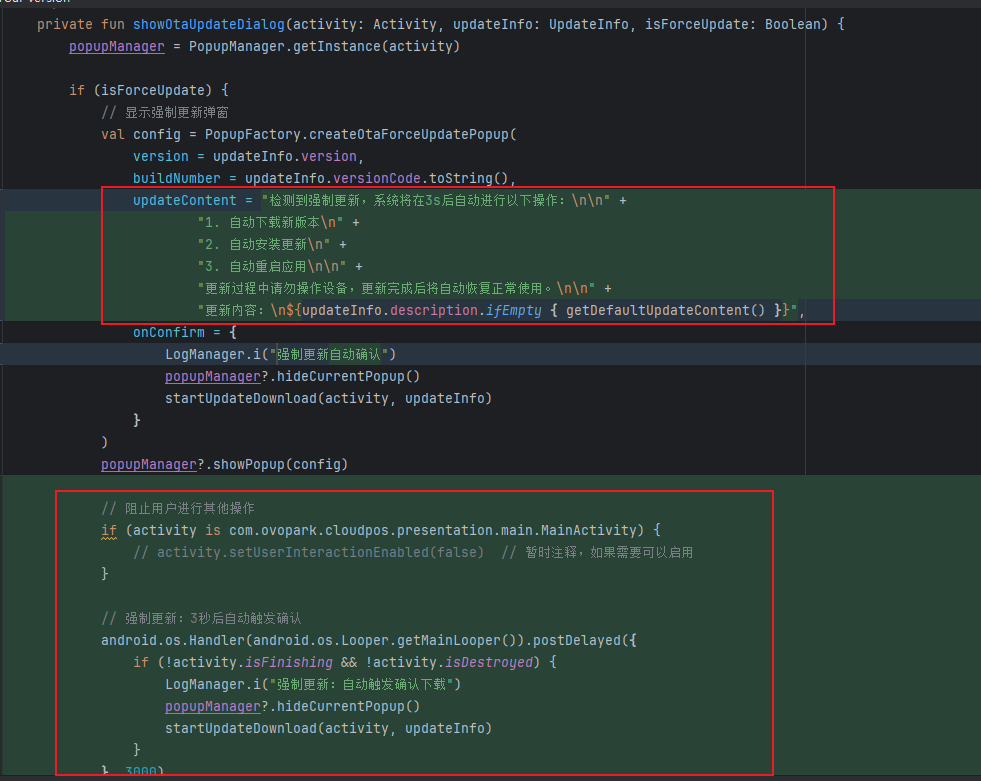

[toc]

## 01.功能概述

- **功能ID**：`FEAT-20250714-001`  
- **功能名称**：
- **目标版本**：v0.2.0
- **提交人**：@panruiqi  
- **状态**：
  - [x] ⌛ 设计中 /
  - [ ] ⌛ 开发中 / 
  - [ ] ✅ 已完成 / 
  - [ ] ❌ 已取消  
- **价值评估**：  
  - [x] ⭐⭐⭐⭐⭐ 核心业务功能  
  - [ ] ⭐⭐⭐⭐ 用户体验优化  
  - [ ] ⭐⭐⭐ 辅助功能增强  
  - [ ] ⭐⭐ 技术债务清理  
- **功能描述** 
  - 打开APP检测版本，它能不能做到自动升级（下载 安装 重启）

## 02.需求分析

### 2.1 用户场景

- **主要场景**：  

  - 企业IT管理员/连锁门店设备维护员
    - 批量管理数百台设备（如商场POS机）
    - 确保所有设备强制升级至合规版本
  - 非技术背景普通用户
    - 手动更新需经过「点击更新→等待安装→重启」多步操作
    - 易忽略更新提醒导致使用旧版（如安全漏洞未修复）

- **边界场景**：  

  - 网络不稳定时的断点续传

  - 安装权限被禁用时的处理

  - 设备存储空间不足时的清理

### 2.2 功能范围

- ✅ 包含：

  - 定时自动版本检查

  - 无感知自动下载和安装

  - 自动重启应用

  - 强制升级策略

- ❌ 不包含：

  - 系统级重启（需要root权限）

  - 回退到旧版本

## 03.技术方案

### 3.0 当前架构分析

- 缺乏自动化：需要用户手动确认更新
- 无定时检查：只在应用启动时检查版本
- 缺乏批量管理：无法统一管理多设备

### 3.1 方案一：渐进式自动化（推荐）

实现思路：

- 在现有架构基础上，逐步增强自动化能力

- 保持向后兼容，不破坏现有功能

- 通过配置开关控制自动化程度

核心组件：

1. AutoUpdateManager - 自动更新管理器

1. AutoUpdateScheduler - 定时任务调度器

1. AutoUpdatePolicy - 自动更新策略

1. DeviceRestartManager - 设备重启管理器

### 3.2 方案二：全新重构方案

实现思路：

- 重新设计OTA架构，完全面向自动化

- 采用更先进的任务队列和状态管理

- 支持更复杂的升级策略

考虑因素：

- 开发成本高，风险大

- 需要大量测试验证

- 可能影响现有业务稳定性

### 3.3 方案三：选择原有方案

实现思路：

- 他就是一个Android Pos机，不需要考虑过分复杂的情况，目前只要考虑启动时进行自动更新即可，关键是这个自动更新过程中要做到强制，即：用户不能执行其他操作，我目前打算：通过强制自动更新实现，当OTA检测到是强制更新时，自动进行下载和安装的流程。
- 考量原有OTA模块设计
- 目前可以选择进行强制更新，在强制更新弹窗显示后，自动触发onConfirm点击事件。这样就能实现真正的"强制自动更新"。

## 04.实现规划

### 4.1 技术选型

方案三

### 4.2 任务拆解

UpdateManager中增加逻辑如下：

- 

### 4.3 代码路径

## 05.兼容性设计

### 5.1 设备适配

### 5.2 冲突检查

## 06.测试方案

### 6.1 核心用例

### 6.2 性能指标

## 07.发布计划

### 7.1 阶段发布

### 7.2 回滚方案

## 08.文档记录

### 8.1 技术文档

### 8.2 用户文档

### 8.3 监控埋点

