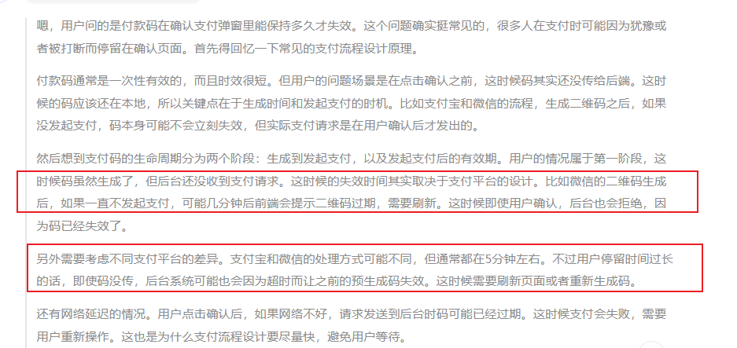

[toc]

## 01.功能概述

- **功能ID**：`FEAT-20250702-001`  
- **功能名称**：购物车页快速支付模块
- **目标版本**：v0.3.0
- **提交人**：@panruiqi  
- **状态**：
  - [x] ⌛ 设计中 /
  - [ ] ⌛ 开发中 / 
  - [ ] ✅ 已完成 / 
  - [ ] ❌ 已取消  
- **价值评估**：  
  - [x] ⭐⭐⭐⭐⭐ 核心业务功能  
  - [ ] ⭐⭐⭐⭐ 用户体验优化  
  - [ ] ⭐⭐⭐ 辅助功能增强  
  - [ ] ⭐⭐ 技术债务清理  
- **功能描述** 
  - POS机扫码的时候，用户扫完商品，不需要点击确认支付按钮，直接扫收款码也可确认完成支付。也就是快速支付模块，现有流程保留并存。

## 02.需求分析

### 2.1 用户场景

- **主要场景**：  

  - 用户A扫描了一些商品，购物车有商品，显示购物车页面

  - 此时，用户A希望购物效率更高，不惦记确认支付按钮，其直接扫码付款码，然后直接点击按钮支付

- **边界场景**：  

### 2.2 功能范围

- ✅ 包含：
- ❌ 不包含：

## 03.技术方案

### 3.0 问题点

现在我扫了付款码，但是不直接付款，而是处在确认支付弹窗中，等待用户点击确认支付后去将付款码传递给后端进行付款操作，那么请问，这个付款码他最多可以保持多久？

- 

整体流程如何？

- 只有购物车金额  > 0时，检测到付款码才去处理。
- 检测到付款码时，要计算价格，生成订单，然后一切成功后弹出弹窗
- 弹出一个带计时器的弹窗，样式模仿Payment页。
- 弹窗有超时取消，无需状态设计，隐藏弹窗即可
- 用户可以点击 ×， 取消订单。也可以点击支付按钮，此时我们进行支付请求。
- 支付中的时候显示支付中逻辑
- 支付成功后显示支付成功的样式（样式模仿payment页）

整体状态如何设计呢？

- 如果使用状态机。

### 3.1 方案一

- 实现思路：

  - 

  - ```
    core - 核心组件
        State定义
        Event定义 
        基础数据模型
    storage - 数据存储层
        DataStore
        DataKey
        扩展函数
    machine - 状态机实现
        StateMachine
        Context接口
        StateHandler
    validation - 验证层
        DataValidator
        各种验证规则
    ```

    

### 3.2 方案二

- 实现思路：


## 04.实现规划

### 4.1 技术选型


### 4.2 任务拆解

QuickPayState（状态机状态）

- 状态定义

  - **初始状态（idle）**：购物车为空或未检测到付款码。
  - **检测到付款码（detected）**：当购物车有商品且检测到付款码时，进入此状态。在此状态下，我们需要计算价格、生成订单（调用后端API），然后准备弹窗。
  -  **弹窗显示（confirming）**：订单生成成功后，显示弹窗。弹窗带有计时器（比如5分钟倒计时）。在这个状态下，用户可以选择取消（点击×）或确认支付（点击支付按钮）。
  -  **支付中（paying）**：用户点击支付按钮后，进入支付中状态。此时应显示支付中的UI，并向后端发起支付请求。
  -  **支付成功（success）**：支付请求成功返回后，显示支付成功页面。
  -  **取消（cancelled）**：用户点击×或弹窗超时自动取消，此时需要隐藏弹窗，并可能取消订单（根据后端需求，可能需要调用取消订单的API）。
  -  **错误状态（error）**：在生成订单或支付过程中出现错误，应进入错误状态，显示错误信息。

- 代码

  - ```
    /**
     * 快速支付状态 - 纯状态，不携带数据
     */
    sealed class QuickPayStateV2 {
        /** 空闲状态 */
        object Idle : QuickPayStateV2()
        
        /** 检测到付款码状态 */
        object PaymentCodeDetected : QuickPayStateV2()
        
        /** 创建订单中状态 */
        object CreatingOrder : QuickPayStateV2()
        
        /** 等待用户确认状态 */
        object AwaitingConfirmation : QuickPayStateV2()
        
        /** 支付处理中状态 */
        object ProcessingPayment : QuickPayStateV2()
        
        /** 支付成功状态 */
        object PaymentSuccessful : QuickPayStateV2()
        
        /** 已取消状态 */
        object Cancelled : QuickPayStateV2()
        
        /** 错误状态 */
        object Failed : QuickPayStateV2()
    }
    ```

但是这个过程中我们需要携带对应的数据啊

- 我们来一个快速支付的数据存储类

- ```
  /**
   * 快速支付数据存储
   * 
   * 使用类型安全的键值存储，支持任意数据类型
   */
  class QuickPayDataStore {
      
      companion object {
          // 预定义的数据键，提供类型安全
          val PAYMENT_CODE = DataKey<String>("payment_code")
          val PAYMENT_TYPE = DataKey<PaymentType>("payment_type")
          val CART_ITEMS = DataKey<List<CartItem>>("cart_items")
          val ORDER_INFO = DataKey<QuickPayOrderInfo>("order_info")
          val ORDER_CREATION_PROGRESS = DataKey<Float>("order_creation_progress")
          val COUNTDOWN_SECONDS = DataKey<Int>("countdown_seconds")
          val PAYMENT_RESULT = DataKey<PaymentResult>("payment_result")
          val ERROR_INFO = DataKey<QuickPayError>("error_info")
          val CANCEL_REASON = DataKey<CancelReason>("cancel_reason")
          val SESSION_START_TIME = DataKey<Long>("session_start_time")
      }
      
      private val storage = mutableMapOf<String, Any>()
      
      /**
       * 存储数据
       */
      fun <T> put(key: DataKey<T>, value: T) {
          storage[key.name] = value as Any
      }
      
      /**
       * 获取数据
       */
      @Suppress("UNCHECKED_CAST")
      fun <T> get(key: DataKey<T>): T? {
          return storage[key.name] as? T
      }
      
      /**
       * 获取数据，如果不存在则返回默认值
       */
      fun <T> getOrDefault(key: DataKey<T>, defaultValue: T): T {
          return get(key) ?: defaultValue
      }
      
      /**
       * 移除数据
       */
      fun <T> remove(key: DataKey<T>): T? {
          @Suppress("UNCHECKED_CAST")
          return storage.remove(key.name) as? T
      }
      
      /**
       * 检查是否包含某个键
       */
      fun <T> contains(key: DataKey<T>): Boolean {
          return storage.containsKey(key.name)
      }
      
      /**
       * 清空所有数据
       */
      fun clear() {
          storage.clear()
      }
      
      /**
       * 获取所有键
       */
      fun getAllKeys(): Set<String> {
          return storage.keys.toSet()
      }
      
      /**
       * 创建数据快照
       */
      fun createSnapshot(): Map<String, Any> {
          return storage.toMap()
      }
      
      /**
       * 从快照恢复数据
       */
      fun restoreFromSnapshot(snapshot: Map<String, Any>) {
          storage.clear()
          storage.putAll(snapshot)
      }
  }
  
  /**
   * 类型安全的数据键
   */
  data class DataKey<T>(val name: String)
  
  /**
   * 数据存储的便捷扩展函数
   */
  
  // 付款码相关
  fun QuickPayDataStore.storePaymentCode(code: String, type: PaymentType) {
      put(QuickPayDataStore.PAYMENT_CODE, code)
      put(QuickPayDataStore.PAYMENT_TYPE, type)
  }
  
  fun QuickPayDataStore.getPaymentCode(): String? = get(QuickPayDataStore.PAYMENT_CODE)
  fun QuickPayDataStore.getPaymentType(): PaymentType? = get(QuickPayDataStore.PAYMENT_TYPE)
  
  // 购物车相关
  fun QuickPayDataStore.storeCartItems(items: List<CartItem>) {
      put(QuickPayDataStore.CART_ITEMS, items)
  }
  
  fun QuickPayDataStore.getCartItems(): List<CartItem> = 
      getOrDefault(QuickPayDataStore.CART_ITEMS, emptyList())
  
  // 订单相关
  fun QuickPayDataStore.storeOrderInfo(orderInfo: QuickPayOrderInfo) {
      put(QuickPayDataStore.ORDER_INFO, orderInfo)
  }
  
  fun QuickPayDataStore.getOrderInfo(): QuickPayOrderInfo? = get(QuickPayDataStore.ORDER_INFO)
  
  // 进度相关
  fun QuickPayDataStore.updateProgress(progress: Float) {
      put(QuickPayDataStore.ORDER_CREATION_PROGRESS, progress)
  }
  
  fun QuickPayDataStore.getProgress(): Float = 
      getOrDefault(QuickPayDataStore.ORDER_CREATION_PROGRESS, 0f)
  
  // 倒计时相关
  fun QuickPayDataStore.updateCountdown(seconds: Int) {
      put(QuickPayDataStore.COUNTDOWN_SECONDS, seconds)
  }
  
  fun QuickPayDataStore.getCountdownSeconds(): Int = 
      getOrDefault(QuickPayDataStore.COUNTDOWN_SECONDS, 0)
  
  // 结果相关
  fun QuickPayDataStore.storePaymentResult(result: PaymentResult) {
      put(QuickPayDataStore.PAYMENT_RESULT, result)
  }
  
  fun QuickPayDataStore.getPaymentResult(): PaymentResult? = get(QuickPayDataStore.PAYMENT_RESULT)
  
  // 错误相关
  fun QuickPayDataStore.storeError(error: QuickPayError) {
      put(QuickPayDataStore.ERROR_INFO, error)
  }
  
  fun QuickPayDataStore.getError(): QuickPayError? = get(QuickPayDataStore.ERROR_INFO)
  
  // 会话相关
  fun QuickPayDataStore.markSessionStart() {
      put(QuickPayDataStore.SESSION_START_TIME, System.currentTimeMillis())
  }
  
  fun QuickPayDataStore.getSessionDuration(): Long {
      val startTime = get(QuickPayDataStore.SESSION_START_TIME) ?: return 0L
      return System.currentTimeMillis() - startTime
  }
  
  /**
   * 数据验证器
   */
  object QuickPayDataValidator {
      
      /**
       * 验证是否可以开始快速支付
       */
      fun canStartQuickPay(dataStore: QuickPayDataStore): Boolean {
          val cartItems = dataStore.getCartItems()
          return cartItems.isNotEmpty()
      }
      
      /**
       * 验证是否可以创建订单
       */
      fun canCreateOrder(dataStore: QuickPayDataStore): Boolean {
          return dataStore.contains(QuickPayDataStore.PAYMENT_CODE) && 
                 dataStore.contains(QuickPayDataStore.PAYMENT_TYPE) &&
                 dataStore.getCartItems().isNotEmpty()
      }
      
      /**
       * 验证是否可以处理支付
       */
      fun canProcessPayment(dataStore: QuickPayDataStore): Boolean {
          return dataStore.contains(QuickPayDataStore.ORDER_INFO) && 
                 dataStore.contains(QuickPayDataStore.PAYMENT_CODE)
      }
  } 
  ```

  

- 

  状态转移图：

  \- 初始状态（idle） -> 检测到付款码（detected）：当购物车金额>0且检测到付款码时。

  \- 检测到付款码（detected） -> 弹窗显示（confirming）：订单生成成功。

  \- 检测到付款码（detected） -> 错误状态（error）：生成订单失败。

  \- 弹窗显示（confirming） -> 支付中（paying）：用户点击支付按钮。

  \- 弹窗显示（confirming） -> 取消（cancelled）：用户点击×或倒计时结束。

  \- 支付中（paying） -> 支付成功（success）：支付成功。

  \- 支付中（paying） -> 错误状态（error）：支付失败（包括超时、网络错误、余额不足等）。

  \- 支付成功（success） -> 初始状态（idle）：成功页面显示一段时间后自动跳转，或者用户手动关闭后回到初始状态。

  \- 错误状态（error） -> 初始状态（idle）：错误信息显示一段时间后自动跳转，或者用户手动关闭后回到初始状态。

UI逻辑

- 采用popup模块

### 4.3 代码路径


## 05.兼容性设计

### 5.1 设备适配


### 5.2 冲突检查


## 06.测试方案

### 6.1 核心用例

```
package com.ovopark.cloudpos.features.popup

import android.app.Activity
import android.os.CountDownTimer
import android.os.Handler
import android.os.Looper
import android.view.LayoutInflater
import android.view.View
import android.view.ViewGroup
import android.view.animation.AnimationUtils
import android.widget.FrameLayout
import com.ovopark.cloudpos.R
import com.ovopark.cloudpos.core.logging.LogManager
import java.util.concurrent.ConcurrentLinkedQueue

/**
 * 弹窗管理器 - 每个Activity拥有独立的实例
 * 核心特性：
 * 1. 智能优先级管理
 * 2. 同类抢占机制
 * 3. 动态容器创建
 * 4. 完全数据驱动
 */
class PopupManager private constructor(private val activity: Activity) {
    
    companion object {
        private val instances = mutableMapOf<String, PopupManager>()
        
        /**
         * 为每个Activity创建独立的弹窗管理器实例
         */
        fun getInstance(activity: Activity): PopupManager {
            val key = activity.javaClass.simpleName
            return instances.getOrPut(key) { PopupManager(activity) }
        }
        
        /**
         * 清理Activity对应的实例
         */
        fun clearInstance(activity: Activity) {
            val key = activity.javaClass.simpleName
            instances[key]?.cleanup()
            instances.remove(key)
        }
    }
    
    // 弹窗容器
    private var popupContainer: ViewGroup? = null
    private var overlayView: View? = null
    
    // 当前状态
    internal var currentPopupState: PopupState? = null
    private var currentTimer: CountDownTimer? = null
    
    // 弹窗队列
    private val popupQueue = ConcurrentLinkedQueue<PopupRequest>()
    
    // UI线程Handler
    private val uiHandler = Handler(Looper.getMainLooper())
    
    /**
     * 初始化弹窗容器
     */
    fun initialize() {
        if (popupContainer != null) return
        
        createDynamicContainer()
        setupOverlay()
        LogManager.ui("弹窗管理器初始化完成: ${activity.javaClass.simpleName}")
    }
    
    /**
     * 动态创建弹窗容器 - 无需修改XML
     */
    private fun createDynamicContainer() {
        val rootView = activity.findViewById<ViewGroup>(android.R.id.content)
        
        // 创建弹窗容器
        val container = FrameLayout(activity).apply {
            id = View.generateViewId()
            layoutParams = ViewGroup.LayoutParams(
                ViewGroup.LayoutParams.MATCH_PARENT,
                ViewGroup.LayoutParams.MATCH_PARENT
            )
            elevation = 1000f // 确保在最顶层
            visibility = View.GONE
        }
        
        rootView.addView(container)
        popupContainer = container
        
        LogManager.ui("动态创建弹窗容器成功")
    }
    
    /**
     * 设置遮罩层
     */
    private fun setupOverlay() {
        overlayView = View(activity).apply {
            layoutParams = ViewGroup.LayoutParams(
                ViewGroup.LayoutParams.MATCH_PARENT,
                ViewGroup.LayoutParams.MATCH_PARENT
            )
            setBackgroundColor(0x80000000.toInt()) // 半透明黑色
            visibility = View.GONE
            elevation = 0f // 设置遮罩层在最底层
            setOnClickListener { 
                // 点击遮罩层的处理逻辑
                currentPopupState?.let { state ->
                    if (state.config.behavior.overlayClickToHide) {
                        hideCurrentPopup()
                    }
                }
            }
        }
        
        popupContainer?.addView(overlayView)
    }
    
    /**
     * 显示弹窗 - 统一入口
     */
    fun showPopup(config: PopupConfig) {
        LogManager.ui("请求显示弹窗: ${config.id}, 类型: ${config.type}")
        
        // 检查是否可以立即显示
        when {
            canShowImmediately(config) -> showPopupDirectly(config)
            canPreempt(config) -> preemptAndShow(config)
            else -> addToQueue(config)
        }
    }
    
    /**
     * 检查是否可以立即显示
     */
    private fun canShowImmediately(config: PopupConfig): Boolean {
        val current = currentPopupState ?: return true
        return config.type.priority > current.config.type.priority
    }
    
    /**
     * 检查是否可以抢占
     */
    private fun canPreempt(config: PopupConfig): Boolean {
        val current = currentPopupState ?: return true
        
        return when (config.preemptRule) {
            PreemptRule.FORCE -> true
            PreemptRule.HIGHER_PRIORITY -> config.type.priority > current.config.type.priority
            PreemptRule.SAME_CATEGORY -> config.type.category == current.config.type.category
            PreemptRule.NONE -> false
        }
    }
    
    /**
     * 直接显示弹窗
     */
    private fun showPopupDirectly(config: PopupConfig) {
        try {
            // 检查是否需要保持遮罩连续性
            val currentHasOverlay = currentPopupState?.config?.behavior?.hasOverlay ?: false
            val newHasOverlay = config.behavior.hasOverlay
            val keepOverlayContinuous = currentHasOverlay && newHasOverlay
            
            LogManager.ui("弹窗切换分析: 当前遮罩=$currentHasOverlay, 新弹窗遮罩=$newHasOverlay, 保持连续=$keepOverlayContinuous")
            
            // 如果需要保持遮罩连续性，先设置新的遮罩状态，再隐藏当前弹窗
            if (keepOverlayContinuous) {
                overlayView?.visibility = View.VISIBLE
                LogManager.ui("预先保持遮罩显示，避免切换闪烁")
            }
            
            // 隐藏当前弹窗
            hideCurrentPopupInternal(keepOverlay = keepOverlayContinuous)
            
            // 创建弹窗View
            val popupView = createPopupView(config)
            
            // 处理遮罩显示 - 基于新弹窗的需求
            if (newHasOverlay && !keepOverlayContinuous) {
                // 只有当不是连续遮罩时才重新设置遮罩
                overlayView?.visibility = View.VISIBLE
                LogManager.ui("显示新弹窗遮罩")
            } else if (!newHasOverlay) {
                // 新弹窗不需要遮罩，隐藏遮罩
                overlayView?.visibility = View.GONE
                LogManager.ui("隐藏遮罩（新弹窗不需要）")
            }
            // 如果keepOverlayContinuous=true，遮罩已经在上面设置好了，这里不需要再处理
            
            // 添加弹窗到容器 - 后添加弹窗，确保在遮罩之上
            popupContainer?.addView(popupView)
            
            // 设置弹窗View的elevation，确保在遮罩之上
            popupView.elevation = 10f
            
            // 更新状态
            currentPopupState = PopupState(
                config = config,
                view = popupView,
                startTime = System.currentTimeMillis(),
                isVisible = true
            )
            
            // 显示容器
            popupContainer?.visibility = View.VISIBLE
            
            // 应用显示动画
            applyShowAnimation(popupView, config.behavior.showAnimation)
            
            // 调用显示回调
            config.bindings.onShow?.invoke()
            
            // 设置自动隐藏定时器
            if (config.behavior.autoHideDuration > 0) {
                setupAutoHideTimer(config)
            }
            
            LogManager.ui("弹窗显示成功: ${config.id}, 遮罩状态: ${if (config.behavior.hasOverlay) "显示" else "隐藏"}")
            
        } catch (e: Exception) {
            LogManager.e("显示弹窗失败: ${config.id}", e)
        }
    }
    
    /**
     * 抢占并显示
     */
    private fun preemptAndShow(config: PopupConfig) {
        LogManager.ui("弹窗抢占显示: ${config.id} 抢占 ${currentPopupState?.config?.id}")
        showPopupDirectly(config)
    }
    
    /**
     * 添加到队列
     */
    private fun addToQueue(config: PopupConfig) {
        val request = PopupRequest(config)
        popupQueue.offer(request)
        LogManager.ui("弹窗加入队列: ${config.id}, 队列长度: ${popupQueue.size}")
    }
    
    /**
     * 创建弹窗View
     */
    private fun createPopupView(config: PopupConfig): View {
        val inflater = LayoutInflater.from(activity)
        val view = inflater.inflate(config.layoutRes, null)

        view.visibility = View.VISIBLE
        // 应用数据绑定
        config.bindings.onBind?.invoke(view, config.data)
        
        // 设置布局参数 - 根据布局文件中的具体尺寸
        view.layoutParams = FrameLayout.LayoutParams(
            getWidthForPopupType(config.type),
            getHeightForPopupType(config.type)
        ).apply {
            gravity = when (config.position) {
                PopupPosition.CENTER -> android.view.Gravity.CENTER
                PopupPosition.TOP -> android.view.Gravity.TOP or android.view.Gravity.CENTER_HORIZONTAL
                PopupPosition.BOTTOM -> android.view.Gravity.BOTTOM or android.view.Gravity.CENTER_HORIZONTAL
            }
        }
        
        return view
    }
    
    /**
     * 根据弹窗类型获取宽度
     */
    private fun getWidthForPopupType(type: PopupType): Int {
        return when (type) {
            PopupType.TOAST_PRODUCT_SUCCESS -> dpToPx(600)  // toast_add_product_success.xml: 600dp
            PopupType.NOTIFICATION -> dpToPx(400)            // toast_add_product_error.xml: 400dp
            PopupType.DIALOG_DELETE_CONFIRM -> dpToPx(450)   // dialog_delete_product_confirm.xml: 450dp
            PopupType.DIALOG_CLEAR_CART_CONFIRM -> dpToPx(450) // dialog_clear_cart_confirm.xml: 450dp
            PopupType.DIALOG_CANCEL_DEAL_CONFIRM -> dpToPx(450) // 复用clear_cart布局: 450dp
            PopupType.TOAST_CALL_HELP_SUCCESS -> dpToPx(500)  // toast_callforhelp_success.xml: 500dp
            PopupType.TOAST_CALL_HELP_FAILED -> dpToPx(500)   // toast_callforhelp_failed.xml: 500dp
            PopupType.DIALOG_OTA_NORMAL_UPDATE -> dpToPx(600)  // dialog_ota_normal_update.xml: 600dp
            PopupType.DIALOG_OTA_FORCE_UPDATE -> dpToPx(480)   // dialog_ota_force_update.xml: 480dp
            PopupType.DIALOG_OTA_UPDATING -> dpToPx(480)       // dialog_ota_updating.xml: 480dp
            PopupType.TOAST_QUICKPAY_PAYING -> dpToPx(700)     // toast_quickpay_paying.xml: 700dp (容纳500dp进度条)
            PopupType.TOAST_QUICKPAY_SUCCESS -> dpToPx(700)    // toast_quickpay_success.xml: 700dp (容纳300dp二维码)
        }
    }
    
    /**
     * 根据弹窗类型获取高度
     */
    private fun getHeightForPopupType(type: PopupType): Int {
        return when (type) {
            PopupType.TOAST_PRODUCT_SUCCESS -> dpToPx(630)  // toast_add_product_success.xml: 630dp
            PopupType.NOTIFICATION -> ViewGroup.LayoutParams.WRAP_CONTENT // toast_add_product_error.xml: wrap_content
            PopupType.DIALOG_DELETE_CONFIRM -> ViewGroup.LayoutParams.WRAP_CONTENT   // dialog_delete_product_confirm.xml: wrap_content
            PopupType.DIALOG_CLEAR_CART_CONFIRM -> ViewGroup.LayoutParams.WRAP_CONTENT // dialog_clear_cart_confirm.xml: wrap_content
            PopupType.DIALOG_CANCEL_DEAL_CONFIRM -> ViewGroup.LayoutParams.WRAP_CONTENT // 复用clear_cart布局: wrap_content
            PopupType.TOAST_CALL_HELP_SUCCESS -> dpToPx(430)  // toast_callforhelp_success.xml: 430dp
            PopupType.TOAST_CALL_HELP_FAILED -> dpToPx(430)   // toast_callforhelp_failed.xml: 430dp
            PopupType.DIALOG_OTA_NORMAL_UPDATE -> ViewGroup.LayoutParams.WRAP_CONTENT  // OTA普通更新弹窗: wrap_content
            PopupType.DIALOG_OTA_FORCE_UPDATE -> ViewGroup.LayoutParams.WRAP_CONTENT   // OTA强制更新弹窗: wrap_content
            PopupType.DIALOG_OTA_UPDATING -> ViewGroup.LayoutParams.WRAP_CONTENT       // OTA更新中弹窗: wrap_content
            PopupType.TOAST_QUICKPAY_PAYING -> dpToPx(1000)     // toast_quickpay_paying.xml: 800dp (容纳所有支付中元素)
            PopupType.TOAST_QUICKPAY_SUCCESS -> dpToPx(1000)    // toast_quickpay_success.xml: 900dp (容纳所有支付成功元素)
        }
    }
    
    /**
     * dp转px工具方法
     */
    private fun dpToPx(dp: Int): Int {
        val density = activity.resources.displayMetrics.density
        return (dp * density + 0.5f).toInt()
    }
    
    /**
     * 设置自动隐藏定时器
     */
    private fun setupAutoHideTimer(config: PopupConfig) {
        currentTimer?.cancel()
        
        currentTimer = object : CountDownTimer(config.behavior.autoHideDuration, 1000) {
            override fun onTick(millisUntilFinished: Long) {
                // 如果有倒计时显示需求，可以在这里处理
                updateCountdown(millisUntilFinished)
            }
            
            override fun onFinish() {
                LogManager.ui("弹窗自动隐藏: ${config.id}")
                config.bindings.onTimeout?.invoke()
                hideCurrentPopup()
            }
        }.start()
    }
    
    /**
     * 更新倒计时显示
     */
    private fun updateCountdown(millisUntilFinished: Long) {
        val seconds = (millisUntilFinished / 1000) + 1
        currentPopupState?.view?.let { view ->
            // 查找倒计时TextView并更新
            view.findViewById<android.widget.TextView>(R.id.tv_product_added_countdown)?.text = "${seconds}s"
            view.findViewById<android.widget.TextView>(R.id.btn_clear_cart_cancel)?.text = "再想想 ${seconds}s"
            view.findViewById<android.widget.TextView>(R.id.btn_delete_cancel)?.text = "取消 ${seconds}s"
            // 添加QuickPay成功弹窗的倒计时更新
            view.findViewById<android.widget.TextView>(R.id.tv_payment_success_countdown)?.text = "${seconds}s"
        }
    }
    
    /**
     * 隐藏当前弹窗
     */
    fun hideCurrentPopup() {
        hideCurrentPopupInternal(keepOverlay = false)
        processQueue()
    }
    
    /**
     * 内部隐藏当前弹窗
     */
    private fun hideCurrentPopupInternal(keepOverlay: Boolean) {
        val state = currentPopupState ?: return
        
        try {
            // 取消定时器
            currentTimer?.cancel()
            currentTimer = null
            
            // 调用隐藏回调（在动画开始前调用）
            state.config.bindings.onHide?.invoke()
            
            // 应用隐藏动画
            state.view?.let { view ->
                applyHideAnimation(view, state.config.behavior.hideAnimation) {
                    // 动画完成后移除View
                    popupContainer?.removeView(view)
                    
                    // 遮罩处理逻辑优化
                    if (!keepOverlay) {
                        // 只有明确要求不保持遮罩时才隐藏
                        overlayView?.visibility = View.GONE
                        LogManager.ui("遮罩已隐藏（动画完成后）")
                        
                        // 隐藏容器（如果没有其他内容）
                        if (popupContainer?.childCount == 1) { // 只有overlay
                            popupContainer?.visibility = View.GONE
                        }
                    } else {
                        LogManager.ui("遮罩保持显示（动画完成后，连续弹窗切换）")
                        // 保持遮罩显示，容器也保持显示
                    }
                }
            }
            
            // 在动画开始后立即清除状态（这样新弹窗可以立即设置）
            currentPopupState = null
            
            LogManager.ui("弹窗隐藏开始: ${state.config.id}, 遮罩保持: $keepOverlay")
            
        } catch (e: Exception) {
            LogManager.e("隐藏弹窗失败: ${state.config.id}", e)
        }
    }
    
    /**
     * 处理队列中的下一个弹窗
     */
    private fun processQueue() {
        val nextRequest = popupQueue.poll() ?: return
        
        LogManager.ui("处理队列中的弹窗: ${nextRequest.config.id}")
        
        // 延迟一小段时间，确保当前弹窗完全隐藏
        uiHandler.postDelayed({
            showPopupDirectly(nextRequest.config)
        }, 100)
    }
    
    /**
     * 应用显示动画
     */
    private fun applyShowAnimation(view: View, animationName: String) {
        val animationRes = when (animationName) {
            "fade_in" -> android.R.anim.fade_in
            "slide_in_bottom" -> android.R.anim.slide_in_left
            else -> android.R.anim.fade_in
        }
        
        val animation = AnimationUtils.loadAnimation(activity, animationRes)
        view.startAnimation(animation)
    }
    
    /**
     * 应用隐藏动画
     */
    private fun applyHideAnimation(view: View, animationName: String, onComplete: () -> Unit) {
        val animationRes = when (animationName) {
            "fade_out" -> android.R.anim.fade_out
            "slide_out_bottom" -> android.R.anim.slide_out_right
            else -> android.R.anim.fade_out
        }
        
        val animation = AnimationUtils.loadAnimation(activity, animationRes)
        animation.setAnimationListener(object : android.view.animation.Animation.AnimationListener {
            override fun onAnimationStart(animation: android.view.animation.Animation?) {}
            override fun onAnimationRepeat(animation: android.view.animation.Animation?) {}
            override fun onAnimationEnd(animation: android.view.animation.Animation?) {
                onComplete()
            }
        })
        
        view.startAnimation(animation)
    }
    
    /**
     * 检查是否有弹窗正在显示
     */
    fun hasVisiblePopup(): Boolean {
        return currentPopupState?.isVisible == true
    }
    
    /**
     * 获取当前弹窗类型
     */
    fun getCurrentPopupType(): PopupType? {
        return currentPopupState?.config?.type
    }
    
    /**
     * 清理资源
     */
    fun cleanup() {
        currentTimer?.cancel()
        currentTimer = null
        currentPopupState = null
        popupQueue.clear()
        uiHandler.removeCallbacksAndMessages(null)
        
        // 移除容器
        popupContainer?.let { container ->
            val parent = container.parent as? ViewGroup
            parent?.removeView(container)
        }
        
        LogManager.ui("弹窗管理器资源清理完成: ${activity.javaClass.simpleName}")
    }
} 
```


### 6.2 性能指标


## 07.发布计划

### 7.1 阶段发布


### 7.2 回滚方案


## 08.文档记录

### 8.1 技术文档


### 8.2 用户文档


### 8.3 监控埋点


