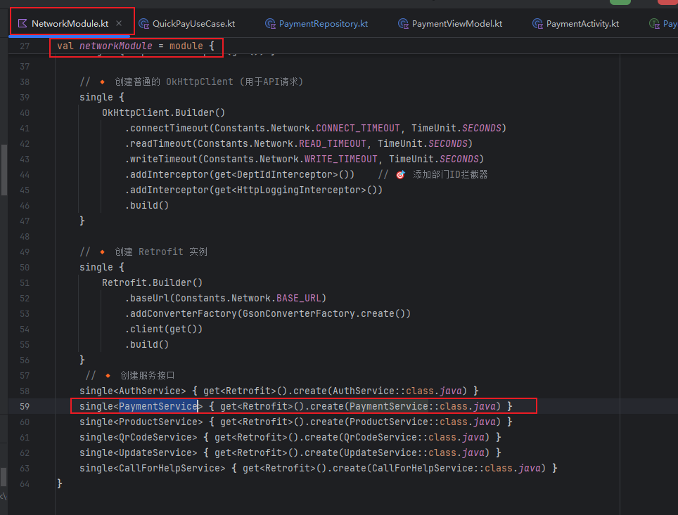
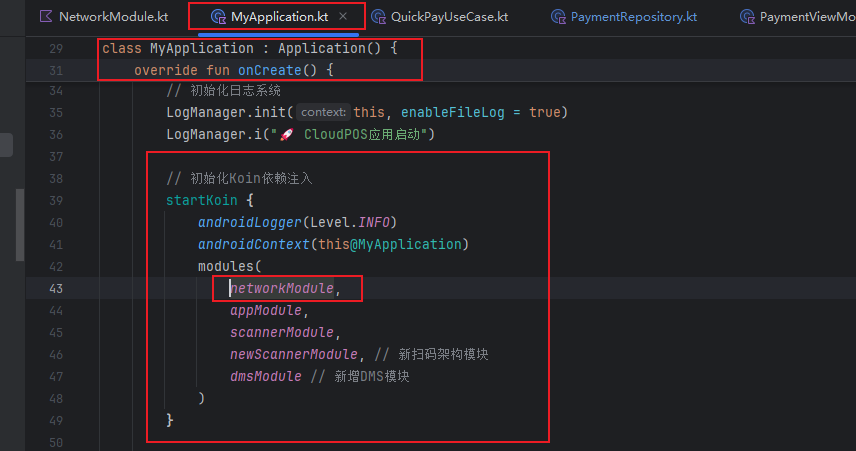
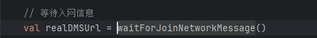
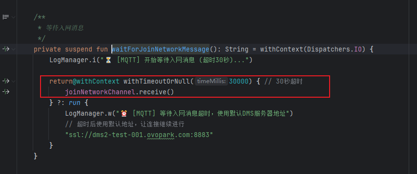

[toc]

## 01.功能概述

- **功能ID**：`FEAT-20250708-001`  
- **功能名称**：聚合支付接口
- **目标版本**：v0.3.0
- **提交人**：@panruiqi  
- **状态**：
  - [x] ⌛ 设计中 /
  - [ ] ⌛ 开发中 / 
  - [ ] ✅ 已完成 / 
  - [ ] ❌ 已取消  
- **价值评估**：  
  - [x] ⭐⭐⭐⭐⭐ 核心业务功能  
  - [ ] ⭐⭐⭐⭐ 用户体验优化  
  - [ ] ⭐⭐⭐ 辅助功能增强  
  - [ ] ⭐⭐ 技术债务清理  
- **功能描述** 
  - POS机扫码付款的时候，之前只有微信付款方式，使用的是单次API。但是他存在两个问题：
    - 用户长时间不付款，此时我和后端的连接是有时长限制的，超出时长就会显示付款失败（但是实际上用户可以等1分钟再付款，这样仍旧会扣款）
    - 添加其他付款方式，如：易宝支付后。后端无法直接返回结果，他要等待易宝那边的响应，因此我这个单次Http连接不满足上述的情况
  - 我们采用轮询的方式+分级设计的解决方案：10s内进行稳定间隔轮询，每秒1次。 10s后进行指数避退算法（1 - 2 - 4 - 8 - 16），最高等待时间16s。 总等待时长为2分钟，2分钟结束之前必定再请求一次结果。

## 02.需求分析

### 2.1 用户场景

- **主要场景**：  

  - 用户扫码付款

- **边界场景**：  

### 2.2 功能范围

- ✅ 包含：
- ❌ 不包含：

## 03.技术方案

### 3.0 问题点

- 户长时间不付款，此时我和后端的连接是有时长限制的，超出时长就会显示付款失败（但是实际上用户可以等1分钟再付款，这样仍旧会扣款）
- 添加其他付款方式，如：易宝支付后。后端无法直接返回结果，他要等待易宝那边的响应，因此我这个单次Http连接不满足上述的情况

### 3.1 方案一

- 实现思路：

  - 120s，每秒轮询一次


### 3.2 方案二

- 实现思路：

  - 轮询的方式+分级设计的解决方案：10s内进行稳定间隔轮询，每秒1次。 10s后进行指数避退算法（1 - 2 - 4 - 8 - 16），最高等待时间16s。 总等待时长为2分钟，2分钟结束之前必定再请求一次结果。

## 04.实现规划

### 4.1 技术选型

- 选择方案二，即降低了服务端的压力，同时也没有影响绝大多数订单的体验效果。


### 4.2 任务拆解

Model

- ```
  @Parcelize
  data class AggpayResponse(
      val code: Int,
      val codename: String?,
      val message: String,
      val isError: Boolean,
      val data: String,
  ) : Parcelable
  
  @Parcelize
  data class AggpayRequest(
      val orderSn: String,
      val authCode: String
  ) : Parcelable
  ```

API

- ```
      @POST("on-duty-service/pay/yop/aggpay/pay")
      suspend fun processAggPayment(
          @Body request: AggpayRequest,
          @Header("Ovo-Authorization") token: String
      ): AggpayResponse
  ```

Retrofit客户端为其创建代理对象：通过Koin进行依赖注入

- 
- 

仓库层

- 构建轮询间隔列表

  - 超过索引，按16_000L执行

  - ```
    val pollingIntervals = mutableListOf<Long>().apply {
            repeat(10) { add(1_000L) } // 前10秒每秒1次
            addAll(listOf(1_000L, 2_000L, 4_000L, 8_000L, 16_000L)) // 指数退避
        }
        
         // 4. 计算下次轮询间隔
                val interval = if (intervalIndex < pollingIntervals.size) {
                    pollingIntervals[intervalIndex++]
                } else {
                    16_000L
                }
    ```

- 实际执行

  - ```
    /**
         * 聚合支付，处理微信、支付宝、银联、数币等付款方式
         * 轮询方式：10s内进行稳定间隔轮询，每秒1次。
         * 10s后进行指数避退算法（1 - 2 - 4 - 8 - 16），最高等待时间16s。
         * 总等待时长为2分钟，2分钟结束之前必定再请求一次结果。
         * @param authCode 微信付款码
         * @param orderSn 订单号
         * @return MicropayResponse
         */
        override suspend fun processPayment(authCode: String, orderSn: String): Resource<AggpayResponse> {
            val token = Constants.TestProject.TOKEN
            if (token.isNullOrEmpty()) {
                LogManager.payment("❌ 支付失败: 用户未登录")
                return Resource.Error(Exception("用户未登录"), "用户未登录，请先登录")
            }
    
            val request = AggpayRequest(authCode = authCode, orderSn = orderSn)
            val startTime = System.currentTimeMillis()
            val maxDuration = 120_000L // 2分钟
            val pollingIntervals = mutableListOf<Long>().apply {
                repeat(10) { add(1_000L) } // 前10秒每秒1次
                addAll(listOf(1_000L, 2_000L, 4_000L, 8_000L, 16_000L)) // 指数退避
            }
            var elapsed = 0L
            var lastResponse: AggpayResponse? = null
            var intervalIndex = 0
    
            LogManager.payment("🔄 开始处理聚合支付轮询 (订单号: $orderSn, 付款码: ${authCode.take(4)}****)")
            LogManager.payment("⏱️ 最大等待时长: ${maxDuration / 1000}s")
            try {
                while (elapsed < maxDuration) {
                    val pollStart = System.currentTimeMillis()
                    LogManager.payment("[轮询] 请求支付状态 (第${intervalIndex + 1}次, 已用时: ${elapsed / 1000}s)")
                    val response = paymentService.processAggPayment(request, token)
                    lastResponse = response
                    val pollEnd = System.currentTimeMillis()
                    val pollDuration = pollEnd - pollStart
                    LogManager.payment("[轮询] 响应: isError=${response.isError}, code=${response.code}, message=${response.message}, 用时: ${pollDuration}ms")
    
                    if (!response.isError) {
                        LogManager.payment("✅ 支付成功，轮询终止 (总用时: ${(System.currentTimeMillis() - startTime) / 1000.0}s)")
                        return Resource.Success(response)
                    }
    
                    elapsed = System.currentTimeMillis() - startTime
                    if (elapsed >= maxDuration) {
                        LogManager.payment("⏹️ 达到最大等待时长，轮询结束")
                        break
                    }
    
                    val interval = if (intervalIndex < pollingIntervals.size) {
                        pollingIntervals[intervalIndex++]
                    } else {
                        16_000L
                    }
                    LogManager.payment("[轮询] 等待${interval / 1000}s后进行下一次请求")
                    kotlinx.coroutines.delay(interval)
                    elapsed = System.currentTimeMillis() - startTime
                }
    
                // 最后再查一次
                LogManager.payment("[轮询] 到时，最后一次请求支付状态")
                val response = paymentService.processAggPayment(request, token)
                lastResponse = response
                LogManager.payment("[轮询] 最终响应: isError=${response.isError}, code=${response.code}, message=${response.message}")
                if (!response.isError) {
                    LogManager.payment("✅ 支付成功 (最终请求)")
                    return Resource.Success(response)
                }
                
    
                LogManager.payment("❌ 支付未成功，返回最后一次响应 (总用时: ${(System.currentTimeMillis() - startTime) / 1000.0}s)")
                return Resource.Error(Exception(lastResponse?.message ?: "支付超时"), lastResponse?.message ?: "支付超时")
            } catch (e: CancellationException) {
                LogManager.payment("⏹️ 支付被取消（协程取消）")
                throw e
            } catch (e: Exception) {
                LogManager.payment("💥 支付异常: ${e.javaClass.simpleName} - ${e.message}")
                LogManager.payment("💥 异常堆栈: ${e.stackTrace.take(3).joinToString { it.toString() }}")
                return Resource.Error(e, "支付失败：${e.message}")
            }
        }
    ```

错误，这个是查询后端是否和交易方建立连接成功的接口，isError为false表示建立连接成功，为true表示建立连接失败。

### 4.2 任务拆解（再设计）

查询后端是否和交易方建立连接成功的接口

- Model

  - ```
    @Parcelize
    data class AggpayResponse(
        val code: Int,
        val codename: String?,
        val message: String,
        val isError: Boolean,
        val data: String,
    ) : Parcelable
    
    @Parcelize
    data class AggpayRequest(
        val orderSn: String,
        val authCode: String
    ) : Parcelable
    ```

- API

  - ```
        @POST("on-duty-service/pay/yop/aggpay/pay")
        suspend fun processAggPayment(
            @Body request: AggpayRequest,
            @Header("Ovo-Authorization") token: String
        ): AggpayResponse
    ```

- Retrofit客户端为其创建代理对象：通过Koin进行依赖注入

  - 
  - 

- Repository层

  - ```
      /**
         * 查询后端是否和交易方建立连接
         * @param authCode 微信付款码
         * @param orderSn 订单号
         */
        override suspend fun processPayConnect(
            authCode: String,
            orderSn: String
        ): Resource<AggpayResponse> {
            val startTime = System.currentTimeMillis()
            val token = Constants.TestProject.TOKEN
            if (token.isNullOrEmpty()) {
                LogManager.payment("❌ 聚合支付连接查询失败: 用户未登录")
                return Resource.Error(Exception("用户未登录"), "用户未登录，请先登录")
            }
    
            val request = AggpayRequest(authCode = authCode, orderSn = orderSn)
            LogManager.payment("🔄 开始处理聚合支付连接查询 (订单号: $orderSn, 付款码: ${authCode.take(4)}****)")
            try {
                val response = paymentService.processAggPayment(request, token)
                if (!response.isError) {
                    LogManager.payment("✅ 聚合支付连接查询成功")
                    return Resource.Success(response)
                } else {
                    LogManager.payment("❌ 聚合支付连接查询超时，返回最后一次响应 (总用时: ${(System.currentTimeMillis() - startTime) / 1000.0}s)")
                    return Resource.Error(Exception(response?.message ?: "聚合支付连接查询超时"), response?.message ?: "聚合支付连接查询超时")
                }
            }catch (e: CancellationException) {
                LogManager.payment("⏹️ 聚合支付连接查询被取消（协程取消）")
                throw e
            } catch (e: Exception) {
                LogManager.payment("💥 聚合支付连接查询异常: ${e.javaClass.simpleName} - ${e.message}")
                LogManager.payment("💥 异常堆栈: ${e.stackTrace.take(3).joinToString { it.toString() }}")
                return Resource.Error(e, "聚合支付连接查询失败：${e.message}")
            }
        }
    ```

- UseCase层

  - ```
    // 第三步：处理支付-查询后端是否和交易方建立连接成功
            LogManager.d("QuickPayUseCase: 查询后端是否和交易方建立连接成功")
            val payConnectResult = paymentRepository.processPayConnect(
                authCode = paymentCode,
                orderSn = orderSn
            )
            when (payConnectResult) {
                is Resource.Success -> {
                    LogManager.d("QuickPayUseCase: 后端和交易方建立连接成功")
                }
                is Resource.Error -> {
                    LogManager.e("QuickPayUseCase: 后端和交易方建立连接成功 - ${payConnectResult.message}")
                    throw Exception("后端和交易方建立连接失败 : ${payConnectResult.message}")
                }
                is Resource.Loading -> {
                    throw Exception("后端和交易方建立连接超时")
                }
            }
    ```

处理支付结果查询

- Model
  - 
- API
  - 
- Retrofit客户端为其创建代理对象：通过Koin进行依赖注入
- Repository层
  - 
- UseCase层






### 4.3 代码路径


## 05.兼容性设计

### 5.1 设备适配


### 5.2 冲突检查


## 06.测试方案

### 6.1 核心用例


### 6.2 性能指标


## 07.发布计划

### 7.1 阶段发布


### 7.2 回滚方案


## 08.文档记录

### 8.1 技术文档


### 8.2 用户文档


### 8.3 监控埋点


