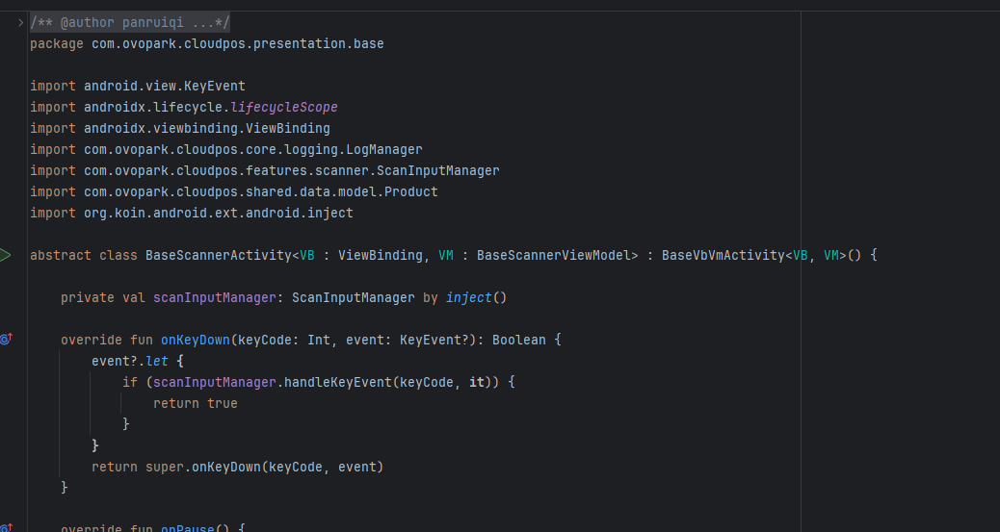
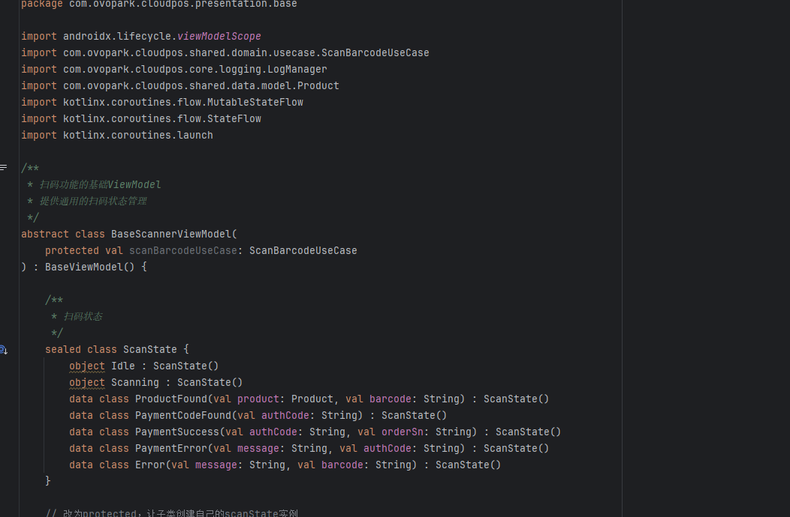
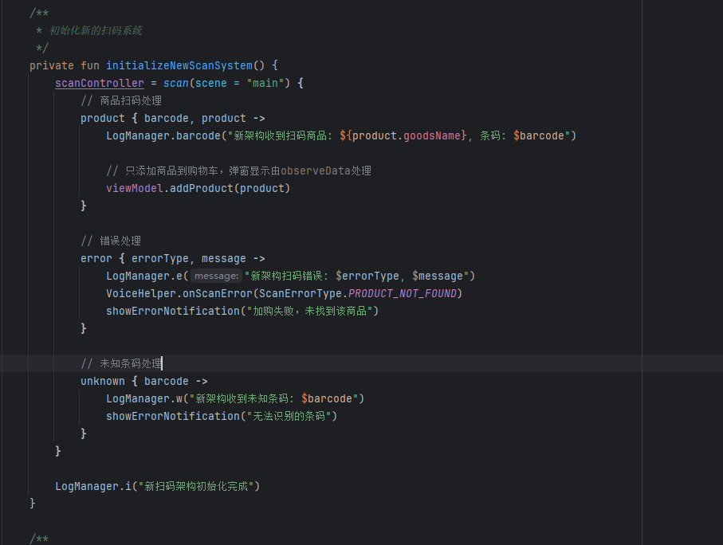

[toc]

## 00.重构概述

- **重构ID**：`refactor-20250701-001`  
- **重构名称**：弹窗管理系统  （考虑到只有main中有频繁的弹窗，因此暂时无需全局唯一单例，去处理main和payment中的弹窗。）
- **目标版本**：v0.3.0  
- **重构类型**：✅ 架构级重构 -
  - [x] 一步到位模式  
  - [ ] 循序渐进逐步替代模式
- **重构负责人**：@panruiqi  
- **完成时间**：2025年07月02日  
- **文档版本**：v1.0  

---

## 01.重构目标

### 1.1 原有问题

- 耦合度高
  - 各组件强依赖于BaseScannerActivity 和 BaseScannnerViewModel
  - 
  - 
- 通过继承实现
  - 各UI继承自上述两个基类，实现他们的具体的处理逻辑。
  - 
- **扩展困难**：新增无感支付方案时，购物车页处理付款码时要修改原有代码，没保留正确的额外的接口

### 1.2 重构目标

- **统一管理**：建立独立弹窗系统
- **动态创建**：按需创建View，节省内存
- **智能优先级**：自动处理弹窗抢占
- **状态隔离**：Activity间状态独立
- **数据驱动**：基于配置创建弹窗
- **零XML修改**：新增弹窗不修改布局

---

## 02.新架构设计

### 2.1 核心组件


### 2.2 架构实现

#### 1.core/BarcodeClassifier

- 简单的条码分类器，根据正则表达式去匹配

- ```
  **
   * 条码分类器
   * 
   * 职责：
   * - 将输入的条码分类为不同类型
   * - 纯函数设计，无状态，无副作用
   * - 高性能，支持高频调用
   */
  object BarcodeClassifier {
      
      // 微信付款码规则：以1开头，第二位0-5，总长度18位
      private val WECHAT_PAYMENT_CODE_REGEX = Regex("^1[0-5]\\d{16}$")
      
      // 支付宝付款码规则：25-29开头16-17位，或30开头15-17位
      private val ALIPAY_PAYMENT_CODE_REGEX = Regex("^2[5-9]\\d{15,16}$|^30\\d{14,16}$")
      
      /**
       * 分类条码
       * 
       * @param barcode 原始条码
       * @return 分类结果
       */
      fun classify(barcode: String): ScanResult {
          // 预处理：去除空白字符
          val cleanBarcode = barcode.trim()
          
          if (cleanBarcode.isEmpty()) {
              LogManager.d("条码为空，返回Unknown")
              return ScanResult.Unknown(cleanBarcode)
          }
          
          LogManager.d("分类条码: $cleanBarcode")
          
          return when {
              isWeChatPaymentCode(cleanBarcode) -> {
                  LogManager.d("识别为微信付款码")
                  ScanResult.PaymentCode(cleanBarcode, PaymentType.WECHAT)
              }
              isAlipayPaymentCode(cleanBarcode) -> {
                  LogManager.d("识别为支付宝付款码")
                  ScanResult.PaymentCode(cleanBarcode, PaymentType.ALIPAY)
              }
              isProductCode(cleanBarcode) -> {
                  LogManager.d("识别为商品码")
                  ScanResult.ProductCandidate(cleanBarcode)
              }
              else -> {
                  LogManager.d("无法识别的条码类型")
                  ScanResult.Unknown(cleanBarcode)
              }
          }
      }
      
      /**
       * 检测是否为微信付款码
       */
      private fun isWeChatPaymentCode(code: String): Boolean {
          return code.matches(WECHAT_PAYMENT_CODE_REGEX)
      }
      
      /**
       * 检测是否为支付宝付款码
       */
      private fun isAlipayPaymentCode(code: String): Boolean {
          return code.matches(ALIPAY_PAYMENT_CODE_REGEX)
      }
      
      /**
       * 检测是否为商品码
       * 规则：8-14位数字
       */
      private fun isProductCode(code: String): Boolean {
          return code.length in 8..14 && code.all { it.isDigit() }
      }
      
      /**
       * 检测是否为任意付款码
       */
      fun isPaymentCode(code: String): Boolean {
          return isWeChatPaymentCode(code) || isAlipayPaymentCode(code)
      }
      
      /**
       * 获取付款码类型
       */
      fun getPaymentType(code: String): PaymentType? {
          return when {
              isWeChatPaymentCode(code) -> PaymentType.WECHAT
              isAlipayPaymentCode(code) -> PaymentType.ALIPAY
              else -> null
          }
      }
  } 
  ```

- 正则表达式

  - 这是一个用于匹配“微信付款码”的正则表达式（Regex）。

  - ```
    // 微信付款码规则：以1开头，第二位0-5，总长度18位
    private val WECHAT_PAYMENT_CODE_REGEX = Regex("^1[0-5]\\d{16}$")
    ```

  - 规则说明：

  - 以数字1开头（^1）

  - 第二位是0到5之间的数字（[0-5]）

  - 后面跟16位任意数字（\d{16}）

  - 总长度是18位（因为1 + 1 + 16 = 18）

  - ^ 表示字符串开头，$ 表示字符串结尾，确保整个字符串完全符合这个格式

- trim

  - trim() 是 Kotlin（和 Java）字符串的一个方法，用于返回去掉首尾空白的新字符串。

  - 假设 barcode = " 1234567890 "

  - 执行 barcode.trim() 后，cleanBarcode 的值就是 "1234567890"（前后的空格被去掉了）。

  - ```
    // 预处理：去除空白字符
    val cleanBarcode = barcode.trim()
    ```

#### 2.core/scanResult

- 扫码结果模型，条码分类器中对原始条码进行正则表达式的判断，并生成对应的扫码结果模型。

- ```
  /**
   * @author panruiqi
   * @date 2025-06-30
   * @description 扫码结果模型
   * @copyright Copyright (c) 2025 ovopark
   * @contact panruiqi@ovopark.com
   */
  package com.ovopark.cloudpos.features.scanner.core
  
  /**
   * 扫码结果基类
   */
  sealed class ScanResult {
      abstract val barcode: String
      
      /**
       * 商品候选码
       */
      data class ProductCandidate(override val barcode: String) : ScanResult()
      
      /**
       * 付款码
       */
      data class PaymentCode(
          override val barcode: String, 
          val type: PaymentType
      ) : ScanResult()
      
      /**
       * 快速支付触发（预留接口）
       */
      data class QuickPaymentTrigger(
          override val barcode: String,
          val paymentType: PaymentType
      ) : ScanResult()
      
      /**
       * 未知条码
       */
      data class Unknown(override val barcode: String) : ScanResult()
  }
  
  /**
   * 付款类型
   */
  enum class PaymentType {
      WECHAT,     // 微信支付
      ALIPAY      // 支付宝
  }
  
  /**
   * 扫码错误类型
   */
  enum class ScanErrorType {
      PRODUCT_NOT_FOUND,      // 商品未找到
      INVALID_PAYMENT_CODE,   // 无效付款码
      NETWORK_ERROR,          // 网络错误
      UNKNOWN_ERROR           // 未知错误
  } 
  ```

#### 3. core/ScanFlowProvider

- 扫码输入流提供者，统一管理所有的输入源

- 目前内部有两个数据流

  - barcodeFlow 是一个 Flow<String>，它是所有扫码输入的“总入口”。

  - 目前有两个输入源：

    - keyboardScanFlow：键盘扫码枪输入（通过全局 KeyEvent 监听）
    - _manualScanFlow：手动输入（通过 emitBarcode 方法手动注入）

  - 这两个输入源通过 merge() 合并成一个 barcodeFlow，外部只需要订阅 barcodeFlow 就能拿到所有扫码数据

  - ```
    /**
     * 扫码输入流提供者
     * 
     * 职责：
     * - 统一管理所有扫码输入源
     * - 提供去重、防抖等数据处理
     * - 支持键盘扫码枪、相机扫码等多种输入
     */
    class ScanFlowProvider(private val context: Context) {
        //手动扫码输入数据流
        private val _manualScanFlow = MutableSharedFlow<String>()
        
        /**
         * 键盘扫码枪输入流
         */
        private val keyboardScanFlow: Flow<String> = callbackFlow {
           .......................
        }
        
        /**
         * 主要的扫码数据流
         */
        val barcodeFlow: Flow<String> = merge(
            keyboardScanFlow,           // 键盘扫码枪输入
            _manualScanFlow.asSharedFlow()  // 手动扫码输入
        )
        .debounce(50)       // 防抖50ms，提高响应速度
        .filter { it.isNotBlank() }    // 过滤空字符串
        .onEach { barcode ->
            LogManager.i("扫码输入检测到: $barcode")
        }
       
    }
    ```

- 我们来简单看一下键盘扫码枪输入流

  - 把“扫码枪通过模拟键盘输入的方式”产生的扫码数据，转化为一个 Kotlin Flow（异步数据流），让你可以像监听事件一样收集扫码结果

  - 实现原理：

    - 关键点：

      - callbackFlow：用于把回调式的事件（如键盘事件）转成 Flow。

      - KeyboardScanInputHandler：全局单例，负责分发 KeyEvent 给所有注册的处理器。

      - inputHandler：本地对象，负责处理 KeyEvent，把扫码数据拼接成字符串，遇到回车键时发送出去

  - ```
    /**
         * 键盘扫码枪输入流
         */
        private val keyboardScanFlow: Flow<String> = callbackFlow {
            val scanBuffer = StringBuilder()
            var lastKeyTime = 0L
            
            val inputHandler = object {
                fun handleKeyEvent(event: KeyEvent): Boolean {
                    if (event.action != KeyEvent.ACTION_DOWN) return false
                    
                    val currentTime = System.currentTimeMillis()
                    val keyCode = event.keyCode
                    
                    // 如果间隔时间过长，清空缓冲区（认为是新的扫码开始）
                    if (currentTime - lastKeyTime > 100) {
                        scanBuffer.clear()
                    }
                    lastKeyTime = currentTime
                    
                    when (keyCode) {
                        KeyEvent.KEYCODE_ENTER -> {
                            // 回车键表示扫码结束
                            if (scanBuffer.isNotEmpty()) {
                                val barcode = scanBuffer.toString()
                                scanBuffer.clear()
                                LogManager.d("键盘扫码完成: $barcode")
                                val result = trySend(barcode)
                                LogManager.d("扫码数据发送结果: ${result.isSuccess}, 数据: $barcode")
                            }
                            return true
                        }
                        in KeyEvent.KEYCODE_0..KeyEvent.KEYCODE_9 -> {
                            // 数字键
                            val char = (keyCode - KeyEvent.KEYCODE_0 + '0'.code).toChar()
                            scanBuffer.append(char)
                            return true
                        }
                        KeyEvent.KEYCODE_PERIOD -> {
                            // 小数点
                            scanBuffer.append('.')
                            return true
                        }
                        KeyEvent.KEYCODE_MINUS -> {
                            // 减号
                            scanBuffer.append('-')
                            return true
                        }
                        // 其他字符键可以根据需要添加
                    }
                    
                    return false
                }
            }
            
            // 注册到全局键盘监听器
            KeyboardScanInputHandler.register(inputHandler::handleKeyEvent)
            
            awaitClose {
                KeyboardScanInputHandler.unregister(inputHandler::handleKeyEvent)
                LogManager.d("键盘扫码监听器已清理")
            }
        }
        
        
    /**
     * 键盘扫码输入处理器
     * 
     * 全局单例，管理键盘事件监听
     */
    object KeyboardScanInputHandler {
        private val handlers = mutableSetOf<(KeyEvent) -> Boolean>()
        
        fun register(handler: (KeyEvent) -> Boolean) {
            handlers.add(handler)
            LogManager.d("注册键盘扫码处理器，当前处理器数量: ${handlers.size}")
        }
        
        fun unregister(handler: (KeyEvent) -> Boolean) {
            handlers.remove(handler)
            LogManager.d("注销键盘扫码处理器，当前处理器数量: ${handlers.size}")
        }
        
        /**
         * 处理键盘事件
         * 
         * @param event 键盘事件
         * @return 是否消费了事件
         */
        fun handleKeyEvent(event: KeyEvent): Boolean {
            var consumed = false
            handlers.forEach { handler ->
                if (handler(event)) {
                    consumed = true
                }
            }
            return consumed
        }
        
        /**
         * 重置所有处理器
         */
        fun reset() {
            handlers.clear()
            LogManager.d("重置所有键盘扫码处理器")
        }
    } 
    ```

#### 4.dsl/ScanDSl

- 扫码DSL构建器，用于构建扫码处理能力（处理商品码，微信付款码，支付宝付款码）

- 关键点：

  - 通过声明式的，例如：product去配置商品扫码处理的能力，传递的是 `action: suspend (barcode: String, product: Product) -> Unit` 这个带两个参数、无返回值的函数类型。具体可以看study_lambda表达式。

  - 然后我们用ProductScanHandler去包裹这个函数类型

    - ProductScanHandler是ScanHandler文件中一个类，其构造方法接受action参数，并在handle方法中调用这个函数类型

    - ```
      /**
       * 扫码处理器基础接口
       */
      interface ScanHandler
      
      /**
       * 商品扫码处理器
       */
      class ProductScanHandler(
          private val action: suspend (barcode: String, product: Product) -> Unit
      ) : ScanHandler {
          
          suspend fun handle(barcode: String, product: Product) {
              action(barcode, product)
          }
      }
      ```

    - 为什么要这样？因为不同的处理能力不一定可以通过一个action处理完成，比如付款码处理器，需要去匹配对应的扫码场景，main中是快速付款，payment中是正常付款

    - ```
      /**
       * 付款码扫码处理器
       */
      class PaymentCodeScanHandler(
          private val scene: String,
          private val action: suspend (barcode: String, type: PaymentType) -> Unit
      ) : ScanHandler {
          
          suspend fun handle(barcode: String, type: PaymentType) {
              action(barcode, type)
          }
          
          fun matchesScene(currentScene: String): Boolean {
              return scene == "*" || scene == currentScene
          }
      }
      ```

  - ```
    /**
     * 扫码DSL构建器
     * 
     * 提供声明式的扫码处理配置
     */
    class ScanDslBuilder {
        private val handlers = mutableMapOf<String, ScanHandler>()
        
        /**
         * 配置商品扫码处理
         * 
         * @param action 处理商品扫码的动作
         */
        fun product(action: suspend (barcode: String, product: Product) -> Unit) {
            handlers["product"] = ProductScanHandler(action)
        }
        
        /**
         * 配置付款码扫码处理
         * 
         * @param inScene 限定在特定场景，"*"表示所有场景
         * @param action 处理付款码扫码的动作
         */
        fun paymentCode(
            inScene: String = "*", 
            action: suspend (barcode: String, type: PaymentType) -> Unit
        ) {
            val key = "payment_$inScene"
            handlers[key] = PaymentCodeScanHandler(inScene, action)
        }
        
        /**
         * 配置快速支付处理（预留接口）
         * 
         * @param action 处理快速支付的动作
         */
        fun quickPayment(action: suspend (barcode: String, type: PaymentType) -> Unit) {
            handlers["quick_payment"] = QuickPaymentScanHandler(action)
        }
        
        /**
         * 配置错误处理
         * 
         * @param action 处理扫码错误的动作
         */
        fun error(action: (errorType: ScanErrorType, message: String) -> Unit) {
            handlers["error"] = ErrorScanHandler(action)
        }
        
        /**
         * 配置未知条码处理
         * 
         * @param action 处理未知条码的动作
         */
        fun unknown(action: (barcode: String) -> Unit) {
            handlers["unknown"] = UnknownScanHandler(action)
        }
        
        /**
         * 构建处理器映射
         */
        internal fun build(): Map<String, ScanHandler> = handlers.toMap()
    } 
    ```

  - 好，我们上面通过  private val handlers = mutableMapOf<String, ScanHandler>() 容纳了不同的处理器，接下来可以通过 build方法

    - 其返回值类型是 Map<String, ScanHandler>。
    - 作用是把内部的 handlers 集合转换为不可变的 Map 并返回。
    - handlers 是一个 MutableMap<String, ScanHandler> 或类似的数据结构，用于存储“扫码处理器”的映射关系。

  - 典型场景：在 Kotlin 的 DSL 构建器模式中，常见的写法是：

    - 先用各种 DSL 语法（如 scan { ... }）往内部集合里添加数据（如 handler）。

    - 最后通过 build() 方法一次性生成最终的数据结构（如 Map、List、对象等

#### 5.lifecycle/ScanController

- 扫码控制器，协调扫码数据流和处理器，将扫码数据流生成扫码结果，并分发给对应的处理器处理。

- 关键点

  - 启动监听，从scanFlowProvider中获取扫码数据流，然后通过BarcodeClassifier进行分类，并通过handleScanResult进行实际处理。

  - ```
    private fun startScanning() {
        scanJob?.cancel() // 先取消之前的监听Job，避免重复监听
    
        scanJob = scanFlowProvider.barcodeFlow // 订阅扫码数据流
            .onStart { LogManager.d("扫码数据流开始监听") } // 流开始时打印日志
            .onEach { barcode -> LogManager.d("收到原始扫码数据: $barcode") } // 每收到一个条码，打印日志
            .map { barcode -> 
                val result = BarcodeClassifier.classify(barcode) // 对条码进行分类
                LogManager.d("条码分类结果: ${result::class.simpleName}, 条码: $barcode")
                result
            }
            .onEach { result -> 
                LogManager.d("准备处理扫码结果: ${result::class.simpleName}, 条码: ${result.barcode}")
                handleScanResult(result) // 处理分类后的扫码结果
            }
            .catch { error -> 
                LogManager.e("扫码流处理异常: ${error.message}", error)
                handleError(ScanErrorType.UNKNOWN_ERROR, error.message ?: "扫码处理失败") // 异常处理
            }
            .launchIn(activity.lifecycleScope) // 在生命周期作用域内启动协程收集
    
        LogManager.d("扫码监听已启动")
    }
    ```

    

  - ```
    
        /**
         * 处理扫码结果
         */
        private suspend fun handleScanResult(result: ScanResult) {
            LogManager.i("处理扫码结果: ${result::class.simpleName}, 条码: ${result.barcode}")
            
            when (result) {
                is ScanResult.ProductCandidate -> handleProductScan(result.barcode)
                is ScanResult.PaymentCode -> handlePaymentCodeScan(result.barcode, result.type)
                is ScanResult.QuickPaymentTrigger -> handleQuickPaymentScan(result.barcode, result.paymentType)
                is ScanResult.Unknown -> handleUnknownScan(result.barcode)
            }
        }
        
        /**
         * 处理商品扫码
         */
        private suspend fun handleProductScan(barcode: String) {
            val handler = handlers["product"] as? ProductScanHandler
            if (handler == null) {
                LogManager.w("未找到商品扫码处理器")
                return
            }
            
            try {
                LogManager.i("查询商品: $barcode")
                val result = scannerRepository.getProductByBarcode(barcode)
                when (result) {
                    is com.ovopark.cloudpos.shared.data.model.ApiResult.Success -> {
                        val product = result.data
                        handler.handle(barcode, product)
                        LogManager.i("商品扫码处理完成: ${product.goodsName}")
                    }
                    is com.ovopark.cloudpos.shared.data.model.ApiResult.Error -> {
                        LogManager.e("商品查询失败: ${result.exception.message}", result.exception)
                        handleError(ScanErrorType.PRODUCT_NOT_FOUND, "未找到商品")
                    }
                    is com.ovopark.cloudpos.shared.data.model.ApiResult.Loading -> {
                        // Loading状态在同步调用中通常不会出现，但为了完整性添加
                        LogManager.d("商品查询加载中...")
                    }
                }
            } catch (e: Exception) {
                LogManager.e("商品查询异常: ${e.message}", e)
                handleError(ScanErrorType.NETWORK_ERROR, "网络错误")
            }
        }
        
        /**
         * 处理付款码扫码
         */
        private suspend fun handlePaymentCodeScan(barcode: String, type: com.ovopark.cloudpos.features.scanner.core.PaymentType) {
            // 查找匹配当前场景的处理器
            val specificHandler = handlers["payment_$currentScene"] as? PaymentCodeScanHandler
            val generalHandler = handlers["payment_*"] as? PaymentCodeScanHandler
            
            val handler = when {
                specificHandler?.matchesScene(currentScene) == true -> specificHandler
                generalHandler?.matchesScene(currentScene) == true -> generalHandler
                else -> null
            }
            
            if (handler == null) {
                LogManager.w("未找到付款码处理器，场景: $currentScene")
                handleError(ScanErrorType.INVALID_PAYMENT_CODE, "当前场景不支持付款码")
                return
            }
            
            try {
                LogManager.i("处理付款码: $barcode, 类型: $type, 场景: $currentScene")
                handler.handle(barcode, type)
                LogManager.i("付款码处理完成")
            } catch (e: Exception) {
                LogManager.e("付款码处理失败: ${e.message}", e)
                handleError(ScanErrorType.INVALID_PAYMENT_CODE, "付款码处理失败")
            }
        }
        
        /**
         * 处理快速支付扫码（预留接口）
         */
        private suspend fun handleQuickPaymentScan(barcode: String, type: com.ovopark.cloudpos.features.scanner.core.PaymentType) {
            val handler = handlers["quick_payment"] as? QuickPaymentScanHandler
            if (handler == null) {
                LogManager.w("未找到快速支付处理器")
                // 降级到普通付款码处理
                handlePaymentCodeScan(barcode, type)
                return
            }
            
            try {
                LogManager.i("处理快速支付: $barcode, 类型: $type")
                handler.handle(barcode, type)
                LogManager.i("快速支付处理完成")
            } catch (e: Exception) {
                LogManager.e("快速支付处理失败: ${e.message}", e)
                handleError(ScanErrorType.INVALID_PAYMENT_CODE, "快速支付失败")
            }
        }
        
        /**
         * 处理未知条码
         */
        private fun handleUnknownScan(barcode: String) {
            val handler = handlers["unknown"] as? UnknownScanHandler
            if (handler != null) {
                LogManager.i("处理未知条码: $barcode")
                handler.handle(barcode)
            } else {
                LogManager.w("未知条码且无处理器: $barcode")
                handleError(ScanErrorType.UNKNOWN_ERROR, "无法识别的条码: $barcode")
            }
        }
        
        /**
         * 处理错误
         */
        private fun handleError(type: ScanErrorType, message: String) {
            val handler = handlers["error"] as? ErrorScanHandler
            if (handler != null) {
                LogManager.d("处理扫码错误: $type, $message")
                handler.handle(type, message)
            } else {
                LogManager.w("扫码错误但无错误处理器: $type, $message")
            }
        }
    } 
    ```
    
  - Main中使用
  
    - 

## 03.文件结构变化

### 3.1 新增文件


### 3.2 修改内容

- 


### 3.3 备份文件

- 

## 04.使用方式对比

### 4.1 重构前（旧方式）


### 4.2 重构后（新方式）

- 


## 05.核心优势

- 这里是xml对比：
  - 

------

## 06.重构效果量化

### 6.1 代码量减少

### 6.2 新增核心组件

- 

### 6.3 净效果

- 

## 07.测试建议

### 7.1 功能测试

### 7.2 性能测试


### 7.3 边界测试


### 7.4 必测项目


------

## 08.扩展指南


## 09.总结

### 9.1 重构成果


### 9.2 技术价值

1. 

### 9.3 业务价值

1. 

### 9.4 下一步计划

1. 

## 📞 支持

如有问题或建议，请联系：panruiqi@ovopark.com

**重构完成时间**：2025年06月21日  
**文档版本**：v1.0 


