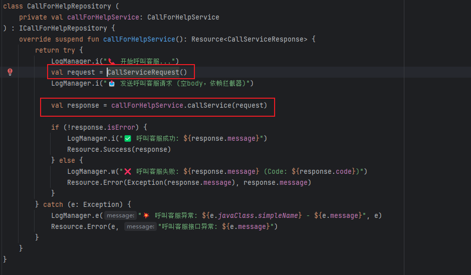
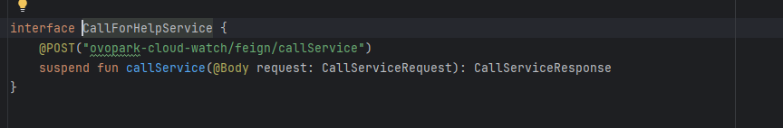
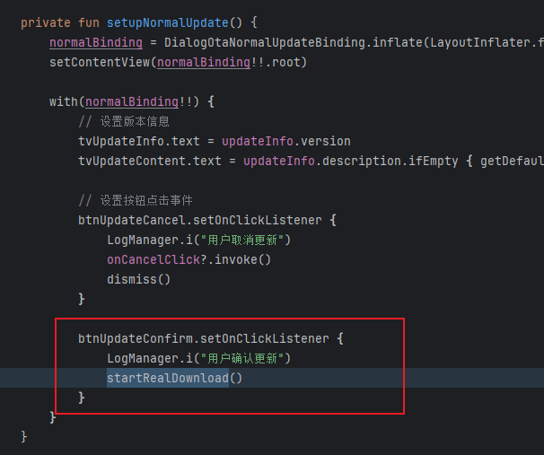
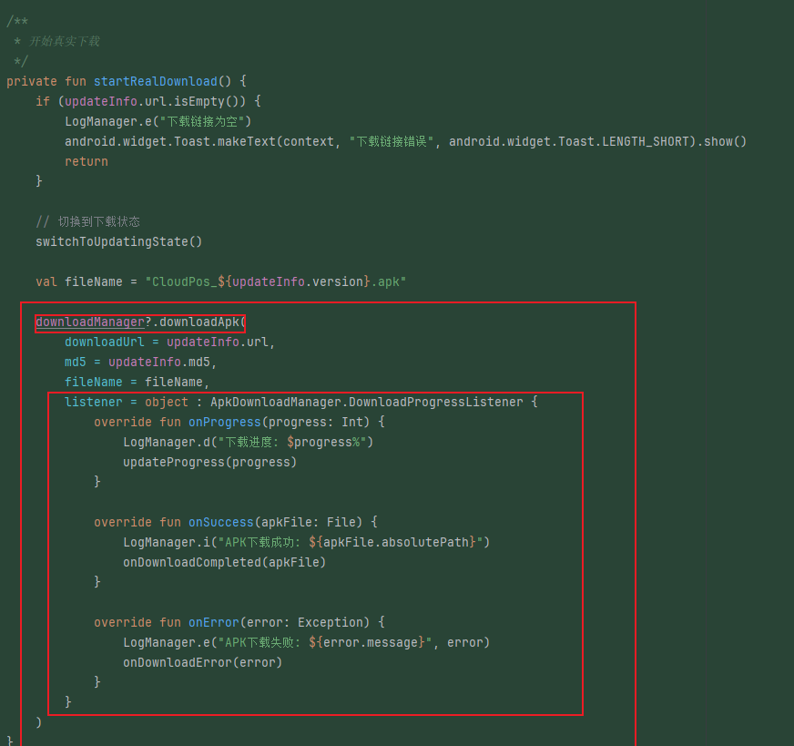
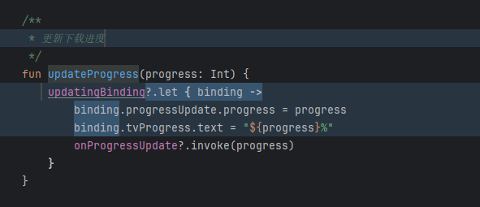
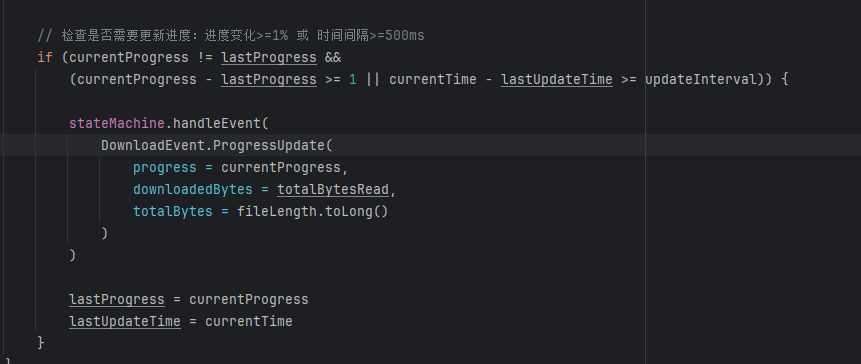

[toc]

## 前言

> 学习要符合如下的标准化链条：了解概念->探究原理->深入思考->总结提炼->底层实现->延伸应用"

## 01.学习概述

- **学习主题**：AI使用
- **知识类型**：
  - [ ] **知识类型**：
    - [ ] ✅Android/ 
      - [ ] ✅01.基础组件
      - [ ] ✅02.IPC机制
      - [ ] ✅03.消息机制
      - [ ] ✅04.View原理
      - [ ] ✅05.事件分发机制
      - [ ] ✅06.Window
      - [ ] ✅07.复杂控件
      - [ ] ✅08.性能优化
      - [ ] ✅09.流行框架
      - [ ] ✅10.数据处理
      - [ ] ✅11.动画
      - [ ] ✅12.Groovy
    - [ ] ✅音视频开发/
      - [ ] ✅01.基础知识
      - [ ] ✅02.OpenGL渲染视频
      - [ ] ✅03.FFmpeg音视频解码
    - [ ] ✅ Java/
      - [ ] ✅01.基础知识
      - [ ] ✅02.Java设计思想
      - [ ] ✅03.集合框架
      - [ ] ✅04.异常处理
      - [ ] ✅05.多线程与并发编程
      - [ ] ✅06.JVM
    - [ ] ✅ Kotlin/
      - [ ] ✅01.基础语法
      - [ ] ✅02.高阶扩展
      - [ ] ✅03.协程和流
- **学习来源**：
- **重要程度**：⭐⭐⭐⭐⭐（核心基础）  
- **学习日期**：
- **记录人**：@panruiqi

### 1.1 学习目标

- 了解概念->探究原理->深入思考->总结提炼->底层实现->延伸应用"

### 1.2 前置知识


## 02.核心概念

### 2.1 是什么？

AI是协助我们开发的工具，他可以是deepseek，是chatgpt，是cursor，是trae。

### 2.2 解决什么问题？

- **消除重复劳动**：自动生成样板代码（如MVP/MVVM骨架、网络请求层）
- **加速知识获取**：快速理解新框架/API（如协程、FFmpeg）
- **提供设计灵感**：复杂问题的备选方案（如状态机优化）
- **降低认知负荷**：聚焦核心业务而非技术细节

### 2.3 基本特性

- **工具性**：如同IDE的智能补全，最终决策权在开发者
- **概率性输出**：相同指令可能生成不同代码，需人工验证
- **上下文依赖**：输出质量与提示词清晰度强相关
- **知识截止**：无法获取最新技术

## 03.原理机制

### 3.1 进一步思考

我是何时使用AI的？

- 我是在23年接触AI的，但是实际上使用它快速辅助开发是在2025/05/25 的Android Pos机第一阶段项目中

### 3.2 刚开始接触AI

我是如何刚开始接触AI的？

- 刚开始蔡老板说可以使用AI辅助开发，他搭建了一个适用性的MVVM架构的框架，使用的就是AI辅助办到的。
- 我们要想了解AI，我们来想象一下，使用它，采用最简单的方法，举例哦，跟他说，给我生成一个Pos机项目。结果可想而知，生成的一塌糊涂。

这里存在哪些问题呢？

- 指令不够清晰，Pos机你的需求是什么？UI是什么？有哪些功能？你说的不够清楚，从这方面，我觉得他很像计算机，你要学会和他对话。
- 结果不可控，你的一步跨的太大了，直接让他生成整个项目，他生成的任何代码都不在你的掌控之中。换而言之，他已经脱离你的掌控了。
- 无法保证安全性，代码稳定性。你并不理解代码，也不理解原理，这个项目仿佛跟你毫无关系，你和他就是陌生人。
- 这些是我们要尽力避免的。

好，我们总结了这些问题，我们开始进一步熟悉他，使用他进行开发，但是我们目前趋向于保守，因为不知道他的能力边界。

- 我自己构建了BaseVbVmActivity和BaseViewModel的基类。也就是有了Activity和ViewModel的框架了。现在我就可以让他给我生成不含任何特殊功能的，只包含基础框架的SplashActivity，Main这些。

- 好，我发现他这方面实现的很好，每个里面都有initListener, initView，observData，这种重复性的工作他处理的很棒，不需要我花很多时间做这种重复性的工作。
- 接着我写接口，Repository层，调用service层。要构建request和response的model，然后有service，再通过Retrofit去create，创建对应的代理方法，然后你调用这个service 的时候，本质就是通过代理调用retrofit的方法，去为你填充一些内容，再分发给OkHttp的线程池，通过拦截器一步步处理，然后发送出去。结果则是想反的过程。我们理解这个过程了，那我只用写一个请求商品信息的接口，然后剩下的接口交给他写就好了，因为这些是重复性的过程。
- 
- 

这里得出什么结论？

- AI真的非常适合处理这种重复性的内容，前提是你理解了这个过程，然后就可以交给他节省你的时间。
- 这些情景，他满足下面的条件
  - 他都是很容易检测出是否安全的，比如：网络API，很容易把控是成功还是失败。
  -  同时结果也是可控的，因为整个流程你理解了原理啊。
  - 指令也很清晰，参考我之前的实现，为我实现新的接口，新的接口是什么？请求和响应的参数是什么？
- 这使用他们就很合理，因为很大程度减少了我们重复开发的动作了。（当然，有特殊的再特殊处理）  

### 3.3 让AI参与模块设计

好，我发现了AI可以完成这些任务了，我们对他的期望提高了，可以让他参与部分模块的设计了。

- 我现在有一个OTA模块，我缺少思路，希望他能给出一个思路和实现。
- 我输入指令：现在需要一个OTA远程更新模块，用户情景：我们远程发布一个新的版本，用户现在需要可以远程更新安装新版本。请你给出可行的功能设计和方案。
- 然后他就很智障的通过网络请求获取远程更新的地址后，通过系统服务打开浏览器进行下载。

这种情况，让人大失所望。这绝对不是OTA的正确实现，虽然可以下载安装，但是借助浏览器，实在不够优雅。

好，那么我只能自己尝试实现。

- 我才用UpdateManager去管理OTA，检测是否需要显示OTA更新弹窗。

- ```
    /**
       * 检查并处理版本更新
       * 
       * @param activity 当前Activity实例
       * @param broadHeading 必需参数，默认"CLOUD_POS"
       * @param deviceType 设备类型，默认"CloudPos"
       * @param type 类型，可选
       * @param showNoUpdateToast 当没有更新时是否显示提示
       * @param scope 协程作用域
       */
      fun checkUpdate(
          activity: Activity,
          broadHeading: String = "CLOUD_POS",
          deviceType: String = "CloudPos",
          type: Int? = null,
          showNoUpdateToast: Boolean = false,
          scope: CoroutineScope
      ) {
          LogManager.i("开始检查版本更新: broadHeading=$broadHeading, deviceType=$deviceType")
          
          scope.launch {
              try {
                  when (val result = updateRepository.checkUpdate(broadHeading, deviceType, type)) {
                      is Resource.Success -> {
                          withContext(Dispatchers.Main) {
                              handleUpdateResult(activity, result.data, showNoUpdateToast)
                          }
                      }
                      
                      is Resource.Error -> {
                          LogManager.e("版本检查失败: ${result.message}", result.exception)
                          if (showNoUpdateToast) {
                              withContext(Dispatchers.Main) {
                                  if (!activity.isFinishing && !activity.isDestroyed) {
                                      android.widget.Toast.makeText(
                                          activity,
                                          "检查更新失败: ${result.message}",
                                          android.widget.Toast.LENGTH_SHORT
                                      ).show()
                                  }
                              }
                          }
                      }
                      
                      is Resource.Loading -> {
                          LogManager.d("正在检查版本更新...")
                      }
                  }
              } catch (e: Exception) {
                  LogManager.e("版本检查异常: ${e.message}", e)
                  if (showNoUpdateToast) {
                      withContext(Dispatchers.Main) {
                          if (!activity.isFinishing && !activity.isDestroyed) {
                              android.widget.Toast.makeText(
                                  activity,
                                  "检查更新异常: ${e.message}",
                                  android.widget.Toast.LENGTH_SHORT
                              ).show()
                          }
                      }
                  }
              }
          }
      }
      
      /**
       * 处理更新检查结果
       */
      private fun handleUpdateResult(activity: Activity, versionInfo: VersionInfo, showNoUpdateToast: Boolean) {
          try {
              // 检查Activity是否仍然有效
              if (activity.isFinishing || activity.isDestroyed) {
                  LogManager.w("Activity已结束或销毁，取消显示更新对话框")
                  return
              }
              
              val needUpdate = updateRepository.needUpdate(versionInfo)
              val isForceUpdate = updateRepository.isForceUpdate(versionInfo)
              
              LogManager.i("更新检查结果: needUpdate=$needUpdate, isForceUpdate=$isForceUpdate, version=${versionInfo.version}")
              LogManager.d("版本详情: versionCode=${versionInfo.versionCode}, description=${versionInfo.description}")
              LogManager.d("下载信息: url=${versionInfo.getBestDownloadUrl()}, md5=${versionInfo.md5}")
              
              if (needUpdate) {
                  // 检查是否忽略了该版本（强制更新时忽略此检查）
                  val isIgnored = !isForceUpdate && UpdateDialog.isVersionIgnored(activity, versionInfo.version)
                  
                  if (!isIgnored) {
                      LogManager.i("显示更新对话框")
                      
                      // 创建兼容的UpdateInfo对象传递给UpdateDialog
                      val updateInfo = UpdateInfo(
                          description = versionInfo.description,
                          forceUpdate = versionInfo.getForceUpdateAsInt(),
                          versionCode = versionInfo.getVersionCodeAsInt(),
                          version = versionInfo.version,
                          md5 = versionInfo.md5,
                          url = versionInfo.getBestDownloadUrl()
                      )
                      
                      // 再次检查Activity状态，确保在显示对话框前Activity仍然有效
                      if (!activity.isFinishing && !activity.isDestroyed) {
                          UpdateDialog.show(activity, updateInfo, isForceUpdate)
                      } else {
                          LogManager.w("准备显示对话框时发现Activity已无效")
                      }
                  } else {
                      LogManager.i("版本${versionInfo.version}已被用户忽略")
                      if (showNoUpdateToast && !activity.isFinishing) {
                          android.widget.Toast.makeText(
                              activity,
                              "版本${versionInfo.version}已被忽略",
                              android.widget.Toast.LENGTH_SHORT
                          ).show()
                      }
                  }
              } else {
                  LogManager.i("当前已是最新版本")
                  if (showNoUpdateToast && !activity.isFinishing) {
                      android.widget.Toast.makeText(
                          activity,
                          "当前已是最新版本",
                          android.widget.Toast.LENGTH_SHORT
                      ).show()
                  }
              }
          } catch (e: Exception) {
              LogManager.e("处理更新结果异常: ${e.message}", e)
              if (showNoUpdateToast && !activity.isFinishing && !activity.isDestroyed) {
                  android.widget.Toast.makeText(
                      activity,
                      "处理更新结果异常: ${e.message}",
                      android.widget.Toast.LENGTH_SHORT
                  ).show()
              }
          }
      }
  ```

- 然后弹窗设置点击事件

  - 
  - 

- 最终调用ApkDownloadManager

  - ```
    /**
         * 开始下载APK
         * 
         * @param downloadUrl APK下载链接
         * @param md5 文件MD5校验码（可选）
         * @param fileName APK文件名
         * @param listener 下载进度监听器
         */
        fun downloadApk(
            downloadUrl: String,
            md5: String? = null,
            fileName: String = "update.apk",
            listener: DownloadProgressListener
        ) {
            LogManager.i("开始下载APK: url=$downloadUrl, fileName=$fileName")
            
            downloadJob = CoroutineScope(Dispatchers.IO).launch {
                try {
                    val apkFile = performDownload(downloadUrl, fileName) { progress ->
                        // 回调下载进度到主线程
                        CoroutineScope(Dispatchers.Main).launch {
                            listener.onProgress(progress)
                        }
                    }
                    
                    // 验证MD5
                    if (md5 != null && md5.isNotEmpty()) {
                        val fileMd5 = calculateMD5(apkFile)
                        if (fileMd5 != md5) {
                            LogManager.e("MD5校验失败: 期望=$md5, 实际=$fileMd5")
                            CoroutineScope(Dispatchers.Main).launch {
                                listener.onError(Exception("MD5校验失败"))
                            }
                            return@launch
                        }
                        LogManager.i("MD5校验成功")
                    }
                    
                    // 下载成功
                    CoroutineScope(Dispatchers.Main).launch {
                        listener.onSuccess(apkFile)
                    }
                    
                } catch (e: Exception) {
                    LogManager.e("下载APK失败: ${e.message}", e)
                    CoroutineScope(Dispatchers.Main).launch {
                        listener.onError(e)
                    }
                }
            }
        }
    
        /**
         * 执行下载
         */
        private suspend fun performDownload(
            downloadUrl: String,
            fileName: String,
            progressCallback: (Int) -> Unit
        ): File {
            return withContext(Dispatchers.IO) {
                val downloadDir = getDownloadDir()
                val apkFile = File(downloadDir, fileName)
                
                // 如果文件已存在，删除
                if (apkFile.exists()) {
                    apkFile.delete()
                }
                
                val url = URL(downloadUrl)
                val connection = url.openConnection() as HttpURLConnection
                connection.connectTimeout = CONNECT_TIMEOUT
                connection.readTimeout = READ_TIMEOUT
                connection.requestMethod = "GET"
                
                try {
                    connection.connect()
                    
                    if (connection.responseCode != HttpURLConnection.HTTP_OK) {
                        throw Exception("HTTP响应错误: ${connection.responseCode}")
                    }
                    
                    val fileLength = connection.contentLength
                    val inputStream: InputStream = connection.inputStream
                    val outputStream = FileOutputStream(apkFile)
                    
                    val buffer = ByteArray(BUFFER_SIZE)
                    var totalBytesRead = 0L
                    var bytesRead: Int
                    
                    while (inputStream.read(buffer).also { bytesRead = it } != -1) {
                        outputStream.write(buffer, 0, bytesRead)
                        totalBytesRead += bytesRead
                        
                        // 计算进度
                        if (fileLength > 0) {
                            val progress = (totalBytesRead * 100 / fileLength).toInt()
                            progressCallback(progress)
                        }
                    }
                    
                    outputStream.close()
                    inputStream.close()
                    
                    LogManager.i("APK下载完成: ${apkFile.absolutePath}, 大小: ${apkFile.length()}")
                    return@withContext apkFile
                    
                } finally {
                    connection.disconnect()
                }
            }
        }
    ```

  - 这里最基础的http连接获取数据，同时不断调用progressCallback回调，更新UI

  - 

- 好，一个很基础的实现，通过UpdateManager.kt获取云端安装包的地址和信息，并根据版本判断是否需要更新。如果要更新，点击弹窗的点击按钮，触发ApkDownloadManager.kt中的相关方法进行安装，这个过程和结果通过回调方法进行处理。所有的状态也是彼此分开的，比如：UpdateManager中获取下载信息这个过程的状态就有：成功，失败，异常。然后有：校验成功，校验失败，版本无需安装，版本需要安装，下载中，下载失败，下载异常，下载成功等。没有统一的状态管理。

- 所以我询问AI，我遇到这种状态管理很麻烦的地方，该使用什么？同时我不希望用较多的扩展函数， 他的回答是状态机。我第一次了解这个概念，去掘金，bing上看相关的内容和博客。初步理解了概念后，开始尝试使用他，他本质就是状态的变化。就是原有状态，经过事件，成为新的状态。比如：下载中状态，经过继续下载事件，转变为下载中状态，这个过程中我们可以带上下载的进度条。然后UI订阅进行更新即可。 下载中状态，经过下载完成事件，转化为下载完成状态。

- 好，我会先让他给我一个demo

    - ```
        // 下载状态
        sealed class DownloadState {
            object Idle : DownloadState()           // 空闲
            object Downloading : DownloadState()    // 正在下载
            object Paused : DownloadState()         // 暂停
            object Completed : DownloadState()      // 完成
            data class Error(val msg: String) : DownloadState() // 错误
        }
        
        
        
        class DownloadStateMachine {
            var state: DownloadState = DownloadState.Idle
                private set
        
            fun startDownload() {
                if (state == DownloadState.Idle || state is DownloadState.Error) {
                    state = DownloadState.Downloading
                    println("开始下载")
                }
            }
        
            fun pause() {
                if (state == DownloadState.Downloading) {
                    state = DownloadState.Paused
                    println("下载已暂停")
                }
            }
        
            fun resume() {
                if (state == DownloadState.Paused) {
                    state = DownloadState.Downloading
                    println("继续下载")
                }
            }
        
            fun complete() {
                if (state == DownloadState.Downloading) {
                    state = DownloadState.Completed
                    println("下载完成")
                }
            }
        
            fun error(msg: String) {
                state = DownloadState.Error(msg)
                println("下载出错: $msg")
            }
        
            fun reset() {
                state = DownloadState.Idle
                println("重置状态")
            }
        }
        
        
        class MainActivity : AppCompatActivity() {
        
            private val downloadStateMachine = DownloadStateMachine()
        
            override fun onCreate(savedInstanceState: Bundle?) {
                super.onCreate(savedInstanceState)
                // setContentView(...) 省略
        
                // 示例：开始下载
                downloadStateMachine.startDownload()
        
                // 示例：暂停
                downloadStateMachine.pause()
        
                // 示例：继续
                downloadStateMachine.resume()
        
                // 示例：完成
                downloadStateMachine.complete()
        
                // 示例：出错
                downloadStateMachine.error("网络断开")
        
                // 示例：重置
                downloadStateMachine.reset()
            }
        }
        ```

- 给的比较基础，和我看到的掘金中的笔记不同，然后和他沟通，这不应该是一个合格的简约的优雅的状态机

    - ```
        // 状态
        sealed class DownloadState {
            object Idle : DownloadState()
            object Downloading : DownloadState()
            object Paused : DownloadState()
            object Completed : DownloadState()
            data class Error(val msg: String) : DownloadState()
        }
        
        // 事件
        sealed class DownloadEvent {
            object Start : DownloadEvent()
            object Pause : DownloadEvent()
            object Resume : DownloadEvent()
            object Complete : DownloadEvent()
            data class Fail(val msg: String) : DownloadEvent()
            object Reset : DownloadEvent()
        }
        
        
        class DownloadStateMachine(
            initialState: DownloadState = DownloadState.Idle,
            private val onStateChanged: ((DownloadState) -> Unit)? = null
        ) {
            var state: DownloadState = initialState
                private set
        
            // 状态转移表
            private val transitions: Map<Pair<DownloadState, DownloadEvent>, DownloadState> = mapOf(
                // Idle
                DownloadState.Idle to DownloadEvent.Start to DownloadState.Downloading,
                // Downloading
                DownloadState.Downloading to DownloadEvent.Pause to DownloadState.Paused,
                DownloadState.Downloading to DownloadEvent.Complete to DownloadState.Completed,
                DownloadState.Downloading to DownloadEvent.Fail("") to DownloadState.Error(""),
                // Paused
                DownloadState.Paused to DownloadEvent.Resume to DownloadState.Downloading,
                DownloadState.Paused to DownloadEvent.Fail("") to DownloadState.Error(""),
                // Error
                DownloadState.Error("") to DownloadEvent.Reset to DownloadState.Idle,
                // Completed
                DownloadState.Completed to DownloadEvent.Reset to DownloadState.Idle
            )
        
            // 事件触发
            fun send(event: DownloadEvent) {
                val key = state to event.withoutData()
                val next = transitions[key]
                if (next != null) {
                    state = when (next) {
                        is DownloadState.Error -> if (event is DownloadEvent.Fail) DownloadState.Error(event.msg) else next
                        else -> next
                    }
                    onStateChanged?.invoke(state)
                } else {
                    // 非法转移，忽略或抛异常
                }
            }
        
            // 用于忽略Error/Fail的data部分，便于建表
            private fun Any.withoutData(): Any = when (this) {
                is DownloadState.Error -> DownloadState.Error("")
                is DownloadEvent.Fail -> DownloadEvent.Fail("")
                else -> this
            }
        }
        
        
        val fsm = DownloadStateMachine { state ->
            println("状态变为：$state")
        }
        
        fsm.send(DownloadEvent.Start)      // Idle -> Downloading
        fsm.send(DownloadEvent.Pause)      // Downloading -> Paused
        fsm.send(DownloadEvent.Resume)     // Paused -> Downloading
        fsm.send(DownloadEvent.Complete)   // Downloading -> Completed
        fsm.send(DownloadEvent.Reset)      // Completed -> Idle
        fsm.send(DownloadEvent.Fail("网络断开")) // Downloading/Paused -> Error("网络断开")
        fsm.send(DownloadEvent.Reset)      // Error -> Idle
        ```

- ok，自己实现一个

    - 定义状态和映射表

    - ```
         /**
             * 状态转移密封类，表示所有可能的(状态, 事件)组合
             */
            private sealed class StateTransition {
                data class DownloadingProgress(val state: DownloadState.Downloading, val event: DownloadEvent.ProgressUpdate) : StateTransition()
            }
            
            /**
             * 将(状态, 事件)映射为StateTransition
             */
            private fun mapStateTransition(currentState: DownloadState, event: DownloadEvent): StateTransition {
                return when {
                    currentState is DownloadState.Downloading && event is DownloadEvent.ProgressUpdate -> StateTransition.DownloadingProgress(currentState, event)
            }
        ```

    - 更新过程中发送事件，触发状态机中状态变化

    - 

    - 状态变化处理

    - ```
          /**
             * 处理下载事件，触发状态转换（正统状态机写法：(状态, 事件) => 新状态）
             */
            fun handleEvent(event: DownloadEvent) {
                val currentState = _state.value
                val transition = mapStateTransition(currentState, event)
                
                val newState = when (transition) {
                    is StateTransition.DownloadingProgress -> transition.state.copy(
                        progress = transition.event.progress,
                        downloadedBytes = transition.event.downloadedBytes,
                        totalBytes = transition.event.totalBytes
                    )
                 }
                
                if (newState != null) {
                    val oldState = _state.value
                    // 避免相同状态的无意义转换（特别是Downloading状态的进度更新）
                    val shouldUpdate = when {
                        oldState::class != newState::class -> true  // 状态类型变化，需要更新
                        oldState is DownloadState.Downloading && newState is DownloadState.Downloading -> {
                            // Downloading状态只在进度有显著变化时更新
                            val progressDiff = abs(newState.progress - oldState.progress)
                            progressDiff >= 1  // 进度变化1%以上才更新
                        }
                        else -> true  // 其他情况都更新
                    }
                    
                    if (shouldUpdate) {
                        LogManager.i("状态转换: ${oldState::class.simpleName} -> ${newState::class.simpleName}" + 
                            if (newState is DownloadState.Downloading) " (${newState.progress}%)" else "")
                        _state.value = newState
                        saveState(newState)
                    } else {
                        // 对于Downloading状态的小幅进度更新，只更新状态值，不记录日志和保存
                        _state.value = newState
                    }
                }
            }
        ```

    - UI中观察流的状态

        - ```
             /**
                 * 观察下载状态变化
                 */
                private fun observeDownloadState(activity: Activity) {
                    stateObserverJob?.cancel()
                    stateObserverJob = CoroutineScope(Dispatchers.Main).launch {
                        apkDownloadManager?.downloadState?.collect { state ->
                            handleDownloadState(activity, state)
                        }
                    }
                }
                
                *
                 * 处理下载状态变化
                 */
                private fun handleDownloadState(activity: Activity, state: DownloadState) {
                    LogManager.d("下载状态变化: ${state::class.simpleName}")
                    
                    when (state) {
                        is DownloadState.Downloading -> {
                            // 更新下载进度
                            updateDownloadProgress(state.progress)
                        }
                  
                    }
                }
                
                  /**
                 * 更新下载进度
                 */
                private fun updateDownloadProgress(progress: Int) {
                    popupManager?.currentPopupState?.view?.let { view ->
                        view.findViewById<android.widget.ProgressBar>(com.ovopark.cloudpos.R.id.progress_update)?.progress = progress
                        view.findViewById<android.widget.TextView>(com.ovopark.cloudpos.R.id.tv_progress)?.text = "$progress%"
                    }
                }
            ```

    - ok，没啥问题，接着让AI实现后续的下载中 -  下载完成的状态，他就很快实现了。问他还有其他状态吗？然后让他实现

好，我发现假如把模块的整个设计交给他实现，这回很困难，它适合架构的升级。因为它很难理解你真正的需求，但是如果你有一个已经实现好的方案，他会很快找到新的可升级的方法，给出你思路。

- 所以，他更适合做优化和重复逻辑的填充，而非直接的实现

接着问他Android中有没有其他位置也用到了这

- 他回答frameworks/base/core/java/com/android/internal/util下也有，然后去找对应的博文看，源码待后续观看
- https://zhuanlan.zhihu.com/p/557029644

### 3.4 AI参与设计的正确姿势
**分层使用策略**：
1. **架构层**：自身设计实际的模块，并进行结构的设计（如：OTA模块，先要自身设计完善，职责明确，任务清晰）
2. **实现层**：AI填充重复逻辑（如API）
3. **优化层**：AI提议改进（如状态机替代回调地狱）

**失败案例的启示**：
- **问题**：直接要求“设计OTA模块”过于宽泛

- **解法**：
  
  - 拆解为原子任务：
    
  - ```
    1. 设计版本检查接口的请求/响应模型
    2. 实现APK下载器（支持断点续传、MD5校验）
    3. 设计更新状态机（idle→checking→downloading→installing）
    ```
    
  - 或者：自己先实现，然后问AI要优化的思路

## 04.底层原理


## 05.深度思考

### 5.1 关键问题探究

在我看来，AI让开发变的更有趣，他可以解决大多数枯燥的重复的任务，让你可以专心于架构的设计，模块的功能设计，代码的原理理解。可以让你接触新的技术栈，给你新的思路。让你每一天的开发都是充实的一天。他很大程度上解放了我们。

现在很多主流观点认为：AI简化了开发流程，所以使得开发人员的负载降低。我觉得这是片面的，对于有些人，使用AI减少重复的体力劳动，然后节省下来的时间玩手机，放松，这确实降低了他们的负载，有问题就丢给AI，但是我认为这是无趣的，一个有自我修养的程序员应该追求代码的优雅，追求代码的乐趣，他应该保持思考。AI应该是减少重复的体力劳动，并且可以为你提供新的技术栈，新的思路。让你可以把节省下来的时间拿去学习，拿去思考，拿去总结成文档，拿去提升自己，接触更新的，更美丽的，更优雅的代码。对于这种人，那么我任务，AI降低了他们身体的劳动，但是增加了他们脑力的劳动，同时也给他们带来了新的技术栈，新的思路，为他们打开了更广阔的世界。

我觉得这就是AI的魅力。他有坏的地方，降低你手写代码的熟练度，需要你花费更多的心神去管理，学习，使用和测试等。但是，他让你可以领略更美好的风景，领略更优雅的代码，我觉得整体上，利大于弊。

我愿意用最后一句话总结我对AI的理解：AI不是替代者，而是杠杆——它放大优秀开发者的创造力，也放大平庸开发者的惰性。
我们选择用节省的时间去构建更健壮的系统，而非停止思考

### 5.2 设计对比


## 06.实践验证

### 6.1 行为验证代码


### 6.2 性能测试


## 07.应用场景

### 7.1 最佳实践


### 7.2 使用禁忌


## 08.总结提炼

### 8.1 核心收获


### 8.2 知识图谱


### 8.3 延伸思考


## 09.参考资料

1. []()
2. []()
3. []()

