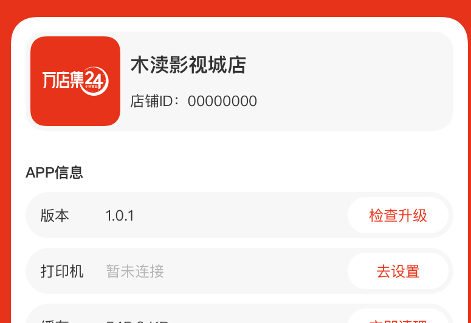
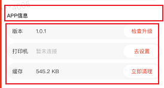
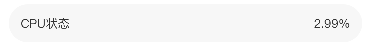
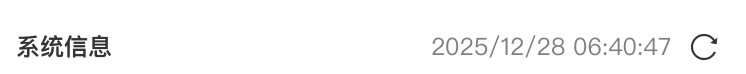
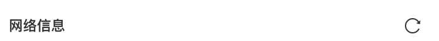
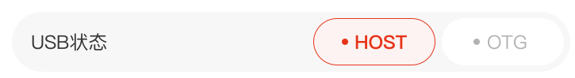
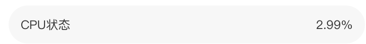

[toc]

## 01.功能概述

- **功能ID**：`FEAT-202506012-001`  

- **功能名称**：设置页UI

- **目标版本**：v0.4.0

- **提交人**：@panruiqi  

- **状态**：
  - [ ] ⌛ 设计中 /
  - [ ] ⌛ 开发中 / 
  - [x] ✅ 已完成 / 
  - [ ] ❌ 已取消  
  
- **价值评估**：  
  - [x] ⭐⭐⭐⭐⭐ 核心业务功能  
  - [ ] ⭐⭐⭐⭐ 用户体验优化  
  - [ ] ⭐⭐⭐ 辅助功能增强  
  - [ ] ⭐⭐ 技术债务清理  
  
- **功能描述** 
  
- 添加设置页，帮助现场服务人员处理Pos机相关问题。
  
- UI：

  - .png)
    
    

## 02.需求分析

### 2.1 用户场景

- **主要场景**：  

  - 

- **边界场景**：  

### 2.2 功能范围

- ✅ 包含：
- ❌ 不包含：


## 03.技术方案

### 3.1 方案一

- 实现思路：
  - 采用ConstraintLayout（约束布局），内部分为Tittle， content， bottom三个部分，一点点慢慢写。Content用LinearLayout慢慢填充
  - 
  - 
  - 
- 优点：
  - 可能只有初期开发简单，适合超简单页面
- 缺点：
  - 这种方案最大的问题就是可维护性差

### 3.2 方案二

- 实现思路：
  - 同样采用ConstraintLayout（约束布局），同样内部分为Tittle， content， bottom三个部分
  - 但是，将content分为：一个LinearLayout，包裹的Tittle
  - 
  - 以及四个信息组：APP信息，系统信息，网络信息，霸屏模式 。他们都是一个LinearLayout + RecyclerView。如下图：
  - 
  - 
- 优点：
  - 相对一更有结构，
- 缺点：
  - 其次每个模块都是独立RecyclerView，数据管理和滚动控制会很麻烦；另外UI复用性依然不高，比如四种信息组其实结构类似却要重复实现。

### 3.2 方案三

- 实现思路：
  - 延续方案二的思路，只不过内部的content可以重新设计。
  - Tittle可以抽象为一类Item：Item_Tittle，APP信息，系统信息，网络信息，霸屏开关可以抽象为一类Item：Item_Header，内部的设备ID，系统版本等可以抽象为一类Item：Item_Body
    - Tittle：
    - 
    - Header：
    - 
    - Body：
    - 
  - 一类Item内部可以有多种实现方式，比如：Item_Header可以为：item_setting_header_image, item_setting_header_text_image, item_setting_header_standard。
    - head有：
      - 
      - 
    - body有：下面等
      - 
      - 
    - 然后，我们把他们都看做item
  - 那么我们可以通过 RecyclerView + 多种Type的Item，同时Item内部又有多种实现方式
- 优点：
  - 组件化设计，把界面元素抽象成三种Item类型（Title/Header/Body），Item还有多种子类型，比如带图标的Header、带开关的Body等。通过多类型RecyclerView实现。这种设计的扩展性优势突出，新增条目只需定义新类型。同时，**维护成本低**：修改单一 Item 类型不影响全局；**UI 统一性强**：规范化的 Item 类型确保设计一致性
- 缺点：
  - 这种方案明显更现代，但实现复杂度较高,需设计多类型 ViewHolder 和适配器逻辑。Type管理会变得复杂，ViewHolder也要写更多分支逻辑,条目子类（如 Header 的 3 种变体）增加开发心智负担。

## 04.实现规划

### 4.1 技术选型

- **暂选方案三**，原因：
  1. **扩展性需求**：未来可能新增条目类型（如设置项分组/说明文本），方案三的抽象设计能快速响应变更
  2. **性能优化**：单 RecyclerView 比方案二的多嵌套 RecyclerView 更流畅
  3. **长期收益**：初期复杂度投入换取后期维护效率，符合迭代开发需求
  4. **UI 规范化**：强制统一设计语言，避免方案二中同类组件样式偏差

### 4.2 核心思路

- 

### 4.2 任务拆解

### 4.3 代码路径

- **新增文件**：
  `app/src/main/java/.../NewFeature.kt`
- **修改文件**：
  `ExistingClass.kt`（方法扩展）
- **资源文件**：
  `res/layout/new_feature.xml`

## 05.兼容性设计

### 5.1 设备适配

- **屏幕尺寸**：小屏设备折叠布局方案
- **系统版本**：

### 5.2 冲突检查

| 现有功能 | 冲突风险     | 解决方案 |
| :------- | :----------- | :------- |
| 功能A    | 接口参数变更 | 版本隔离 |

## 06.测试方案

### 6.1 核心用例

### 6.2 性能指标

| 指标       | 预期值 | 实测值 |
| :--------- | :----- | :----- |
| 内存增量   | <1MB   | -      |
| 渲染帧率   | >55fps | -      |
| 冷启动延迟 | <100ms | -      |

## 07.发布计划

### 7.1 阶段发布

| 阶段  | 范围     | 验证重点 |
| :---- | :------- | :------- |
| Alpha | 内部测试 | 核心流程 |
| Beta  | 5%用户   | 崩溃率   |
| GA    | 全量用户 | 性能指标 |

### 7.2 回滚方案

- 热修复开关：
- 动态配置：


## 08.文档记录

### 8.1 技术文档

- [架构设计文档](https://xn--gzu811i/)
- [接口API文档](https://xn--gzu811i/)

### 8.2 用户文档

- 功能引导页设计
- 错误代码对照表

### 8.3 监控埋点

```
// analytics_events.json
{
  "new_feature_used": {
    "params": ["screen_size", "os_version"]
  }
}
```

