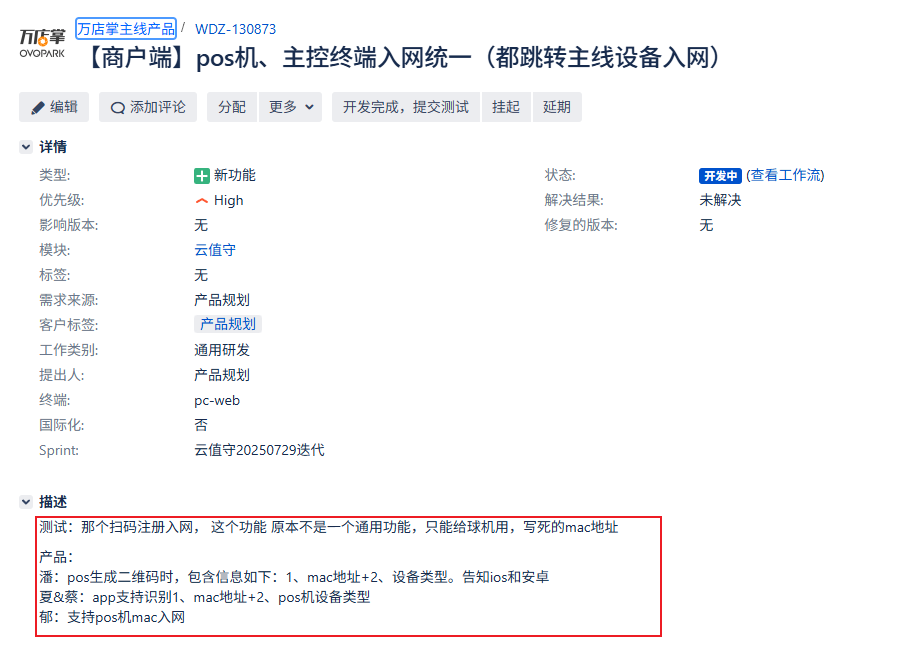
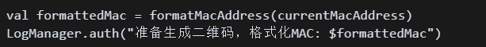

[toc]

## 01.功能概述

- **功能ID**：`FEAT-20250609-001`  
- **功能名称**：
- **目标版本**：v0.2.0
- **提交人**：@panruiqi  
- **状态**：
  - [x] ⌛ 设计中 /
  - [ ] ⌛ 开发中 / 
  - [ ] ✅ 已完成 / 
  - [ ] ❌ 已取消  
- **价值评估**：  
  - [x] ⭐⭐⭐⭐⭐ 核心业务功能  
  - [ ] ⭐⭐⭐⭐ 用户体验优化  
  - [ ] ⭐⭐⭐ 辅助功能增强  
  - [ ] ⭐⭐ 技术债务清理  
- **功能描述** 
  - 


## 02.需求分析

### 2.1 用户场景

- **主要场景**：  
  - app扫码入网

- **边界场景**：  

### 2.2 功能范围

- ✅ 包含：
- ❌ 不包含：

## 03.技术方案

### 3.0 预分析

当前的二维码生成逻辑非常简单：

- 

- 只是将MAC地址去冒号后直接作为二维码内容，缺乏扩展性。

### 3.1 方案一

实现思路：扩展方案设计

- 数据格式

  - ```
    格式：{版本}{设备类型}{MAC地址}[扩展数据]
    示例：2P0a0c11223834
    ```

- 解析规则：

  - 2 - 版本号（1位）
  - P - 设备类型（1位字母）
  - 0a0c11223834 - MAC地址（12位，无冒号小写）
  - 可选的扩展数据

- 设备类型编码

  - P = POS机 (CloudPos)
  - C = 球机设备 (Camera) 
  - S = 扫码器 (Scanner)
  - K = 自助终端 (Kiosk)
  - M = 移动设备 (Mobile)
  - U = 未知设备 (Unknown)

- 版本演进策略

  - 版本1: 纯MAC地址（向后兼容）
  - 版本2: 版本号+设备类型+MAC地址  
  - 版本3: 可加入时间戳等（预留扩展）

- 使用说明

  - ```
    // 生成
    val qrContent = "2P${formatMacAddress(macAddress)}"
    
    // 解析
    when (qrContent[0]) {
        '2' -> {
            val deviceType = qrContent[1] // P = POS机
            val mac = qrContent.substring(2, 14)
        }
        else -> {
            // 老版本兼容：纯MAC地址
            val mac = qrContent
            val deviceType = 'U' // Unknown
        }
    }
    ```

### 3.2 方案二

- 实现思路：


## 04.实现规划

### 4.1 技术选型


### 4.2 任务拆解


### 4.3 代码路径


## 05.兼容性设计

### 5.1 设备适配


### 5.2 冲突检查


## 06.测试方案

### 6.1 核心用例


### 6.2 性能指标


## 07.发布计划

### 7.1 阶段发布


### 7.2 回滚方案


## 08.文档记录

### 8.1 技术文档


### 8.2 用户文档


### 8.3 监控埋点


