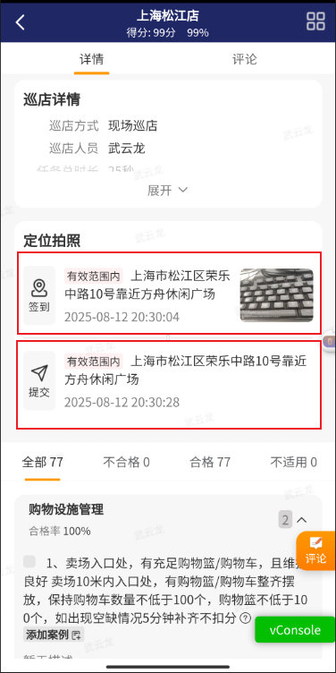
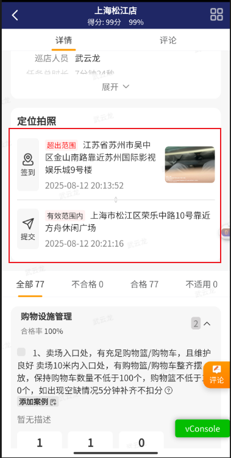

[toc]

## 01.功能概述

- **[优先级] **
  - [ ] ⚠️ 阻断 (Blocker)：系统崩溃、核心功能完全不可用
  - [ ] 🔴 严重 (Critical)：核心功能受损，无可用替代方案
  - [ ] 🟠 高 (High)：主要功能受影响，但有临时解决方案
  - [ ] 🟡 中 (Medium)：次要功能问题，影响用户体验
  - [ ] 🟢 低 (Low)：界面问题或轻微异常，不影响功能
- **问题简要描述**
  - **Bug ID**：`WDZ-128970`  
  - **影响版本**：v
  - **提交人**：@panruiqi
  - **状态**：
    - [ ] ⌛ 修复中 /
    - [ ] ✅ 已解决 / 
    - [ ] ❌ 无法复现  

- **问题现象**
  - 现场巡店拍照签到，用户在门店附近但是app判断不在门店范围内
  - 门店设置的经纬度：121.240109,31.017494，用户创建巡店时传的经纬度：121.240258;31.017436
  - 
- **环境特征**
  - 

## 02.问题分析

### 2.1 日志分析

- 

### 2.2 根本原因推理

- 

## 03.代码分析

### 3.1 关联代码路径

-  [03. 巡店_现场巡店门店选择逻辑.md](..\03. 业务逻辑介绍\03. 巡店_现场巡店门店选择逻辑.md)     [03. 巡店_巡店定位获取逻辑.md](..\03. 业务逻辑介绍\03. 巡店_巡店定位获取逻辑.md)     [03. 巡店_整体介绍.md](..\03. 业务逻辑介绍\03. 巡店_整体介绍.md) 

### 3.2 可疑修改点

- 

## 04.复现步骤

这个bug是偶现的，不好处理。该怎么去复现呢？该怎么完全复原用户的场景呢？首先要有一个门店，位置完全相符。然后要有签到的位置

如何复现？

门店：这个好处理，新建一个测试服门店，然后经纬度让后端修改，ok，我们有这个门店了。

### 4.1 第一次尝试复现

签到的位置：我们首先尝试使用虚拟定位，不行，仍然显示位置为寿桃湖附近，为什么呢？拼多多上显示的是上海附近啊。

难道是流量的问题？开启代理，好像还是不行。

### 4.2 第二次尝试复现

读巡店定位获取逻辑，发现是高德SDK的一个Listener中发射出去的，那我们直接修改，给一个假的数据


## 05.解决方案尝试

### 5.1 第一次解决方案

- 分析：多次尝试复现，目前多次测试，发现一个情况，签到和提交都需要定位，他们是分开的。签到和提交各需要一次定位
  - 
- 解决方案：
  - 
- 结果：ok，下面是多次尝试的截图
  - 
  - 
  - 
  - 目前只有下面的情况复现出签到超出范围的情况
  - 
  - 
  - 

### 5.2 第二次解决方案

- 分析：
- 解决方案：
  - 
- 结果：
  - 

### 5.3 第三次解决方案

- 分析：
  - 
- 解决方案：
  - 
- 结果：
  - 

### 5.4 第四次解决方案

- 分析：
  - 

- 解决方法：
  - 
- 结果：
  - 

### 5.4 第五次解决方案

- 分析：
  - 
- 解决方案：
  - 
- 结果：成功解决问题


## 06.进一步思考

### 6.1 有没有其他更优雅的方案

- 

### 6.2 推荐方案

```

```


## 07.根本原因和修复

### 7.1 最终定位

- 


### 7.2 修复方案


## 08.经验总结

### 8.1 技术原理

### 8.2 预防措施

### 8.3 卸载规范

### 8.4 调试技巧


