[toc]

## 01.功能概述

- **[优先级] **
  - [ ] ⚠️ 阻断 (Blocker)：系统崩溃、核心功能完全不可用
  - [ ] 🔴 严重 (Critical)：核心功能受损，无可用替代方案
  - [ ] 🟠 高 (High)：主要功能受影响，但有临时解决方案
  - [ ] 🟡 中 (Medium)：次要功能问题，影响用户体验
  - [ ] 🟢 低 (Low)：界面问题或轻微异常，不影响功能
- **问题简要描述**
  - **Bug ID**：`BUG-20240709-001`  
  - **影响版本**：v
  - **提交人**：@panruiqi
  - **状态**：
  - [ ] ⌛ 修复中 /
    - [ ] ✅ 已解决 / 
    - [ ] ❌ 无法复现  

- **问题现象**
  - 万店掌中云值守模块，门店事件部分，点进回放时，可以显示多视频源，但是进行切换时程序崩溃
- **环境特征**
  - 

## 02.问题分析

### 2.1 日志分析

- 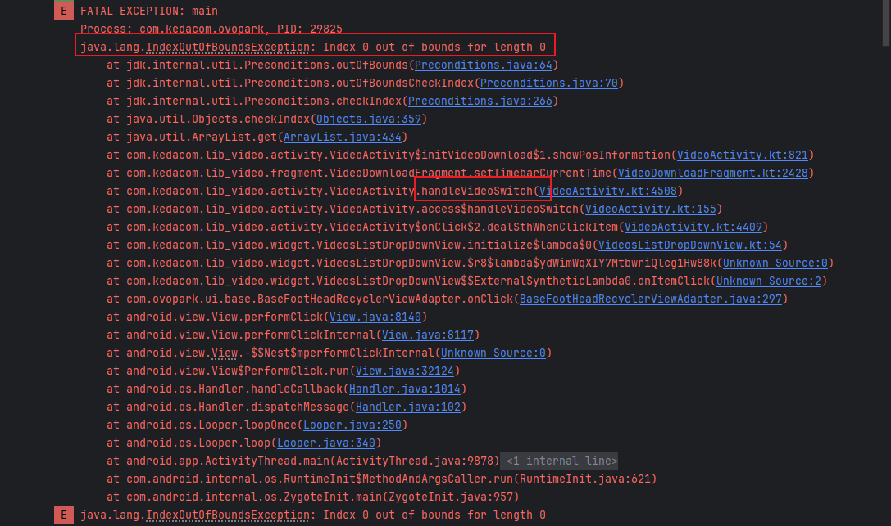
- 在“视频切换”选择框中切换了一个选项。
  - 触发了 handleVideoSwitch → setTimebarCurrentTime → showPosInformation，此时某个 ArrayList 为空。

### 2.2 根本原因推理

- 数组越界，handleVideoSwitch → setTimebarCurrentTime → showPosInformation，这个过程中某个 ArrayList 为空。
- 应当是 showPosInformation 这个位置的ArrayList为空

## 03.代码分析

### 3.1 关联代码路径

- 相关代码链路
  
  - VideoActivity$onClick$2.dealSthWhenClickItem（点击切换项）
  
  - VideoActivity.handleVideoSwitch
  
  - VideoDownloadFragment.setTimebarCurrentTime
  
  - VideoActivity$initVideoDownload$1.showPosInformation（崩溃点）
  
- 崩溃点：

  - 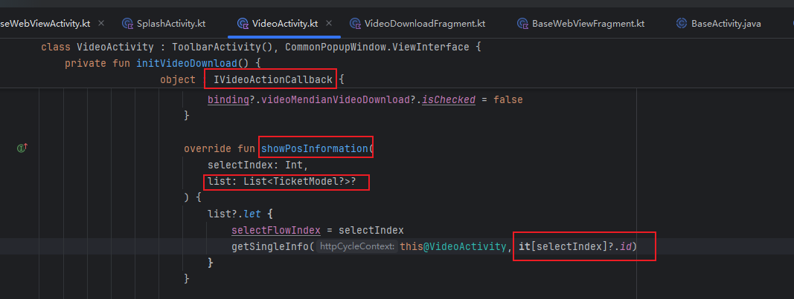
  - 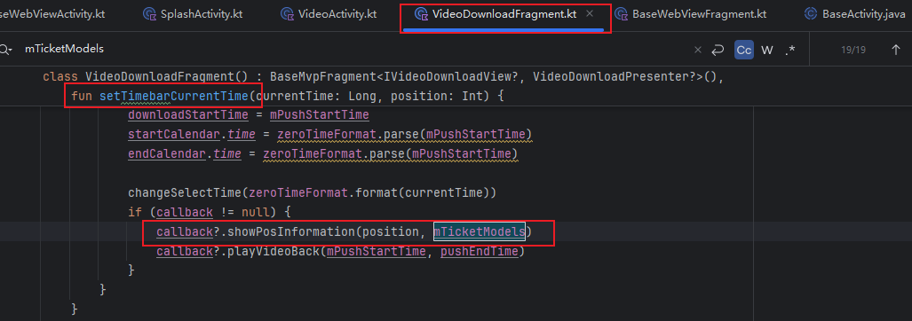

### 3.2 可疑修改点

- 

## 04.复现步骤


## 05.解决方案尝试

### 5.1 第一次解决方案

- 分析：
  - fix(VideoActivity): 815行showPosInformation位置缺少越界检测，导致云值守门店事件部分查看回放时切换视频源产生数组越界的的异常并导致应用程序崩溃。这可能只是暂时的解决方法，根本问题可能是 mTicketModels 采用协程加载，在该位置使用时，协程未加载完成，导致的没有数据的问题。
- 解决方案：
  - 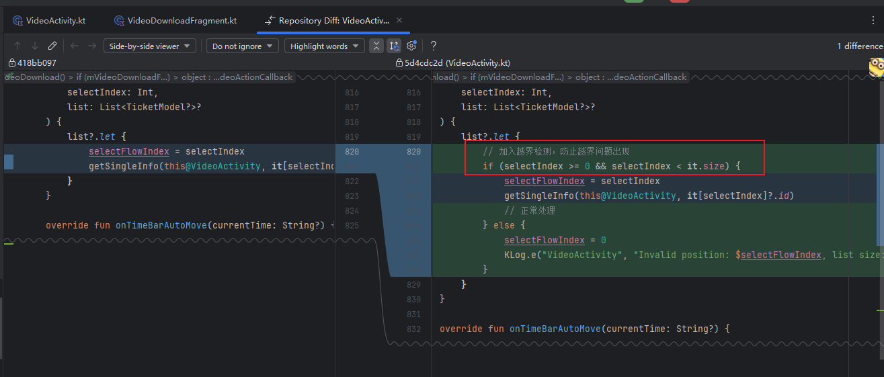
- 结果：
  - 未产生应用崩溃的问题
  - 产生新的问题：简单地跳过执行，会导致用户交互失效，视频回放功能不工作，用户体验很差。

### 5.2 第二次解决方案

- 分析：

  - 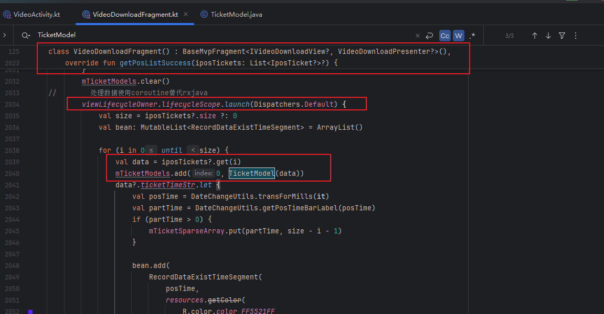

    - 这段代码是异步协程（coroutine）在后台线程填充 mTicketModels。
    - 只有等 for 循环跑完，mTicketModels 才会有数据。

  - 崩溃的原因：

    - UI 线程在协程还没填充完 mTicketModels 时，就已经去访问了它（如 mTicketModels[0]）
    - 这时 mTicketModels 还是空的，导致 IndexOutOfBoundsException 崩溃

  - 这是典型的异步数据未就绪的问题

    - 你在切换视频、切换时间轴、或其他 UI 操作时，UI 逻辑和数据填充是并发的，但没有同步机制保证“数据已准备好再访问”。

    - 只要 UI 比协程快一步，就会出现空列表访问

- 解决方案：
  
  - 我们既要解决应用崩溃的问题，也不能简单地跳过执行。
  - 定义状态
    - 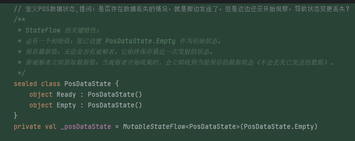
  - 状态变化
    - 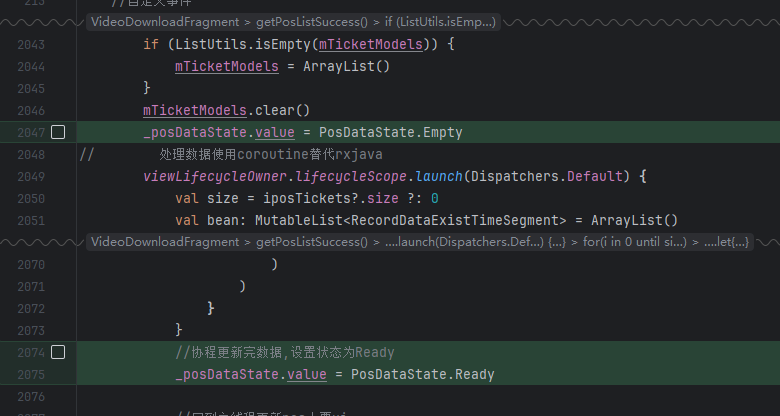
  - 观察状态
    - 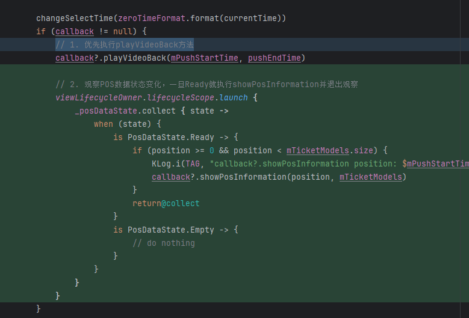
  
- 结果：
  
  - 好像这不是真正的解决啊
  - 日志如下：
    - 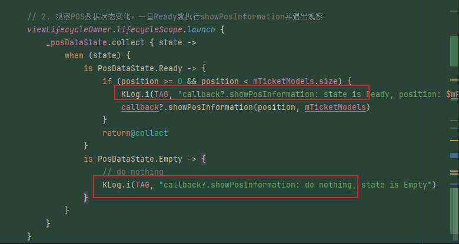
    - 

### 5.3 第三次解决方案

- 分析：
  - 为什么是上面的样子？
  - 加日志：
    - 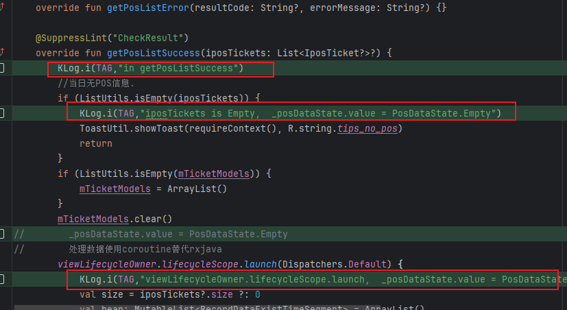
    - 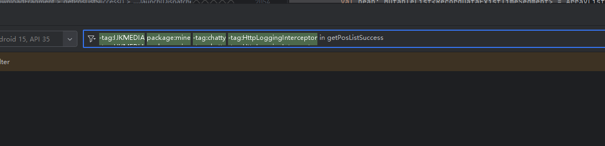
    - 好像这个getPosListSuccess没有正确执行啊
  - 加日志
    - 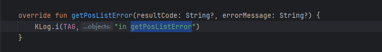
    - 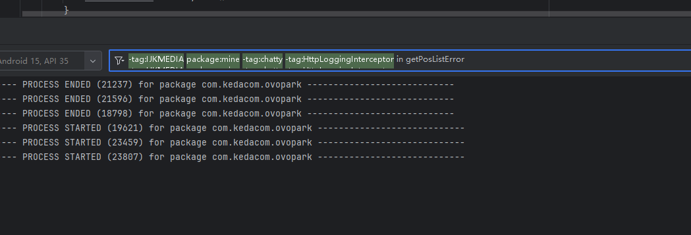
    - 好像这个getPosListError也没有正确执行啊
- 解决方案：查看这个的流程
  - 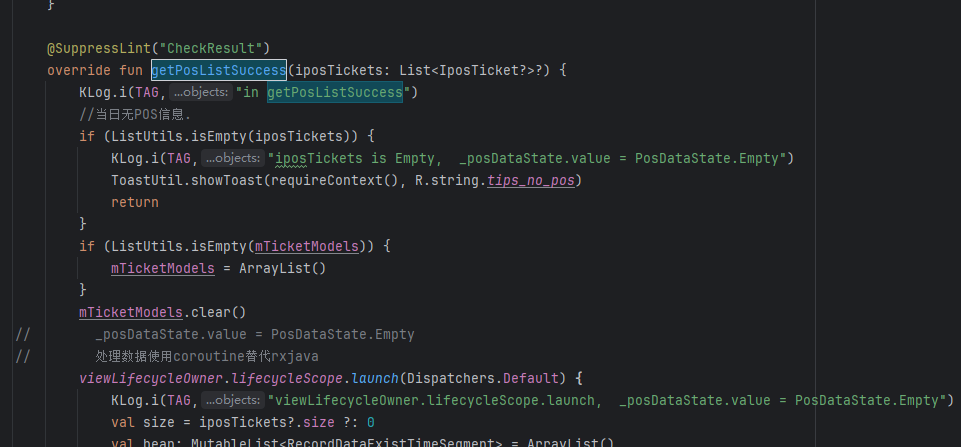
  - 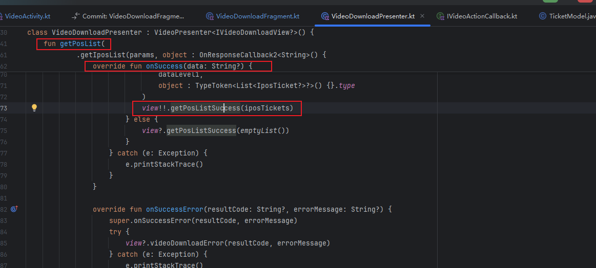
  - 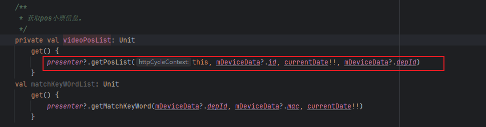
  - 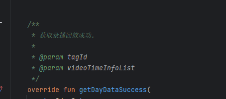
  - 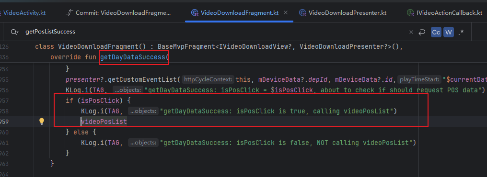
  - 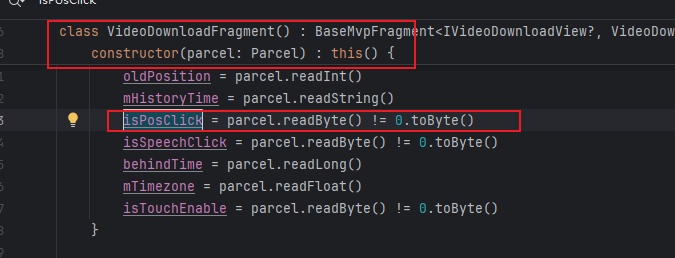
  - 
- 我们看是在构造函数中才修改的他，那么谁调用的他呢？
  - 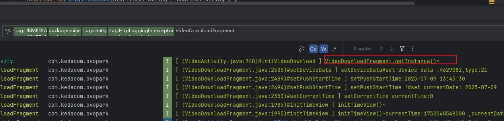
  - 
  - 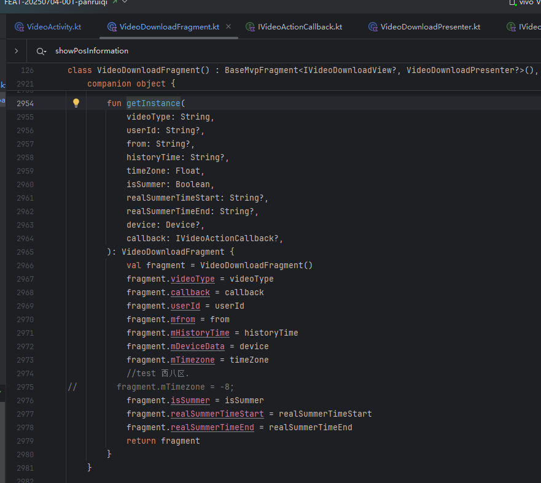
- 结果：
  - 所以，他就没有被初始化，isPosClick一直是false，因此也没触发getPosListSuccess中的mTicketModels.add的逻辑，因此也没有触发状态流的变化。

### 5.4 第四次解决方案

- 分析：
  - isPosClick一直是false，因此也没触发getPosListSuccess中的mTicketModels.add的逻辑，因此也没有触发状态流的变化。所以假如这边去访问，必定是空，那么根本问题不是5.2中协程的问题，而是数据本身为空。因此无需5.2中状态流的解决方案，只需要加入判空机制即可

- 解决方法：
  - 只需要加入判空机制即可
- 结果：
  - rollback之前的修改，加入判空机制即可

### 5.4 第五次解决方案

- 分析：
  - 
- 解决方案：
  - 
- 结果：成功解决问题


## 06.进一步思考

### 6.1 有没有其他更优雅的方案

- 

### 6.2 推荐方案

```

```


## 07.根本原因和修复

### 7.1 最终定位

- 

### 7.2 修复方案


## 08.经验总结

### 8.1 技术原理

### 8.2 预防措施

### 8.3 卸载规范

### 8.4 调试技巧


