[toc]

## 01.功能概述

- **功能ID**：`FEAT-20250704-001`  
- **功能名称**：点击云值守商户端门店事件回放时，跳转原生APP查看回放
时，可切换门店下所有的监控设备。
- **目标版本**：v0.3.0
- **提交人**：@panruiqi  
- **状态**：
  - [ ] ⌛ 设计中 /
  - [ ] ⌛ 开发中 / 
  - [x] ✅ 已完成 / 
  - [ ] ❌ 已取消  
- **价值评估**：  
  - [x] ⭐⭐⭐⭐⭐ 核心业务功能  
  - [ ] ⭐⭐⭐⭐ 用户体验优化  
  - [ ] ⭐⭐⭐ 辅助功能增强  
  - [ ] ⭐⭐ 技术债务清理  
- **功能描述** 
- 目前有多个球机，也就是监控设备，但是现在只能显示一个监控设备的画面
  - 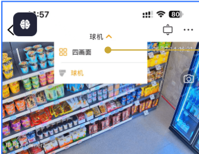

## 02.需求分析

### 2.1 用户场景

- **主要场景**：  

  - 用户在门店中添加了多个球机，希望可以看到多个监控的画面。他可以通过切换球机下的球机编号切换到不同球机所对应的视频源并进行播放。
  
  

### 2.2 功能范围

- ✅ 包含：
- ❌ 不包含：

## 03.代码位置定位

### 3.1 初步定位

发现存在文字：快拍，去进行查找

- 

主要在VideoPlayActivity和VideoPlayFragment中出现。

去VideoPlayFragment中查看

- 

有日志记录诶，加入日志过滤，发现来回点击仅视频时确实出现了这个日志，也就是说，很可能和VideoPlayFragment相关

- 

Find in Usage

- 
- 
- 

确定了，这个页主要和VideoPlayFragment相关，或者最起码被他包含一部分

目前就是主要涉及的是VideoPlayActivity 和 VideoPlayFragment两个位置

### 3.2 进一步定位

ok，我们要修改的是

- 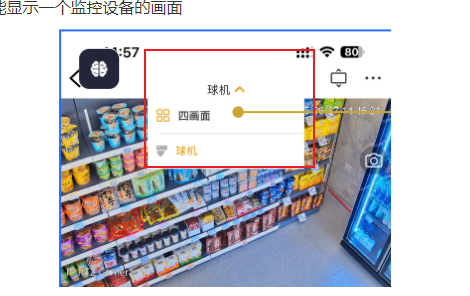
- 看看VideoPlayFragment，不太符合，更像是内部的视频播放
  - 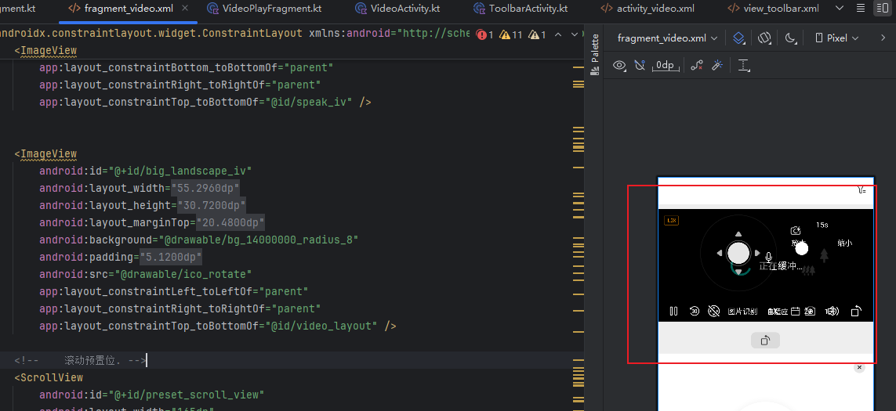

- 看看VideoPlayActivity，符合诶，就是不太一致。
  - 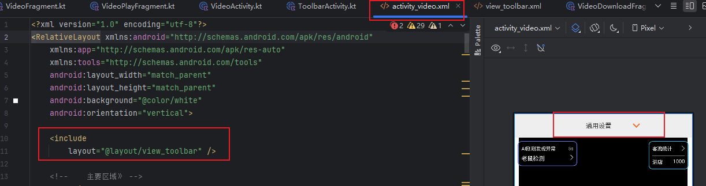

### 3.3 进一步定位

这个View_toolbar里面是什么

- 这里点击按钮，发现是整个FrameLayout有触感反馈，因此查找这个toolbar_title_layout

- 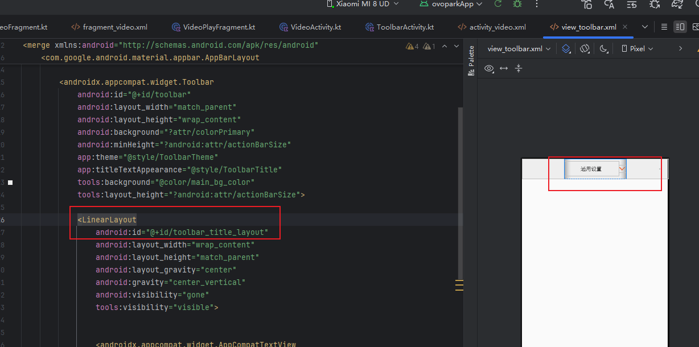

查找这个id

- 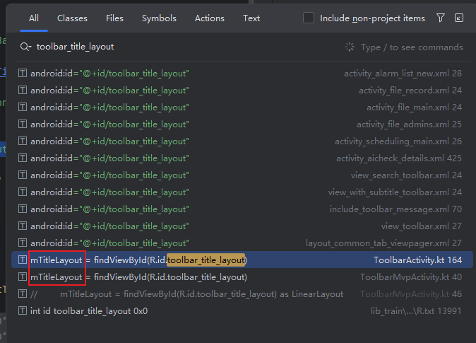

是mTitleLayout，去查找

- 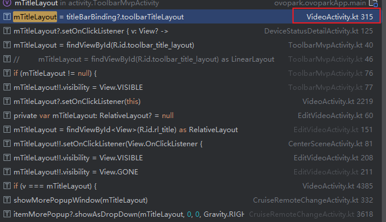

去VideoActivity中看

- 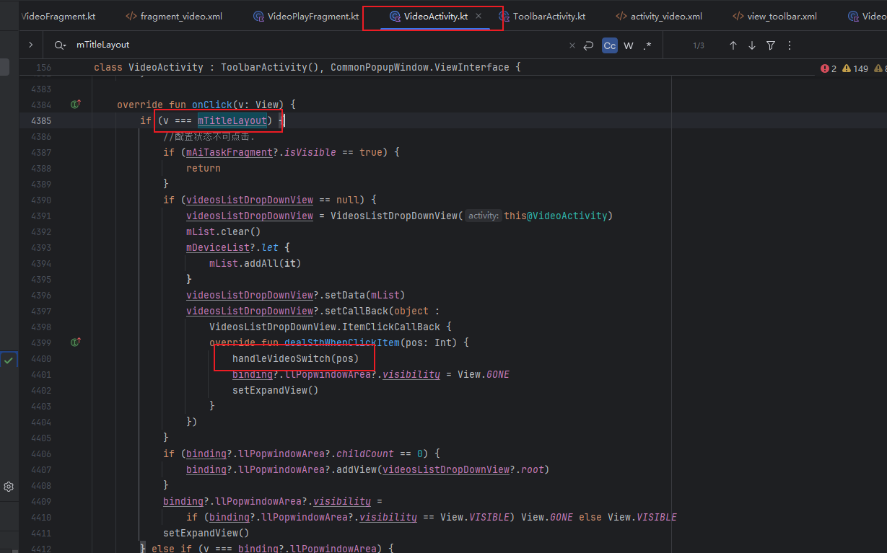

目前切换这个位置判断为上述的handleVideoSwitch

### 3.4 验证所处位置

添加打印

- 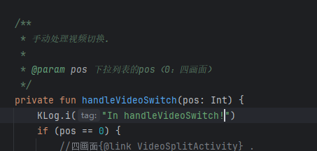

- 程序崩溃
  - 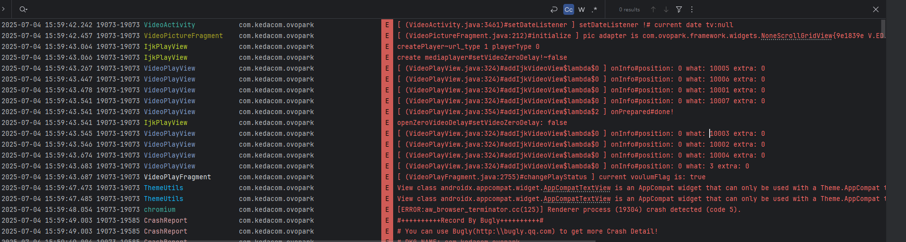

- 忽略上面的

### 3.5 点击事件定位

点击事件定位：

- 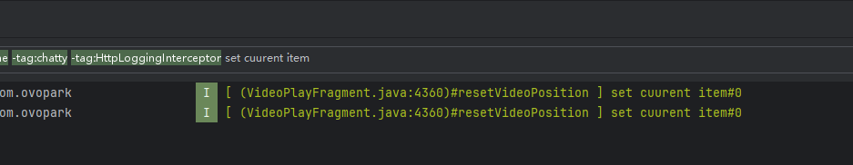
- 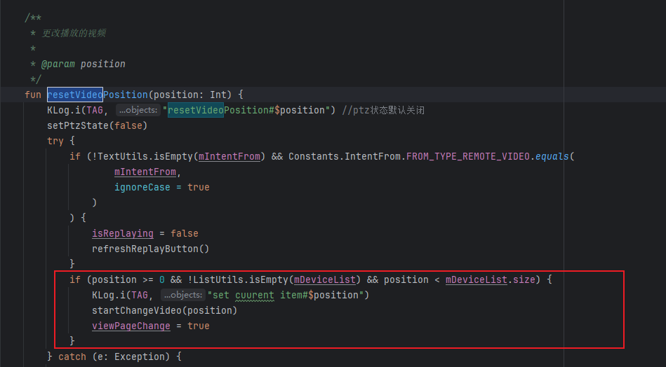
- 这块处理没问题啊，就是正常处理，那么为什么没有多余的数据源呢？是不是mDeviceList的问题呢？

mDeviceList定位

- 

- 这是数据刷新的位置，也就是addAll的位置

数据怎么来的？

- 多个重载的方法，这是源头
- 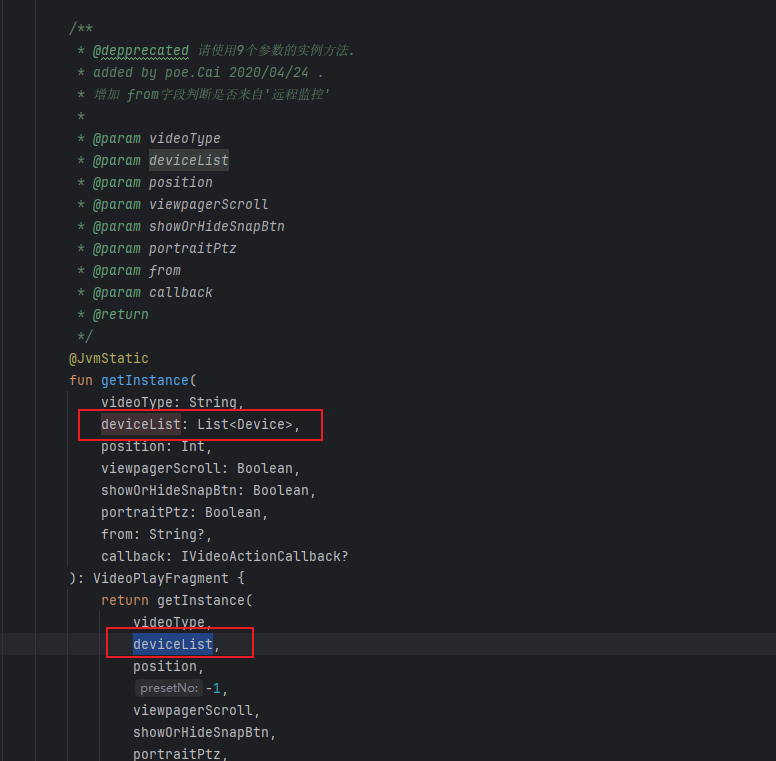
- 对应这个位置
- 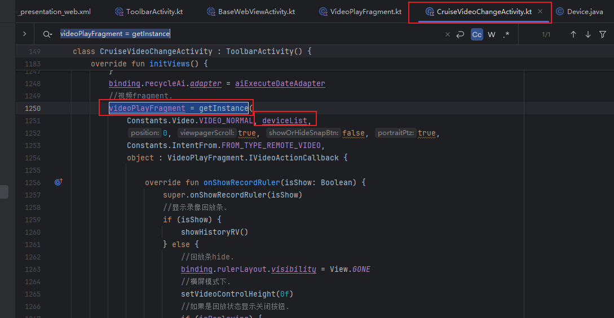
- deviceList数据在这
- 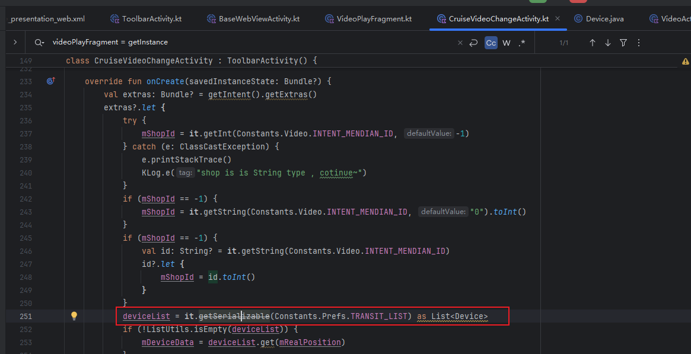
- 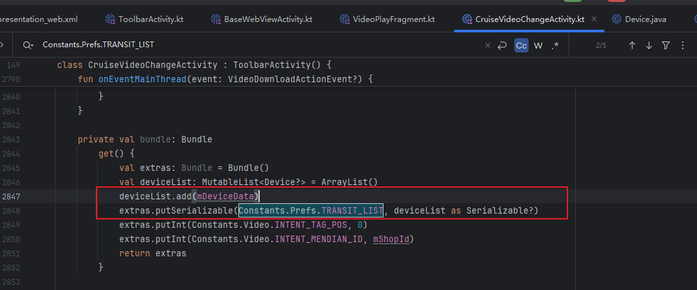

不对，数据不是这样来的

- 是用VideoActivity中来的。

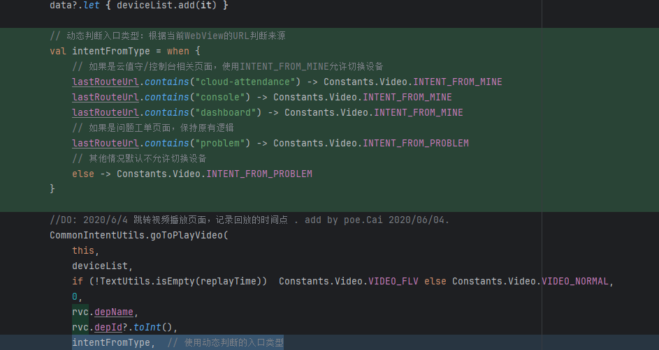

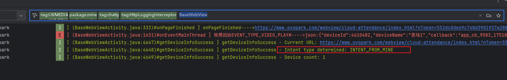

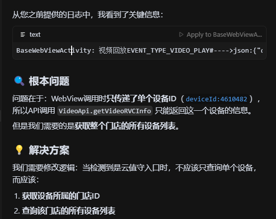

那么数据究竟是怎样获取的呢？

- 参考 [05. study_云值守视频播放逻辑.md](05. study_云值守视频播放逻辑.md) 

我们定位到根本原因是：传递进来的数据有问题，整个数据集只有一个数据

### 3.6 方案一

- 实现思路：在BaseWebViewActivity中重新进行网络请求获取数据源实现。
  - 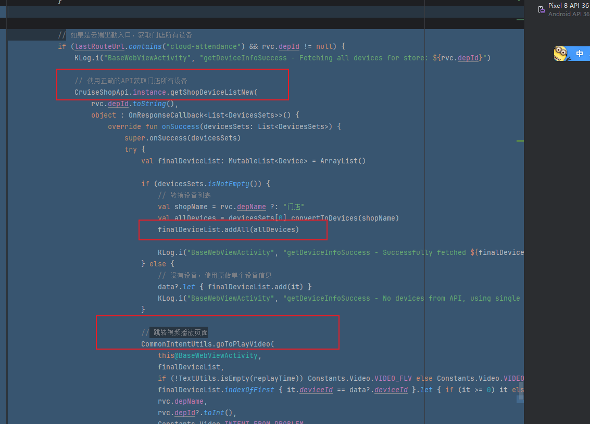

### 3.7 方案二

- 实现思路：尝试在获取设备信息时进行分支处理，避免网络请求后再次进行云值守网络请求覆盖数据。
  - 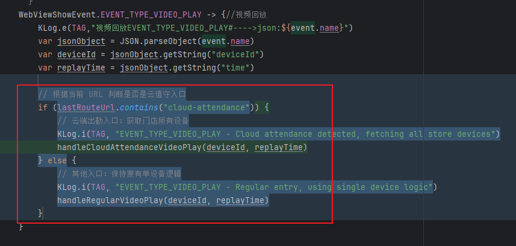

## 04.实现规划

### 4.1 技术选型

### 4.2 任务拆解

### 4.3 代码路径

## 05.兼容性设计

### 5.1 设备适配

### 5.2 冲突检查

## 06.测试方案

### 6.1 核心用例

### 6.2 性能指标

## 07.发布计划

### 7.1 阶段发布

### 7.2 回滚方案

## 08.文档记录

### 8.1 技术文档

### 8.2 用户文档

### 8.3 监控埋点

