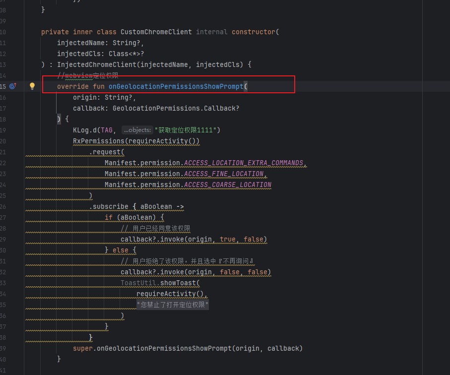

[toc]

## 前言

> 学习要符合如下的标准化链条：了解概念->探究原理->深入思考->总结提炼->底层实现->延伸应用"

## 01.学习概述

- **学习主题**：JSBridge机制
- **知识类型**：
  - [ ] **知识类型**：
    - [x] ✅Android/ 
      - [ ] ✅01.基础组件
      - [ ] ✅02.IPC机制
      - [ ] ✅03.消息机制
      - [ ] ✅04.View原理
      - [ ] ✅05.事件分发机制
      - [ ] ✅06.Window
      - [x] ✅07.复杂控件
      - [ ] ✅08.性能优化
      - [ ] ✅09.流行框架
      - [ ] ✅10.数据处理
      - [ ] ✅11.动画
      - [ ] ✅12.Groovy
    - [ ] ✅音视频开发/
      - [ ] ✅01.基础知识
      - [ ] ✅02.OpenGL渲染视频
      - [ ] ✅03.FFmpeg音视频解码
    - [ ] ✅ Java/
      - [ ] ✅01.基础知识
      - [ ] ✅02.Java设计思想
      - [ ] ✅03.集合框架
      - [ ] ✅04.异常处理
      - [ ] ✅05.多线程与并发编程
      - [ ] ✅06.JVM
    - [ ] ✅ Kotlin/
      - [ ] ✅01.基础语法
      - [ ] ✅02.高阶扩展
      - [ ] ✅03.协程和流
- **学习来源**：主线云值守模块中使用到H5界面，点击某个位置后会调用我们原生显示
- **重要程度**：⭐⭐⭐⭐⭐（核心基础）  
- **学习日期**：2025.07.07
- **记录人**：@panruiqi

### 1.1 学习目标

- 了解概念->探究原理->深入思考->总结提炼->底层实现->延伸应用"

### 1.2 前置知识

## 02.核心概念

### 2.1 是什么？

JSBridge 机制，是指在 Android App 的 WebView 中，JavaScript（前端）和原生代码之间互相通信的桥梁机制。

它让 Web 页面里的 JS 能调用原生方法，原生也能回调 JS，实现“混合开发”时的深度集成


### 2.2 解决什么问题？

WebView 只能渲染网页，JS 代码无法直接访问手机硬件、系统能力（如相机、定位、存储等）。

但原生代码可以。

通过 JSBridge，JS 可以“请求”原生帮它做事，原生也能把结果“回调”给 JS

### 2.3 基本特性


## 03.原理机制

### 3.1 进一步理解

给我一个典型的实现

- 原生接口注册

  - ```
    public class HostJsScope {
        @JavascriptInterface
        public static void goVideoPlay(WebView webView, String url) {
            if (webView.getContext() instanceof Activity) {
                EventBus.getDefault().post(new WebViewShowEvent(EVENT_TYPE_VIDEO_PLAY, url));
            }
        }
    }
    
    // 注册到 WebView
    webView.addJavascriptInterface(new HostJsScope(), "HostJsScope");
    ```

- JS调用原生

  - ```
    window.HostJsScope.goVideoPlay(JSON.stringify({ deviceId: 123 }));
    ```

- 原生回调JS

  - ```
    webView.evaluateJavascript("javascript:callbackFunction('result')", null);
    ```


### 3.2 进一步理解

- 

### 3.3 进一步理解

小结：JSBridge 就是 JS 和原生互相“打电话”的桥梁。

- JS 想让原生干活：通过 JSBridge 调用原生方法

- 原生想通知 JS：通过 JSBridge 回调 JS 函数

### 3.4 实际项目中如何实现的

goVideoPlay 在哪注册为 JS 接口？

- ```
  mWebView?.webChromeClient = CustomChromeClient("webview", HostJsScope::class.java)
  ```

CustomChromeClient是什么？这符合构造反射映射表的过程吗？

- CustomChromeClient

  - ```
    private inner class CustomChromeClient internal constructor(
        injectedName: String?,
        injectedCls: Class<*>?
    ) : InjectedChromeClient(injectedName, injectedCls) {
        // ...
    }
    ```

  - 这里 CustomChromeClient 继承自 InjectedChromeClient。

  - 构造参数 injectedName（如 "webview"）和 injectedCls（如 HostJsScope::class.java）就是要注入到 JS 的对象名和类

那为什么要用这个CustomChromeClient呢？

- 添加一些权限处理

- 

那原生主动调JS呢？

- ```
  webView.loadUrl("javascript:" + callbackMethod + "('" + response + "')");
  webView.loadUrl("javascript:" + callBack + "({" + ... + "})");
  ```

  


## 04.底层原理

基本机制：

- 你调用 webView.addJavascriptInterface(obj, "name") 后，WebView 会把 obj 这个 Java 对象以 name 这个名字注入到 JS 的全局作用域。

- JS 代码可以通过 window.name.methodName() 直接调用 Java 对象的 @JavascriptInterface 标注的方法

JSBridge的底层原理是什么？

- 映射表生成

  - WebView 内部会通过 Java 反射机制，扫描 obj 上所有被 @JavascriptInterface 注解的方法。

  - 这些方法会被注册到一个映射表，供 JS 调用时查找

- JS到Java的调用

  - JS 调用：例如：window.android.showToast("hello")
  - WebView 拦截：WebView 的 JS 引擎（V8/Dalvik/ART）会拦截到对 window.android 的访问。
  - 参数序列化：JS 传递的参数会被序列化为字符串，通过 WebView 的桥接通道传递到 Java 层。
  - 反射调用：WebView 内部通过反射查找 android 对象上名为 showToast 的方法，并将参数反序列化后调用。
  - 返回值处理：如果有返回值，会被序列化后传回 JS

整体流程

- ```
  JS (window.android.method()) 
     ↓
  WebView JS引擎拦截
     ↓
  JNI/桥接通道
     ↓
  Java层反射查找 @JavascriptInterface 方法
     ↓
  执行方法并返回结果
  ```

缺了一个：Java中通过反射的映射表找到对应的Java方法执行，这里呢？类似反射机制 和 映射表机制？

- 原生调 JS 本质上只是“拼接 JS 代码字符串并注入执行

- Java 调 JS 的机制（本质）

  - Java 调 JS：只是把一段 JS 代码（字符串）通过 loadUrl("javascript:...") 或 evaluateJavascript("...") 注入到 WebView 的 JS 引擎中执行。

  - 不会自动查找 JS 方法，也没有类似 Java 反射那样的“方法映射表”。

  - 你要自己拼接 JS 方法名和参数，比如：

  - ```
     String js = "window.webview.onNativeCallback('" + param + "')";
     webView.loadUrl("javascript:" + js);
    ```

- 为什么没有类似反射机制？

  - Java 调 JS 是“单向字符串注入”，WebView 只负责把这段 JS 代码丢给 JS 引擎执行，不会做任何方法查找或参数分发。

  - JS 端是否有这个方法、参数是否正确，完全靠前端和后端约定，如果 JS 端没有定义这个方法，调用会报错，但不会像 Java 反射那样抛异常到 Java 层。

那么JS端分发器的原理是什么？

- 其实就是用 JavaScript 代码实现一个“方法映射表”+“统一入口”，让外部（比如原生、H5其他模块）只需调用一个统一的 JS 方法，由它来根据方法名和参数自动分发到具体的业务方法。

- 核心思想：

  - 映射表：用 JS 对象保存“方法名 → 具体函数”的映射关系。

  - 统一入口：提供一个统一的分发函数（如 dispatch），接收方法名和参数。

  - 自动分发：dispatch 根据方法名查找并调用对应的函数

- 伪代码

  - ```
    window.bridge = {
      // 业务方法
      showToast: function(params) {
        alert(params.message);
      },
      goVideoPlay: function(params) {
        // 业务逻辑
      },
      // 分发器
      dispatch: function(method, params) {
        if (typeof window.bridge[method] === 'function') {
          window.bridge[method](params);
        } else {
          console.warn('No such method:', method);
        }
      }
    };
    ```

- 原理分析：

  - 方法注册：所有可被调用的 JS 方法都注册在 window.bridge 对象上。

  - 统一分发：外部只需调用 window.bridge.dispatch(method, params)，不需要知道具体方法名。

  - 动态查找：dispatch 用 window.bridge[method] 动态查找方法（类似 JS 反射）。

  - 参数传递：参数可以是对象、字符串等，分发器直接传递给目标方法。

## 05.深度思考

### 5.1 关键问题探究


### 5.2 设计对比


## 06.实践验证

### 6.1 行为验证代码


### 6.2 性能测试


## 07.应用场景

### 7.1 最佳实践


### 7.2 使用禁忌


## 08.总结提炼

### 8.1 核心收获


### 8.2 知识图谱


### 8.3 延伸思考


## 09.参考资料

1. []()
2. []()
3. []()

## 其他介绍

### 01.关于我的博客

- csdn：http://my.csdn.net/qq_35829566

- 掘金：https://juejin.im/user/499639464759898

- github：https://github.com/jjjjjjava

- 简书：http://www.jianshu.com/u/92a2412be53e

- 邮箱：[934137388@qq.com]

