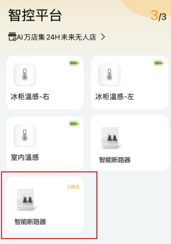
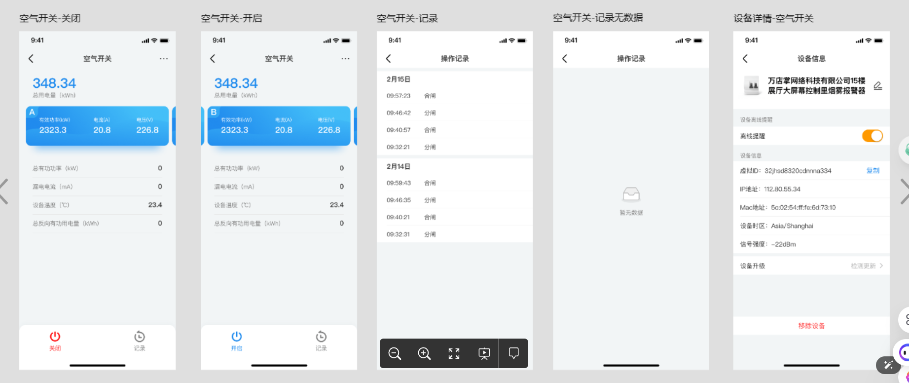
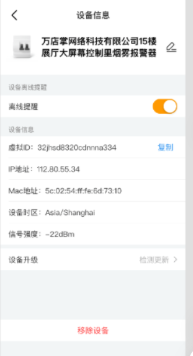
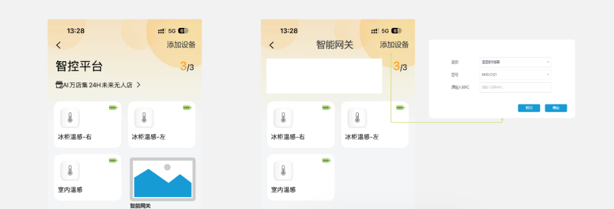
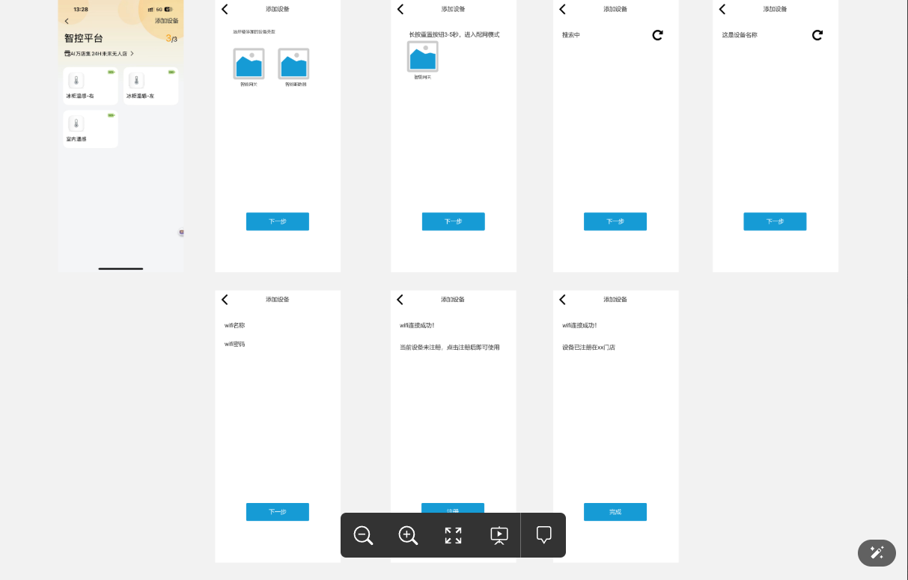
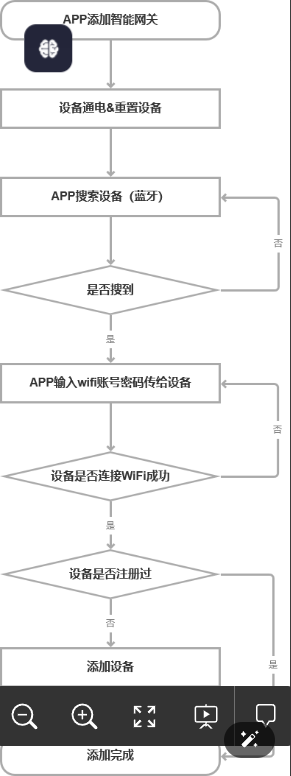
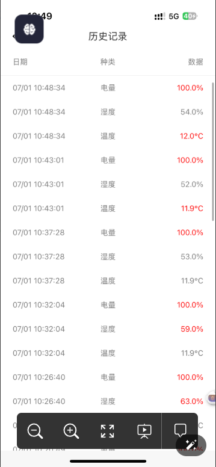

[toc]

## 01.需求一

需求来源：戴雪飞

需求背景：对接天毅行空开（智能微型断路器），0807GBE论坛交流演示

需求描述：

- 01.门店设备列表新增智能断路器设备
  - 
  - 功能介绍：
    - 智控平台-门店的设备列表，新增智能断路器，展示设备在线状态
    - 在线状态UI调整（建议使用置灰或红色icon？）
    - 离线可以点击查看详情
  - 疑问：
    - 这是什么页？从哪个位置跳进去的？ 
      -  智控平台
    - 他的参数是什么样的？接口从哪拿？  
      - 等郁公子
    - UI原型呢？从哪拿？ 
    -  app/design/162367/board
    - 这个在线状态UI调整是什么意思？   
      - 非关键点
    - 离线查看详情，那在线呢？在线查看什么？  
      - 以前正常状态可以查看，现在要求离线也可以查看
  
- 02.APP设备详情

  - 

  - 功能介绍：

    - 展示设备总用电量（截止到当前时间）

    - 三项设备的ABC向的有效功率、电流、电量

    - 此设备的总有功功率、漏电电流、设备温度（当前内部温度）、总反向有功用电量

    - 开启-合闸；关闭-分闸

      - 来源：手动操作/设备主动发生
      - 需展示当前设备的状态（开启或关闭），并支持切换

    - 操作记录：即web端历史数据，记录此设备的合闸分闸操作和操作时间

    - 设备信息

      - 支持修改设备名称，注意这里修改是备注名称
      - 删除设备，即设备退网，删除设备及它的历史数据，需二次确认
      - 设备ID：即设备的序列号/mac？

      （现在三方设备、秒秒测、天毅行设备的称呼有差异，万店掌平台统一使用设备ID作为某台的唯一标识）

      其他UI中信息或操作均隐藏

  - 提问：

    - 设备详情从哪进去？
      - 点击设备进去查看
    - 这是空气开关的设备详情？可是之前说的是智能断路器啊？什么是智能断路器？
      - 两个是一样的
    - 我的这些数据从哪个接口拿？
      - 等郁公子
    - 我开关操作也是调接口？还是通过蓝牙发送数据？
      - 接口
    - 设备信息页
      - 从哪进？
        - 设备详情页的右上角三个点
      - 离线提醒？
        - 不要
      - 虚拟ID？，IP地址？，Mac地址？设备封区？信号强度？这些从哪获取？
        - 只保留IP地址，修改名称 和 移除设备
      - 设备升级我记得是暂时不处理
      - 修改名称的数据要发送给后端吗？
        - 要的
      - 

## 02.需求二

需求来源：戴雪飞

需求背景：IOT客户越来越多，需要把网关配网功能做到万店掌app里，否则使用三方APP很不方便

需求描述：

- 01.门店iot设备列表新增网关设备
  - 
  - 功能介绍：
    - 门店的iot设备列表，新增网关设备
    - 网关设备详情，展示该网关下的子设备，支持添加子设备
    - 点击添加，选择设备类型：温湿度传感器（现在只有这个类型）；型号：MHO-C121、秒秒测无限温度标签；输入mac；完成添加子设备（即web端的子设备关联）
  - 提问：
    - 页面地址在哪？
      - 同上
    - 门店iot设备列表新增，这个和01的第一个需求门店设备列表新增有什么关系？
      - 一样的，要给个 添加设备的按钮
    - 网关设备详情？（网关设备详情，展示该网关下的子设备，支持添加子设备）什么意思？缺少图示，UI，也确实详细的功能描述
      - 点击网关设备，跳转到只能网关页，下面显示其三个子设备，点击添加设备，可以添加其子设备
    - 添加设备逻辑，接口从哪拿？
      - 郁工资
- 02.门店iot设备列表
  - 
  - 
  - 功能介绍：
    - 智控平台模块-选择某家门店
    - 点击添加设备
    - 选择设备类型，进入不同设备的入网引导
    - 智能网关入网：
      - -提示用户重置设备
      - -手机开始搜索设备并连接（根据三方app效果，搜索成功点击该设备则默认连接成功）
      - -输入wifi账号密码
      - -网络连接成功
      - -下一步注册至平台（配网和入网分开两步，防止后期门店更换网络、设备只需换wifi而不要重新注册平台）
      - 选择关联主设备（指智能网关），输入序列号，添加成功
    - 智能断路器入网：
      - 提示用户重置设备进入配置状态；
      - 手机搜索设备；
      - 手机和设备连接；
      - 输入wifi密码设备联网
      - 查询设备入网状态，若未入网，则提示用户注册入网
  - 提问：
    - 选择关联主设备（指智能网关），输入序列号，添加成功什么意思？缺少图示，UI，也缺少详细的功能描述


## 03.需求三

需求来源：戴雪飞

需求背景：使用优化

需求描述：

- 01.查询历史数据优化

  - 

  - 功能介绍：

    - app查询历史数据时，首次加载非常慢，需要等待很久或上拉重新刷新。但是接口返回很快，需优化

      （快速展示数据或起码加个loading）

    - 数字颜色逻辑不正常，现在单看页面数据无法确认红色字体的逻辑。改为：

      - 异常数据红色，正常数据灰色
      - 其中电量无告警设置，应该永远是正常数据

  - 提问：从哪进去这个页面的？


## 04.重难点优先处理

其中关键点在于：通过蓝牙搜索设备，通过对码（约定好的码）过滤其他设备，然后连接上后给他传输wifi的账号密码。并获取其连接wifi成功的结果。

- 发现和连接蓝牙设备

  - ```
    class GatewayProvisioningManager(private val context: Context) {
        private val bluetoothAdapter: BluetoothAdapter? = BluetoothAdapter.getDefaultAdapter()
        private val scanCallback = object : ScanCallback() {
            override fun onScanResult(callbackType: Int, result: ScanResult) {
                val device = result.device
                val scanRecord = result.scanRecord
                
                // Filter devices by specific service UUID or manufacturer data
                if (isTargetDevice(scanRecord)) {
                    // Found target device
                    connectToDevice(device)
                }
            }
        }
        
        private fun isTargetDevice(scanRecord: ScanRecord?): Boolean {
            // Check for specific identifier in scan record
            // Could be a service UUID or manufacturer-specific data containing your "code"
            scanRecord?.serviceUuids?.forEach { uuid ->
                if (uuid.uuid == YOUR_SERVICE_UUID) return true
            }
            
            // Or check manufacturer data
            val manufacturerData = scanRecord?.getManufacturerSpecificData(YOUR_MANUFACTURER_ID)
            if (manufacturerData != null) {
                // Check if data contains your pre-agreed code
                // Example: first 3 bytes match expected pattern
                return manufacturerData[0] == 0xAA && 
                       manufacturerData[1] == 0xBB && 
                       manufacturerData[2] == 0xCC
            }
            return false
        }
        
        fun startDeviceDiscovery() {
            val scanSettings = ScanSettings.Builder()
                .setScanMode(ScanSettings.SCAN_MODE_LOW_LATENCY)
                .build()
                
            // Start scanning
            bluetoothAdapter?.bluetoothLeScanner?.startScan(null, scanSettings, scanCallback)
        }
    }
    ```

- 通过蓝牙BLE与智能设备通信

  - ```
    private val gattCallback = object : BluetoothGattCallback() {
        override fun onConnectionStateChange(gatt: BluetoothGatt, status: Int, newState: Int) {
            if (status == BluetoothGatt.GATT_SUCCESS) {
                if (newState == BluetoothProfile.STATE_CONNECTED) {
                    // Connected to device
                    gatt.discoverServices()
                }
            }
        }
    
        override fun onServicesDiscovered(gatt: BluetoothGatt, status: Int) {
            if (status == BluetoothGatt.GATT_SUCCESS) {
                // Find the WiFi configuration service and characteristic
                val wifiService = gatt.getService(WIFI_CONFIG_SERVICE_UUID)
                val wifiConfigChar = wifiService?.getCharacteristic(WIFI_CONFIG_CHAR_UUID)
                
                // Set up notification for status updates
                val wifiStatusChar = wifiService?.getCharacteristic(WIFI_STATUS_CHAR_UUID)
                gatt.setCharacteristicNotification(wifiStatusChar, true)
                
                // Enable notifications on the remote device
                val descriptor = wifiStatusChar?.getDescriptor(CLIENT_CONFIG_DESCRIPTOR_UUID)
                descriptor?.value = BluetoothGattDescriptor.ENABLE_NOTIFICATION_VALUE
                gatt.writeDescriptor(descriptor)
            }
        }
        
        override fun onCharacteristicChanged(gatt: BluetoothGatt, characteristic: BluetoothGattCharacteristic) {
            if (characteristic.uuid == WIFI_STATUS_CHAR_UUID) {
                // Process connection status updates
                val status = characteristic.value[0].toInt()
                when (status) {
                    0 -> { /* Connecting */ }
                    1 -> { /* Connection successful */ }
                    2 -> { /* Connection failed */ }
                }
            }
        }
    }
    
    fun sendWifiCredentials(ssid: String, password: String) {
        val wifiService = gatt?.getService(WIFI_CONFIG_SERVICE_UUID)
        val wifiConfigChar = wifiService?.getCharacteristic(WIFI_CONFIG_CHAR_UUID)
        
        // Secure the credentials - you may want to use encryption here
        // Simple example just combines SSID and password with delimiter
        val credentials = "$ssid|$password"
        wifiConfigChar?.value = credentials.toByteArray()
        
        // Write the characteristic
        gatt?.writeCharacteristic(wifiConfigChar)
    }
    ```

- 产生流的变化

  - ```
    class GatewayProvisioningViewModel : ViewModel() {
        private val _state = MutableLiveData<ProvisioningState>()
        val state: LiveData<ProvisioningState> = _state
        
        private val provisioningManager = GatewayProvisioningManager(application)
        
        fun startProvisioning() {
            _state.value = ProvisioningState.RESETTING_DEVICE
            
            // After user confirms device reset
            _state.value = ProvisioningState.SCANNING_DEVICES
            provisioningManager.startDeviceDiscovery()
        }
        
        fun deviceSelected(device: BluetoothDevice) {
            _state.value = ProvisioningState.CONNECTING_DEVICE
            provisioningManager.connectToDevice(device)
        }
        
        fun submitWifiCredentials(ssid: String, password: String) {
            _state.value = ProvisioningState.SENDING_CREDENTIALS
            provisioningManager.sendWifiCredentials(ssid, password)
        }
        
        // Called by the provisioningManager when status updates are received
        fun onWifiConnectionResult(success: Boolean) {
            _state.value = if (success) {
                ProvisioningState.CONNECTION_SUCCESSFUL
            } else {
                ProvisioningState.CONNECTION_FAILED
            }
        }
    }
    
    enum class ProvisioningState {
        RESETTING_DEVICE,
        SCANNING_DEVICES,
        CONNECTING_DEVICE,
        SENDING_CREDENTIALS,
        CONNECTING_WIFI,
        CONNECTION_SUCCESSFUL,
        CONNECTION_FAILED
    }
    ```

    

## 05.蓝牙