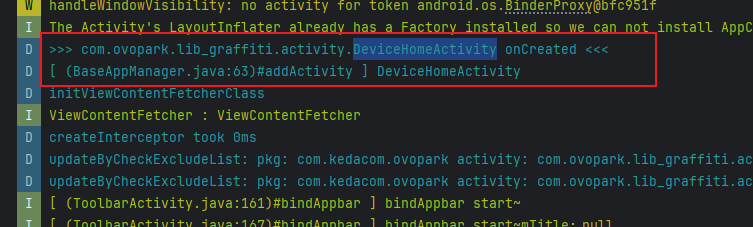
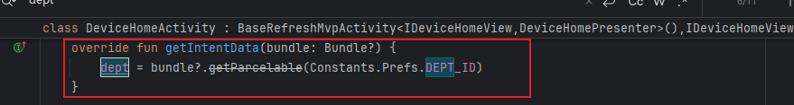

[toc]

## 前言

> 学习要符合如下的标准化链条：了解概念->探究原理->深入思考->总结提炼->底层实现->延伸应用"

## 01.学习概述

- **学习主题**：业务逻辑-智控平台
- **知识类型**：
  - [ ] **知识类型**：
    - [ ] ✅Android/ 
      - [ ] ✅01.基础组件
      - [ ] ✅02.IPC机制
      - [ ] ✅03.消息机制
      - [ ] ✅04.View原理
      - [ ] ✅05.事件分发机制
      - [ ] ✅06.Window
      - [ ] ✅07.复杂控件
      - [ ] ✅08.性能优化
      - [ ] ✅09.流行框架
      - [ ] ✅10.数据处理
      - [ ] ✅11.动画
      - [ ] ✅12.Groovy
    - [ ] ✅音视频开发/
      - [ ] ✅01.基础知识
      - [ ] ✅02.OpenGL渲染视频
      - [ ] ✅03.FFmpeg音视频解码
    - [ ] ✅ Java/
      - [ ] ✅01.基础知识
      - [ ] ✅02.Java设计思想
      - [ ] ✅03.集合框架
      - [ ] ✅04.异常处理
      - [ ] ✅05.多线程与并发编程
      - [ ] ✅06.JVM
    - [ ] ✅ Kotlin/
      - [ ] ✅01.基础语法
      - [ ] ✅02.高阶扩展
      - [ ] ✅03.协程和流
    - [ ] ✅ 故障分析与处理/
      - [ ] ✅01.基础知识
    - [ ] ✅ 自我管理/
      - [ ] ✅01.内观
    - [ ] ✅ 业务逻辑/
      - [ ] ✅01.启动逻辑
      - [ ] ✅02.云值守
      - [ ] ✅03.智控平台

- **学习来源**：FEAT_WDZ-129598-128285-128279-panruiqi
- **重要程度**：⭐⭐⭐⭐⭐
- **学习日期**：2025.07.16
- **记录人**：@panruiqi

### 1.1 学习目标

- 了解概念->探究原理->深入思考->总结提炼->底层实现->延伸应用"

### 1.2 前置知识

- [ ] 

## 02.核心概念

### 2.1 是什么？

智慧平台业务逻辑

### 2.2 解决什么问题？

FEAT_WDZ-129598-128285-128279-panruiqi前需要理解业务逻辑

### 2.3 基本特性

## 03.原理机制

### 3.1 进一步思考

模块入口？

- 搜索智控平台，  范镇

账号密码？

- test_wyl 666666 

代码入口？

- 

### 3.2 进一步思考

请问先给我分析他的流程，也就是内部的关键流程（让我可以定位到常见的问题）。然后我们再来进行源码分析

他有哪些核心的业务功能点？

- 设备配网和连接
  - 流程：AddDeviceActivity → 选择配网方式 → SearchDeviceActivity/SearchZigbeeDeviceActivity → 搜索配对
  - 详细流程：
    - 添加设备入口：AddDeviceActivity
      - 选择设备类型(WiFi/Zigbee)和配网方式
      - 通过INTENT_KEY_CONFIG_TYPE传递配网类型(EZ/AP/QR/BLE/Zigbe
    - 设备重置引导：
      - WiFi设备：ResertDeviceActivity
      - Zigbee设备：ZigbeeResertDeviceActivity
      - 引导用户将设备重置为配网状态
    - WiFi设备配网：
      - ChooseWifiActivity：选择WiFi网络
      - SearchDeviceActivity：搜索和配对设备
      - 使用SHARE_WIFI_USERNAME和SHARE_WIFI_PASSWORD传递WiFi信息
    - Zigbee设备配网：
      - SearchZigbeeDeviceActivity或ZigbeeSearchDeviceActivity
      - 通过Zigbee网关搜索和连接设备
    - 配网结果处理：
      - 成功：ConnectedSuccessActivity
      - 失败：ConnectedFailedActivity
- 设备信息显示
  - deptID获取
    - 
  - 

### 3.3 进一步思考

设备配网和连接的源码分析

- 

## 04.底层原理

## 05.深度思考

### 5.1 关键问题探究

### 5.2 设计对比

## 06.实践验证

### 6.1 行为验证代码

### 6.2 性能测试

## 07.应用场景

### 7.1 最佳实践

### 7.2 使用禁忌

## 08.总结提炼

### 8.1 核心收获

### 8.2 知识图谱

### 8.3 延伸思考

## 09.参考资料

1. 
2. 
3. 

## 其他介绍

### 01.关于我的博客

- csdn：http://my.csdn.net/qq_35829566

- 掘金：https://juejin.im/user/499639464759898

- github：https://github.com/jjjjjjava

- 邮箱：[934137388@qq.com]

