[toc]

## 01.功能概述

- **[优先级] **
  - [ ] ⚠️ 阻断 (Blocker)：系统崩溃、核心功能完全不可用
  - [ ] 🔴 严重 (Critical)：核心功能受损，无可用替代方案
  - [ ] 🟠 高 (High)：主要功能受影响，但有临时解决方案
  - [ ] 🟡 中 (Medium)：次要功能问题，影响用户体验
  - [ ] 🟢 低 (Low)：界面问题或轻微异常，不影响功能
- **问题简要描述**
  - **Bug ID**：`BUG-20240717-001`  
  - **影响版本**：v
  - **提交人**：@panruiqi
  - **状态**：
    - [x] ⌛ 修复中 /
    - [ ] ✅ 已解决 / 
    - [ ] ❌ 无法复现  

- **问题现象**
  - 连接到设备后，对其进行蓝牙配网时出现bug
- **环境特征**
  - 

## 02.问题分析

### 2.1 日志分析

- 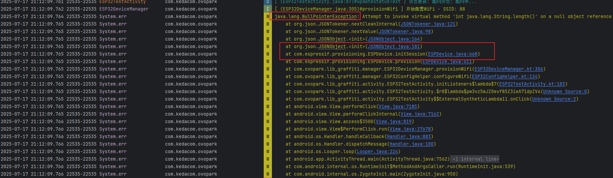

### 2.2 根本原因推理

- 代码路径如下：
  - 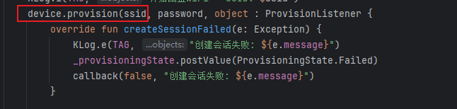
  - 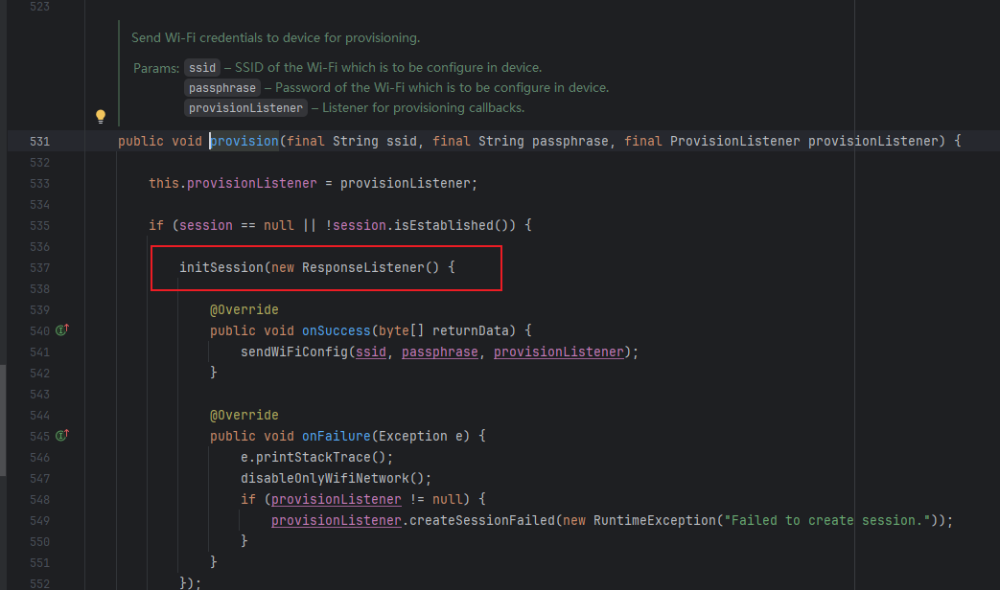

  - 

## 03.代码分析

### 3.1 关联代码路径

- 

### 3.2 可疑修改点

- 

## 04.复现步骤


## 05.解决方案尝试

### 5.1 第一次解决方案

- 分析：versioninfo为空，是否是流程错误？
  - 查看我和文档的执行区别
  - 我是：自己手动输入wifi账号，密码，然后直接执行
    - 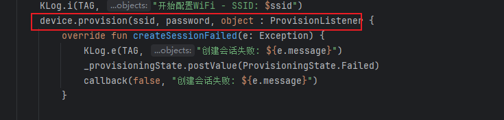
  - 文档：根据API搜索WIFI，然后执行连接操作
    - 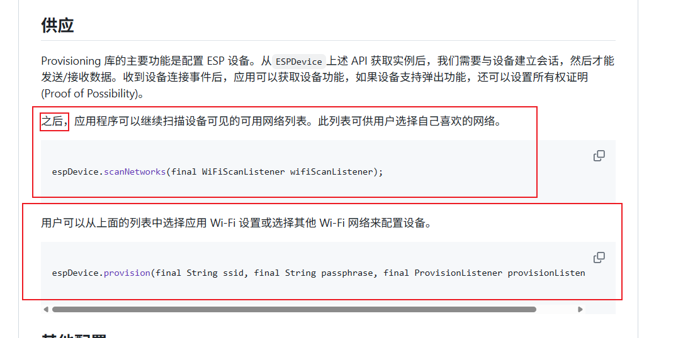
- 解决方案：
  - 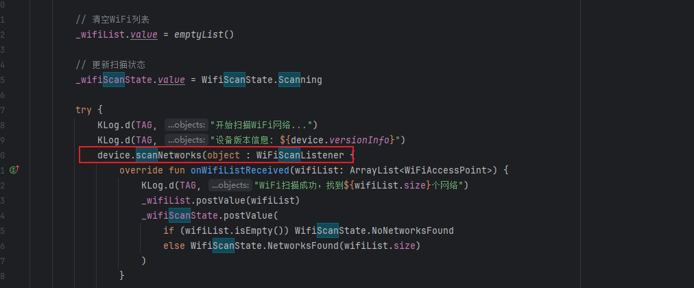
- 结果：
  - 不是，这个怎么也报这个错误啊？他也要这个seession
  - 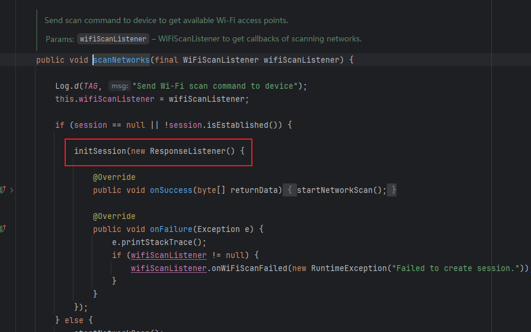

### 5.2 第二次解决方案

- 分析：
  - 不就是versioninfo为空吗？我直接去赋值
- 解决方案：
  - 调用相关API去赋值versioninfo
- 结果：
  - 没有相关的API

### 5.3 第三次解决方案

- 分析：
  - 保持一段时间连接，可能信息获取需要时间
- 解决方案：
  - 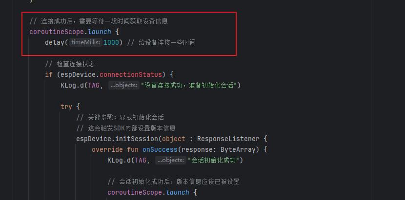
- 结果：
  - 仍是这样的结果

### 5.4 第四次解决方案

- 分析：
  - 
- 解决方案： swapped over from `WIFI_PROV_SECURITY_1` to `WIFI_PROV_SECURITY_0` on the firmware.
  - 之前是0，现在修改为1
  - 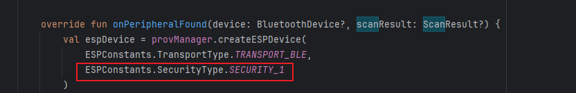
  - 
  - 
- 结果：
  - 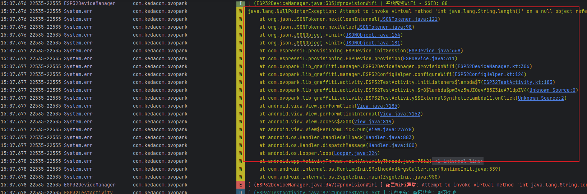

### 5.5 第五次解决方案

- 分析：查看github上相关issue
  - 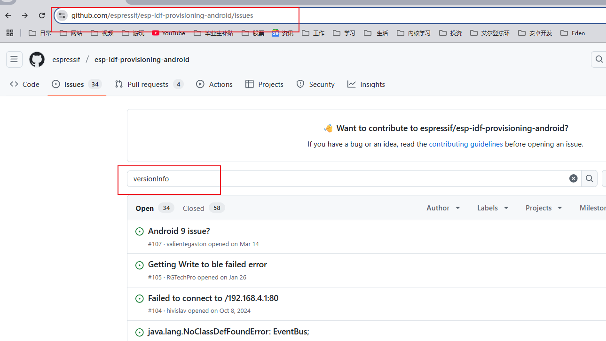
- 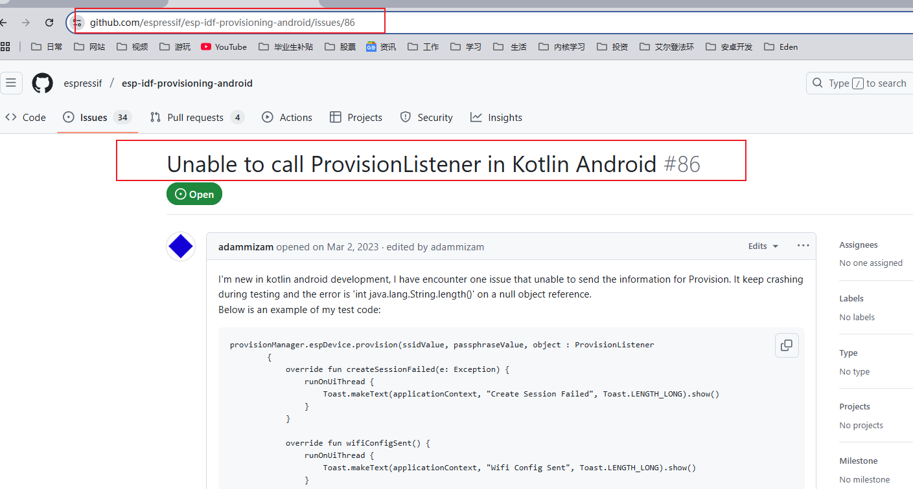
  - 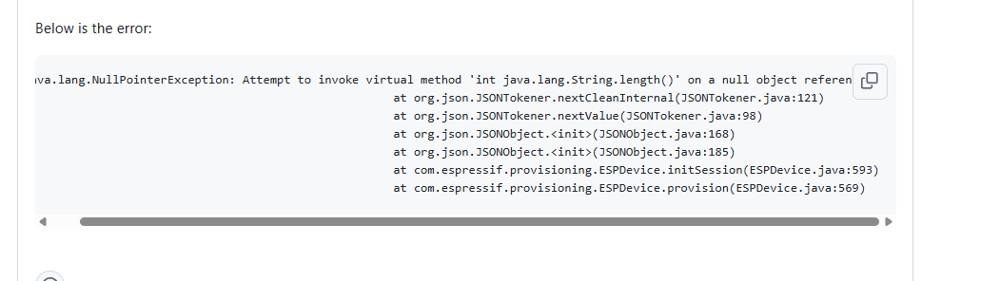
  - https://github.com/espressif/esp-idf-provisioning-android/issues/86
- 解决方法：
  - 暂无
- 结果：
  - 截止目前，github上issue仍未被关闭

### 5.4 第五次解决方案

- 分析：
  - 
- 解决方案：
  - 
- 结果：成功解决问题


## 06.进一步思考

### 6.1 有没有其他更优雅的方案

- 

### 6.2 推荐方案

```

```


## 07.根本原因和修复

### 7.1 最终定位

- 


### 7.2 修复方案


## 08.经验总结

### 8.1 技术原理

### 8.2 预防措施

### 8.3 卸载规范

### 8.4 调试技巧


