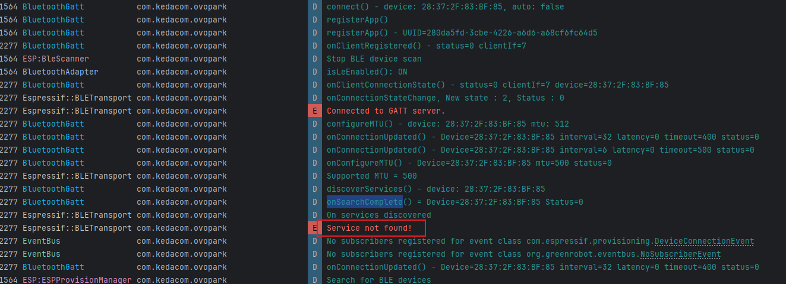
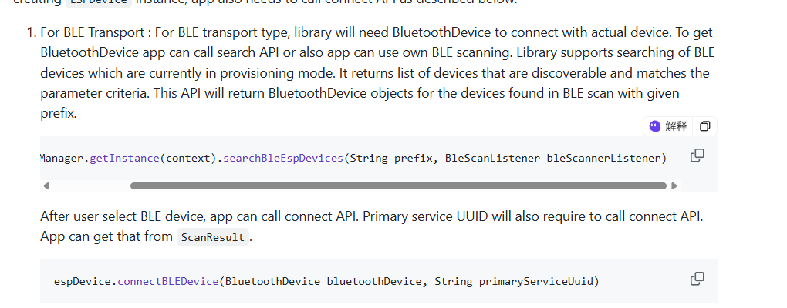
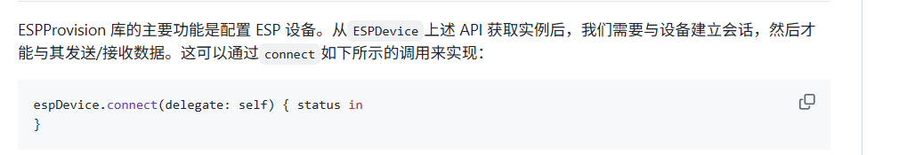
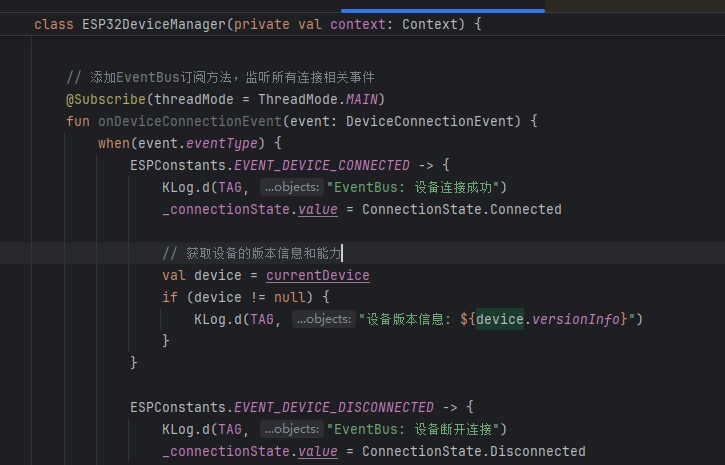
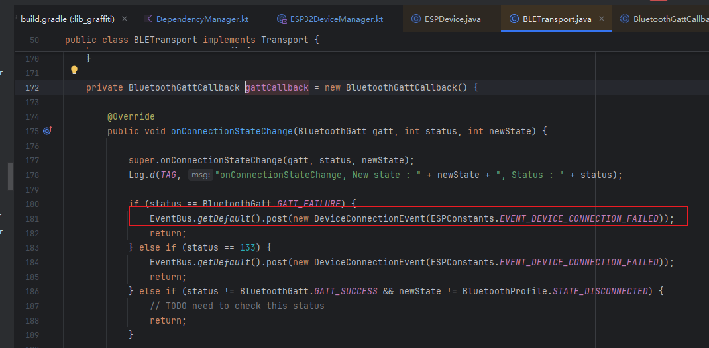
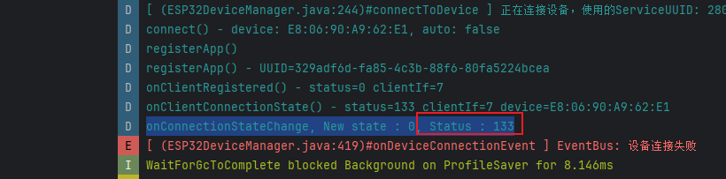
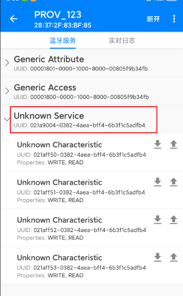
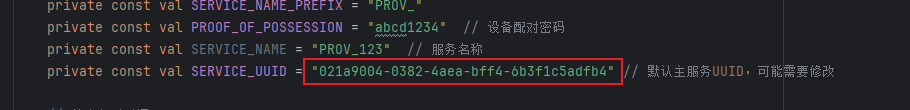
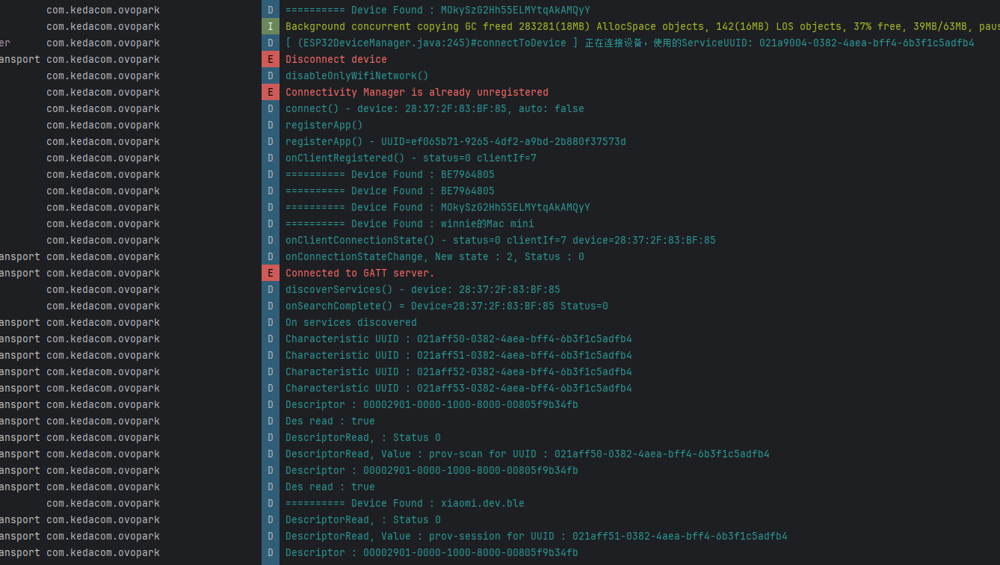

[toc]

## 01.功能概述

- **[优先级] **
  - [ ] ⚠️ 阻断 (Blocker)：系统崩溃、核心功能完全不可用
  - [ ] 🔴 严重 (Critical)：核心功能受损，无可用替代方案
  - [ ] 🟠 高 (High)：主要功能受影响，但有临时解决方案
  - [ ] 🟡 中 (Medium)：次要功能问题，影响用户体验
  - [ ] 🟢 低 (Low)：界面问题或轻微异常，不影响功能
- **问题简要描述**
  - **Bug ID**：`BUG-20240709-001`  
  - **影响版本**：v
  - **提交人**：@panruiqi
  - **状态**：
    - [ ] ⌛ 修复中 /
    - [ ] ✅ 已解决 / 
    - [ ] ❌ 无法复现  

- **问题现象**
  - 
- **环境特征**
  - 

## 02.问题分析

### 2.1 日志分析

- 

### 2.2 根本原因推理

- 

## 03.代码分析

### 3.1 关联代码路径

- ```
  
  ```

### 3.2 可疑修改点

- 

## 04.复现步骤

```

```


## 05.解决方案尝试

### 5.1 第一次解决方案

- 分析：service not found？为什么？查看UUID，和我代码中定义的不同，请问是UUID的问题吗？
  - BLE连接完整流程
    - 设备扫描
      - 应用调用startLeScan开始扫描周围BLE设备
      - 收到广播包含设备名称、MAC地址和服务UUID
    - 建立连接
      - 调用connectGatt/connectBLEDevice与特定设备建立连接
      - 系统创建BluetoothGatt对象并注册回调
      - 连接状态变化通过onConnectionStateChange回调通知
    - MTU协商
      - 连接成功后协商最大传输单元(MTU)
      - 您的日志显示请求了512字节，获得了500字节
    - 服务发现
      - 调用discoverServices()扫描设备提供的GATT服务
      - 完成后触发onServicesDiscovered回调
      - 这是您的问题所在：回调显示"Service not found!"
    - 特征操作
      - 读写特征值、订阅通知等
  - 不对啊，真的是UUID的问题吗？为什么我这UUID每次关联都会产生变化啊？
    - 在蓝牙BLE中，有几种不同类型的UUID：
      - 服务UUID (Service UUID) - 标识设备提供的服务类型
      - 特征UUID (Characteristic UUID) - 标识服务中的特定特征
      - 客户端应用的UUID - 在registerApp过程中生成，用于标识应用实例
    - 从代码中可以看到，ESP32DeviceManager.kt中定义了一个SERVICE_UUID常量，初始值为"280da5fd-3cbe-4226-a6d6-a68cf6fc64d5"。这应该是用于连接到ESP32设备的服务UUID。
    - 但用户日志中提到的UUID "3f715195-9f91-470a-82c0-c2e244d9ae82" 与代码中定义的SERVICE_UUID不同，这个UUID出现在"registerApp()"日志中。这很可能是Android BLE API在注册应用时生成的随机UUID，用于标识蓝牙GATT客户端实例。
    - 在Android的蓝牙实现中，每次调用registerApp时，系统会生成一个随机UUID作为客户端标识。这是为了区分不同的应用实例或连接请求。
    - 所以，这个UUID变化是正常的，这是Android蓝牙子系统为每个连接请求生成的唯一标识符，而非设备服务的UUID。
- 解决方案：尝试采用相同的UUID
  - 
- 结果：
  - 错误，仍旧是一样的结果

### 5.2 第二次解决方案

- 分析：
  - Android
    - 
  - IOS
    - 
  - 两者有差异，一个要发送UUID，另一个不用。难道真的是UUID的问题吗？
- 解决方案：
  - 
- 结果：
  - 

### 5.3 第三次解决方案

- 分析：订阅蓝牙连接回调，查看状态信息
  - 
  - 
- 解决方案：
  - 
- 结果：
  - 

### 5.4 第四次解决方案

- 分析：
  - 状态码133，这对应如下问题：
- https://www.cnblogs.com/cps666/p/17248346.html
  - https://github.com/SouthAve/bleTester
- 解决方法：
  - 需要正确的UUID
  - 通过BLE调试室 apk查找其UUID
  - 
  - 
  - 
- 结果：
  - 连接成功，但是配网失败了，查看

### 5.4 第五次解决方案

- 分析：
  - 
- 解决方案：
  - 
- 结果：成功解决问题


## 06.进一步思考

### 6.1 有没有其他更优雅的方案

- 

### 6.2 推荐方案

```

```


## 07.根本原因和修复

### 7.1 最终定位

- 


### 7.2 修复方案


## 08.经验总结

### 8.1 技术原理

### 8.2 预防措施

### 8.3 卸载规范

### 8.4 调试技巧


