[toc]

## 01.功能概述

- **功能ID**：`FEAT-20250724-001`  
- **功能名称**：
- **目标版本**：v0.2.0
- **提交人**：@panruiqi  
- **状态**：
  - [x] ⌛ 设计中 /
  - [ ] ⌛ 开发中 / 
  - [ ] ✅ 已完成 / 
  - [ ] ❌ 已取消  
- **价值评估**：  
  - [x] ⭐⭐⭐⭐⭐ 核心业务功能  
  - [ ] ⭐⭐⭐⭐ 用户体验优化  
  - [ ] ⭐⭐⭐ 辅助功能增强  
  - [ ] ⭐⭐ 技术债务清理  
- **功能描述** 
  - 

## 02.需求分析

### 2.1 用户场景

- **主要场景**：  

  - 

- **边界场景**：  

### 2.2 功能范围

- ✅ 包含：
- ❌ 不包含：

## 03.技术方案

### 3.0 预分析

需要的API列表：

- dlqInfoActivity
  - 获取iot设备列表_已处理
    
    - 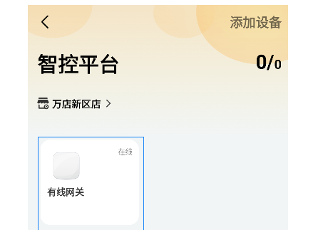
    - 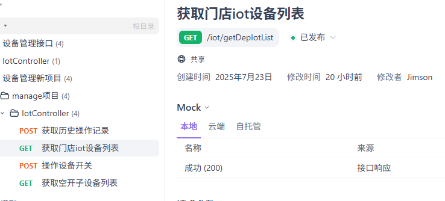
  - **获取空开下子设备列表 和子设备数据**
    
    - 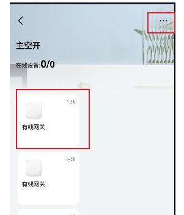
    
    - 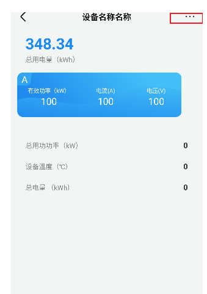
    - 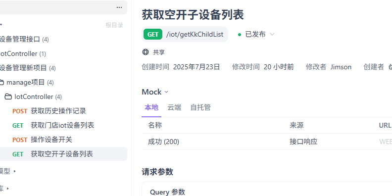
  - 开启操作
    
    - 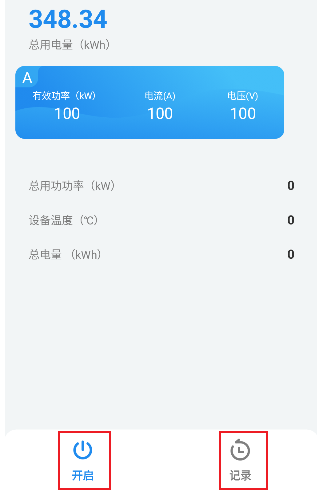
    - 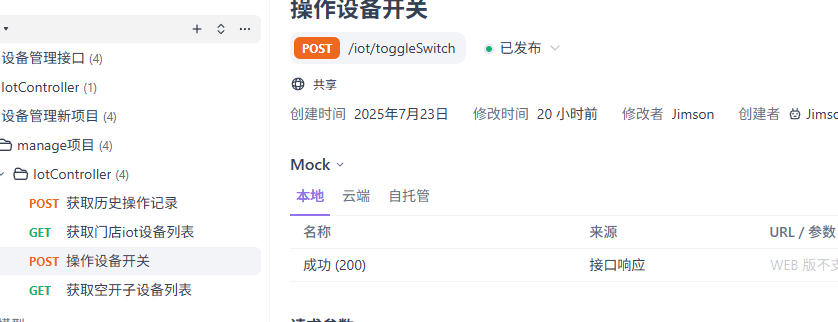
  - 获取操作记录
    
    - 
    - 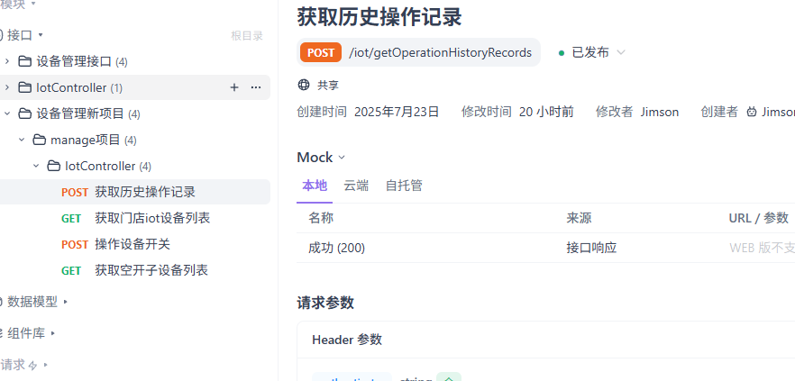
  - 获取设备信息
    
    - 
    
    - 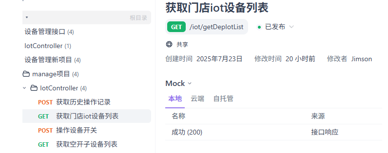
    
    - 这里的信号强度有误，使用API中的信号即可
    
    - 
    
  - 修改数据名称
    
    - 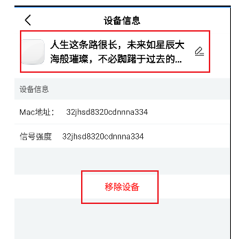
    - 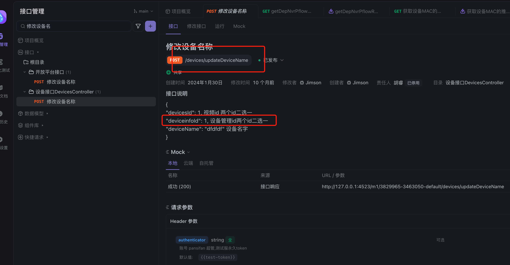
  - 移除设备
    
    - 
    - 
  
- DeviceHome新增网关设备_已处理
  - 设备查询_已处理
    - 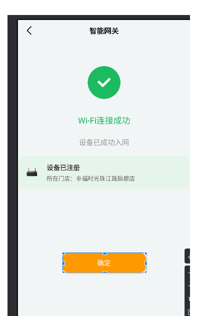
    - 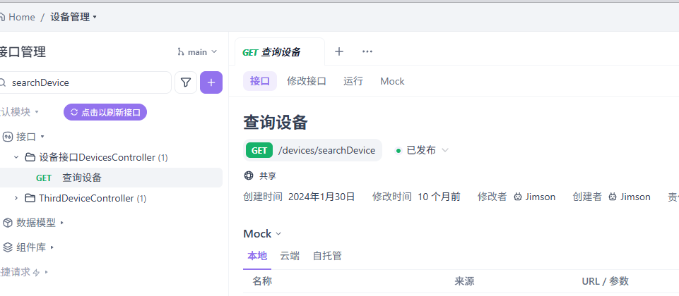
  - 设备入网_已处理
    - 
    - 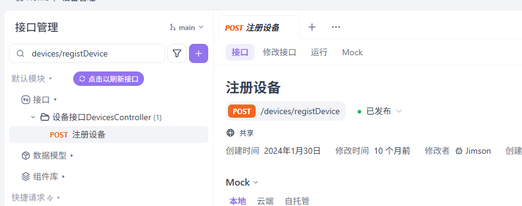
  
- 新增断路器设备_已处理
  - 设备入网
    - 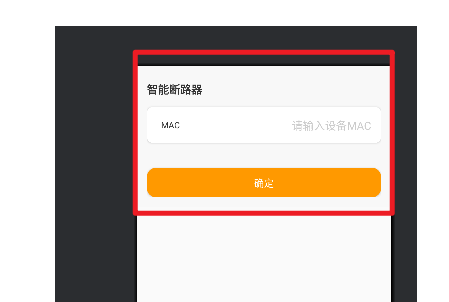
  - 复用这个，不需要查询，只有入网成功和失败的结果
    - 
  
- 网关详情页
  - 网关下子温湿度传感器设备数据_待处理
    - 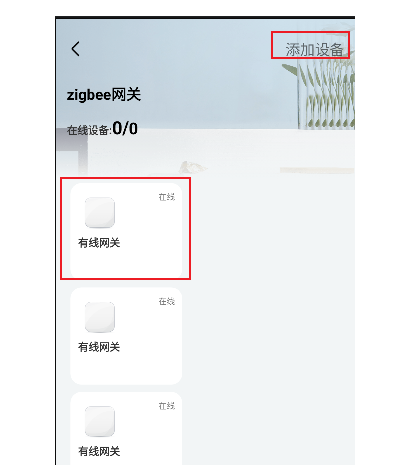
    - 复用之前的接口，就是涂鸦接口
  - 添加温湿度传感器设备
    - 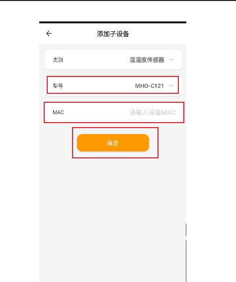
    - 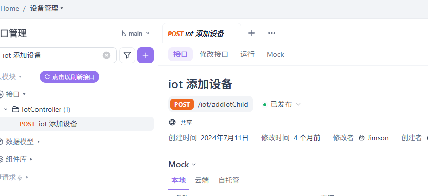

### 3.1 问题一

- 问题：
  
  - 现在的核心问题是：数据模型的转换，新旧API之间的数据模型不同，我现在既要用新的API替代旧的API，新的API对应新的数据模型，我需要解决各个部分数据不一致的问题啊。比如，这里用的是之前的数据模型，字段可能含义相同，但是名称不同了，导致各个位置报错。
- 解决思路：
  
- 创建一个DTO类来表示新的API响应结构，然后创建映射扩展函数将新的数据模型转换为旧的DeviceBean模型。
  
- 实现思路：
  
  - 创建新API数据结构
  
    - 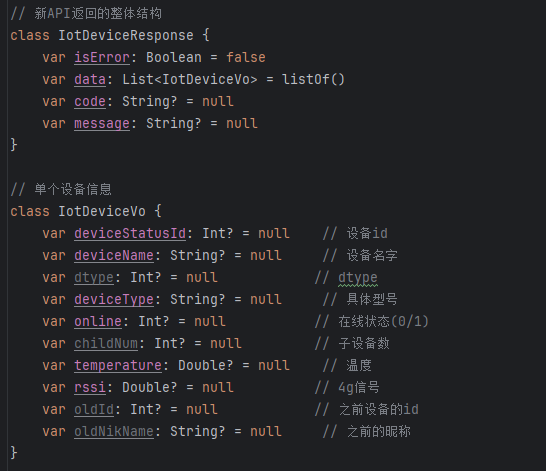
  
  - 创建 转换器，专门负责转换工作
  
    - 单个IOT设备映射
      - 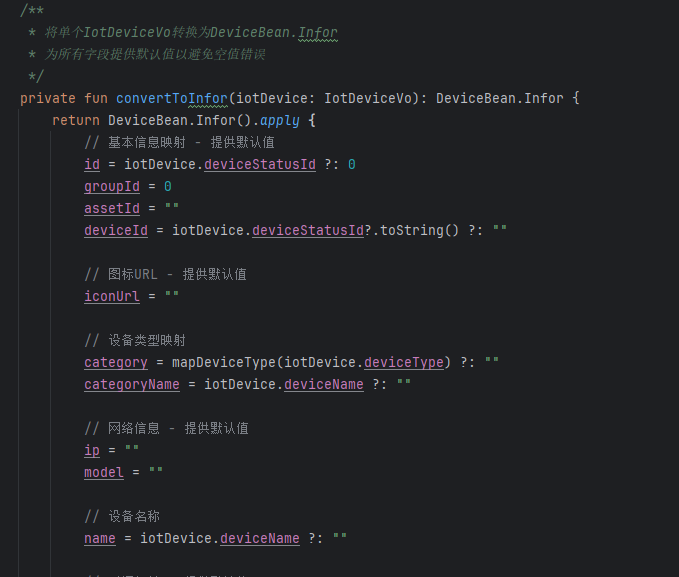
    - 实际的映射方法
      - 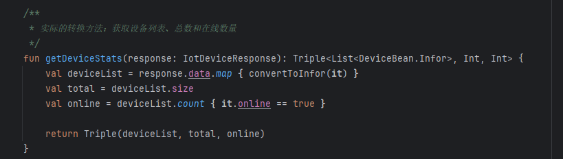
  
  - 实际使用中
  
    - 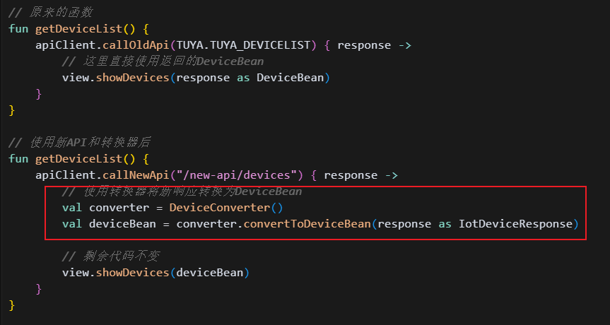
  
    

### 3.2 问题二

- 问题：项目中有多种API的写法，我们需要一个清晰明了，简洁优雅的实现，请您分析我项目中几种API的写法，然后您再给我一种优雅简洁的写法，他既要便用，又要简洁优雅。

- 实现

  - 定义数据模型

    - 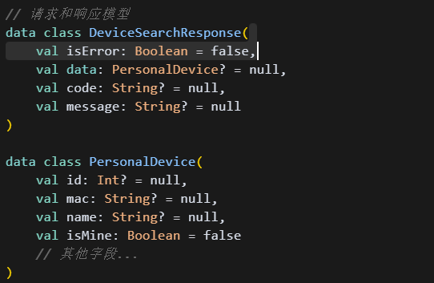

  - 定义API工具类

    - 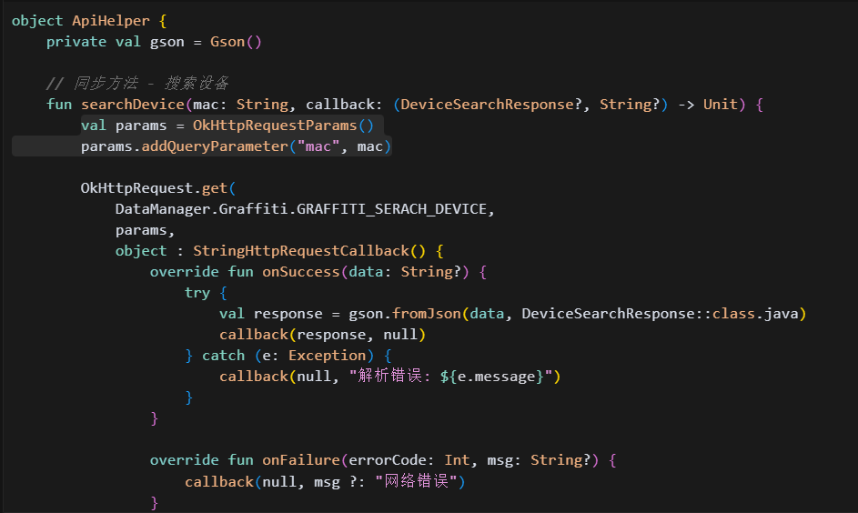

      

## 04.实现规划

### 4.1 技术选型

### 4.2 任务拆解

### 4.3 代码路径

## 05.兼容性设计

### 5.1 设备适配

### 5.2 冲突检查

## 06.测试方案

### 6.1 核心用例

### 6.2 性能指标

## 07.发布计划

### 7.1 阶段发布

### 7.2 回滚方案

## 08.文档记录

### 8.1 技术文档

### 8.2 用户文档

### 8.3 监控埋点

