[toc]

## 01.功能概述

- **功能ID**：`FEAT-20250718-001`  
- **功能名称**：
- **目标版本**：v
- **提交人**：@panruiqi  
- **状态**：
  - [x] ⌛ 设计中 /
  - [ ] ⌛ 开发中 / 
  - [ ] ✅ 已完成 / 
  - [ ] ❌ 已取消  
- **价值评估**：  
  - [x] ⭐⭐⭐⭐⭐ 核心业务功能  
  - [ ] ⭐⭐⭐⭐ 用户体验优化  
  - [ ] ⭐⭐⭐ 辅助功能增强  
  - [ ] ⭐⭐ 技术债务清理  
- **功能描述** 
  - 需求描述：01.门店设备列表新增 智能断路器 和 智能网关 设备

  - 功能介绍：

    - 添加设备页面
    - 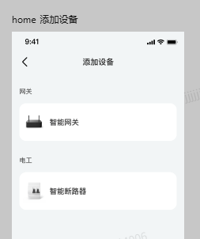
    - 选择智能断路器就是有一个弹窗
    - 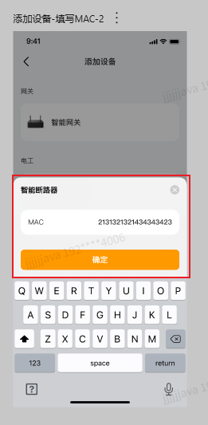
    - 智能网关则需要很繁琐的引导
    - 

    

## 02.需求分析

### 2.1 用户场景

- **主要场景**：  

  - 用户增加了断路器设备

- **边界场景**：  

### 2.2 功能范围

- ✅ 包含：
- ❌ 不包含：

## 03.技术方案

### 3.1 方案一

- 实现思路：
  - AddDeviceActivity钟他是一个ScrollerView包裹的RecyclerVIew
    - 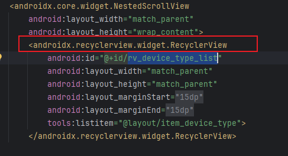
    - 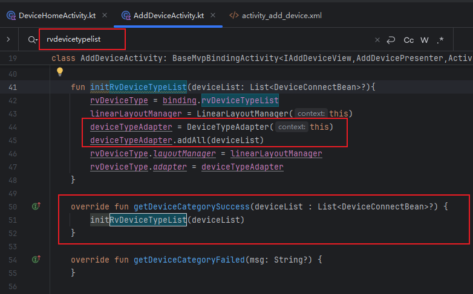
    - 使用DeviceTypeAdapter进行子条目的显示，有必要吗？没必要，可以直接给个假数据来复用他啊
    - 那么要求呢？
    - deviceConnect.type = 1， 2

### 3.2 方案二

- 实现思路：

## 04.实现规划

### 4.1 技术选型

### 4.2 任务拆解

### 4.3 代码路径

好，我们来梳理一下门店设备列表新增 智能断路器 和 智能网关 设备的逻辑

- 首先是门店设备页中的点击事件
  - 
  - 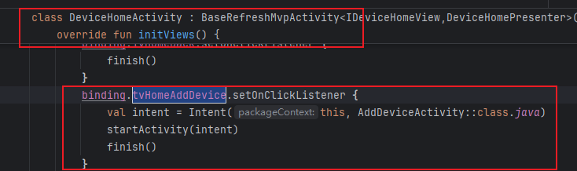
  - 点击添加设备进入AddDeviceActivity中
- AddDeviceActivity中逻辑
  - 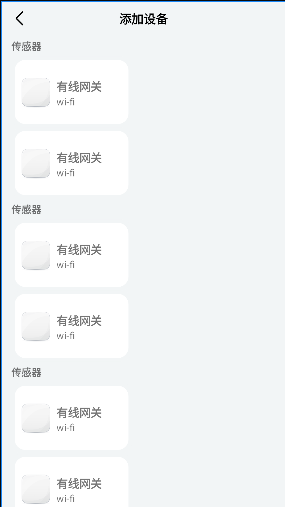
  - 他是一个ScrollerView包裹的RecyclerVIew
    - 
    - 
    - 使用DeviceTypeAdapter进行子条目的显示，有必要吗？没必要
    - 原有方案：
      - AddDeviceActivity中他是一个ScrollerView包裹的RecyclerVIew
      - 
      - 
        - 通过下面的进行两个级别的显示，先有外层的设备类型列表，然后有类型下的设备列表
          - 
      - 新的方案可以怎么设计呢？原有代码扩展性很强了，IOS是直接重写页面，写死。我能不能在保留原有逻辑的基础上去使用呢？
        - 考量数据来源
        - 原有是通过
        - 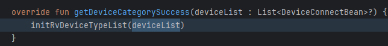
        - 现在可以修改数据源，给假的数据
        - 
        - 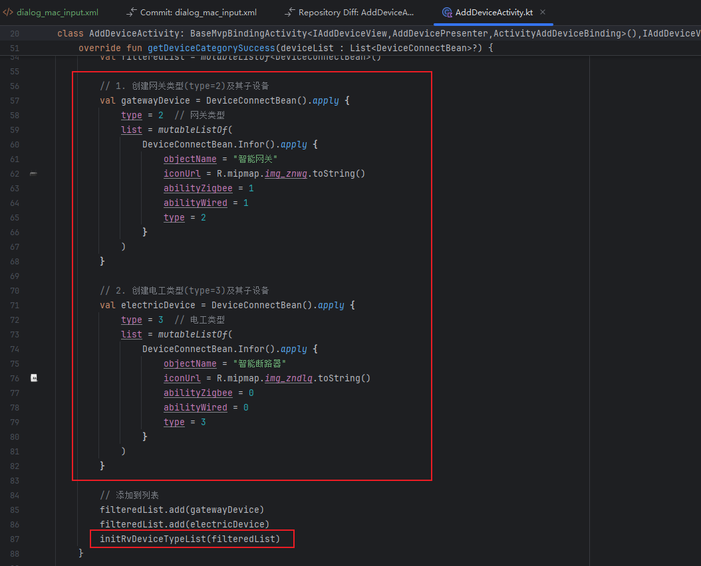
        - ok，现在已经修改为假数据了，那么点击事件回到这个位置
        - 先是智能网关的点击事件
        - 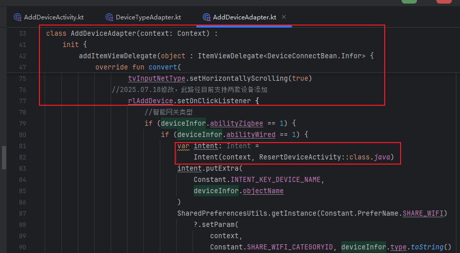
        - 然后是断路器的点击事件
        - 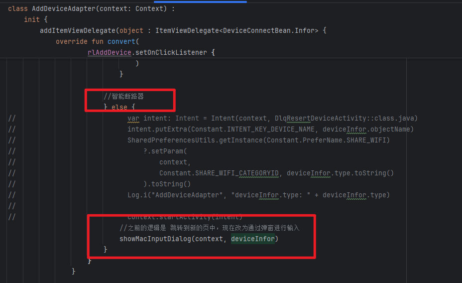
  - 断路器的点击添加怎么写？
    - 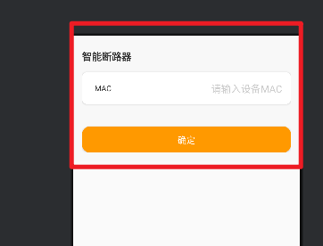
    - 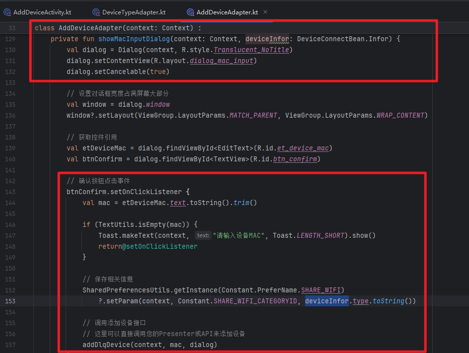
    - 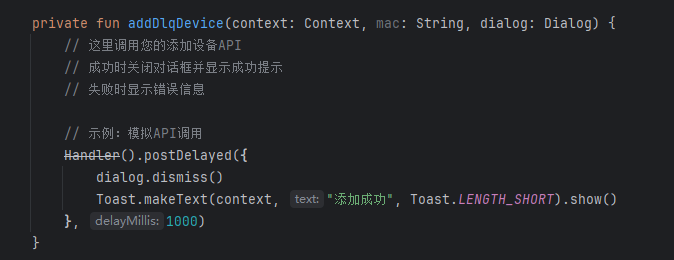
  - 网关呢？详见  [04. feat_智控平台_DeviceHome新增网关设备.md](04. feat_智控平台_DeviceHome新增网关设备.md) 

## 05.兼容性设计

### 5.1 设备适配

### 5.2 冲突检查

## 06.测试方案

### 6.1 核心用例

### 6.2 性能指标

## 07.发布计划

### 7.1 阶段发布

### 7.2 回滚方案

## 08.文档记录

### 8.1 技术文档

### 8.2 用户文档

### 8.3 监控埋点

