[toc]

## 01.功能概述

- **功能ID**：`FEAT-20250723-001`  
- **功能名称**：
- **目标版本**：v0.2.0
- **提交人**：@panruiqi  
- **状态**：
  - [x] ⌛ 设计中 /
  - [ ] ⌛ 开发中 / 
  - [ ] ✅ 已完成 / 
  - [ ] ❌ 已取消  
- **价值评估**：  
  - [x] ⭐⭐⭐⭐⭐ 核心业务功能  
  - [ ] ⭐⭐⭐⭐ 用户体验优化  
  - [ ] ⭐⭐⭐ 辅助功能增强  
  - [ ] ⭐⭐ 技术债务清理  
- **功能描述** 
  - 

## 02.需求分析

### 2.1 用户场景

- **主要场景**：  

  - 

- **边界场景**：  

### 2.2 功能范围

- ✅ 包含：
- ❌ 不包含：

## 03.技术方案

### 3.0 预分析

### 3.1 方案一

- 实现思路：
  - 

### 3.2 方案二

- 实现思路：

## 04.实现规划

### 4.1 技术选型

### 4.2 任务拆解

### 4.3 代码路径

好，让我们看看DeviceHome中新增网关设备的逻辑，首先他继承自 [04. feat_智控平台_DeviceHome新增断路器逻辑.md](04. feat_智控平台_DeviceHome新增断路器逻辑.md) 

- 点击入口：
  - 先是智能网关的点击事件
  - 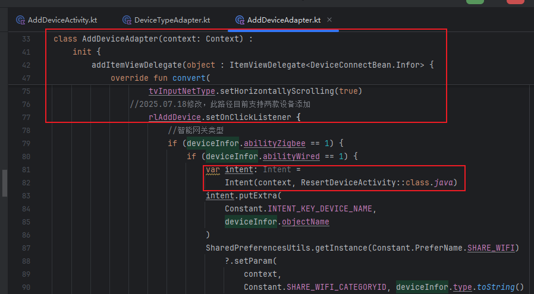
- 看看ResertDeviceActivity
  - 简单的UI和内部逻辑
  - 
  - 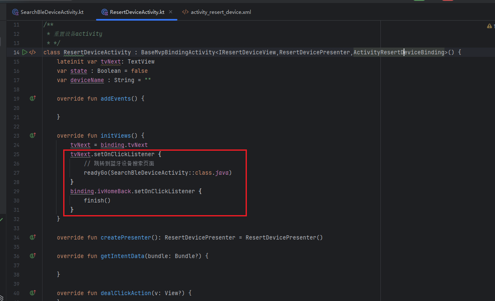
  - 跳转到SearchBleDeviceActivity页中，也就是设备被重置了，现在我们要搜索并连接到他的蓝牙。

- SearchBleDeviceActivity
  - 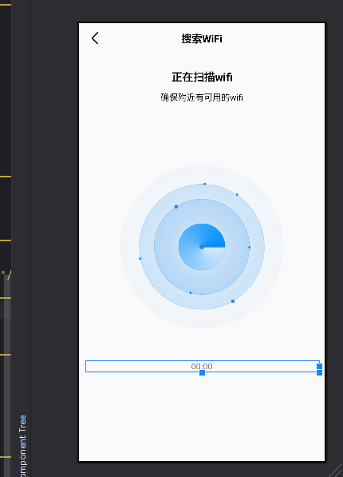
  - 没啥好说，倒计时结束后跳转
  - 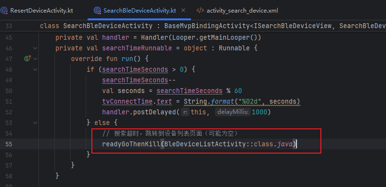
- BleDeviceListActivity
  - 没啥好说，有设备显示设备列表，没设备让他可以重试
  - 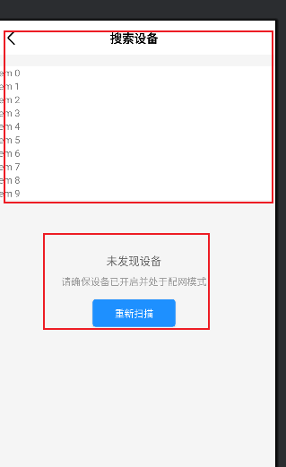
  - 设置列表的点击事件
  - 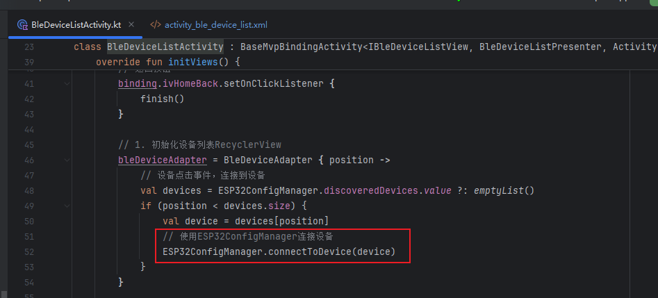
  - 观察连接状态（连接一般很稳定），跳转到ChooseWifiManualActivity页
  - 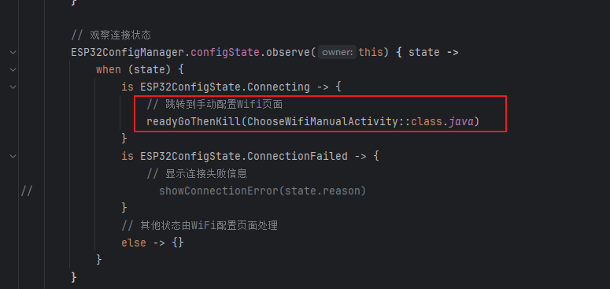
- ChooseWifiManualActivity页
  - 让用户手动输入wifi账号和密码，让他可以进行配网操作
  - 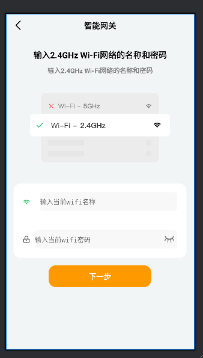
  - 点击事件，进行配网操作
    - 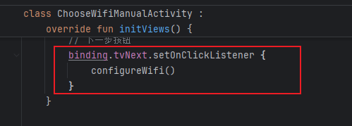
    - 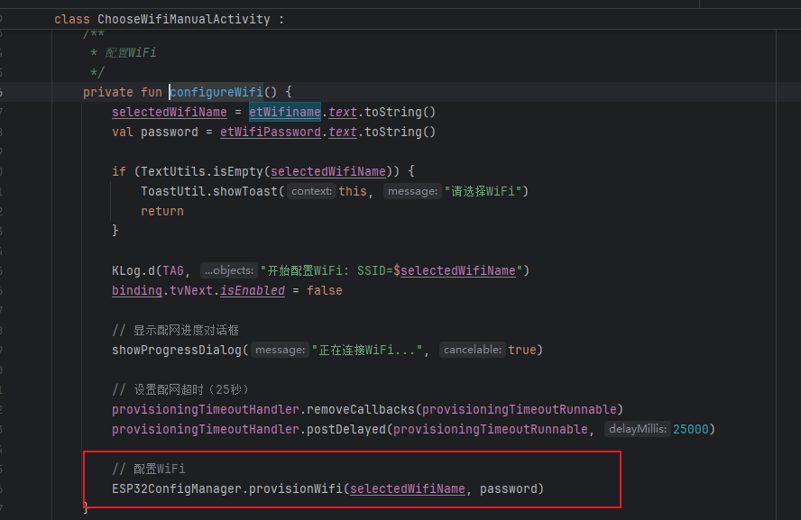
  - 观测配网结果
    - 正常状态，配网成功时跳转进ProvisionSuccessActivity
    - 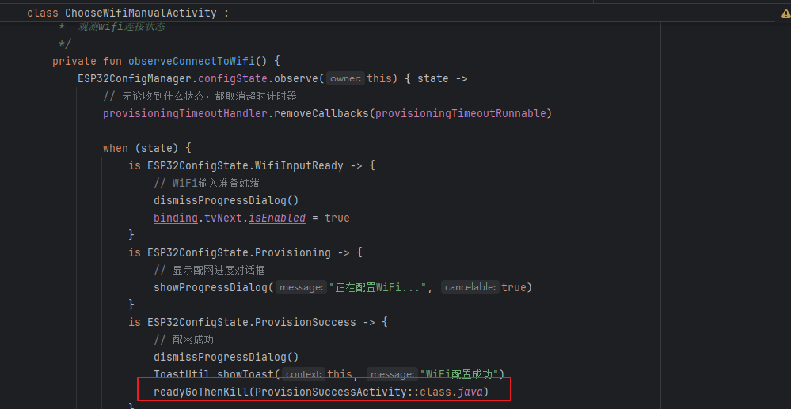
    - 异常状态之配网失败，如果是wifi密码或找不到wifi错误，那么允许重试，否则断连并返回上一级页（设备搜索页，让他重新搜索）
    - 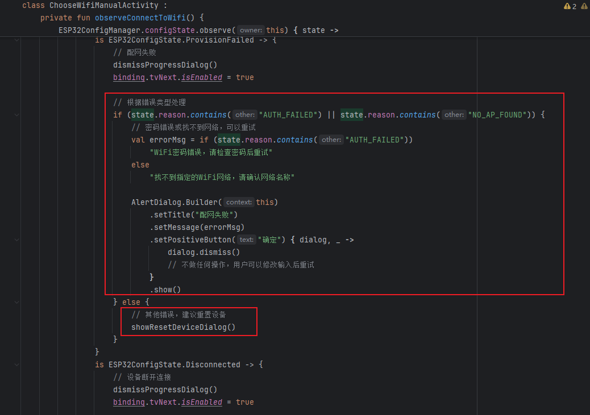
    - 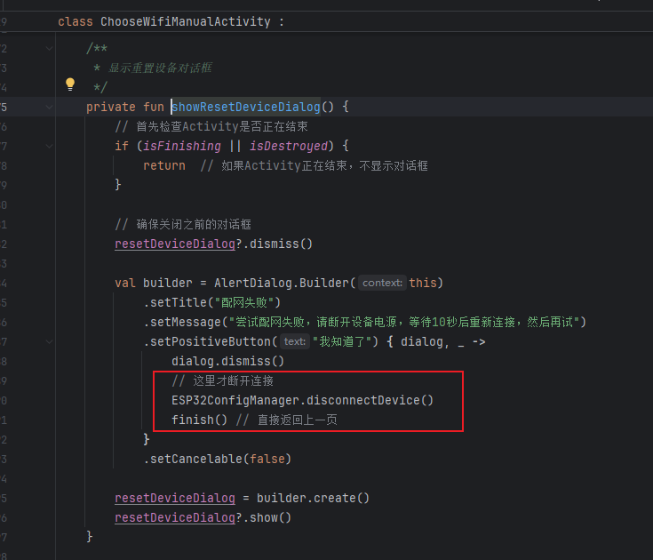
    - 异常状态之设备断连：直接返回上一级页
    - 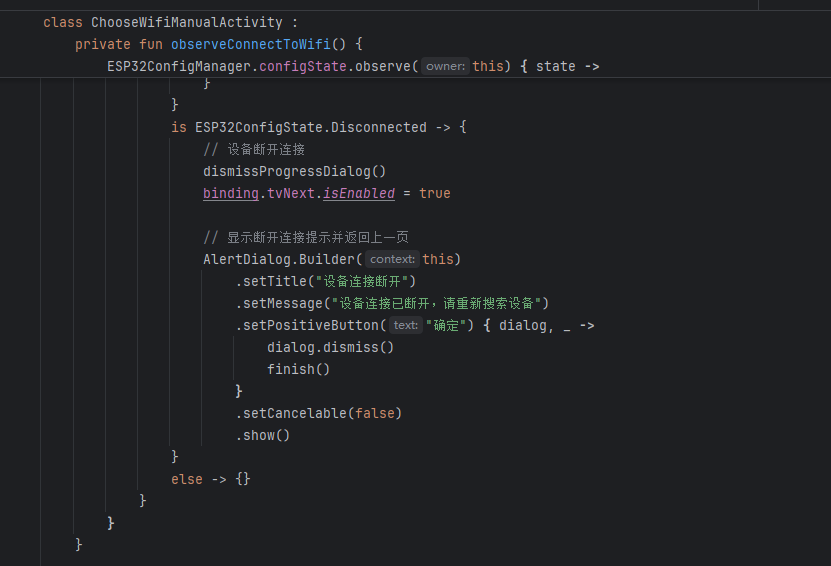
  - 配网超时：释放Dialog，然后显示重置设备提示,此时设备断连并返回上一级页（设备搜索页，让他重新搜索）
    - 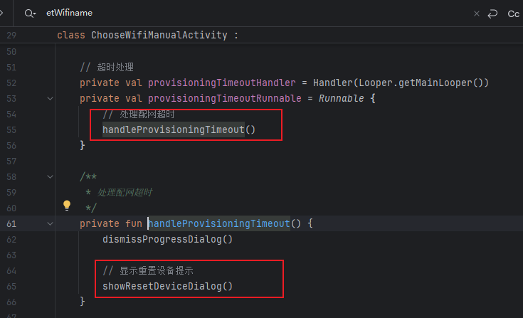
- ProvisionSuccessActivity配网成功页
  - 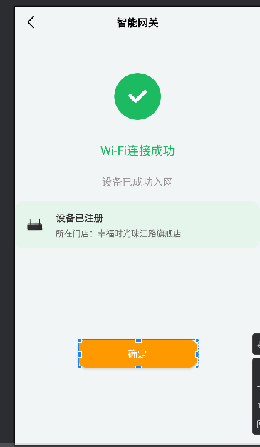
  - 没啥好说的，使用当前的设备的mac进行网络操作
  - 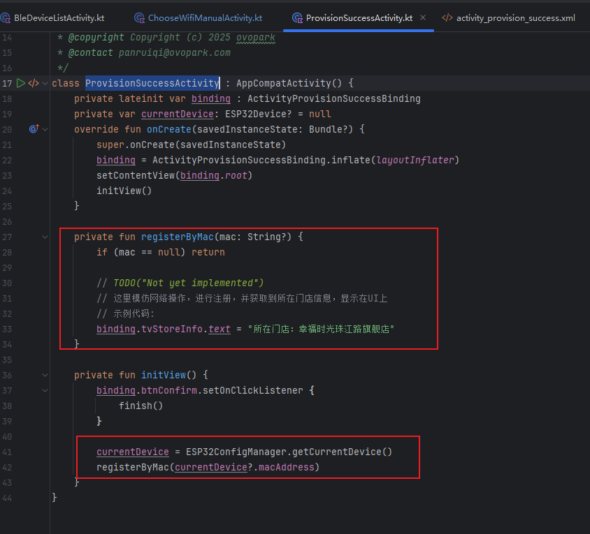

## 05.兼容性设计

### 5.1 设备适配

### 5.2 冲突检查

## 06.测试方案

### 6.1 核心用例

### 6.2 性能指标

## 07.发布计划

### 7.1 阶段发布

### 7.2 回滚方案

## 08.文档记录

### 8.1 技术文档

### 8.2 用户文档

### 8.3 监控埋点

