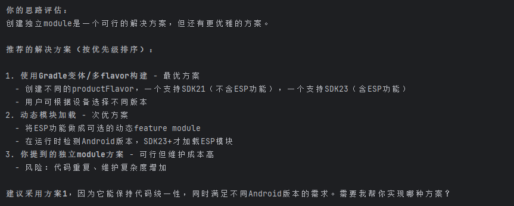
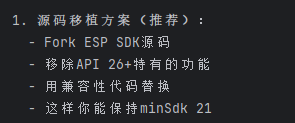
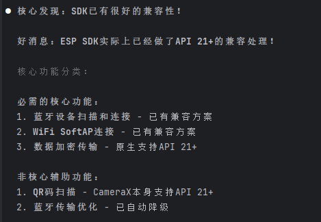
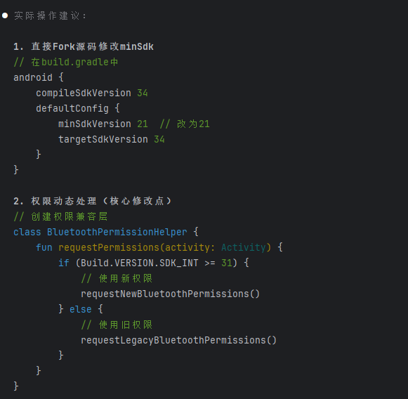
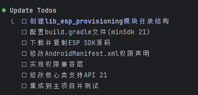

[toc]

## 01.功能概述

- **功能ID**：`FEAT-20250805-001`  
- **功能名称**：
- **目标版本**：v0.2.0
- **提交人**：@panruiqi  
- **状态**：
  - [x] ⌛ 设计中 /
  - [ ] ⌛ 开发中 / 
  - [ ] ✅ 已完成 / 
  - [ ] ❌ 已取消  
- **价值评估**：  
  - [x] ⭐⭐⭐⭐⭐ 核心业务功能  
  - [ ] ⭐⭐⭐⭐ 用户体验优化  
  - [ ] ⭐⭐⭐ 辅助功能增强  
  - [ ] ⭐⭐ 技术债务清理  
- **功能描述** 
  - 现在存在一个问题：当前SDK存在一个问题：支持的最小版本是Android SDK23. 但是我们把版本从21修改为23后，会产生一个问题：我们的压缩规则不适用，导致Android包会很大。此时，我们只能在21版本使用它，因此我们不能直接SDK导入，我们要有新的解决方案

## 02.需求分析

### 2.1 用户场景

- **主要场景**：  

  - 某些极个别的客户要使用他进行测试

- **边界场景**：  

### 2.2 功能范围

- ✅ 包含：智控平台部分
- ❌ 不包含：

## 03.技术方案

### 3.0 预分析

但是我仍打算把它做成一个单独的模块，因为我可以从里面学习到很多

### 3.1 方案一

- 实现思路：我们能否这个lib单独使用SDK23，其他的使用SDK21呢？这是一个很好的选择吗？
  - 不，这无法解决，整个Android应用的minSdk是统一的，你不能让某个module用SDK 26而其他用SDK 21。最终APK的minSdk取决于所有依赖的最高要求。

### 3.2 方案二

- 实现思路：好，那我就把它做成一个单独的模块，请问我要处理哪些问题？
  - 
  - 所以，我要先分析代码，知道里面有哪些是SDK 23+独有的功能，并尝试使用兼容性的代码替换
  - 
  - 
  - 

## 04.实现规划

### 4.1 技术选型

方案二

### 4.2 任务拆解

### 4.3 代码路径

## 05.兼容性设计

### 5.1 设备适配

### 5.2 冲突检查

## 06.测试方案

### 6.1 核心用例

### 6.2 性能指标

## 07.发布计划

### 7.1 阶段发布

### 7.2 回滚方案

## 08.文档记录

### 8.1 技术文档

### 8.2 用户文档

### 8.3 监控埋点

