[toc]

## 01.功能概述

- **功能ID**：`FEAT-20250722-001`  
- **功能名称**：
- **目标版本**：v0.2.0
- **提交人**：@panruiqi  
- **状态**：
  - [x] ⌛ 设计中 /
  - [ ] ⌛ 开发中 / 
  - [ ] ✅ 已完成 / 
  - [ ] ❌ 已取消  
- **价值评估**：  
  - [x] ⭐⭐⭐⭐⭐ 核心业务功能  
  - [ ] ⭐⭐⭐⭐ 用户体验优化  
  - [ ] ⭐⭐⭐ 辅助功能增强  
  - [ ] ⭐⭐ 技术债务清理  
- **功能描述** 
  - 显示断路器的相关信息
  - 包括设备的信息，，启动和开启按钮，操作记录。设备信息
  - 资源：https://codesign.qq.com/app/s/577408455299659

## 02.需求分析

### 2.1 用户场景

- **主要场景**：  

  - 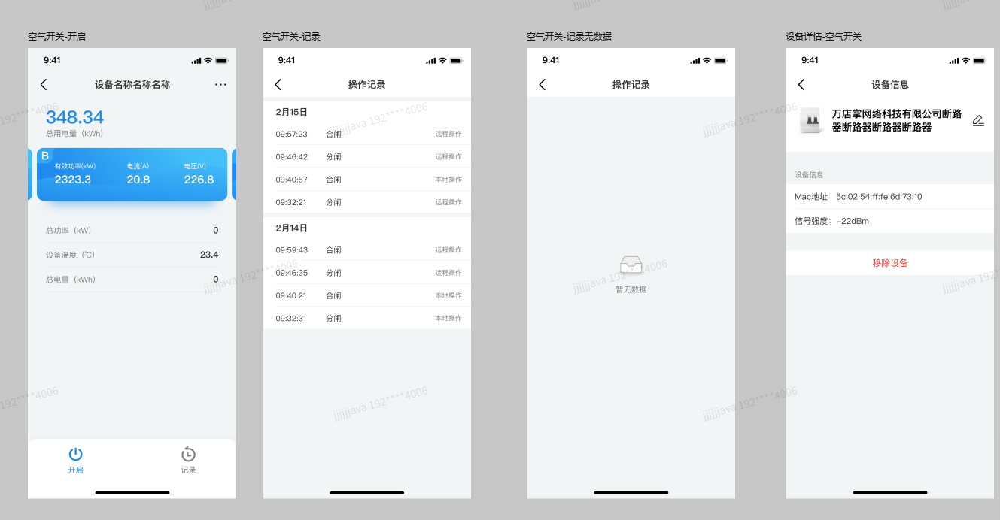

- **边界场景**：  

### 2.2 功能范围

- ✅ 包含：
- ❌ 不包含：

## 03.技术方案

### 3.0 预分析

数据从哪来？

使用哪个页？

- 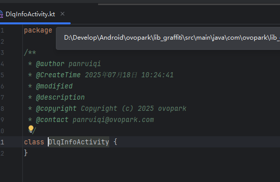

开启和关闭做了什么事？

操作记录从哪获取？

设备详情从哪获取？

### 3.1 方案一

- 实现思路：分割UI和实现逻辑，先写UI
  - 先绘制相关信息页
  - 已有模板

### 3.2 方案二

- 实现思路：

## 04.实现规划

### 4.1 技术选型

### 4.2 任务拆解

主页

记录页

设置页

- 代码路径
  - 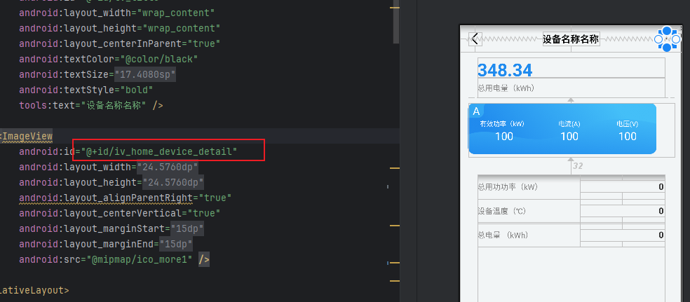
  - 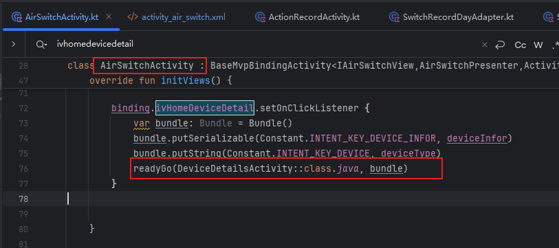
  - 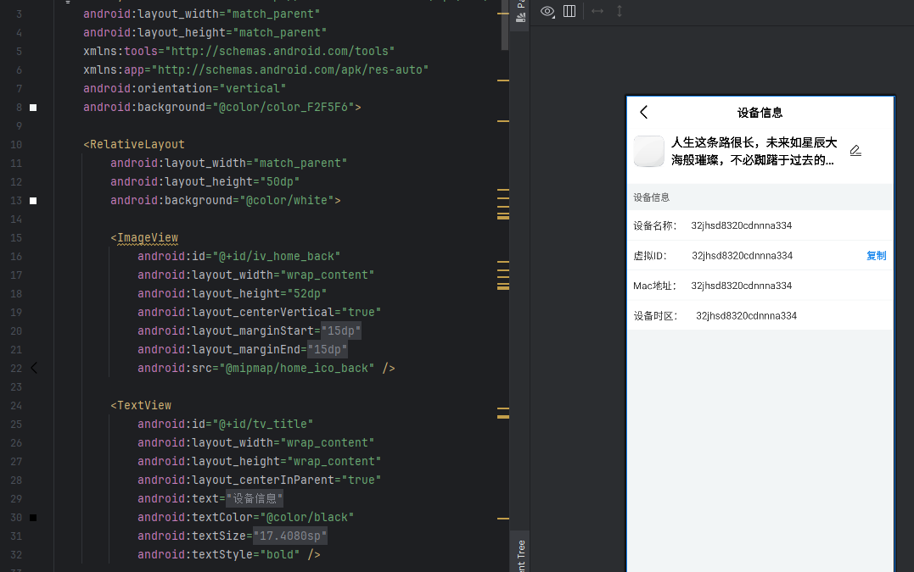
  - 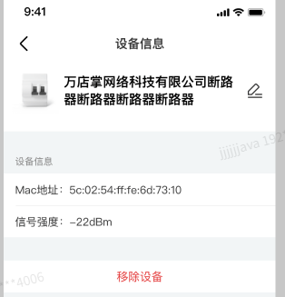
  - 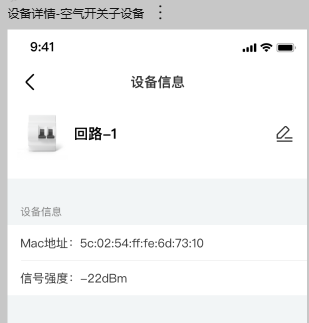

业务逻辑

- 现在有个问题：从主页点击主dlq要跳入dlqHomeActivity中，然后在dlqHomeActivity中点击从断路器要跳入DlqInfoActivity中。他们这些都是RecyclerView的点击事件，但是DeviceHomeActivity和DlqHomeActivity复用的是一个Adapter。都是根据Dlq进行跳转的。我该如何区分实现？
- 也就是都走这个逻辑
  - 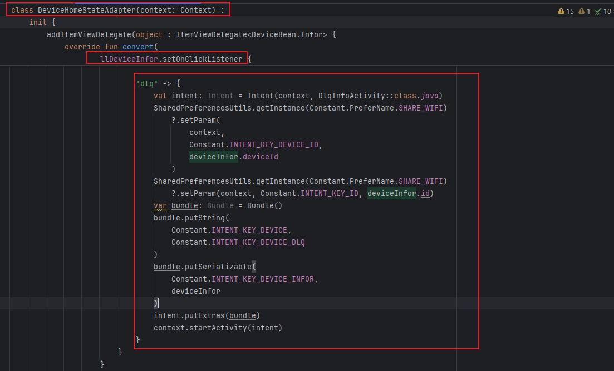
  - 通过上下文区分
  - 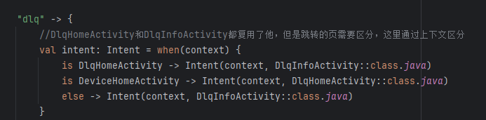

### 4.3 代码路径

我们来整体过一下流程

- 首先是点击主页中点击主断路器进入到DlqHomeActivity
  - 
  - 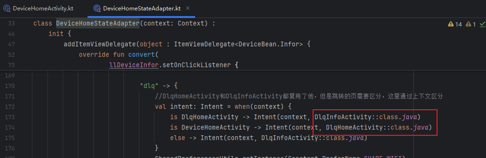

- 然后是DlqHomeActivity，也就是空开Home页

  - 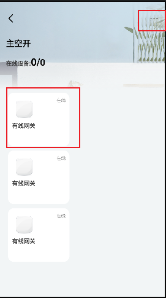
  - 此时，不论是点击右上角还是子空开，都会进入info页

  - 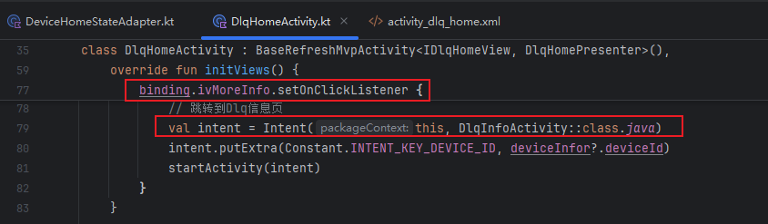
  - 从Home页中点击子空开逻辑
  - 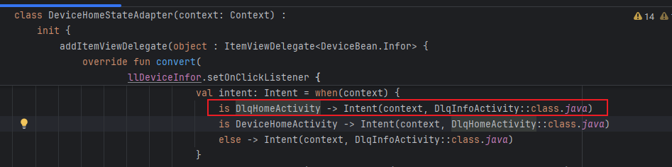

- info页

  - 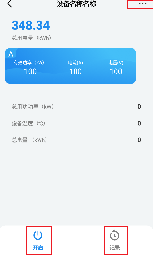
  - 需要调接口获取数据，同时可以通过开启去调    控制断路器开启   的接口（A，B，C三项电的数据）
  - 可以点击记录去记录页中查看数据，可以点击more去查看更多信息
  - 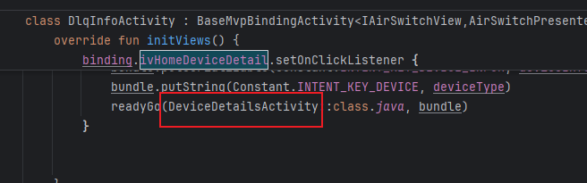
  - 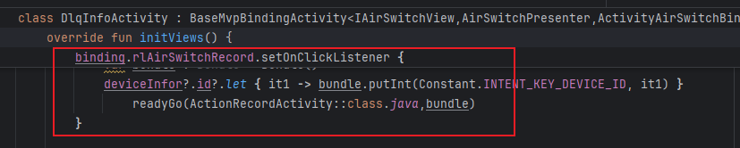

- DeviceDeatils设备信息页

  - 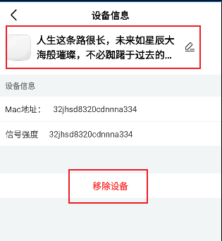
  - 需要有两个接口：移除设备，设备名称（如果是子空开，没法移除设备）

- ActionRecord操作记录页

  - 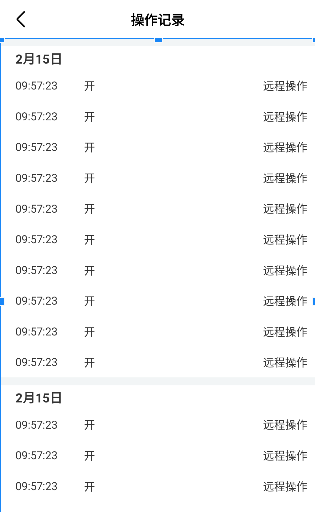
  - 需要调接口获取数据

- 疑问：这个是所有空开的信息页，那子空开呢？也有有这些吗？

## 05.兼容性设计

### 5.1 设备适配

### 5.2 冲突检查

## 06.测试方案

### 6.1 核心用例

### 6.2 性能指标

## 07.发布计划

### 7.1 阶段发布

### 7.2 回滚方案

## 08.文档记录

### 8.1 技术文档

### 8.2 用户文档

### 8.3 监控埋点

