[toc]

## 01.功能概述

- **功能ID**：`FEAT-20250609-001`  
- **功能名称**：
- **目标版本**：v0.2.0
- **提交人**：@panruiqi  
- **状态**：
  - [x] ⌛ 设计中 /
  - [ ] ⌛ 开发中 / 
  - [ ] ✅ 已完成 / 
  - [ ] ❌ 已取消  
- **价值评估**：  
  - [x] ⭐⭐⭐⭐⭐ 核心业务功能  
  - [ ] ⭐⭐⭐⭐ 用户体验优化  
  - [ ] ⭐⭐⭐ 辅助功能增强  
  - [ ] ⭐⭐ 技术债务清理  
- **功能描述** 
  - 网关点击进入后可以显示网关详情页，下面要显示当前网关拥有的断路器设备
  - 也可以点击添加断路器设备
  - 关键点：API，获取和显示的API

## 02.需求分析

### 2.1 用户场景

- **主要场景**：  

  - 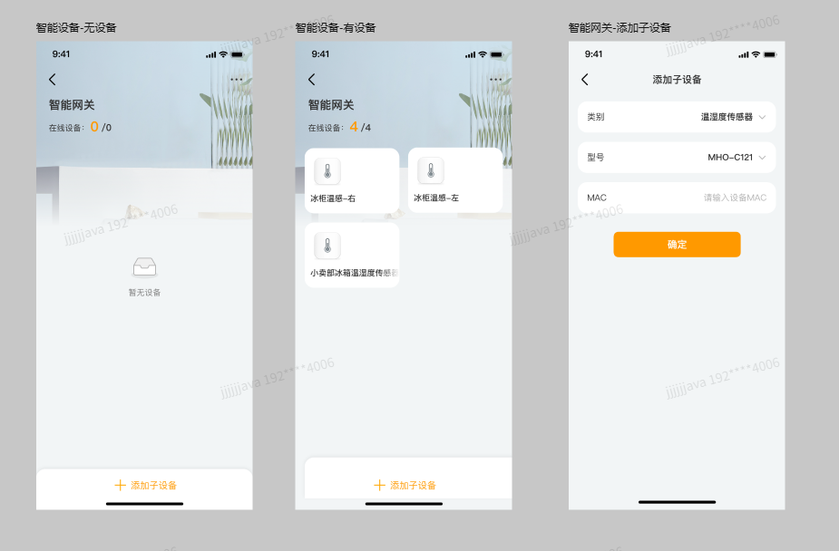

- **边界场景**：  

### 2.2 功能范围

- ✅ 包含：
- ❌ 不包含：

## 03.技术方案

### 3.0 预分析

代码位置

- 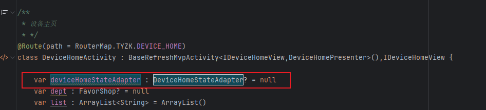
- 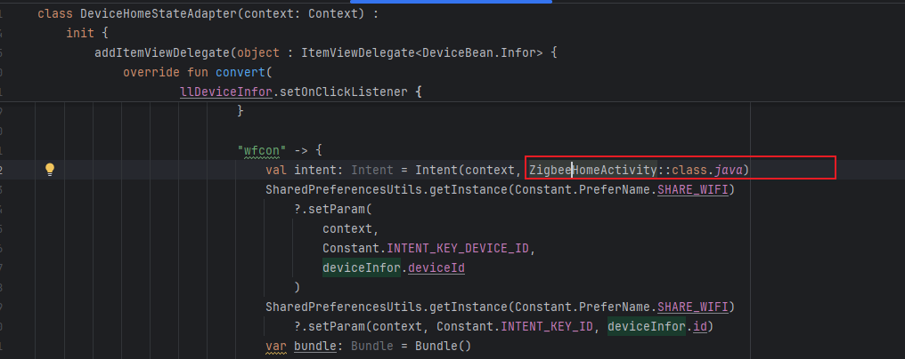
- 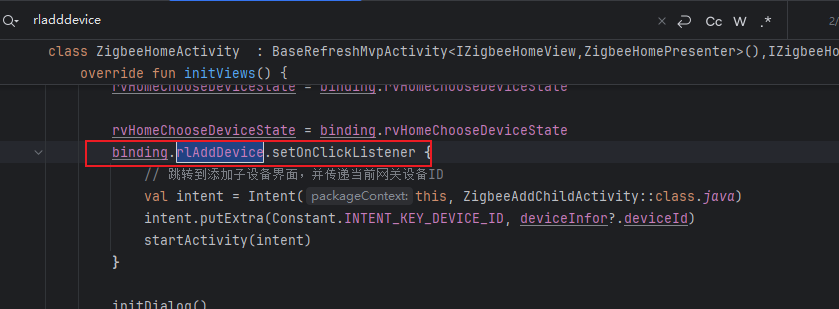

需要改动的地方：

- 添加按钮	解决
  - 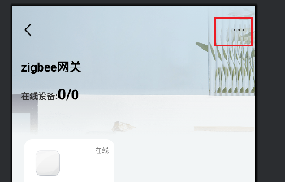
- 获取当前网关下所有的设备
  - 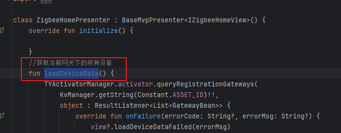
  - 有可能用的是这个：
  - 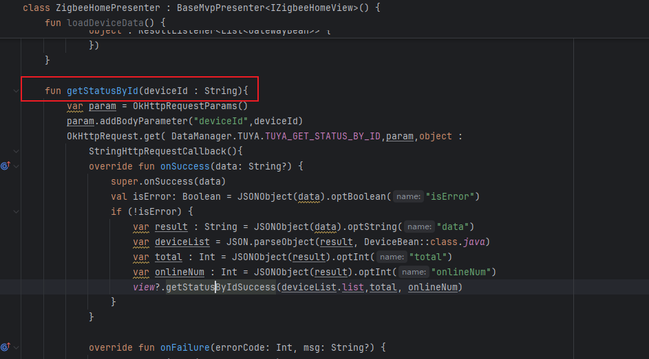
  - 
- 添加子设备
  - 调什么API呢？
  - 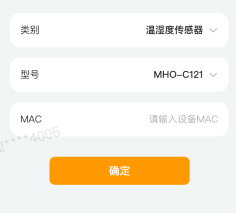

### 3.1 方案一

- 实现思路：
  - 显示逻辑：
    - 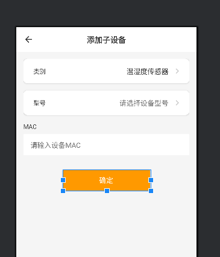
  - 连接逻辑：
    - 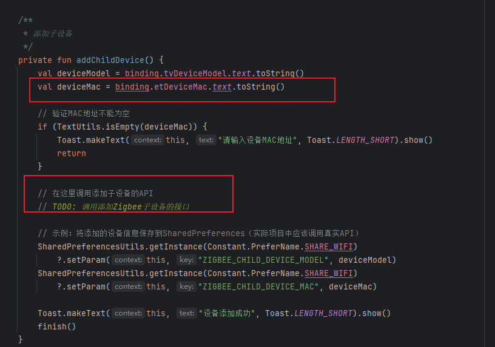

### 3.2 方案二

- 实现思路：

## 04.实现规划

### 4.1 技术选型

### 4.2 任务拆解

### 4.3 代码路径

好，我们来梳理一下只能网关详情页的逻辑

- 首先是点击主页中点击有线网关进入到ZigbeeHomeActivity
  - 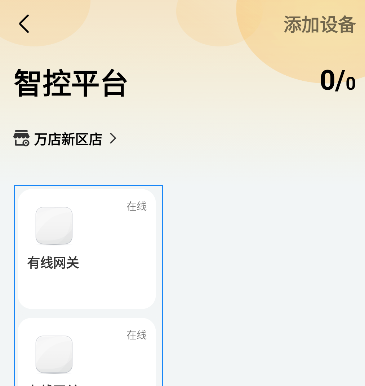
  - 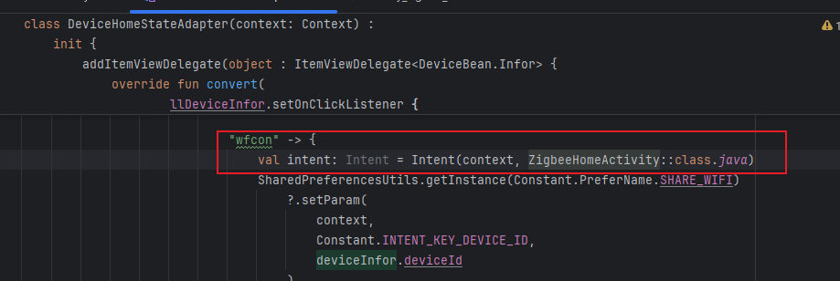

- 然后是ZigbeeHomeActivity,也就是网关Home页
  - 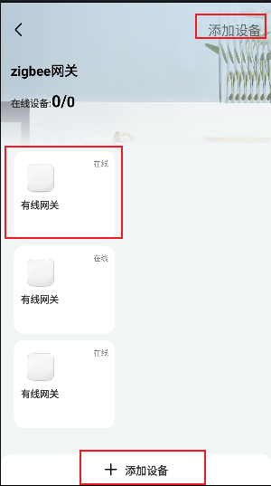
  - 他可以查看子设备的信息（子设备有且只有温度器），也可以点击添加进行子设备的添加操作，右上角应该是三个点，显示网关的更多信息
  - 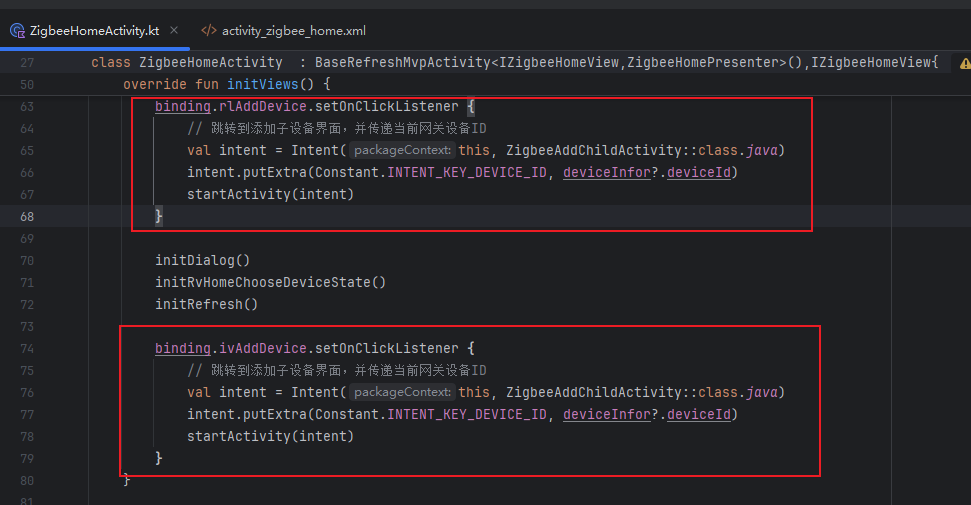
- ZigbeeAddChildActivity，网关添加子设备页
  - 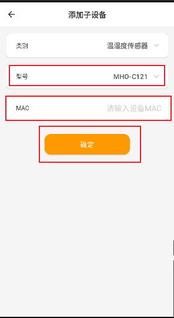
  - 显示可选型号，输入mac地址，点击确定按钮后添加
- ZigbeeInfoActivity
  - 显示网关信息
- 温度传感器点击事件
  - 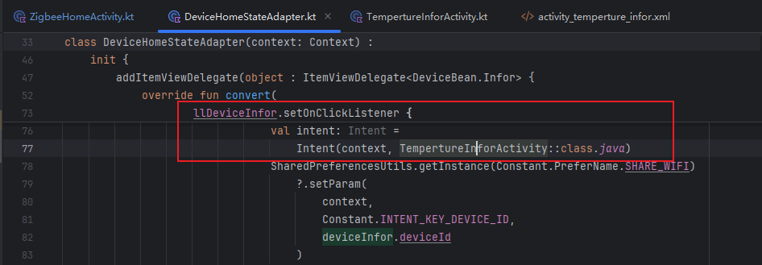

## 05.兼容性设计

### 5.1 设备适配

### 5.2 冲突检查

## 06.测试方案

### 6.1 核心用例

### 6.2 性能指标

## 07.发布计划

### 7.1 阶段发布

### 7.2 回滚方案

## 08.文档记录

### 8.1 技术文档

### 8.2 用户文档

### 8.3 监控埋点

