[toc]

## 01.功能概述

- **功能ID**：
- **功能名称**：
- **目标版本**：v0.2.0
- **提交人**：@panruiqi  
- **状态**：
  - [x] ⌛ 设计中 /
  - [ ] ⌛ 开发中 / 
  - [ ] ✅ 已完成 / 
  - [ ] ❌ 已取消  
- **价值评估**：  
  - [x] ⭐⭐⭐⭐⭐ 核心业务功能  
  - [ ] ⭐⭐⭐⭐ 用户体验优化  
  - [ ] ⭐⭐⭐ 辅助功能增强  
  - [ ] ⭐⭐ 技术债务清理  
- **功能描述** 
  - 


## 02.需求分析

### 2.1 思路分析

您先回答我一个问题：假如我现在有一个SDK，我需要拉取仓库下来自己编译执行，修改一些成为自己想用的，成为一个模块，请问我该做哪些步骤？请给我标准化的步骤

### 2.2 学习知识预览

这个阶段会学习到哪些知识？

## 03.实现规划

### 3.1 需求分析

蓝牙配网的SDK支持的Android minSDK是26，我们项目支持的最低SDK版本是21，我们无法很轻松的更改项目的版本，因此需要下载SDK源码，进行定制化开发。

### 3.2 技术调研

目的：判断蓝牙配网的SDK所支持的Android minSDK降低的可行性。

阅读README：

- 需要API 26
  - 
- 核心功能
  - 连接设备：包含扫码连接，Ble扫描，与设备建立会话
  - 设备配网：包含：扫描网络，为设备配置网络

阅读gradle

- 支持的最小SDK为 23
  - 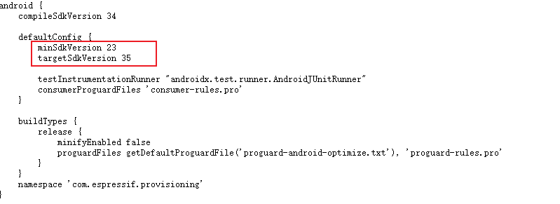
- 23与21的差距相对较小，改造可行性较高
- 核心BLE功能兼容 API 21+
  - BluetoothLeScanner、ScanCallback、ScanResult 等核心BLE API均从API 21开始支持
  -  设备扫描和连接功能无需API 26+特性
- CameraX兼容性良好
  - 使用CameraX 1.2.3版本，最低支持API 21
  - QR码扫描功能可在API 21+正常工作
  - 无API 26强制依赖
      - 未发现任何严格要求API 26+的功能
    - 当前的API 26要求更多是策略性选择而非技术限制
  - 权限处理向下兼容
    - SDK已实现条件性权限处理逻辑
    - 针对API 31+的新蓝牙权限有完整的向下兼容代码

### 3.3 架构设计

 我的模块化策略：
  temp_esp_sdk/     ← 研究用临时目录
  lib_esp_provision/ ← 独立ESP模块
  lib_graffiti/     ← 业务封装层

### 3.4 环境初步搭建

目的：建立一个"干净的编译环境"，验证SDK能否在你的项目环境下正常构建

步骤：

- 构建一个新的module，然后把核心的build.gradle改好。
  - lib级别gradle
  - 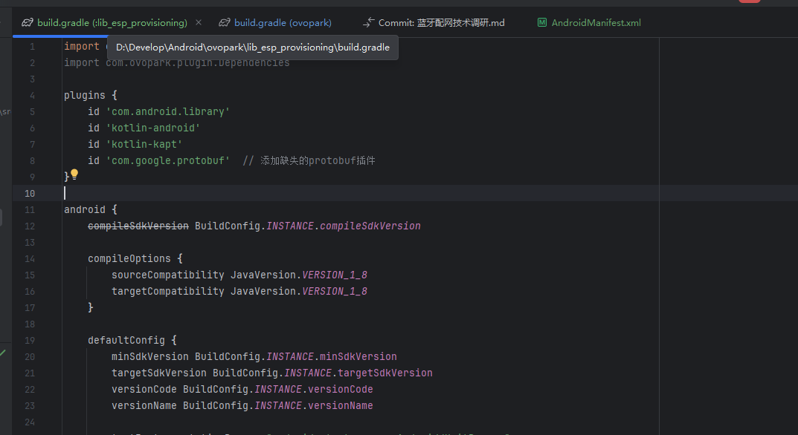
  - 项目级gradle
  - 
- 权限声明
  - 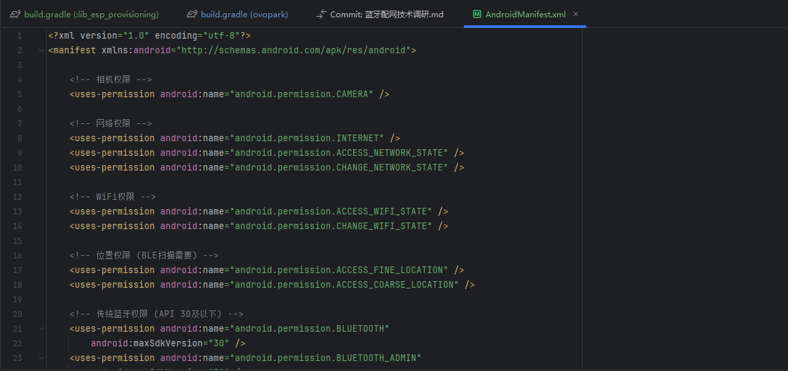
- 隔离验证：验证这个SDK单依赖能否编译通过
  - 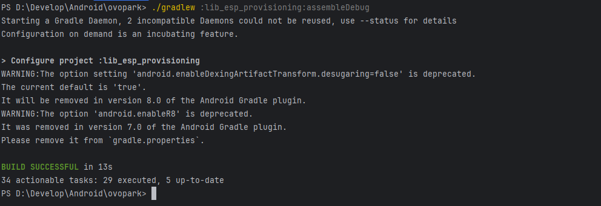

### 3.5 代码迁移规划

目的：规划分层迁移策略，用于下面的目的：

- 风险控制 - 逐层迁移可以快速定位问题源头
  2. 依赖管理 - 按依赖关系顺序迁移，避免循环依赖
  3. 编译验证 - 每层迁移后立即编译，确保无语法错误
  4. 问题隔离 - 将API兼容性问题、包名问题、业务逻辑问题分开处理

分析要迁移的步骤

- ✅ 先复制proto文件 - 最安全，无需修改
  2. ✅ 复制Java核心代码
  3. ✅ 批量替换包名 - 使用IDE的全局替换功能
  4. ✅ 逐个修复API兼容性问题 - 按上述清单逐一处理
  5. ✅ 编译测试 - 每修复一个问题就编译一次

分析迁移修改清单

- 包名和导入语句修改
  - 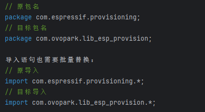
- API兼容性问题分析
  - 网络API兼容性
    - 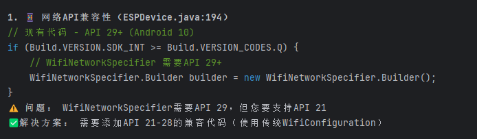
  - 蓝牙权限处理
    - 
  - 相机权限处理
    - 

### 3.6 初步迁移

目的：将简单的，最安全的，无需修改的先一步进行迁移

复制proto文件

- 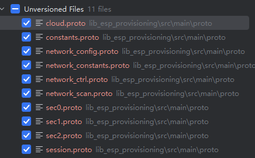
- 然后查看其能否正常的工作

验证迁移是否完成：./gradlew :lib_esp_provisioning:generateDebugProto 编译通过

- 他们会生成对应的Java类
  - 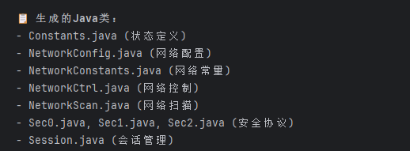

### 3.7 核心文件迁移规划

代码分层分析：

-  第1层：基础工具类 (无依赖)
    ├── utils/HexEncoder.java
    ├── utils/MessengeHelper.java
    └── ESPConstants.java
- 为什么先迁移这些：
    - 🛡️ 最安全 - 这些是纯工具类，几乎不需要修改
    - 🔧 基础依赖 - 其他所有类都依赖它们
    - ✅ 快速验证 - 可以立即编译通过，建立信心


-   第2层：核心数据类 (依赖第1层)
    ├── WiFiAccessPoint.java
    ├── Session.java
    └── DeviceConnectionEvent.java

- 为什么这个顺序：
    - 📦 纯数据模型 - 只包含getter/setter，修改风险低
    - 🔗 中间依赖 - 被上层依赖，为下步做准备

  

-   第3层：传输和安全层 (依赖前2层)
    ├── security/ (Security0, Security1, Security2, Security.java)
    ├── srp6a/ (全部SRP6认证相关类)
    └── transport/ (BLETransport, SoftAPTransport, Transport.java)

- 为什么要特别关注：
    - ⚠️ API敏感 - 可能包含低版本兼容性问题
    - 🔐 安全关键 - 加密算法不能出错
    - 🔧 协议核心 - BLE/WiFi传输协议的实现

  

-   第4层：业务逻辑层 (依赖前3层)
    ├── device_scanner/ (BleScanner, WiFiScanner)
    ├── listeners/ (全部监听器接口)
    ├── ESPDevice.java
    └── ESPProvisionManager.java

-  为什么最后迁移：
    - 🚨 最复杂 - 包含大量API版本检查逻辑
    - 🔄 交互密集 - 与Android系统API交互最多
    - 🎯 核心功能 - 主要的API兼容性问题都在这里

  

-   第5层：UI相关 (依赖前4层)
    ├── CameraSource.java
    ├── CameraSourcePreview.java
    └── GraphicOverlay.java

- 为什么可选：
    - 🎨 UI层 - 您的项目可能有自己的UI实现
    - 📷 相机功能 - 可能需要定制化

- 🎯 执行策略：自底向上迁移


每完成一个阶段后：

  - 📝 批量包名替换：使用IDE的全局替换功能， com.espressif.provisioning → com.ovopark.lib_esp_provision
  - 🔨 编译测试：./gradlew :lib_esp_provisioning:compileDebugJavaWithJavac

  - 📋 记录问题

         - ```
              - 编译错误 → 立即修复
              - 导入错误 → 调整import语句
              - API兼容性警告 → 记录待后续处理
              ```

  明确排除的文件：
  - ❌ ExampleInstrumentedTest.java - 测试文件
  - ❌ ExampleUnitTest.java - 测试文件
  - ❌ app目录下的所有Activity - UI实现
  - ❌ res资源文件 - 界面资源


  🎯 预期遇到的问题及解决策略

-   问题1：导入语句错误
    // 错误
    import com.espressif.provisioning.ESPConstants;
    // 修正
    import com.ovopark.lib_esp_provision.ESPConstants;

-   问题2：proto类导入
    // 需要调整为
    import espressif.Constants;  // proto生成的类

-   问题3：API兼容性编译警告
    // 暂时忽略，在阶段5专门处理
    @SuppressWarnings("deprecation") // 临时添加


  📊 风险评估

| 阶段 | 风险等级 | 主要风险点        | 缓解策略                   |
| ---- | -------- | ----------------- | -------------------------- |
| 2.1  | 🟢 低     | 包名替换遗漏      | IDE全局搜索替换            |
| 2.2  | 🟢 低     | 依赖关系错误      | 按顺序编译验证             |
| 2.3  | 🟡 中     | 加密API兼容性     | 分文件逐个验证             |
| 2.4  | 🔴 高     | Android API兼容性 | 暂时忽略警告，后续专门处理 |
| 2.5  | 🟡 中     | CameraX集成问题   | 可选阶段，出问题可跳过     |

### 3.8 核心文件迁移_工具类迁移

迁移

- 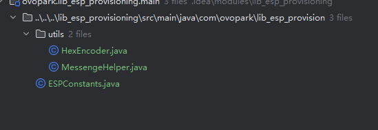

编译测试

- 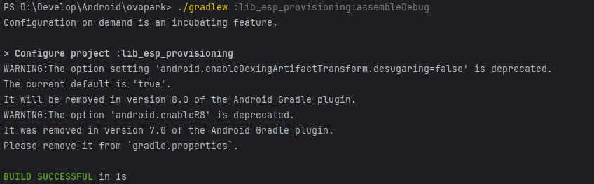

### 3.9 核心文件迁移_核心数据类

迁移

- 

编译测试

- 

### 3.10核心文件迁移_传输和安全层

迁移

- 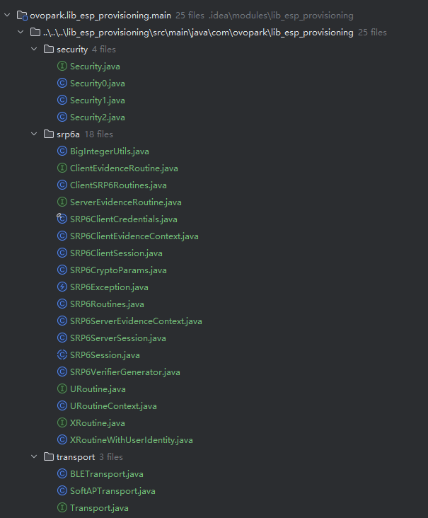

编译测试

- 出现问题是正常的， 因为缺少 ResponseListener 等接口（在listeners目录中）

- 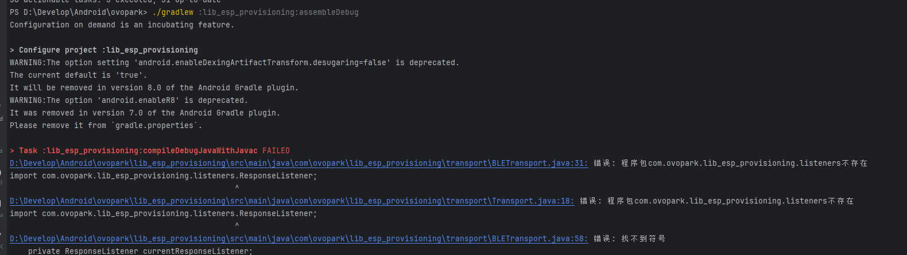

文件完整性 - 安全层(4个)、SRP6a(18个)、传输层(3个)共25个文件已迁移

目前 核心架构完成 - 安全、加密、传输层已全部就位，接下来是业务逻辑层

### 3.11 核心文件迁移_业务逻辑层

迁移

- 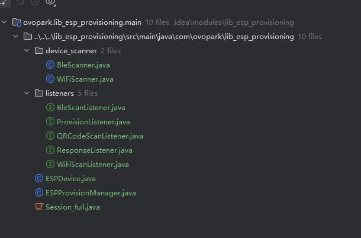

编译测试

- 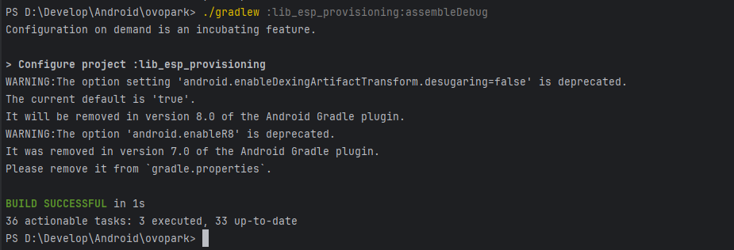

### 3.12 定制化需求

目的：降低其依赖API到21

现状分析：

-  ❌ WiFi连接问题未解决：
  - ESPDevice.java:194 - 仍然使用 WifiNetworkSpecifier（需要API 29+）
  - 缺少API 21-28的兼容实现
  - ❌ 缺少传统WiFi连接方法：
      2. - 没有添加使用 WifiConfiguration 的API 21-28兼容代码
  - ✅ 已有部分兼容性：
      3. BLE传输在 BLETransport.java:138 有API M(23)的兼容性检查
    - 但主要问题是WiFi连接部分

尝试解决

- 

### 3.13 集成到项目中

目的：让lib_graffiti使用lib_esp_provisioning，而非SDK

步骤：

- Project中添加
  - 
- ovopark中添加
  - 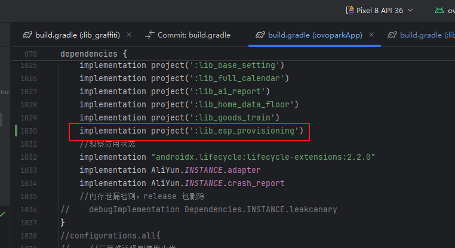
- lib中使用
  - 

- 修改lib_graffiti的import导入语句

### 3.14 解决编译问题


### 3.15 优化


## 04.测试方案

### 4.1 核心用例


### 4.2 性能指标


## 05.发布计划

### 5.1 阶段发布


### 5.2 回滚方案


## 06.文档记录

### 6.1 技术文档


### 6.2 学习文档


### 6.3 监控埋点


