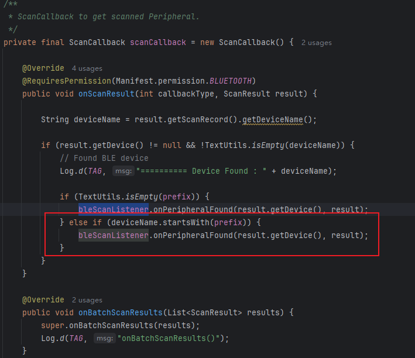

## 01.基础熟悉阶段

目的：建立SDK的基本认知，快速上手

基本信息收集（版本、依赖、功能特性）

  - 核心功能

      - 设备发现与连接: BLE 扫描与 GATT 连接；SoftAP 连接

    - 安全握手: Security0/1/2（Security2 基于 SRP6A）

    - 配网: WiFi 扫描、发送 SSID/密码、状态回调；支持 Thread 配网

    - 二维码: 支持 CameraX + ML Kit、CodeScanner 以及 legacy Vision 三种路径

    - 事件通知: EventBus 分发连接/断开等事件

    - 自定义协议: Protobuf（lite）

- Android 版本要求
  - 库模块 minSdk: 23（不是 21）
  - Demo app 模块 minSdk: 26
  - compileSdk: 34，targetSdk: 35

- 关键依赖（已在库中声明）
  - Protobuf（com.google.protobuf:protobuf-javalite:3.18.0）
  - EventBus（org.greenrobot:eventbus:3.3.1）
  - 加密（com.google.crypto.tink:tink-android:1.12.0）
  - 相机扫码（androidx.camera:*:1.2.3 + com.google.mlkit:barcode-scanning:17.3.0）
  - 另外还包含 com.github.yuriy-budiyev:code-scanner:2.1.2 与 play-services-vision:20.1.3

项目结构概览（模块划分、包命名）

- 模块：provisioning（SDK库），app（演示应用）

- 包命名：核心在 com.espressif.provisioning
  - ESPProvisionManager（对外入口）
  - ESPDevice（设备对象：连接、会话、扫描、配网）
  - transport（BLETransport、SoftAPTransport）
  - security（Security0/1/2 + srp6a/*）
  - device_scanner（BleScanner、WiFiScanner）
  - listeners、utils、proto 等

快速上手体验（最小化测试用例）

- 扫描设备阶段
  - 调用SDK的
  - 
  - 

## 02.以点破面

目的：根据Demo的使用，快速深入SDK，建立熟悉感。

- 整体机制如下
  - 

### 2.1 BLE的扫描机制

Demo发起扫描

- BLEProvisionLanding.startScan() 校验权限后，调用 SDK 的“按前缀扫描”API
  - 这里的 deviceNamePrefix 默认来自设置（如 PROV_），用于快速筛出目标设备。
  - bleScanListener 用于通过接口接收扫描到的外围设备，并更新 UI 列表。
  - 
- ESPProvisionManager怎么来的？
  - 单例模式
  - 
  - 对应这个方法，其实就是设置context和Handler
  - 

SDK管理层进行调度

- ESPProvisionManager 将“前缀扫描”的调用，转交给 BleScanner：
  - 

蓝牙扫描器（BleScanner）

- 角色定位：是 SDK 的 BLE 扫描“执行器”。对外由 ESPProvisionManager.searchBleEspDevices(...) 调用，对内真正与系统 BluetoothLeScanner 打交道，并最终通过 BleScanListener 向上层（Demo 或业务方）报告“找到设备 / 扫描完成 / 扫描失败”。

- 成员和构造函数

  - SCAN_TIME_OUT: 固定 6 秒“单次扫描”窗口。
  - prefix: 设备名前缀过滤（应用层过滤，不使用硬件 ScanFilter）。
  - 构造时拿到 BluetoothAdapter、保存回调、可注入 prefix。
  - 
  - 构造函数则是获取系统的蓝牙服务

  - 

- 启动扫描

  - 创建空的 List<ScanFilter>（= 不做硬件过滤）、使用 SCAN_MODE_BALANCED，然后委托到重载方法。

  - 

  - 获取系统扫描蓝牙的能力，进行扫描，其中：允许外部决定“扫哪些”（filters）与“怎么扫”（settings）。

  - handler.postDelayed(stopScanTask, SCAN_TIME_OUT) 定时停止（库内固定 6000ms）

  - 

  - 这里的scanCallback就是系统扫描回调，这里有扫描结果时，我们进行软件规则匹配，如果匹配，那么会调用接口，将结果上传给Demo层

    

  - 

Demo层获取扫描结果

- 主要是onPeripheralFound
  - 提取主服务 UUID，取广告包中 ServiceUuids 的第一个作为“主服务”展示/后续连接参数。
  - 去重逻辑，用 HashMap<BluetoothDevice, String> bluetoothDevices 判断是否已出现过，避免重复加入列表。
  - 新设备则创建 BleDevice 模型，填入“广播名 + BluetoothDevice”，加入 deviceList和哈希表，然后刷新适配器。
  - UI 可见性，第一次发现设备时显示 listView（之前扫描进度可能隐藏了列表）。
  - 

这一阶段的代码有什么可以优化的地方吗？

- 没有特别多可行的优化

整个的原理是什么呢？

- App → Binder 调系统扫描 → 系统经 Binder 回调 ScanCallback → SDK 再回调给 Demo。

### 2.2 BLE连接建立过程

Demo层触发连接

- ItemClick中调用Manager的connectBleDevice方法
  - 

## 02.整体认知阶段

目标：建立SDK整体架构认知，理解模块间关系

- 架构图绘制

- 数据流分析：

  - ```
    🔄 配网数据流程图
    ┌─────────────────────────────────────────────────────────────┐
    │ 1. 设备发现 → 2. 建立连接 → 3. 安全握手 → 4. WiFi配网      │
    │                                                            │
    │ BLE扫描 → GATT连接 → Security握手 → 配网数据传输 → 结果确认 │
    └─────────────────────────────────────────────────────────────┘
    ```

- 设计模式识别

- 对外API梳理

  - ```
    // 1. 设备管理API
    ESPProvisionManager.getInstance(context)
    createESPDevice(transport, security)
    
    // 2. 设备扫描API  
    startBleScan(prefix, listener)
    startWifiScan(listener)
    
    // 3. 配网操作API
    provision(ssid, passphrase, listener)
    scanNetworks(listener)
    
    // 4. QR码扫描API
    scanQRCode(activity, listener)
    ```

## 03.重点认知阶段

目标：识别核心模块，建立优先级认知，能够准确评估各模块的重要性和复杂度，制定合理学习计划

核心模块识别矩阵：

| 模块                | 重要程度 | 复杂程度 | 优先级 | 功能说明               |
| ------------------- | -------- | -------- | ------ | ---------------------- |
| ESPDevice           | 🔴高      | 🔴高      | P1     | 核心设备控制和配网逻辑 |
| Security2/SRP6A     | 🔴高      | 🔴高      | P1     | 安全认证协议实现       |
| BLETransport        | 🔴高      | 🟡中      | P1     | 蓝牙通信封装           |
| ESPProvisionManager | 🔴高      | 🟡中      | P2     | 对外API管理            |
| BleScanner          | 🟡中      | 🟡中      | P2     | 设备扫描功能           |
| Protobuf Messages   | 🟡中      | 🟢低      | P3     | 协议数据结构           |

关键技术点识别 🔍

- 并发控制：ExecutorService + Semaphore

- 加密通信：Tink + SRP6A协议

- 蓝牙通信：GATT Client实现

- 协议序列化：Protocol Buffers

- 事件通信：EventBus解耦

性能关注点 ⚡

- 蓝牙连接稳定性

- 大数据量传输优化

- 内存泄漏防范

- 线程池管理

## 04.深入研究阶段

目的：深入理解核心模块，具备二次开发能力

● 逐模块深入分析


### 05.扩展学习方向

立即可行的深入方向：

1. Security2/SRP6A模块：深入理解认证协议实现

1. BLETransport模块：学习蓝牙通信的最佳实践

1. 完整配网流程：端到端追踪数据流

扩展学习方向：

1. 对比学习：分析其他IoT配网SDK的设计差异

1. 性能优化：识别潜在瓶颈，提出改进方案

1. 功能扩展：基于现有架构，设计新功能模块

这套四层递进的标准化流程，可以复制应用到任何SDK的学习中，帮助您快速建立系统性认知并达到深度理解的目标。