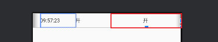
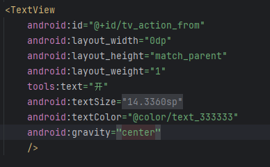
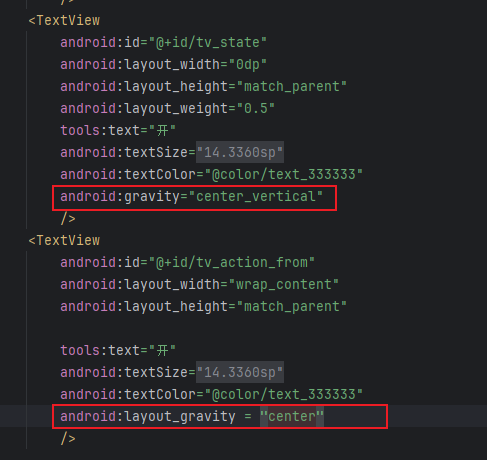

```
import com.ovopark.plugin.BuildConfig
import com.ovopark.plugin.Camera
import com.ovopark.plugin.Dependencies

apply plugin: 'com.android.library'
apply plugin: 'kotlin-android'
apply plugin: 'com.google.protobuf'
//Arouter配置.
apply plugin: 'kotlin-kapt'

android {

    defaultConfig {
        compileSdkVersion BuildConfig.INSTANCE.compileSdkVersion
        minSdkVersion 21  // 我们需要支持API 21
        targetSdkVersion BuildConfig.INSTANCE.targetSdkVersion
        versionCode BuildConfig.INSTANCE.versionCode
        versionName BuildConfig.INSTANCE.versionName

        testInstrumentationRunner "androidx.test.runner.AndroidJUnitRunner"
        consumerProguardFiles "consumer-rules.pro"

        kapt {
            arguments {
                arg("AROUTER_MODULE_NAME", project.getName())
            }
        }
    }

    buildTypes {
        release {
            minifyEnabled false
            proguardFiles getDefaultProguardFile('proguard-android-optimize.txt'), 'proguard-rules.pro'
        }
    }

    compileOptions {
        sourceCompatibility JavaVersion.VERSION_1_8
        targetCompatibility JavaVersion.VERSION_1_8
    }
    kotlinOptions {
        jvmTarget = '1.8'
    }
    buildFeatures {
        viewBinding true
    }
}

repositories {
    mavenCentral()
    google()
}

// Protobuf配置
protobuf {
    protoc {
        artifact = 'com.google.protobuf:protoc:3.21.9'
    }
    generateProtoTasks {
        all().each { task ->
            task.builtins {
                java {
                    option 'lite'
                }
            }
        }
    }
}

dependencies {
    implementation project(':lib_common')
    implementation Dependencies.INSTANCE.arouter_api
    kapt Dependencies.INSTANCE.arouter_compiler

    // ESP-IDF核心依赖
    implementation Dependencies.INSTANCE.eventbus
    implementation 'com.google.protobuf:protobuf-javalite:3.18.0'
    implementation 'com.google.crypto.tink:tink-android:1.12.0'

    // 蓝牙和相机相关 (为了API 21兼容性，使用较低版本)
    implementation Dependencies.INSTANCE.appcompat_v7
    implementation 'androidx.preference:preference:1.2.1'
    implementation 'com.github.yuriy-budiyev:code-scanner:2.1.2'

    // CameraX (支持API 21)
    def camerax_version = "1.2.3"
    implementation Camera.getCamera_core()
    implementation Camera.getCamera_camera2()
    implementation Camera.getCamera_lifecycle()
    implementation Camera.getCamera_view()

    // ML Kit for QR code scanning
    implementation 'com.google.mlkit:barcode-scanning:17.3.0'
    implementation 'com.google.android.gms:play-services-vision:20.1.3'

    // 测试依赖
    testImplementation 'junit:junit:4.13.2'
    androidTestImplementation 'androidx.test.ext:junit:1.3.0'
    androidTestImplementation 'androidx.test.espresso:espresso-core:3.7.0'
}
```


## LinearLayout中

- 
- 让他
  - 
  - 变成：也就是开变成
  - 





## RelativeLayout中


```
// Android MVVM + ViewBinding + Coroutine/Flow + Koin .cursorrules

// Flexibility Notice

// Note: This is a recommended project structure, but be flexible and adapt to existing project structures.
// Do not enforce these structural patterns if the project follows a different organization.
// Focus on maintaining consistency with the existing project architecture while applying MVVM, ViewBinding, and Koin best practices.

// Project Architecture and Best Practices

const androidMVVMBestPractices = [
    "Adapt to existing project architecture while maintaining clean code principles",
    "Use ViewBinding for type-safe and null-safe view access; avoid findViewById",
    "Implement MVVM architecture: separate View (Activity/Fragment), ViewModel, and Model layers",
    "Keep Activities/Fragments as thin as possible; move business logic to ViewModel",
    "Expose UI state from ViewModel using StateFlow or LiveData",
    "Use Kotlin coroutines and Flow for asynchronous and reactive operations",
    "Implement dependency injection using Koin; define modules for each layer",
    "Use sealed classes or data classes to represent UI state and events",
    "Handle navigation in a centralized way (Navigation Component or custom navigator)",
    "Apply proper error and loading state handling in ViewModel and propagate to UI",
    "Keep all Android framework references (Context, View, etc.) out of ViewModel and domain layers",
];

// Folder Structure

// Note: This is a reference structure. Adapt to the project's existing organization

const projectStructure =
project-root/
  core/                // Core module: base classes, network, database, DI, utils
    di/                // Koin modules and dependency definitions
    network/           // Network layer (Retrofit, API services, etc.)
    database/          // Database layer (Room, DAOs, etc.)
    utils/             // Utility classes and extensions
  features/            // Feature modules (one folder per business feature)
    login/
      data/            // Data sources, repositories, models for login
      domain/          // Use cases, business logic for login
      presentation/    // UI, ViewModel, state for login
    profile/
      data/
      domain/
      presentation/
    ...                // Other features
  presentation/        // Global UI (main Activity, navigation, theme, base UI)
    navigation/        // Navigation setup (NavHost, graph, etc.)
    theme/             // App-wide theming
    base/              // Base UI components (BaseActivity, BaseFragment, etc.)
  shared/              // Shared code and resources across features
    components/        // Reusable UI components
    resources/         // Shared resources (strings, drawables, etc.)
    utils/             // Shared utility classes
  build.gradle
  settings.gradle
  ...

// ViewBinding + MVVM Guidelines

const viewBindingMVVMGuidelines =
1. Use ViewBinding in all Activities and Fragments for view access; never use findViewById.
2. Only hold ViewBinding references between onCreateView/onDestroyView (Fragment) or onCreate/onDestroy (Activity).
3. Never hold long-lived references to ViewBinding outside the view lifecycle to avoid memory leaks.
4. ViewModel must not reference any Android View, Context, or resources directly.
5. Expose all UI state from ViewModel using StateFlow (preferred) or LiveData.
6. Collect Flow/StateFlow in Activity/Fragment with lifecycle awareness (e.g., lifecycleScope, flowWithLifecycle).
7. Use Koin modules to provide ViewModel, repositories, and other dependencies.
8. Use sealed classes or data classes for representing UI state, events, and side effects.
9. Handle loading, error, and success states explicitly in ViewModel and propagate to UI.
10. Keep navigation logic out of ViewModel; handle navigation in Activity/Fragment or via a Navigator abstraction.
11. Use extension functions and utility classes for common ViewBinding patterns.
12. Write unit tests for ViewModel and business logic; use fake or mock repositories for testing.

// Testing Guidelines

const testingGuidelines =
1. Write unit tests for ViewModels, use cases, and repositories.
2. Use fake or mock repositories and data sources for testing business logic.
3. Use coroutine test dispatchers for testing suspend functions and flows.
4. Implement UI tests for Activities/Fragments using Espresso (or Compose if used).
5. Ensure proper test coverage for all features and core modules.
6. Test error, loading, and edge cases in ViewModel and UI.

// Performance Guidelines

const performanceGuidelines =
1. Use Flow operators (debounce, distinctUntilChanged, etc.) to minimize unnecessary UI updates.
2. Avoid memory leaks by clearing ViewBinding references in onDestroyView (Fragment) or onDestroy (Activity).
3. Use proper coroutine scopes (viewModelScope for ViewModel, lifecycleScope for UI).
4. Avoid heavy work on the main thread; use Dispatchers.IO for I/O operations.
5. Use paging or lazy loading for large lists and data sets.
6. Profile and optimize startup time, screen transitions, and memory usage.
7. Use shared ViewModels for communication between fragments when needed.
8. Minimize recomposition and unnecessary UI updates by using proper state management. 
```

