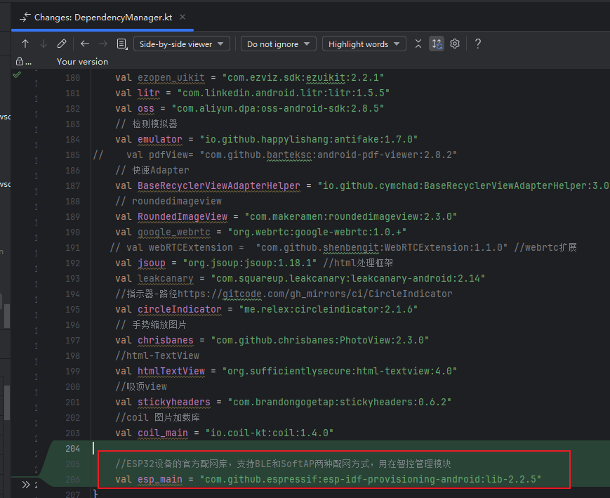
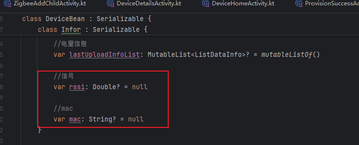
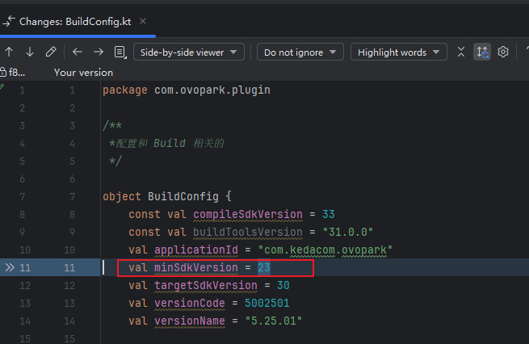

影响的三个部分：

- 
- 
- 


```
┌─────────────────────────────────────────────────────────────┐
│                      View Layer                             │
│  ┌─────────────────┐ ┌─────────────────┐ ┌─────────────────┐│
│  │   Activity      │ │   Fragment      │ │   Custom View   ││
│  │   - UI操作      │ │   - UI操作      │ │   - UI操作      ││
│  │   - 用户交互    │ │   - 用户交互    │ │   - 用户交互    ││
│  │   - 状态显示    │ │   - 状态显示    │ │   - 状态显示    ││
│  └─────────────────┘ └─────────────────┘ └─────────────────┘│
└─────────────────────┬───────────────────────────────────────┘
                      │ IView接口
┌─────────────────────▼───────────────────────────────────────┐
│                   Presenter Layer                          │
│  ┌─────────────────────────────────────────────────────────┐│
│  │                 BasePresenter                           ││
│  │  - 生命周期管理                                         ││
│  │  - View绑定/解绑                                       ││
│  │  - 统一错误处理                                         ││
│  └─────────────────────────────────────────────────────────┘│
│  ┌─────────────────┐ ┌─────────────────┐ ┌─────────────────┐│
│  │ DevicePresenter │ │SearchPresenter  │ │ ReportPresenter ││
│  │ - 调用Repository│ │ - 调用Repository│ │ - 调用Repository││
│  │ - 处理UI逻辑    │ │ - 处理UI逻辑    │ │ - 处理UI逻辑    ││
│  │ - 状态管理      │ │ - 状态管理      │ │ - 状态管理      ││
│  └─────────────────┘ └─────────────────┘ └─────────────────┘│
└─────────────────────┬───────────────────────────────────────┘
                      │ Repository接口
┌─────────────────────▼───────────────────────────────────────┐
│                    Model Layer                              │
│  ┌─────────────────────────────────────────────────────────┐│
│  │                  Repository                             ││
│  │  - 数据来源抽象                                         ││
│  │  - 数据缓存策略                                         ││
│  │  - 统一数据接口                                         ││
│  └─────────────────────────────────────────────────────────┘│
│  ┌─────────────────┐ ┌─────────────────┐ ┌─────────────────┐│
│  │   Data Source   │ │   API Service   │ │  Data Mapper    ││
│  │   - 网络请求    │ │   - 接口定义    │ │   - 数据转换    ││
│  │   - 本地缓存    │ │   - 参数构建    │ │   - 模型映射    ││
│  │   - 数据库操作  │ │   - 响应解析    │ │   - 错误转换    ││
│  └─────────────────┘ └─────────────────┘ └─────────────────┘│
└─────────────────────────────────────────────────────────────┘
```

