[toc]

## 前言

> 学习要符合如下的标准化链条：了解概念->探究原理->深入思考->总结提炼->底层实现->延伸应用"

## 01.学习概述

- **学习主题**：
- **知识类型**：
  - [ ] **知识类型**：
    - [ ] ✅Android/ 
      - [ ] ✅01.基础组件
      - [ ] ✅02.IPC机制
      - [ ] ✅03.消息机制
      - [ ] ✅04.View原理
      - [ ] ✅05.事件分发机制
      - [ ] ✅06.Window
      - [ ] ✅07.复杂控件
      - [ ] ✅08.性能优化
      - [ ] ✅09.流行框架
      - [ ] ✅10.数据处理
      - [ ] ✅11.动画
      - [ ] ✅12.Groovy
    - [ ] ✅音视频开发/
      - [ ] ✅01.基础知识
      - [ ] ✅02.OpenGL渲染视频
      - [ ] ✅03.FFmpeg音视频解码
    - [ ] ✅ Java/
      - [ ] ✅01.基础知识
      - [ ] ✅02.Java设计思想
      - [ ] ✅03.集合框架
      - [ ] ✅04.异常处理
      - [ ] ✅05.多线程与并发编程
      - [ ] ✅06.JVM
    - [ ] ✅ Kotlin/
      - [ ] ✅01.基础语法
      - [ ] ✅02.高阶扩展
      - [ ] ✅03.协程和流
    - [ ] ✅ 故障分析与处理/
      - [ ] ✅01.基础知识
    - [ ] ✅ 自我管理/
      - [ ] ✅01.内观
    - [ ] ✅ 业务逻辑/
      - [ ] ✅01.启动逻辑
      - [ ] ✅02.云值守
      - [ ] ✅03.智控平台
- **学习来源**：
- **重要程度**：⭐⭐⭐⭐⭐
- **学习日期**：2025.
- **记录人**：@panruiqi

### 1.1 学习目标

- 了解概念->探究原理->深入思考->总结提炼->底层实现->延伸应用"

### 1.2 前置知识

- [ ] 

## 02.核心概念

### 2.1 是什么？

消息推送和处理机制

### 2.2 解决什么问题？

实时、集中、可交互地展示各种重要提醒（如任务、公告、审批、系统通知等），确保用户不错过任何关键消息，并能便捷处理。

### 2.3 基本特性

## 03.原理机制

### 3.1 进一步思考

我们怎么设计我们的数据模型？

- HomeReminderMessageInfo
  - 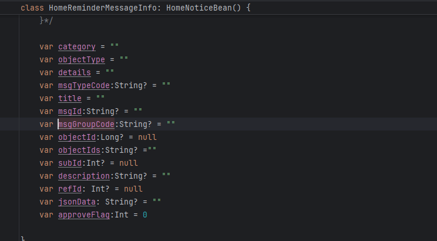
  - 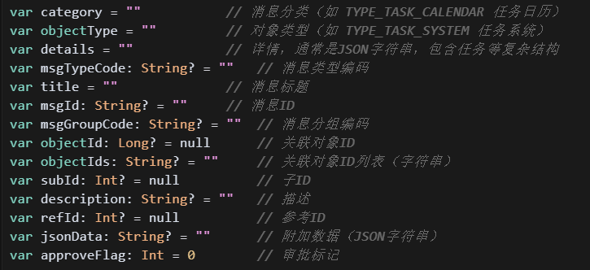
  - 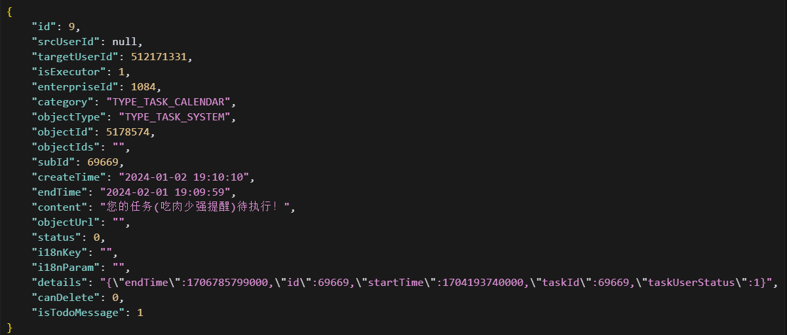
  - 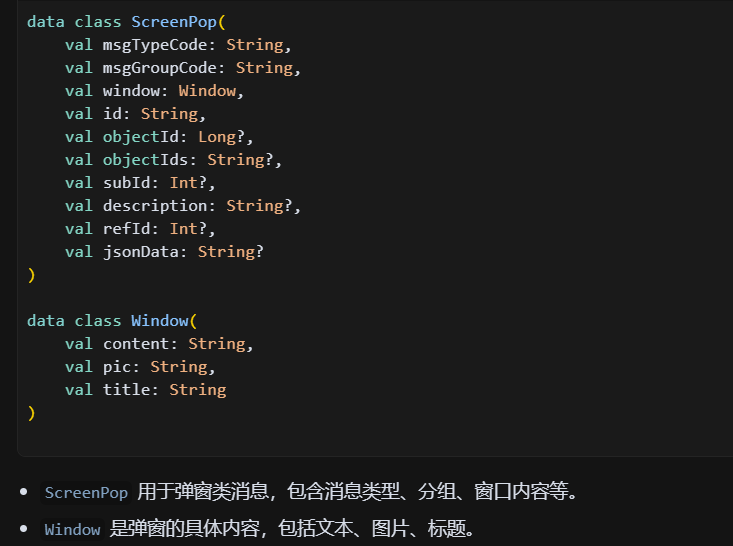

### 3.2 进一步思考

ok，那相关的API在哪？

你不能简单的说API在哪，因为这里不光有API，还有WebSock长连接，你得理解这里面的WebSock长连接和API之间的协作关系

- WebSock长连接推送，只负责“某个事件类型有新消息了！”的通知。
  - WebSocket收到消息后，EventBus分发到主线程，按类型触发不同的业务刷新。
  - 
  - 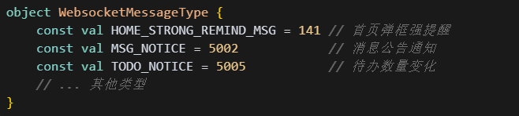
- 我们从webSocket中获取到 “某个事件类型有新消息了！”的通知 后，调用对应的API进行对应类型的消息数据的获取
  - 比如：上面的NEW_PROBLEM新问题类型
  - 
  - 会调用对应的getHomeAnnounce方法
  - 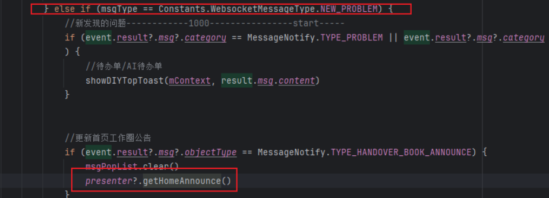
  - 对应下面的API
  - 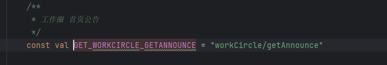
  - 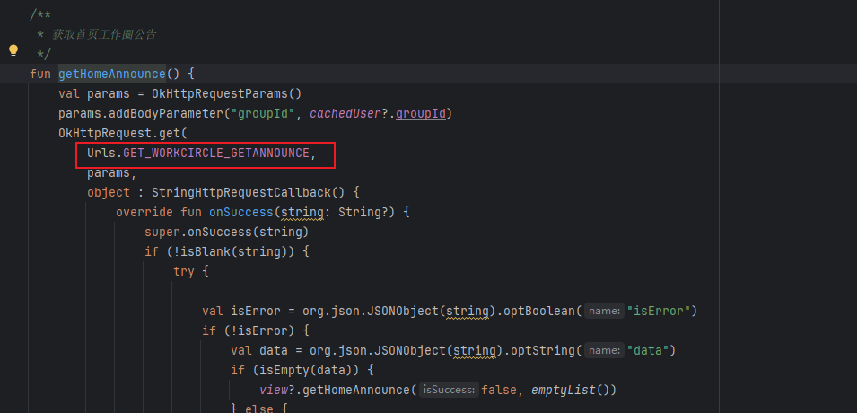
  - 其获取成功后，会继续获取其他首页弹框公告列表
  - 
  - 
  - 
- 有点意思啊，你得去理解：API与WebSocket协同流程
  - WebSocket实时推送：服务端主动推送“某个事件类型有新消息了”，客户端收到后触发数据刷新。
  - HTTP接口拉取：客户端根据推送类型，调用对应API拉取最新数据（如强提醒、公告等）。
  - 用户操作：如已读、确认等，通过HTTP接口通知服务端，保持数据一致。
- 实际流程：
  - 

### 3.3 进一步思考

那我们拿到数据后如何处理他呢？

- 首先是WebSocket消息接收和推送
  - 接收后解析和推送
  - 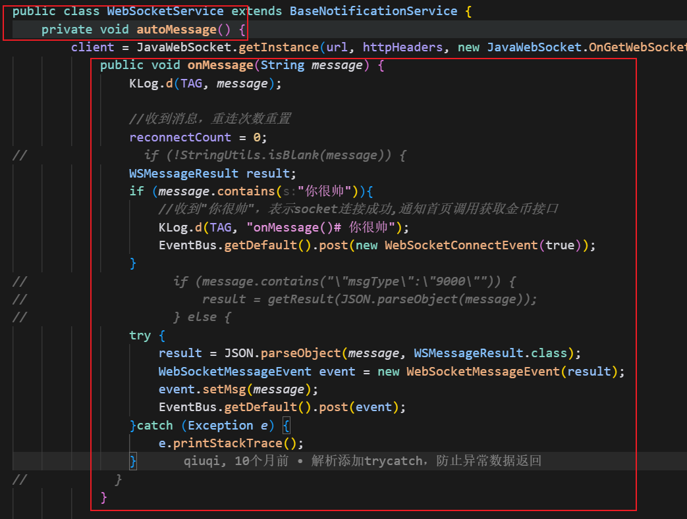
- 然后是WebSocket事件订阅和处理
  - 这里通过@Subscribe注解，自动监听WebSocketMessageEvent事件。收到特定类型后，调用Presenter层API拉取数据。
  - 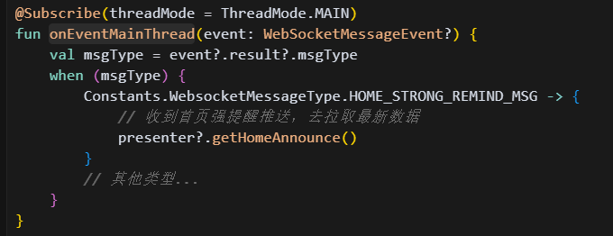
- 调用API获取实际的数据
  - 通过HTTP接口拉取最新的公告/强提醒消息。拉取成功后，回调到View层（即Activity）。
  - 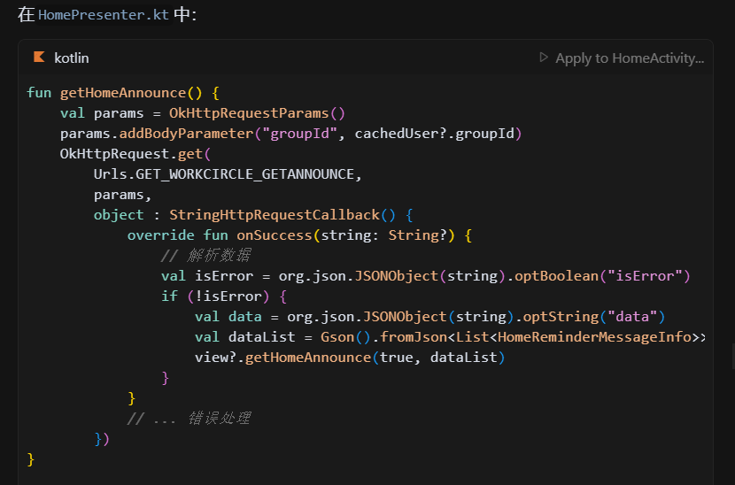
- UI层显示与应用交互
  - 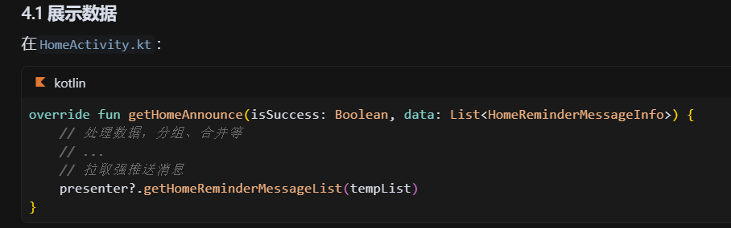
  - 数据通过RecyclerView横向展示，用户可进行“查看”、“忽略”、“确认”等操作。
  - 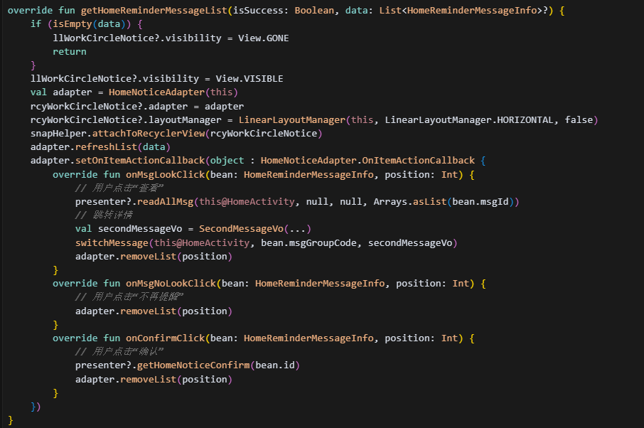
- 用户操作后上报服务端
  - 用户操作后，调用API上报到服务端，保持数据一致。
  - 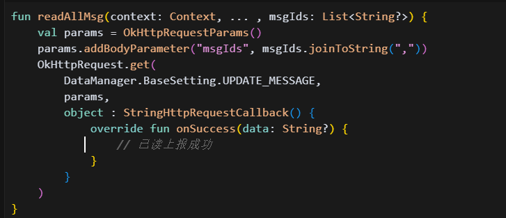
  - 同时将用户的操作结果返回给服务端，对应上面确认按钮的点击交互
  - 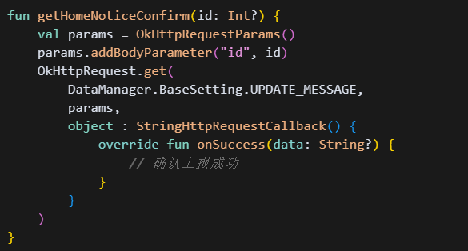
- 关键点总结：
  - 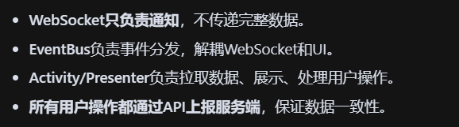

### 3.4 进一步思考

具体的业务场景是什么样的？

### 3.5 进一步思考

### 3.6 进一步思考

总结一下，整个数据的流转过程是什么样的?

- 网络层到数据层

  

- 数据层到业务层

  

- 业务层到存储层

  

- 存储层到UI层

  

### 3.7 进一步思考

## 04.底层原理

## 05.深度思考

### 5.1 关键问题探究

### 5.2 设计对比

## 06.实践验证

### 6.1 行为验证代码

### 6.2 性能测试

## 07.应用场景

### 7.1 最佳实践

### 7.2 使用禁忌

## 08.总结提炼

### 8.1 核心收获

### 8.2 知识图谱

### 8.3 延伸思考

## 09.参考资料

1. 
2. 
3. 

## 其他介绍

### 01.关于我的博客

- csdn：http://my.csdn.net/qq_35829566

- 掘金：https://juejin.im/user/499639464759898

- github：https://github.com/jjjjjjava

- 邮箱：[934137388@qq.com]

