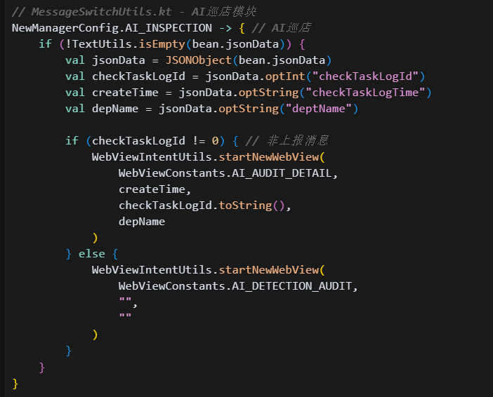

[toc]

## 前言

> 学习要符合如下的标准化链条：了解概念->探究原理->深入思考->总结提炼->底层实现->延伸应用"

## 01.学习概述

- **学习主题**：
- **知识类型**：
  - [ ] **知识类型**：
    - [ ] ✅Android/ 
      - [ ] ✅01.基础组件
      - [ ] ✅02.IPC机制
      - [ ] ✅03.消息机制
      - [ ] ✅04.View原理
      - [ ] ✅05.事件分发机制
      - [ ] ✅06.Window
      - [ ] ✅07.复杂控件
      - [ ] ✅08.性能优化
      - [ ] ✅09.流行框架
      - [ ] ✅10.数据处理
      - [ ] ✅11.动画
      - [ ] ✅12.Groovy
    - [ ] ✅音视频开发/
      - [ ] ✅01.基础知识
      - [ ] ✅02.OpenGL渲染视频
      - [ ] ✅03.FFmpeg音视频解码
    - [ ] ✅ Java/
      - [ ] ✅01.基础知识
      - [ ] ✅02.Java设计思想
      - [ ] ✅03.集合框架
      - [ ] ✅04.异常处理
      - [ ] ✅05.多线程与并发编程
      - [ ] ✅06.JVM
    - [ ] ✅ Kotlin/
      - [ ] ✅01.基础语法
      - [ ] ✅02.高阶扩展
      - [ ] ✅03.协程和流
    - [ ] ✅ 故障分析与处理/
      - [ ] ✅01.基础知识
    - [ ] ✅ 自我管理/
      - [ ] ✅01.内观
    - [ ] ✅ 业务逻辑/
      - [ ] ✅01.启动逻辑
      - [ ] ✅02.云值守
      - [ ] ✅03.智控平台
- **学习来源**：
- **重要程度**：⭐⭐⭐⭐⭐
- **学习日期**：2025.
- **记录人**：@panruiqi

### 1.1 学习目标

- 了解概念->探究原理->深入思考->总结提炼->底层实现->延伸应用"

### 1.2 前置知识

- [ ] 

## 02.核心概念

### 2.1 业务痛点与需求

在万店掌这样的大型企业管理App中，存在几十种不同业务线的消息类型：

- 巡店相关（AI巡店、现场巡店、计划巡店、巡店审核）

- 培训相关（考试、证书、课程、实操考评、学习项目）

- 运营相关（工单管理、告警中心、证件管理、待办单）

- 审批相关（OA审批、考勤、开店流程）

- 其他业务（CRM、营销管理、奖惩中心等）

问题：每种消息点击后需要跳转到不同的页面，如果在各个消息展示界面分别处理跳转逻辑，会导致：

- 跳转逻辑分散，难以维护

- 相同消息类型在不同地方处理不一致

- 新增消息类型需要修改多个地方

### 2.2 解决方案

设计一个统一的消息路由分发器，所有消息点击后的跳转都通过这个工具类处理，他负责处理"点击消息后该跳转到哪里"这个简单问题。

任何消息点击 → MessageSwitchUtils.switchMessage() → 根据消息类型路由到具体页面

他要做的

- 

### 2.3 基本特性

## 03.原理机制

### 3.1 我们怎么设计我们的数据模型？

消息分类的层次结构

- 消息系统分为msgCode和SecondMessageVo
  - 

- msgCode
  - msgCode就是msgGroupCode，也就是一级分类，他来自item的msgGroupCode
- 
  - 他有如下几种类型：
  - 
- SecondMessageVo - 消息详情实体
  - 
  - 他来自item的整体数据
  - 

### 3.2 消息来源和触发的流程？

消息来源的渠道

- 他有两个来源渠道，一个是Home页中消息推送机制产生的首页推送弹窗的看一看点击事件
  - 
- 另一个是消息提醒二级页
  - 

消息统一的入口方法

- 没啥好说的，先是msgGroupCode，然后是msgTypeCode，多级判断
  - 

### 3.3 具体的业务场景是什么样的？

首页弹框场景

数据获取流程

- 

数据合并与UI展示

- 数据合并逻辑如下：
  
  - getHomeAnnounce成功后，先将数据存放到tempList中.
  - 
  
  - 然后继续通过getHomeReminderMessageList获取额外的数据
  
  - 
  - 
  - 
  - 获取到后进行数据的合并操作，原有列表为空，则直接处理，不为空则合并数据并显示
  - 
  - 获取成功后，设置适配器，刷新数据，将显示的任务交给适配器处理
  - 
  
- 适配器进行类型推断

  - 

- 消息内容的渲染
  
  - 

用户交互（用户点击操作产生的回调）

- 用户点击查看详情
  - 
- 用户点击不再提醒
  - 
- 用户点击确认按钮
  - 

ok，现在终于到了MessageSwitchUtils的核心分发逻辑，是通过用户点击"查看详情"按钮跳转到的

- 统一入口方法
  - 

具体业务模块的处理示例

- AI巡店消息处理，显示WebView
  - 
- 培训考试消息处理，也是显示WebView
  - 
- 代办单消息处理，Arouter跳转
  - 

### 3.4 他有哪些跳转方式呢？

ARouter组件化跳转

- 

WebView页面跳转

- 

原生Activity跳转

- 

### 3.5 他的错误处理与降级方案

数据解析异常处理

- 

未知消息类型处理

- 

### 3.6 导师说：在HomeActivity中会先调用一次这个：getHomeReminderMessageList。然后消息被用完之后才会通过webSocket推新的。

ok，我们来看看流程

- onResume
  - 
- getScreenPop()到调用getHomeReminderMessageList流程
  - 首先是getScreenPop
  - 
  - getScreenPop回调触发getHomeAnnounce
  - 
  - getHomeAnnounce回调触发getHomeReminderMessageList
  - 

- ok，我们现在获取到了这些消息了，所以他会自动推送上来，我们只需要处理跳转的逻辑就行了。

### 3.7 导师还说：图片什么的也会支持，可以自动显示在上面

数据结构支持

- getHomeAnnounce方法获取到的data是HomeReminderMessageInfo类型数据	

  - 

- HomeReminderMessageInfo 继承自 HomeNoticeBean

  - 

- HomeNoticeBean 中定义了三种附件列表：

  - attaList - 图片视频

  - extAttaList - 附件

  - subAttaList - 模版图片视频
  - 

- 他们都是HomeNoticeMediaBean类型

  - 

图片自动显示的机制

- 消息中心类型（TYPE_NSG）：只显示第一张图片 item.attaList[0].path
  - 

- 工作圈类型：支持完整的图片列表、附件列表
  - 

附件的展示机制

- 文档附件展示机制：
  - 

数据来源与图片注入

- 从服务端获取的消息数据中包含图片信息
  - 
- 首屏弹窗数据（ScreenPop）中的 window.pic 也会转换为图片显示
  - 

## 04.底层原理

## 05.深度思考

### 5.1 关键问题探究

### 5.2 设计对比

## 06.实践验证

### 6.1 行为验证代码

### 6.2 性能测试

## 07.应用场景

### 7.1 最佳实践

### 7.2 使用禁忌

## 08.总结提炼

### 8.1 核心收获

### 8.2 知识图谱

### 8.3 延伸思考

## 09.参考资料

1. 
2. 
3. 

## 其他介绍

### 01.关于我的博客

- csdn：http://my.csdn.net/qq_35829566

- 掘金：https://juejin.im/user/499639464759898

- github：https://github.com/jjjjjjava

- 邮箱：[934137388@qq.com]

