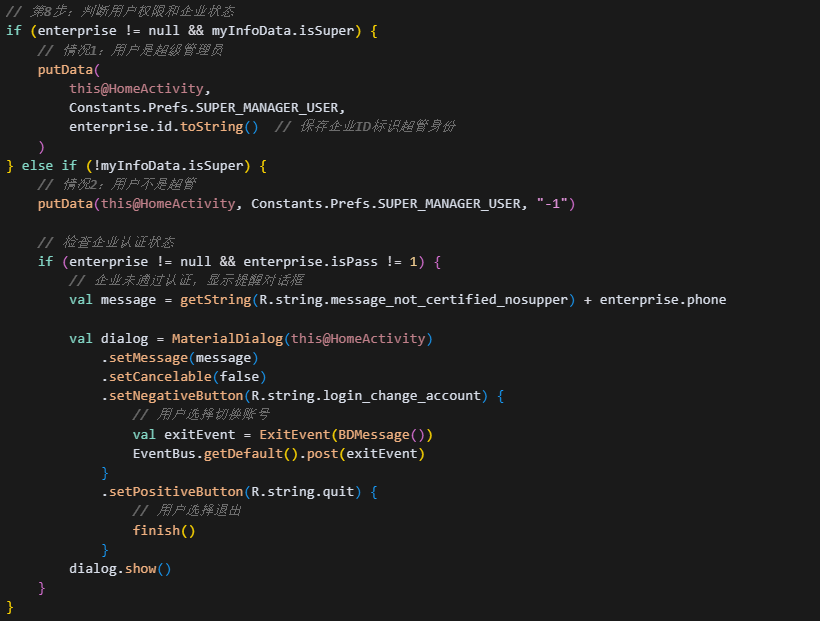

[toc]

## 前言

> 学习要符合如下的标准化链条：了解概念->探究原理->深入思考->总结提炼->底层实现->延伸应用"

## 01.学习概述

- **学习主题**：ovopark内如何进行定制化需求？
- **知识类型**：
  - [ ] **知识类型**：
    - [ ] ✅Android/ 
      - [ ] ✅01.基础组件
      - [ ] ✅02.IPC机制
      - [ ] ✅03.消息机制
      - [ ] ✅04.View原理
      - [ ] ✅05.事件分发机制
      - [ ] ✅06.Window
      - [ ] ✅07.复杂控件
      - [ ] ✅08.性能优化
      - [ ] ✅09.流行框架
      - [ ] ✅10.数据处理
      - [ ] ✅11.动画
      - [ ] ✅12.Groovy
    - [ ] ✅音视频开发/
      - [ ] ✅01.基础知识
      - [ ] ✅02.OpenGL渲染视频
      - [ ] ✅03.FFmpeg音视频解码
    - [ ] ✅ Java/
      - [ ] ✅01.基础知识
      - [ ] ✅02.Java设计思想
      - [ ] ✅03.集合框架
      - [ ] ✅04.异常处理
      - [ ] ✅05.多线程与并发编程
      - [ ] ✅06.JVM
    - [ ] ✅ Kotlin/
      - [ ] ✅01.基础语法
      - [ ] ✅02.高阶扩展
      - [ ] ✅03.协程和流
    - [ ] ✅ 故障分析与处理/
      - [ ] ✅01.基础知识
    - [ ] ✅ 自我管理/
      - [ ] ✅01.内观
    - [ ] ✅ 业务逻辑/
      - [ ] ✅01.启动逻辑
      - [ ] ✅02.云值守
      - [ ] ✅03.智控平台
- **学习来源**：
- **重要程度**：⭐⭐⭐⭐⭐
- **学习日期**：2025.
- **记录人**：@panruiqi

### 1.1 学习目标

- 了解概念->探究原理->深入思考->总结提炼->底层实现->延伸应用"

### 1.2 前置知识

- [ ] 

## 02.核心概念

### 2.1 是什么？

公司的业务逻辑

### 2.2 解决什么问题？

请问我们如何解决多租户SaaS应用的复杂需求？

业务场景：一个App服务多个企业客户

万店掌 → 服务不同的零售企业

老百姓版本 → 专门服务老百姓大药房

来伊份版本 → 专门服务来伊份零食

### 2.3 基本特性

## 03.原理机制

### 3.1 进一步思考

我们怎么设计我们的数据模型？

- 核心数据模型
  - 
- 企业信息实体
  - 
- 用户个人信息实体
  - 

### 3.2 进一步思考

ok，那相关的API在哪？

- API接口定义
  - 
- 实际网络请求的发起呢？
  - 
- 服务器返回的JSON数据的示例是什么样的？
  - 

### 3.3 进一步思考

那我们拿到数据后如何处理他呢？

- 接收数据并更新用户信息
  - 
- 处理企业信息
  - 
- 根据企业状态执行不同的业务逻辑
  - 
- 处理企业的到期提醒
  - 

### 3.4 进一步思考

具体的业务场景是什么样的？

- 登陆场景
  - 
- 主页面初始化场景
  - 
- 个人中心场景
  - 

### 3.5 进一步思考

除了用户信息，企业信息等处理和保存，还有其他的处理吗？比如，使用的BaseUrl？因为你最终是要完成：老百姓版本 → 专门服务老百姓大药房，来伊份版本 → 专门服务来伊份零食的。所以他们的数据必须是不同的，需要通过BaseUrl等区分

版本上的特殊处理如下：

- 地址处理
  - 
- UI显示差异
  - 

### 3.6 进一步思考

总结一下，整个数据的流转过程是什么样的?

- 网络层到数据层
  - 
- 数据层到业务层
  - 
- 业务层到存储层
  - 
- 存储层到UI层
  - 

### 3.7 进一步思考

我们如何让自己构建的apk是对应的定制版本呢？

- 版本识别逻辑
  - 
- 版本配置逻辑
  - 
- 构建流程
  - 
- 不对啊，地址还是：URL	https://www.ovopark.com/ovopark-privilege/privilege/getMenusPrivileges 

再次思考：

之前的理解可能不对，他应该分为两种情况，一种是定制化的版本，另一种是复用我们的万店掌版本，只是通过企业id进行区分。你需要判断，如果是定制化版本，他理论上会有对应的Build Variant

那么我们怎么区分？

- 真正的定制化版本会存在于build.gralde中有独立的 productFlavor
  - 
  - 
- 老百姓属于第二种情况 - 复用万店掌版本，通过企业ID区分！
  - 因为包名还是com.kedacom.ovopark
  - 

## 04.底层原理

## 05.深度思考

### 5.1 关键问题探究

他的设计有什么合理的地方，又有什么不合理的地方呢？

### 5.2 设计对比

## 06.实践验证

### 6.1 行为验证代码

### 6.2 性能测试

## 07.应用场景

### 7.1 最佳实践

### 7.2 使用禁忌

## 08.总结提炼

### 8.1 核心收获

### 8.2 知识图谱

### 8.3 延伸思考

## 09.参考资料

1. 
2. 
3. 

## 其他介绍

### 01.关于我的博客

- csdn：http://my.csdn.net/qq_35829566

- 掘金：https://juejin.im/user/499639464759898

- github：https://github.com/jjjjjjava

- 邮箱：[934137388@qq.com]

