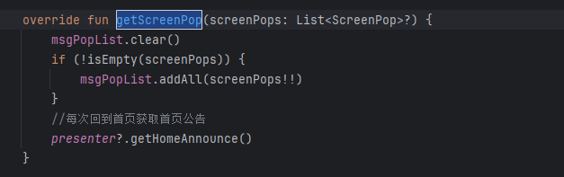
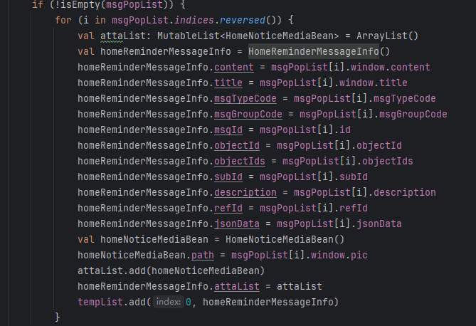

```
            NewManagerConfig.OPERATION_ALARM -> { //告警中心
                when (bean.msgTypeCode) {
                    "Device_Alert_Notify_Disk" -> { //磁盘告警
                        // 立即查看 - 跳转告警中心
                        bean.objectId?.let { goDeviceAlarm(mContext, it.toInt()) }
                    }
                    else -> {
                        // 其他告警类型的通用处理
                        bean.objectId?.let { goDeviceAlarm(mContext, it.toInt()) }
                    }
                }
            }
```



