[toc]

## 01. 需求介绍

- https://codesign.qq.com/app/s/512680383255699

- 

- 数据明细页面UI更新。
- 筛选框添加保存当前筛选按钮和逻辑
- 保存筛选要有弹窗。

## 02.相关代码逻辑分析

### 2.1 数据明细页面UI相关代码逻辑

- 首先是代办单Activity：ProblemChangeActivity

  - 

  - 内部包含两个Fragment，分别是：workBenchFragment和dataManageFragment。他们通过FragmentManager进行管理。

- 看看工作台Fragment：workBenchFragment

  - 
  - 内部包含一个ViewPager，其Fragment数据集为 `private val fragments = ArrayList<ProblemChangeFragment>()`

- 看看ProblemChangeFragment类型Fragment，也就是ViewPager填充的部分

  - 
  - 内部是一个RecyclerView去包含子条目

- 我们来看看子条目视图逻辑

  - 首先是RecyclerView的adapter，`lateinit var adapter: ProblemMultiModeAdapter`

  - 其在onCreateViewHolder阶段，根据ViewType填充不同的子条目

    - ```
      override fun onCreateViewHolder(parent: ViewGroup, viewType: Int): RecyclerView.ViewHolder {
              if (viewType == MODE_LIST) {
                  val binding = ItemProblemChangeOBinding.inflate(
                      LayoutInflater.from(parent.context),
                      parent,
                      false
                  )
                  return ProblemListViewHolder(binding)
              } else if (viewType == MODE_STORE) {
                  val binding =
                      ItemProblemStatisticsBinding.inflate(
                          LayoutInflater.from(parent.context),
                          parent,
                          false
                      )
                  return ProblemStoreViewHolder(binding)
              }
              val binding = ItemProblemChangeOBinding.inflate(
                  LayoutInflater.from(parent.context),
                  parent,
                  false
              )
              return ProblemListViewHolder(binding)
          }
      ```

  - 首先是ItemProblemChangeOBinding

    - 

  - 然后是ItemProblemStatisticsBinding

    - 

- 好，我们现在回到DataManagerFragment
  - 
  - 视图逻辑和ProblemChangeFragment，也就是工作台Fragment内部ViewPager填充部分一样。
  - 看看Adapter：`lateinit var adapter: ProblemDataManageAdapter`
  - ProblemDataManageAdapter内部子条目条目视图ItemDataManageBinding的逻辑：
    - 

### 2.2 筛选框新增按钮相关逻辑

- 

- 我们点击工作台页面中的select_btn，也就是筛选按钮，可以进入到这个Activity中

  - ```
    binding.problemSelectBtn.setOnClickListener {
                isShopRefresh = false
                //弹出筛选
                animateReveal(binding.problemCreateFilterLayout, true)
                WDZBuriedPointManager.instance.addPoint(
                    requireActivity(),
                    StatisticModuleNameId.BP_TODO_FILTER.pageId,
                    StatisticModuleNameId.BP_TODO_FILTER.pageName,
                    BuriedPointEventType.Click
                )
            }
    ```

  - **作用**：通过 **CircularReveal 动画** 展开筛选面板（`problemCreateFilterLayout`），动画开始时通过回调显示筛选 Fragment（`filterFragment`）。

- filterFragment显示在哪里？我没看到显示他的逻辑啊。

  - 工作台Fragment内部有以下逻辑：创建filterFragment实例，挂载到对应的FrameLayout中，然后隐藏起来。

    - ```
      filterFragment = ProblemFilterFragment.getInstance(
                  jsonList,
                  allList,
                  titleList,
                  object : IProblemActionCallback {
                      override fun onCommit() {
                          animateReveal(binding.problemCreateFilterLayout, false)
                          fragments[location].refreshProblemList(
                              createOrder,
                              commonOrder, priorityOrder, expirationOrder, filterFragment!!.allList
                          )
                      }
      
                      override fun onDismiss() {
                          animateReveal(binding.problemCreateFilterLayout, false)
                      }
                  })
              addFragment(R.id.problem_create_filter_layout, filterFragment, false)
              hideFragment(filterFragment)
      ```

  - 对应挂载的视图位置

    - ```
      <FrameLayout
              android:id="@+id/problem_create_filter_layout"
              android:layout_width="match_parent"
              android:layout_height="match_parent"
              android:focusable="true"
              android:focusableInTouchMode="true"/>
      ```

    - 

```
<View
    android:layout_width="0dp"
    android:layout_weight="1"
    android:layout_height="@dimen/dp_0_5"
    android:visibility="invisible"/>
```

## 03.修改思路

### 3.1 保存筛选视图逻辑

- 需求图片：

  - 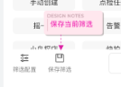

- 原代码：

  - ```
     <LinearLayout
            android:id="@+id/problem_filter_bottom_layout"
            android:layout_width="match_parent"
            android:layout_height="wrap_content"
            android:layout_alignParentBottom="true"
            android:paddingTop="@dimen/dp_7"
            android:paddingBottom="@dimen/dp_7"
            android:paddingLeft="@dimen/dp_16"
            android:paddingRight="@dimen/dp_16">
            <LinearLayout
                android:id="@+id/ll_modify"
                android:layout_width="wrap_content"
                android:layout_height="wrap_content"
                android:orientation="vertical"
                android:gravity="center">
                <ImageView
                    android:id="@+id/modify_iv"
                    android:layout_width="wrap_content"
                    android:layout_height="wrap_content"
                    android:layout_gravity="center"
                    android:padding="@dimen/dp_5"
                    android:src="@drawable/ico_configure_min" />
                <TextView
                    android:id="@+id/modify_tv"
                    android:layout_width="wrap_content"
                    android:layout_height="wrap_content"
                    android:layout_gravity="center_horizontal"
                    android:text="@string/filter_setting_title"
                    android:textColor="@color/color_FF7F7F7F"
                    android:textSize="@dimen/sp_10" />
            </LinearLayout>
      
            <com.ovopark.widget.BorderTextView
                android:id="@+id/problem_filter_reset"
                android:layout_width="@dimen/dp_84"
                android:layout_height="wrap_content"
                android:layout_marginLeft="@dimen/dp_80"
                android:gravity="center"
                android:text="@string/problem_reset"
                android:textColor="@color/main_text_black_color"
                android:textSize="@dimen/medium_text"
                app:contentBackColor="@color/transparent"
                app:strokeWidth="@dimen/dp_1"
                app:strokeColor="@color/color_FFE5E5E5"
                app:cornerRadius="@dimen/dp_6"
                android:paddingTop="@dimen/dp_7"
                android:paddingBottom="@dimen/dp_7"/>
      
            <com.ovopark.widget.BorderTextView
                android:id="@+id/problem_filter_commit"
                android:layout_width="@dimen/dp_84"
                android:layout_height="wrap_content"
                android:gravity="center"
                android:text="@string/confirm"
                android:textColor="@color/white"
                android:textSize="@dimen/medium_text"
                android:layout_marginLeft="@dimen/dp_12"
                app:contentBackColor="@color/main_text_yellow_color"
                app:strokeWidth="@dimen/dp_1"
                app:strokeColor="@color/color_FFE5E5E5"
                app:cornerRadius="@dimen/dp_6"
                android:paddingTop="@dimen/dp_7"
                android:paddingBottom="@dimen/dp_7"/>
        </LinearLayout>
     ```


        <com.ovopark.widget.recycleview.MaxHeightRecyclerView
            android:id="@+id/problem_filter_recyclerview"
            android:layout_width="match_parent"
            android:layout_height="match_parent"
            android:layout_above="@id/problem_filter_bottom_layout"
            android:layout_below="@id/ll_layout"
            android:layout_marginBottom="0dp"
            android:background="@color/white"
            android:paddingLeft="@dimen/dp_3"
            android:paddingTop="@dimen/dp_10"
            android:paddingRight="@dimen/dp_12"
            android:paddingBottom="@dimen/dp_15" />
    ```
      
    ```

- 修改预案：

  - 方法一：采用LinearLayout包裹筛选配置和保存筛选，通过权重进行分割。
    - 优点：符合代办单中的视图逻辑，两个作为一个整体，只需要考虑外部的布局，内部直接通过权重划分
      - 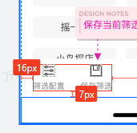
    - 缺点：增加视图层级，点击事件要多走一层，绘制也要多走一层，降低了整体性能，视图优化有一个就是尽量降低视图层级，扁平化视图。
  - 方法二：保存筛选单独做一个LinearLayout，通过marginLeft和筛选配置分割。
    - 优点：
      - **减少视图层级**：相比方法一减少一层`ViewGroup`，测量，布局和点击事件的效率都有所上升，同时也避免父容器的中间层事件拦截。
      - 保存功能与筛选配置解耦，后续修改`marginLeft`即可调整间距，无需调整权重
    - 缺点：性能仍然是嵌套布局。并且比较老，没有使用上现代化的工具。
  - 方法三：采用新式的ConstraintLayout布局，重构底部导航栏的布局结构
    - 优点：通过链式约束（Chain）替代嵌套，减少层级至1层。app:layout_constraintHorizontal_bias可动态控制间距比例，无需硬编码marginLeft
    - 缺点：重构布局，可能导致代码评审风险与其他未知错误，可能还需要同步更新单元测试

- 修改方案：作为新人，应尽量避免代码重构，减少风险，同时写出高性能代码。综合考虑，采用方法二。方法三留档，后续熟悉后可以重构优化。

- 实际操作：

  - xml布局中新增如下：采用dp，而非px

    - ```
      <LinearLayout
                  android:id="@+id/ll_save"
                  android:layout_width="wrap_content"
                  android:layout_height="wrap_content"
                  android:orientation="vertical"
                  android:gravity="center"
                  android:layout_marginLeft="@dimen/dp_17">
                  <ImageView
                      android:id="@+id/save_iv"
                      android:layout_width="wrap_content"
                      android:layout_height="wrap_content"
                      android:layout_gravity="center"
                      android:padding="@dimen/dp_5"
                      android:src="@drawable/ico_save_min" />
                  <TextView
                      android:id="@+id/save_tv"
                      android:layout_width="wrap_content"
                      android:layout_height="wrap_content"
                      android:layout_gravity="center_horizontal"
                      android:text="@string/save_setting_title"
                      android:textColor="@color/color_FF7F7F7F"
                      android:textSize="@dimen/sp_10" />
              </LinearLayout>
      ```

  - 从UI提供的网址下载对应的webp图片，存放到res中

  - 在string中增加对应的文字。

- 实际结果：小米8，Android10

  - 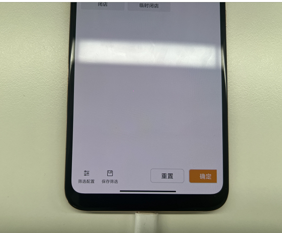

### 3.2 保存筛选点击弹窗逻辑

- 需求图片：

  - 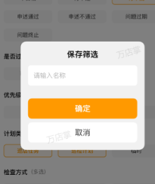

- 修改预案：

  - 方法一：setonTouchListener
    - 优点：触发较快，考量事件分发机制，我们再dispatchTouchEvent的时候，我们会优先监听是否有onTouchListen并执行，其响应速度甚至优先于onTouchEvent
    - 缺点：触发频率高，每次MotionEvent事件到来，无论类型是Down，up都会触发，性能损耗较大。
  - 方法二：参考筛选配置的点击逻辑，针对iv_save添加onClickListener。
    - 优点：触发频率低，性能消耗小。
    - 缺点：触发慢于setonTouchListener，会在Up事件时触发。
  - 方法三：优化方法二，iv_save属于ll_save，是他的子视图。考量ll_save，其包含iv和tv，tv无需修改，也不需要点击事件，也就是iv和tv无需分别维护一个点击事件，因此我们可以针对ll_save添加onClickListener。
    - 优点：相对于方法二，点击事件的分发和处理层级更高了一层，性能有一定优化。

- 提问：

  - 是否要增加防抖控制：避免快速重复点击导致的多次弹窗？
  - 我的弹窗逻辑该如何写？参考哪些地方？

- 解答：

  - 防抖：如果采用：

    - ```
      //保存筛选逻辑
      binding.llSave.setOnClickListener {
          if (!CommonUtils.isFastRepeatClick(600)) { // 设置防抖间隔
              // 实际业务逻辑
              showToast("点击生效")
          }
      }
      
      @JvmStatic
      fun isFastRepeatClick(duration: Long): Boolean {
              val time = System.currentTimeMillis()
              val deltaTime = time - lastClickTime
              if (0 < deltaTime && deltaTime < duration) {
                  return true
              }
              lastClickTime = time
              return false
          }
      ```

    - 通过时间戳差值判断连续点击（`System.currentTimeMillis()`），当两次点击间隔小于`duration`时返回`true`

    - 当两次点击大于这个时间时，返回false，通过！返回true，执行内部弹窗逻辑。

  - 那么解答问题：有必要采用防抖吗？我点击后就会产生弹窗**，连续点击也不会产生连续的弹窗啊。**

  - 现在存在一个问题，要不要做防抖？

  - 弹窗：自己写一个

    - 这不是Toast，是Dialog。这两者有什么区别？
    - **Dialog**：当提示信息是至关重要的，并且必须要由用户做出决定才能继续的时候，使用**Dialog**。 **Toast**：当提示信息只是告知用户某个事情发生了，用户不需要对这个事情做出响应的时候，使用**Toast**。
    - 首页的远程巡店中会有相似的dialog。你可以去看看
    - 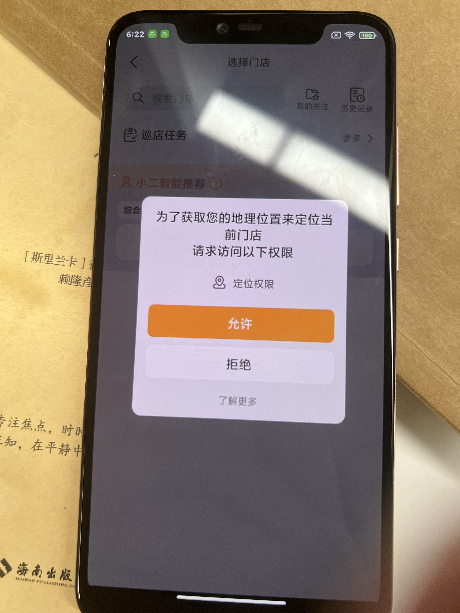
    - TextTitleContentDialog
    - https://juejin.cn/post/6844904197280923655


### 3.3 弹窗显示逻辑

- 需求如下：
  
  - 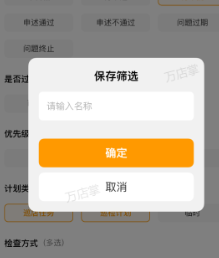
- 选型：PermissionTipsDialog
  
  - 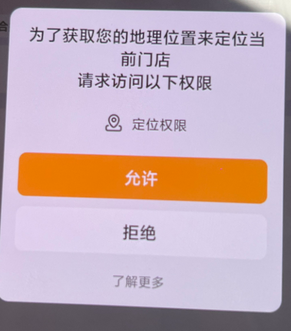
- PermissionTipsDialog视图和代码逻辑分析：
- 修改规划：
  - 给出xml配置文件
  
    - 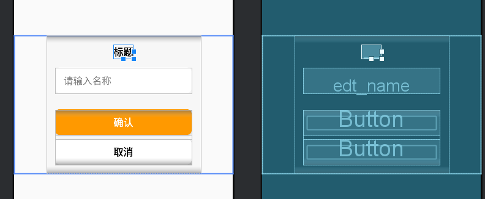
  
    - ```
      <?xml version="1.0" encoding="utf-8"?>
      <FrameLayout xmlns:android="http://schemas.android.com/apk/res/android"
          xmlns:tools="http://schemas.android.com/tools"
          xmlns:wheel="http://schemas.android.com/apk/res-auto"
          android:layout_width="match_parent"
          android:layout_height="wrap_content"
          android:layout_gravity="center"
          android:gravity="center"
          android:orientation="vertical">
      
          <LinearLayout
              android:id="@+id/ll_normalArea"
              android:layout_width="@dimen/alert_width"
              android:layout_height="wrap_content"
              android:layout_gravity="center"
              android:background="@drawable/bg_f7f7f7_radius_12"
              android:gravity="center"
              android:orientation="vertical"
              android:padding="@dimen/dp_15">
      
              <TextView
                  android:id="@+id/tv_tittle"
                  android:layout_width="wrap_content"
                  android:layout_height="wrap_content"
                  android:gravity="center"
                  android:textColor="@color/black"
                  android:textSize="@dimen/sp_17"
                  android:textStyle="bold"
                  tools:text="标题" />
      
              <EditText
                  android:id="@+id/edt_name"
                  android:layout_width="match_parent"
                  android:layout_height="@dimen/dp_44"
                  android:layout_marginTop="@dimen/dp_15"
                  android:background="@drawable/bg_white_radius_8"
                  android:paddingLeft="@dimen/dp_15"
                  android:hint="请输入名称"
                  android:textColorHint="#808080" />
      
              <LinearLayout
                  android:layout_width="match_parent"
                  android:layout_height="wrap_content"
                  android:layout_marginTop="@dimen/dp_28"
                  android:gravity="center"
                  android:orientation="vertical">
      
                  <Button
                      android:id="@+id/btn_confirm"
                      android:layout_width="match_parent"
                      android:layout_height="@dimen/dp_44"
                      android:background="@drawable/circle_bg_orange_r8"
                      android:text="@string/dialog_ok"
                      android:textColor="@color/white"
                      android:textSize="@dimen/sp_17"
                      android:textStyle="bold" />
      
                  <Button
                      android:id="@+id/btn_cancel"
                      android:layout_width="match_parent"
                      android:layout_height="@dimen/dp_44"
                      android:layout_marginTop="@dimen/dp_7"
                      android:background="@drawable/bg_white_radius_8"
                      android:text="@string/cancel"
                      android:textColor="@color/black"
                      android:textSize="@dimen/sp_17"
                      android:textStyle="bold" />
      
              </LinearLayout>
      
          </LinearLayout>
      </FrameLayout>
      ```
  
  - 代码逻辑：
  
    - SaveFilterDialog.kt
  
      - ```
        package com.ovopark.libproblem.widgets
        
        
        import android.app.Dialog
        import android.content.Context
        import android.os.Bundle
        import com.ovopark.libproblem.databinding.DialogSaveFilterBinding
        
        /**
         * Author: panruiqi
         * Time:2025/5/16  15:04
         * Description: 保存筛选弹框
         */
        class SaveFilterDialog(
            context: Context,
            private val onConfirm: (String) -> Unit
        ) : Dialog(context) {
        
            private lateinit var binding: DialogSaveFilterBinding
        
            override fun onCreate(savedInstanceState: Bundle?) {
                super.onCreate(savedInstanceState)
                binding = DialogSaveFilterBinding.inflate(layoutInflater)
                setContentView(binding.root)
        
                setupViews()
            }
        
            private fun setupViews() {
                // 基础UI设置
                binding.tvTittle.text = "保存筛选"
                binding.edtName.hint = "请输入名称"
        
                // 按钮事件
                binding.btnConfirm.setOnClickListener {
                    val input = binding.edtName.text.toString().trim()
                    if (input.isNotEmpty()) {
                        onConfirm(input)
                        dismiss()
                    } else {
                        binding.edtName.error = "名称不能为空"
                    }
                }
        
                binding.btnCancel.setOnClickListener { dismiss() }
            }
        }
        ```
  
      - problemFilterFragment
  
        - ```
          //保存筛选逻辑
          binding.llSave.setOnClickListener {
              SaveFilterDialog(requireContext()){}.apply {
                  setCancelable(false) // 禁止点击外部关闭
                  show()
              }
          }
          ```
  
  - 优化：考量可能存在的问题如下：
  
    - 取消机制：超时取消 + 返回键取消
  
      - 超时取消待议
  
      - 返回键取消：
  
        - ```
          setCancelable(true)
          setCanceledOnTouchOutside(false)
          ```
  
    - 内存泄漏：Dialog 通过requireContext获取到 `Activity` 或 `Fragment` 的 `Context`。如果Dialog没有再在 `Activity` 销毁前手动 `dismiss()`，并且被长期持有（比如静态变量中持有 Dialog），就会导致`Activity` 销毁时，资源被持有引用，无法释放。也就是内存泄漏
  
      - 采用弱引用，同时再onDestroy时去回收资源
  
        - ```
          private val weakContext = WeakReference(context)
          
          dialog?.dismiss()
          dialog = null
          ```
  
    - ANR问题：
  
      - 假设 `onConfirm(input)` 内部做了如下事情：
  
        - ```
          fun onConfirm(name: String) {
              val result = networkRequest(name) // 模拟网络请求
              saveToDatabase(result)            // 模拟数据库操作
          }
          ```
  
      - 如果 `onConfirm` 是一个**耗时操作**，你在主线程里运行它，会导致：
  
        - **界面卡顿**
        - **无响应（ANR）**
        - **用户体验极差**
  
      - 采用协程，使用IO线程进行高效的IO操作，执行完成后切换回来进行UI线程中dismiss操作
  
        - ```
          // 使用协程异步处理耗时任务
          CoroutineScope(Dispatchers.IO).launch {
              onConfirm(input)
              withContext(Dispatchers.Main) {
              	dismiss()
          	}
           }
          ```
  
    - **输入验证**：正则 + 长度校验 + 动态反馈
  
      - 正则校验：
  
        - ```
          val regex = Regex("^[\\u4e00-\\u9fa5a-zA-Z0-9_]{1,20}$")
          
          if (input.matches(regex)) 
          
          binding.edtName.error = "仅支持中文、字母、数字、下划线，最长20字符"
          // 震动反馈
          (weakContext.get()?.getSystemService(Context.VIBRATOR_SERVICE) as? Vibrator)?.vibrate(100)
          // 焦点回到输入框
          binding.edtName.requestFocus()
          binding.edtName.postDelayed({
          	showKeyboard(binding.edtName)
          }, 	200)
          ```
  
      - 长度校验：
  
        - ```
            // 输入长度监听
                  binding.edtName.addTextChangedListener(object : TextWatcher {
                      override fun afterTextChanged(s: Editable?) {
                          s ?: return
                          val maxLength = 20
                          if (s.length > maxLength) {
                              // 删除多余字符（强制回退）
                              s.delete(maxLength, s.length)
                              binding.edtName.error = "最多只能输入 $maxLength 个字符"
                          }
                      }
          ```
  
    - **用户体验**：震动
  
  - ok，解决后新的代码：
  
    - ```
      package com.ovopark.libproblem.widgets
      
      
      import android.app.Dialog
      import android.content.Context
      import android.os.Vibrator
      import android.text.Editable
      import android.text.TextWatcher
      import android.view.LayoutInflater
      import android.view.View
      import android.view.inputmethod.InputMethodManager
      import com.ovopark.libproblem.databinding.DialogSaveFilterBinding
      import kotlinx.coroutines.CoroutineScope
      import kotlinx.coroutines.Dispatchers
      import kotlinx.coroutines.launch
      import kotlinx.coroutines.withContext
      import java.lang.ref.WeakReference
      
      /**
       * Author: panruiqi
       * Time:2025/5/16  15:04
       * Description: 保存筛选弹框
       */
      class SaveFilterDialog(
          context: Context,
          private val onConfirm: (String) -> Unit
      ) : Dialog(context) {
      
          private val binding: DialogSaveFilterBinding = DialogSaveFilterBinding.inflate(LayoutInflater.from(context))
          private val weakContext = WeakReference(context)
      
          init {
              setContentView(binding.root)
              setCancelable(true)
              setCanceledOnTouchOutside(false)
      
              binding.tvTittle.text = "保存筛选"
      
              // 确认按钮监听
              binding.btnConfirm.setOnClickListener {
                  val input = binding.edtName.text.toString().trim()
                  val regex = Regex("^[\\u4e00-\\u9fa5a-zA-Z0-9_]{1,20}$")
      
                  if (input.matches(regex)) {
                      // 使用协程异步处理耗时任务
                      CoroutineScope(Dispatchers.IO).launch {
                          onConfirm(input)
                          withContext(Dispatchers.Main) {
                              dismiss()
                          }
                      }
                  } else {
                      binding.edtName.error = "仅支持中文、字母、数字、下划线，最长20字符"
                      // 震动反馈
                      (weakContext.get()?.getSystemService(Context.VIBRATOR_SERVICE) as? Vibrator)?.vibrate(100)
                      // 焦点回到输入框
                      binding.edtName.requestFocus()
                      binding.edtName.postDelayed({
                          showKeyboard(binding.edtName)
                      }, 200)
                  }
              }
      
              binding.btnCancel.setOnClickListener {
                  dismiss() // 正确关闭对话框
              }
      
              // 输入长度监听
              binding.edtName.addTextChangedListener(object : TextWatcher {
                  override fun afterTextChanged(s: Editable?) {
                      s ?: return
                      val maxLength = 20
                      if (s.length > maxLength) {
                          // 删除多余字符（强制回退）
                          s.delete(maxLength, s.length)
                          binding.edtName.error = "最多只能输入 $maxLength 个字符"
                      }
                  }
      
                  override fun beforeTextChanged(s: CharSequence?, start: Int, count: Int, after: Int) {}
                  override fun onTextChanged(s: CharSequence?, start: Int, before: Int, count: Int) {}
              })
          }
      
          private fun showKeyboard(view: View) {
              val imm = weakContext.get()?.getSystemService(Context.INPUT_METHOD_SERVICE) as? InputMethodManager
              imm?.showSoftInput(view, InputMethodManager.SHOW_IMPLICIT)
          }
      }
      ```
  
    - ```
          override fun onDestroy() {
              dialog?.dismiss()
              dialog = null
              super.onDestroy()
              EventBus.getDefault().unregister(this)
          }
      ```
  
    - ```
          /**
           * 保存配置弹窗
           */
          private var dialog: SaveFilterDialog? = null
      ```
  
  - 存在的问题：
  
    - 
    - 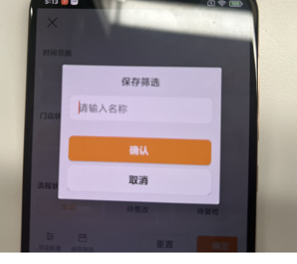
    - 外侧LinearLayout的圆角
    - 请输入名字的颜色
    - 保存筛选加粗
    - 取消按钮四个角有阴影
    - 可能需要自定义View，CardView或使用BorderTextView

### 3.5 保存筛选获取数据并调用接口的逻辑

- 现在接口调用逻辑在	ProblemThreeSelectDelegate 位置

- 两个Fragment之间通过接口实现调用吧

  - 接口：

    - ```
      // 定义接口：用于将保存的配置传递给 主Fragment，再由 主Fragment 转发到目标 Fragment
      interface FilterConfigListener {
          fun onConfigSaved(configName: String, selectedNames: List<String>)
      }
      ```

  - MainFragment中实现接口

    - ```
      class ProblemWorkBenchFragment : BaseChangeFragment(), FilterConfigListener {
      	// 目标 Fragment 的引用
          private var targetFragment: TargetFragment? = null
      
          override fun onConfigSaved(configName: String, selectedNames: List<String>) {
              // 转发数据到目标 Fragment
              targetFragment = supportFragmentManager.findFragmentByTag("TargetFragment") as? TargetFragment
              targetFragment?.updateConfig(configName, selectedNames)
          }
      }
      ```

  - 源Fragment，也就是调用保存筛选按钮的Fragment

    - ```
      //和主Fragment通信的接口实例
      private var filterConfigListener: FilterConfigListener? = null
      
      
      // 保存当前筛选结果的引用（需根据你的实际代码获取）
      private lateinit var currentFilterResult: ProblemFilterResult
      // 保存所有配置的集合（Key=配置名称，Value=选中的筛选项name列表）
      private val savedConfigs = mutableMapOf<String, List<String>>()
      
      
      override fun onAttach(context: Context) {
              super.onAttach(context)
              // 绑定 MainFragment 的接口实现
              filterConfigListener = context as? FilterConfigListener
          }
      
      //保存筛选
      binding.llSave.setOnClickListener {
      	dialog = SaveFilterDialog(requireContext()) { inputName ->
               handleSaveFilter(inputName) （这里不应该放在协程里面处理）
      	}
      	dialog?.show()
      }
      
          // 处理保存逻辑
          private fun handleSaveFilter(configName: String) {
              // 获取当前选中的筛选项 name 列表
              val selectedNames = currentFilterResult.list
                  .filter { it.isChecked && !it.name.isNullOrEmpty() }
                  .map { it.name!! }
      
              // 保存到内存（可扩展为数据库）
              savedConfigs[configName] = selectedNames
      
              // 通知目标 Fragment 更新 UI
             filterConfigListener?.onConfigSaved(configName, selectedNames)
          }
      
      
      override fun onDetach() {
          super.onDetach()
          filterConfigListener = null // 避免内存泄漏
      }
      ```
    
    - 这里我们可以看到，handleSaveFilter(inputName) （这里不应该放在协程里面处理）

    - 它的本质是：接口回调只适合于线程内部通信，不适合线程间通信，那么请问为什么线程内部的Fragment通信方式接口回调不适用于线程间通信？
  
      - 理解一下底层通信原理，接口回调本质是同一个线程内部的虚拟机栈中当前再执行的方法去调用另一个方法。这个方法的上下文都在当前线程里面。如果是不同线程，他们不共用虚拟机栈。
      - 说的有点抽象，我想想怎么可以更好的解释。
      - 这样，我们先来理解方法调用的本质：方法依赖于本身的字节码以及参数，他们分别是私有和公有的。
        - **方法区共享**：所有线程共享 JVM 的方法区，接口方法的字节码存储在方法区中。
        - **虚拟机栈私有**：每个线程有自己的虚拟机栈，存储方法调用的栈帧（局部变量、操作数栈、动态链接等）。
      - 那么线程内部接口调用的过程是什么：
        - **获取方法地址**：通过虚方法表（vtable）或接口方法表（itable）找到方法在方法区中的地址。
        - **压入当前栈帧**：将方法的参数和返回地址压入当前线程的虚拟机栈。
        - **执行上下文**：方法执行时，直接访问当前线程的栈帧中的局部变量和 `this` 引用（隐式参数）。
      - ok，现在来回答为什么线程内部的Fragment通信方式接口回调不适用于线程间通信？
        - **虚拟机栈私有性**：不同线程有自己的虚拟机栈，他们的栈帧完全隔离，后台线程无法直接访问主线程的栈帧（如 UI 组件的引用）。
        - **上下文丢失**：若接口方法依赖主线程的上下文（如更新 `TextView`），在后台线程调用时会因缺少主线程的 `Looper` 和消息队列而崩溃。
  
  - 目标Fragment接收数据并更新UI
  
    - ```
      // 目标 Fragment（例如 SavedConfigFragment.kt）
      class SavedConfigFragment : Fragment() {
          // 保存配置的集合
          private val configs = mutableMapOf<String, List<String>>()
      
          // 提供给 Activity 调用的更新方法
        fun updateConfig(configName: String, selectedNames: List<String>) {
              configs[configName] = selectedNames
              refreshRecyclerView()
          }
      
          private fun refreshRecyclerView() {
              binding.recyclerView.adapter = ConfigAdapter(configs.toList()).apply {
                  // 点击项可删除配置（可选）
                  setOnItemClickListener { position ->
                      val configName = configs.keys.elementAt(position)
                      configs.remove(configName)
                      notifyItemRemoved(position)
                  }
              }
          }
      }
      ```
  
  - 现在就是currentFilterResult数据的获取了。
  
  - 该数据是用于保存点击筛选配置选项的文件，实机去Debug，点击按钮，发现频繁出现一个`ProblemThreeSelectDelegate` 类的日志。
  
  - 去里面查看代码逻辑，内部设置了onItemClick回调，会更新list中被选中项的isChecked的状态。
  
  - list来源于其内部的`getNewList(result.list)`，也就是将原始的 `ProblemFilterResult.list` 转换为适配 `GridSelectLayout` 显示的新列表。
  
  - 那么这个result从哪来？构造方法中有接收这个，我想想，class ProblemFilterFragment : BaseChangeFragment()调用了他
  
    - ```
      selectDelegate =
          ProblemThreeSelectDelegate(mContext, titles, screenWidth, false, false, false, 
      
      
      //刷新适配器
                      adapter?.datas?.clear()
                      adapter?.datas?.addAll(newAllList!!.toList())
                      adapter?.notifyDataSetChanged()
      ```
  
  - 所以他的数据来自于newAllList，那么这个来自于哪？
  
    - ```
      newAllList?.addAll(allList)
      
       allList[getRealPos(6)].timeRange = 30
       
       newAllList?.get(index)!!.list.get(index1).name == mContext.resources.getString(
                                              R.string.text_all
                                          )
      ```
  
  - allList来源：
  
    - ```
      fun getInstance(
                  jsonList: String?,
                  allList: MutableList<ProblemFilterResult>?,
                  titles: List<String>,
                  callback: IProblemActionCallback?
              ): ProblemFilterFragment {
                  val filterFragment = ProblemFilterFragment()
                  filterFragment.jsonList = jsonList
                  filterFragment.allList = allList!!
                  filterFragment.titles = titles
                  filterFragment.callback = callback
                  return filterFragment
              }
      ```
  
  - 谁构造了这个Fragment？
  
    - ProblemWorkBenchFragment中构造：
  
      - ```
        filterFragment = ProblemFilterFragment.getInstance(
                   jsonList,
                   allList,
                   titleList,
                   object : IProblemActionCallback {
                       override fun onCommit() {
                           animateReveal(binding.problemCreateFilterLayout, false)
                           fragments[location].refreshProblemList(
                               createOrder,
                               commonOrder, priorityOrder, expirationOrder, filterFragment!!.allList
                           )
                       }
          
                       override fun onDismiss() {
                           animateReveal(binding.problemCreateFilterLayout, false)
                       }
                   })
        ```
  
    - 那么这个allList和jsonList从哪来？
  
      - ```
        var jsonList = AssetsUtils.loadText(requireContext(), "problem_filter_pending.json")
        val subList: MutableList<ProblemFilterResult> = ArrayList<ProblemFilterResult>()//筛选显示项.
        
         fun loadText(context: Context, assetFielPath: String?): String? {
                var `is`: InputStream? = null
                try {
                    `is` = context.resources.assets.open(assetFielPath!!)
                    return convertStreamToString(`is`)
                } catch (e: IOException) {
                    e.printStackTrace()
                }
                return null
            }
        
        allList = subList
        jsonList = Gson().toJson(subList)
        ```
  
      - ok，jsonList为字符串类型，其实就是将输入流转化为String。
  
      - allList是通过GSON转换而成。
  
      - 所以，目前的一切数据保存在allList中
  
    - 这个Fragment也就是工作台Fragment。其会调用我们当前需要编码的源Fragment。
  
  - 我们要从里面获取数据，该怎么处理？接口暴露？
  
    - 采用接口？假如他要实现后续的逻辑，这里会形成的层级是：爷爷-父亲-孩子，爷爷和孩子之间通信，那么父亲也要实现接口啊。这样很繁琐啊，那通过EventBus？该怎么处理呢？
  
- ok，假如我现在拿到数据了，我该怎么操作呢？

  - 传递引用还是数据呢？或者我在这里重构筛选出合适数据的引用，然后发过去？
  - 传递引用吧，这样不用拷贝耗时，假设拿到的是allList

- 这样操作problemFilterResult要考虑多线程访问的数据安全性问题吗？

  - ```
    data class SelectedInfo(val id: Int, val name: String)
    
    val result = mutableListOf<SelectedInfo>()
    for (item in problemFilterResult.list) {
        if (item.isChecked) {
    		result.add(SelectedInfo(item.id, item.nameId, item.name))    
        }
    }
    ```

  - 我们上锁？不行，UI主线程上锁，你在想什么呢？那么我们该怎么操作这个problemFilterResult

  - ```
    val safeCopy = problemFilterResult.list.toList() // 创建独立副本
    val result = safeCopy
        .filter { it.isChecked }
        .map { SelectedInfo(it.id, it.name) }
    ```

  - 关键问题是：**外部数据在读取期间是否会被其他线程修改**？

  - 从操作逻辑来看，我们点击保存，他会执行这个方法，然后才是dialog的dismiss。这个方法会将数据结果保存并传递，理论上有dialog在前面挡着，不会出现数据安全性问题。那我们直接读取？
  
- 紧急！！！！，不使用Fragment之间的接口通信，使用网络接口通信。

- 那么内部处理，然后使用OkHttp发送？

- 先别慌，找到对应的代码逻辑位置：

  - 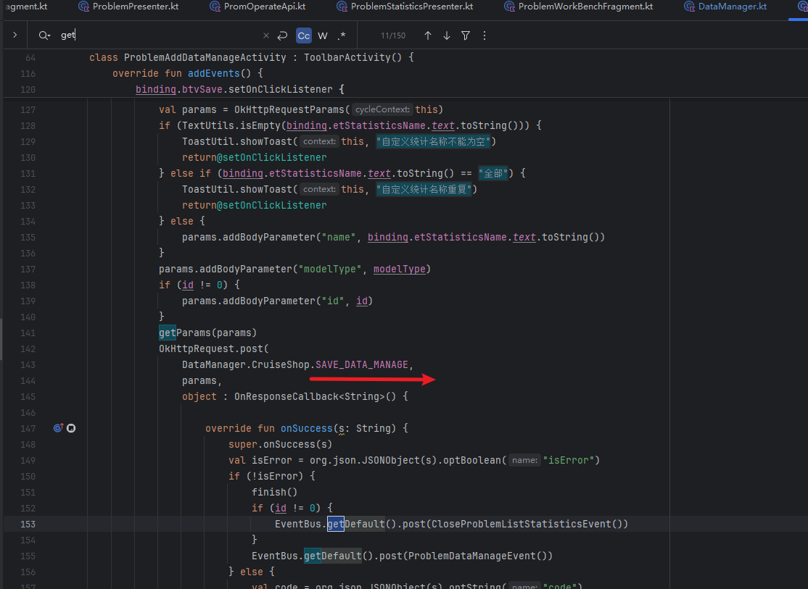
  - 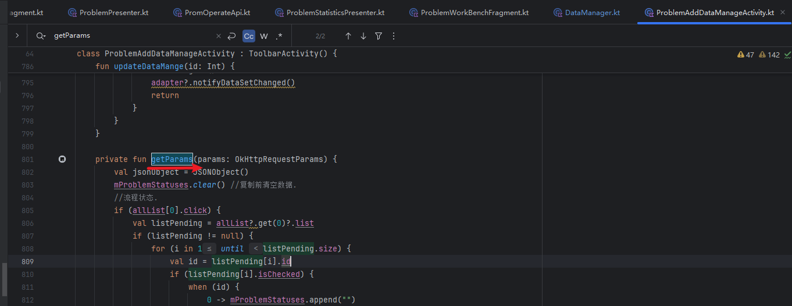

- 代码逻辑可以优化啊，算了，先完成需求，再考虑优化。

### 3.4 数据管理中子条目视图逻辑修改

- 需求图片：其实就是筛选条件不一样，拿全部的。带个30天的参数。
  - 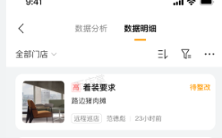
- 情况对比分析：
  - 当前的子条目视图逻辑：
  - 
  - 需要更改为：ItemProblemChangeOBinding
    - 
  - 存在的问题：
    - 两者元素存在很多差异，数据从哪里拿？，通过 Presenter？借助requestDataRefresh？

- 确定和取消去掉数据库的接口，自定义Dialog


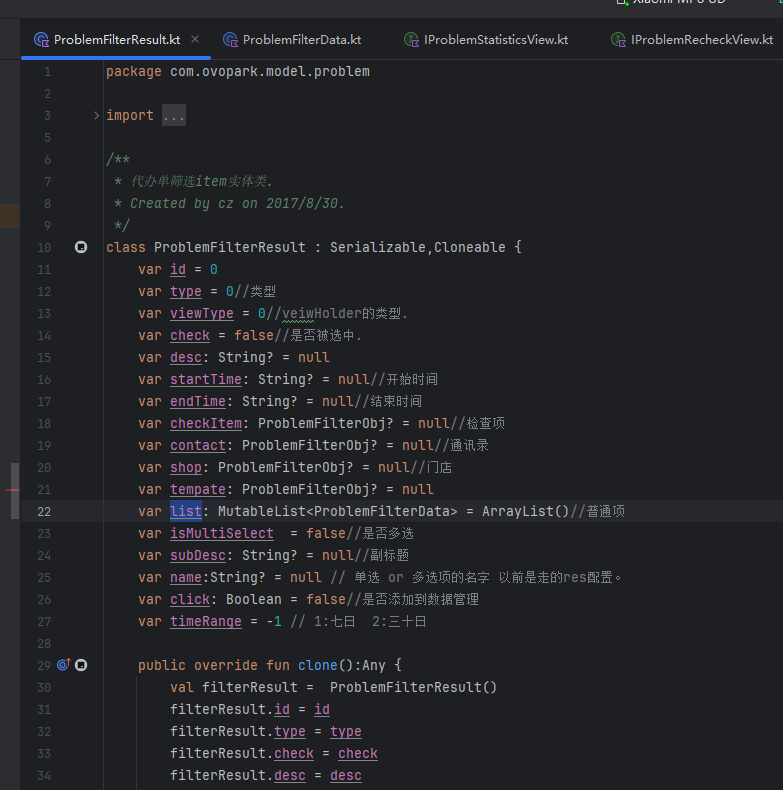

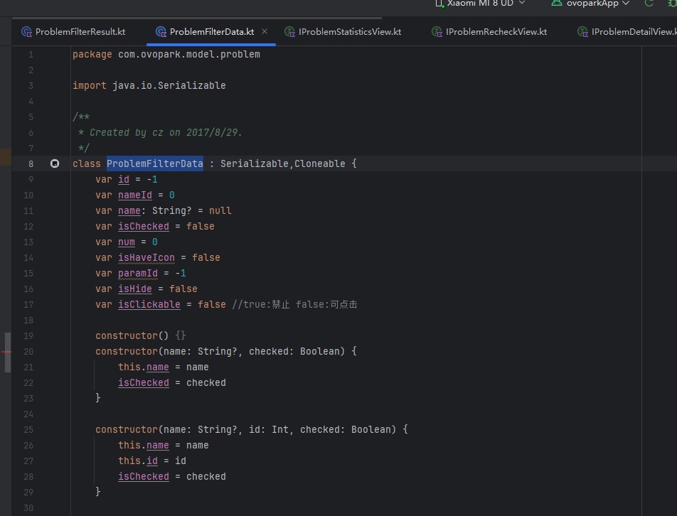

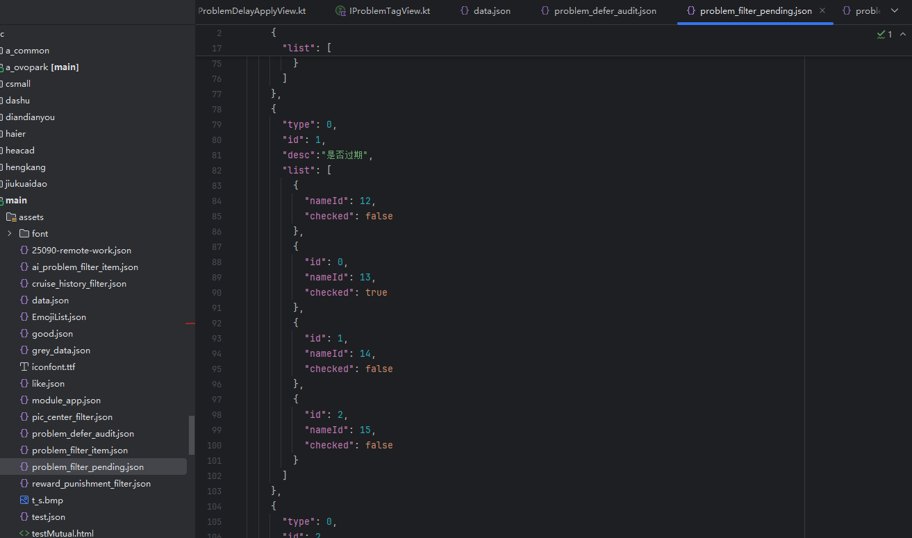


