[toc]

## 01. 环境配置所遇问题

### 1.1 Missing DX

- 现象描述

  - ```
    Build-tool 31.0.0 is missing DX at /Users/lijunde/Library/Android/sdk/build-tools/31.0.0/dx
    ```

  - 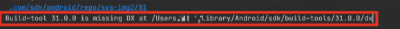

- 错误原因：缺少DX文件。

- 解决方法：

  - 方法一：参照StackOverflow的解决方案，31.0.0版本的构建工具缺少了"dx"和"dx.jar"这两文件，正确的做法就是复制对应路径的"d8"和"d8.jar"这两文件创建副本，并分别改名为"dx"和"dx.jar"
    - 目录参照图片
    - 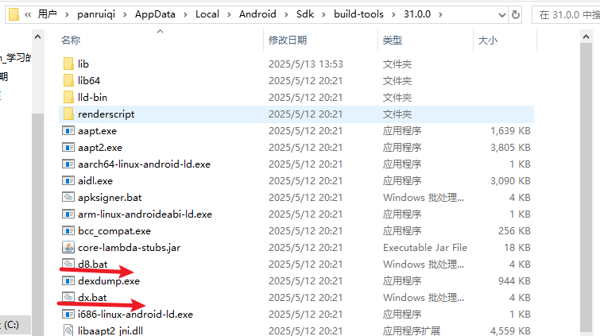
    - 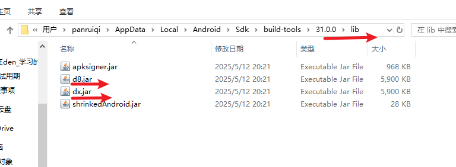

### 1.2 导包，下载文件过程中总是莫名的失败

- 现象分析：查看自身设备配置，内存24GB，下载过程中内存使用率达到90%以上。
- 可能的原因：内存占用过多，系统守护进程一定程度去杀死内存数据，导致下载失败。
- 解决方法：
  - 方法一：采用占用内存较少但是执行较慢的JDK版本
    - 去setting中配置，Azul和Amazon的都可以。
    - 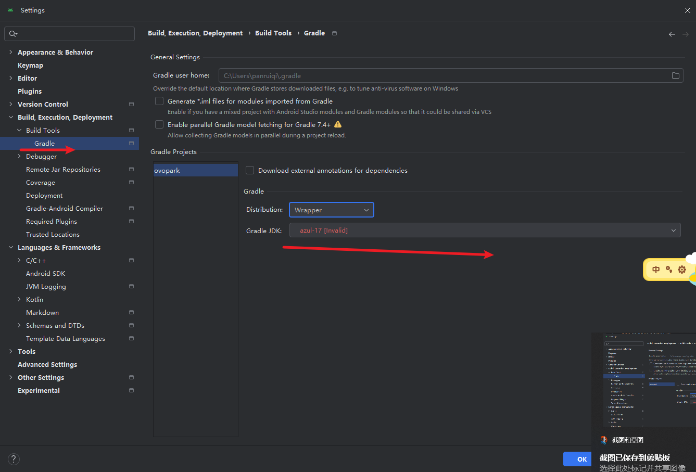
    - 
  - 方法二：换个好点的电脑

### 1.3 下载速度过慢

- 现象分析：下载速度过慢，使用speedtest自测，网速30Mb/S
  - 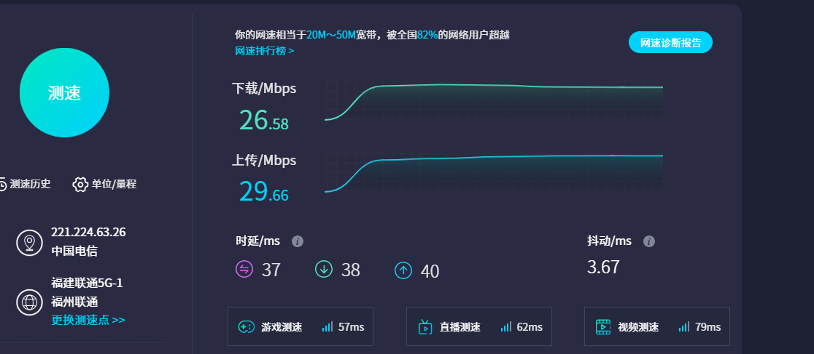
- 可能的原因：单纯是被限速了。
- 解决方法：
  - 连手机wifi；
  - 高级的Android机，可以通过usb wifi进行数据传输。
  - 或者和运维沟通，看看他们能不能给你放开网速限制，这个要刷脸的。

### 1.4 Variants问题

- 切记：编译时要选择variants版本
- 解决方案：
  - Debug的时候选择ovoparkCommonDebug版本，发布时选择release版本。
  - 
  - 其影响的是：配置文件中的项目的一些配置。

### 1.5 Echo本地回环无法connect

- 现象描述：访问127.0.0.1时，发现无法connection。也就是本地回环失败。
- 可能的原因：开了VPN。
- 解决方案：关闭VPN，重启Android Studio。

### 1.6 Android SDK问题

- 记得使用Android SDK 14，使用SDK Manager管理
  - 以后要是有需要的版本，还需要预安装SDK Platform，
  - 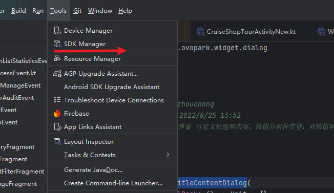
  - 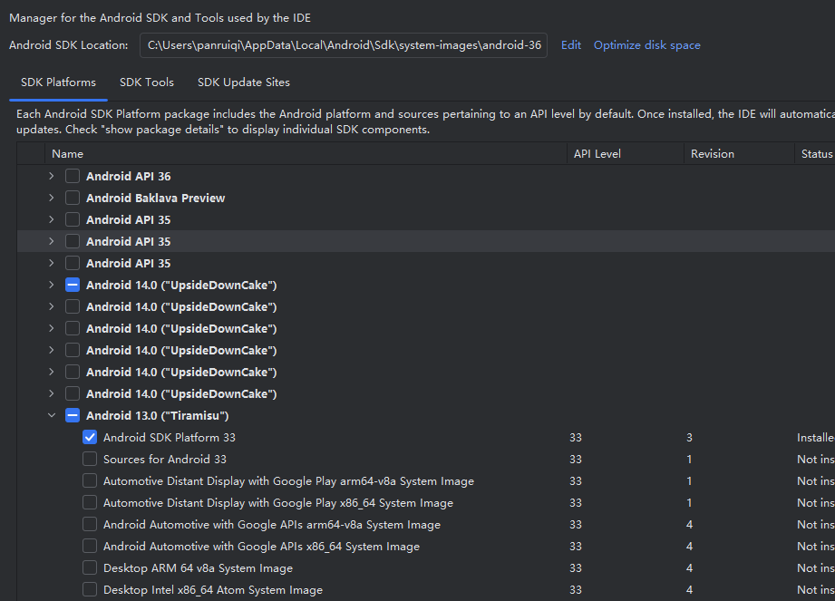

### 1.7 Build Tools 31.0.0 错误，请移除并重装

- 现象描述：

  - 

  - ```
    Could not determine the dependencies of task ':lib_stickyrecyclerview:generateDebugRFile'.
    > Installed Build Tools revision 31.0.0 is corrupted. Remove and install again using the SDK Manager.
    ```

- 可能的原因：复杂的问题，多种可能的情况。

- 解决方法：

  - 方法一：重装，这个未起到效果，只能提供我之前的解决过程，供您分析

    - 初步判断是**Build Tools 31.0.0 文件损坏或缺失关键组件**，我重新安装了他，但是仍然是相同的结果

    - 清除Gradle缓存，采用 `del /s /q "%USERPROFILE%\.gradle\caches" `命令。仍是相同的结果。

    - 我去对应的lib_stickyrecyclerview模块的build.gradle文件中查看对应的buildtool版本，符合期望的版本

      - 
      - 

    - 我暂时移除掉这个lib_stickyrecyclerview模块，其他模块也报同样的错误，因此判断是整体范围上的问题，而非单个模块。

      - ```
        Could not determine the dependencies of task ':lib_edit:generateDebugRFile'.
        ```

    - 使用./gradlew --stacktrace查看gradle堆栈信息

      - ```
        Welcome to Gradle 7.3.3!
        
        Here are the highlights of this release:
         - Easily declare new test suites in Java projects
         - Support for Java 17
         - Support for Scala 3
        
        For more details see https://docs.gradle.org/7.3.3/release-notes.html
        
        Starting a Gradle Daemon, 1 incompatible and 3 stopped Daemons could not be reused, use --status for details
        
        FAILURE: Build failed with an exception.
        
        * What went wrong:
        Unable to start the daemon process.
        This problem might be caused by incorrect configuration of the daemon.
        For example, an unrecognized jvm option is used.
        Please refer to the User Manual chapter on the daemon at https://docs.gradle.org/7.3.3/userguide/gradle_daemon.html
        Process command line: C:\Program Files\Java\jdk1.8.0_152\bin\java.exe -XX:+HeapDumpOnOutOfMemoryError --add-exports=java.base/sun.nio.ch=ALL-UNNAMED --add-opens=java.base/java.lang=ALL-UNNAMED --add-opens=java.base/java.lang.ref
        lect=ALL-UNNAMED --add-opens=java.base/java.io=ALL-UNNAMED --add-exports=jdk.unsupported/sun.misc=ALL-UNNAMED -Xmx8096m -Dfile.encoding=UTF-8 -Duser.country=CN -Duser.language=zh -Duser.variant -cp C:\Users\panruiqi\.gradle\wrapper\dists\gradle-7.3.3-bin\6a41zxkdtcxs8rphpq6y0069z\gradle-7.3.3\lib\gradle-launcher-7.3.3.jar org.gradle.launcher.daemon.bootstrap.GradleDaemon 7.3.3
        Please read the following process output to find out more:
        -----------------------
        Error: Could not create the Java Virtual Machine.
        Error: A fatal exception has occurred. Program will exit.
        Unrecognized option: --add-exports=java.base/sun.nio.ch=ALL-UNNAMED
        
        
        * Try:
        > Run with --info or --debug option to get more log output.
        > Run with --scan to get full insights.
        
        * Exception is:
        org.gradle.api.GradleException: Unable to start the daemon process.
        This problem might be caused by incorrect configuration of the daemon.
        For example, an unrecognized jvm option is used.
        Please refer to the User Manual chapter on the daemon at https://docs.gradle.org/7.3.3/userguide/gradle_daemon.html
        Process command line: C:\Program Files\Java\jdk1.8.0_152\bin\java.exe -XX:+HeapDumpOnOutOfMemoryError --add-exports=java.base/sun.nio.ch=ALL-UNNAMED --add-opens=java.base/java.lang=ALL-UNNAMED --add-opens=java.base/java.lang.ref
        lect=ALL-UNNAMED --add-opens=java.base/java.io=ALL-UNNAMED --add-exports=jdk.unsupported/sun.misc=ALL-UNNAMED -Xmx8096m -Dfile.encoding=UTF-8 -Duser.country=CN -Duser.language=zh -Duser.variant -cp C:\Users\panruiqi\.gradle\wrapper\dists\gradle-7.3.3-bin\6a41zxkdtcxs8rphpq6y0069z\gradle-7.3.3\lib\gradle-launcher-7.3.3.jar org.gradle.launcher.daemon.bootstrap.GradleDaemon 7.3.3
        Please read the following process output to find out more:
        -----------------------
        Error: Could not create the Java Virtual Machine.
        Error: A fatal exception has occurred. Program will exit.
        Unrecognized option: --add-exports=java.base/sun.nio.ch=ALL-UNNAMED
        
                at org.gradle.launcher.daemon.client.DaemonGreeter.parseDaemonOutput(DaemonGreeter.java:38)
                at org.gradle.launcher.daemon.client.DefaultDaemonStarter.startProcess(DefaultDaemonStarter.java:181)
                at org.gradle.launcher.daemon.client.DefaultDaemonStarter.startDaemon(DefaultDaemonStarter.java:137)
                at org.gradle.launcher.daemon.client.DefaultDaemonConnector.doStartDaemon(DefaultDaemonConnector.java:222)
                at org.gradle.launcher.daemon.client.DefaultDaemonConnector.startDaemon(DefaultDaemonConnector.java:216)
                at org.gradle.launcher.daemon.client.DaemonClient.execute(DaemonClient.java:164)
                at org.gradle.launcher.daemon.client.DaemonClient.execute(DaemonClient.java:99)
                at org.gradle.launcher.cli.RunBuildAction.run(RunBuildAction.java:57)
                at org.gradle.internal.Actions$RunnableActionAdapter.execute(Actions.java:210)
                at org.gradle.launcher.cli.DefaultCommandLineActionFactory$ParseAndBuildAction.execute(DefaultCommandLineActionFactory.java:275)
                at org.gradle.launcher.cli.DefaultCommandLineActionFactory$ParseAndBuildAction.execute(DefaultCommandLineActionFactory.java:247)
                at org.gradle.launcher.cli.DebugLoggerWarningAction.execute(DebugLoggerWarningAction.java:82)
                at org.gradle.launcher.cli.DebugLoggerWarningAction.execute(DebugLoggerWarningAction.java:30)
                at org.gradle.launcher.cli.WelcomeMessageAction.execute(WelcomeMessageAction.java:92)
                at org.gradle.launcher.cli.WelcomeMessageAction.execute(WelcomeMessageAction.java:38)
                at org.gradle.launcher.cli.NativeServicesInitializingAction.execute(NativeServicesInitializingAction.java:44)
                at org.gradle.launcher.cli.NativeServicesInitializingAction.execute(NativeServicesInitializingAction.java:26)
                at org.gradle.launcher.cli.ExceptionReportingAction.execute(ExceptionReportingAction.java:41)
                at org.gradle.launcher.cli.ExceptionReportingAction.execute(ExceptionReportingAction.java:26)
                at org.gradle.launcher.cli.DefaultCommandLineActionFactory$WithLogging.execute(DefaultCommandLineActionFactory.java:240)
                at org.gradle.launcher.Main.doAction(Main.java:35)
                at org.gradle.launcher.bootstrap.EntryPoint.run(EntryPoint.java:50)
                at sun.reflect.NativeMethodAccessorImpl.invoke0(Native Method)
                at sun.reflect.NativeMethodAccessorImpl.invoke(Unknown Source)
                at sun.reflect.DelegatingMethodAccessorImpl.invoke(Unknown Source)
                at java.lang.reflect.Method.invoke(Unknown Source)
                at org.gradle.launcher.bootstrap.ProcessBootstrap.runNoExit(ProcessBootstrap.java:60)
                at org.gradle.launcher.bootstrap.ProcessBootstrap.run(ProcessBootstrap.java:37)
                at org.gradle.launcher.GradleMain.main(GradleMain.java:31)
                at sun.reflect.NativeMethodAccessorImpl.invoke0(Native Method)
                at sun.reflect.NativeMethodAccessorImpl.invoke(Unknown Source)
                at sun.reflect.DelegatingMethodAccessorImpl.invoke(Unknown Source)
                at java.lang.reflect.Method.invoke(Unknown Source)
                at org.gradle.wrapper.BootstrapMainStarter.start(BootstrapMainStarter.java:30)
                at org.gradle.wrapper.WrapperExecutor.execute(WrapperExecutor.java:129)
                at org.gradle.wrapper.GradleWrapperMain.main(GradleWrapperMain.java:61)
        
        
        * Get more help at https://help.gradle.org
        ```

      - 这个错误的核心问题是 **Gradle 7.3.3 与 JDK 1.8 不兼容**。

        ```
        Here are the highlights of this release:
         - Easily declare new test suites in Java projects
         - Support for Java 17
         - Support for Scala 3
        ```

    - 应该是环境配置没有符合要求，重新查看仓库：

      - 开发工具约定 Android Studio Version: 3.0.1 +
      - buildToolsVersion: 25.0.2 
      - Support Library Version: 25.1.1 
      - classpath 'com.android.tools.build:gradle:2.2.3' 
      - minSdkVersion: 15
      - targetSdkVersion: 19
      - compileSdkVersion: 25 
      - Gradle Version: 2.14.1

    - 我的思路：

      - 安装匹配的JDK版本：JDK1.8（已完成）
      - 配置Gradle版本，在 `gradle-wrapper.properties` 中指定 Gradle 2.14.1：（存在困惑，项目里面指定的和README中约定的事不同的版本啊，同时这个Gradle版本太低，已经不支持了）
        - 
        - 
      - 删除本地Gradle缓存
      - Android Studio版本（应该不需要，采用ftp中获取的，理论没问题）
      - 指定SDK版本：sdkmanager "platforms;android-25" 
      - 设置构建工具版本："build-tools;25.0.2"

      - 和导师沟通：采用它的编译环境配置：Android SDK 14，使用SDK Manager管理，Java环境确定是1.8。那么我git拉下来，通过Gradle进行加载，不应该出现问题啊。
        - 还是寄了：
        - 

      - 

  - 方法二：使用JDK17。


### 1.8 虚拟机无法启动

- 现象描述：
  
  - 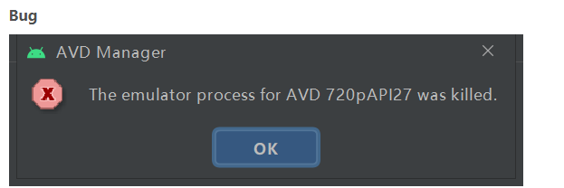
  
- 问题分析：查看Android Studio运行日志
  
  - 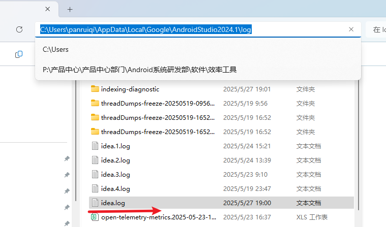
  - 注意这个频繁出现的
  - 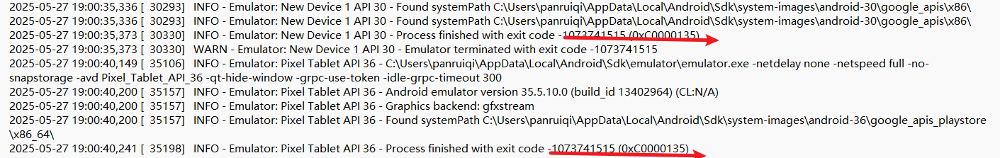
  - 错误代码 -1073741515 (0xC0000135) 在Windows系统中表示"应用程序未能启动，因为找不到所需的DLL文件"。
  
- 原因分析：这是一个Windows系统DLL依赖问题，而不是模拟器配置问题。无论是API 30还是API 36的模拟器都遇到了相同错误，这明确指向系统级别的问题

- 解决方案：安装Visual C++ 可再发行软件包

  - ```
    从Microsoft官网下载并安装最新的Visual C++ Redistributable包：
    https://aka.ms/vs/17/release/vc_redist.x64.exe
    ```

    


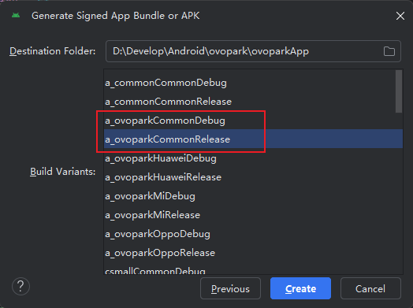

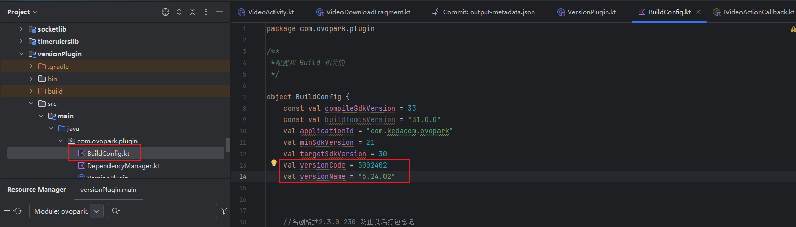