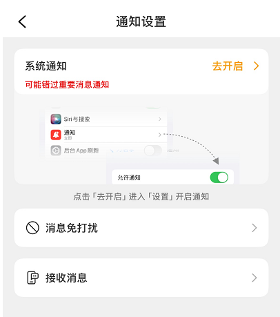
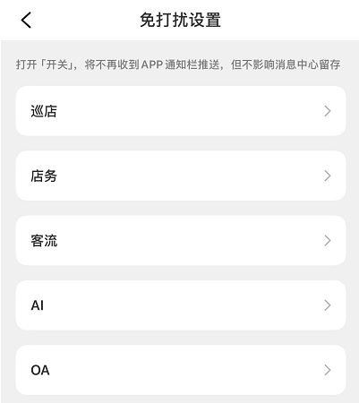
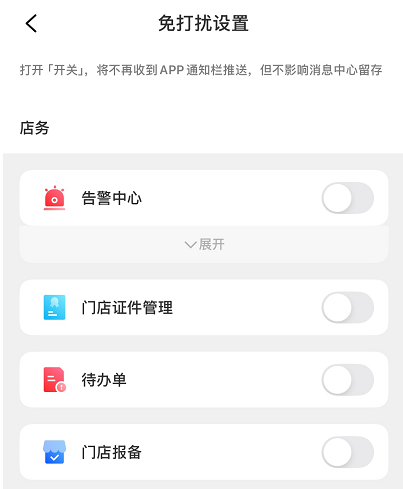
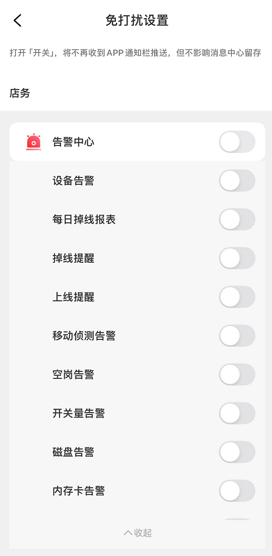
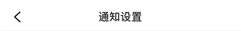
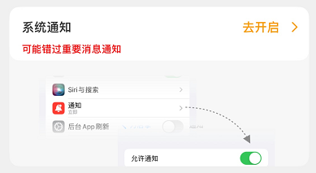
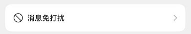

[toc]

## 01.功能概述

- **功能ID**：`FEAT-202506014-001`  

- **功能名称**：设置页UI

- **目标版本**：v0.4.0

- **提交人**：@panruiqi  

- **状态**：

  - [x] ⌛ 设计中 /
  - [ ] ⌛ 开发中 / 
  - [ ] ✅ 已完成 / 
  - [ ] ❌ 已取消  

- **价值评估**：  

  - [ ] ⭐⭐⭐⭐⭐ 核心业务功能  
  - [x] ⭐⭐⭐⭐ 用户体验优化  
  - [ ] ⭐⭐⭐ 辅助功能增强  
  - [ ] ⭐⭐ 技术债务清理  

- **功能描述** 

  - 参考Android中对应通知设置页面的实现，在鸿蒙中实现同样的效果

- UI：

  - 通知设置页

    - 

  - 跳转到的免打扰设置页

    - 

  - 免打扰设置页中子条目对应的页（点击店务）

    - 

  - 展开店务

    - 

    

- UI总结与分析：
  - 很清楚的看到：
    - 通知设置是一个页，免打扰是一个页，他们彼此独立，只存在跳转关系
    - 免打扰是一级页，点击内部子条目后会跳到二级页。二级页中可以展开三级项

## 02.需求分析

### 2.1 用户场景

- **主要场景**：  

  - 

- **边界场景**：  

### 2.2 功能范围

- ✅ 包含：
- ❌ 不包含：


## 03.技术方案

### 3.1 通知设置页

- 实现思路：col为父容器，从上到下有Tittle，card，Text，relativecontainer, relativecontainer
  - Tittle
    - 
    - 可以采用relativecontainer，通知设置水平，垂直居中
    - 左侧一个图片
    - 背景设置为纯白
  - card，这个是最难的
    - 可否一个固定大小的col，background是imag，然后有一个relativelayout？
    - 
    - 应该一个col包裹着，防止内部的视图超出范围
    - 然后一个stack，先设置背景image
    - 然后是一个col包裹上方内容区域，内部一个relativelayout，relativelayout中有：Text系统通知和下方的Text，右侧一个row，包裹去开启和右侧图片。
  - Text直接AlignCenter就行
    - 
  - relativecontainer
    - 
    - imag, Text, Imag

### 3.2 免打扰页（一级页）

- 实现思路：一个col，内部一个Tittle，一个Text，一个List，内部填充对应的MessageItem
  - Tittle，和上面一致
  - Text，无需多言
  - List内部的MessageItem：
    - 一个row，内部一个text，一个Image，Text占据全部即可。
  - 

### 3.2 二级页

- 实现思路：一个col，内部：一个Tittle，一个Text，一个Text，下面一个List

  - 

  - 这个位置可能不是一个text这么简单
    - 

## 04.实现规划

### 4.1 技术选型

- 

### 4.2 核心思路

- 

### 4.2 任务拆解

### 4.3 代码路径

### 4.4 实际实现

### 4.5 难点

- 
- 这个采用一个stack，底层设置图片，上层是包裹自己的内容部分，但是给内容部分设置背景为白色时，覆盖了下方的图片？

## 05.兼容性设计

### 5.1 设备适配

- **屏幕尺寸**：小屏设备折叠布局方案
- **系统版本**：

### 5.2 冲突检查

| 现有功能 | 冲突风险     | 解决方案 |
| :------- | :----------- | :------- |
| 功能A    | 接口参数变更 | 版本隔离 |

## 06.测试方案

### 6.1 核心用例

### 6.2 性能指标

| 指标       | 预期值 | 实测值 |
| :--------- | :----- | :----- |
| 内存增量   | <1MB   | -      |
| 渲染帧率   | >55fps | -      |
| 冷启动延迟 | <100ms | -      |

## 07.发布计划

### 7.1 阶段发布

| 阶段  | 范围     | 验证重点 |
| :---- | :------- | :------- |
| Alpha | 内部测试 | 核心流程 |
| Beta  | 5%用户   | 崩溃率   |
| GA    | 全量用户 | 性能指标 |

### 7.2 回滚方案

- 热修复开关：
- 动态配置：


## 08.文档记录

### 8.1 技术文档

- [架构设计文档](https://xn--gzu811i/)
- [接口API文档](https://xn--gzu811i/)

### 8.2 用户文档

- 功能引导页设计
- 错误代码对照表

### 8.3 监控埋点

```
// analytics_events.json
{
  "new_feature_used": {
    "params": ["screen_size", "os_version"]
  }
}
```

