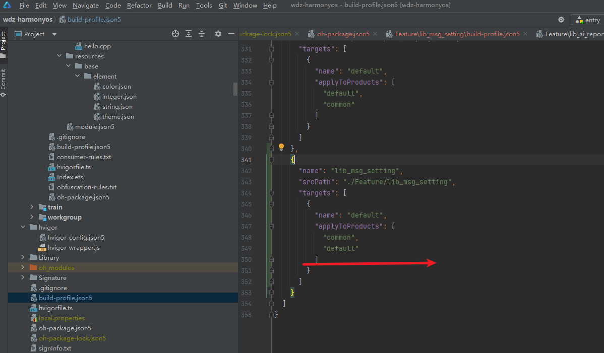

[toc]

## 01.

### 1.1 如何正确配置一个ets并使用？

- 需要有以下几个步骤：

  - **页面组件必须使用 `@Entry` 装饰器**

  -  **确认 `config.json` 中已注册页面路径**

    - 在 `src/main/resources/base/profile/main_pages.json` 中，确保目标页面路径已声明：

    - ```
      {
        "src": [
          "pages/Index",        // 入口页面
          "pages/SystemSettingPage"  // 确保目标页面在此处声明
        ]
      }
      ```

  - 验证RouterMap

    - 在路由映射文件中（如 `router/RouterMap.ets`），检查路径是否一致：

    - ```
      // RouterMap.ets
      export const ROUTER_MAP = {
        INDEX: {
          path: 'pages/Index'
        },
        SYSTEM_SETTING: {
          path: 'pages/SystemSettingPage' // 路径必须与 main_pages.json 完全一致
        }
      }
      ```

### 1.2 新建一个shared module

- 新建一个share module要做什么？

- oh-package.json5中添加common库的依赖

  - 

- build-profile-json5：需要吗？有待商榷

  - 

- RouterUtils.push(RouteMap.MSG_SETTING,undefined,true)

  - 正常的RouterUtils.push(RouteMap.MSG_SETTING)用于模块内部跳转，需要带参跳转

  