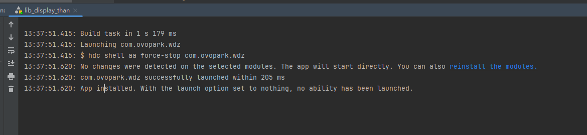
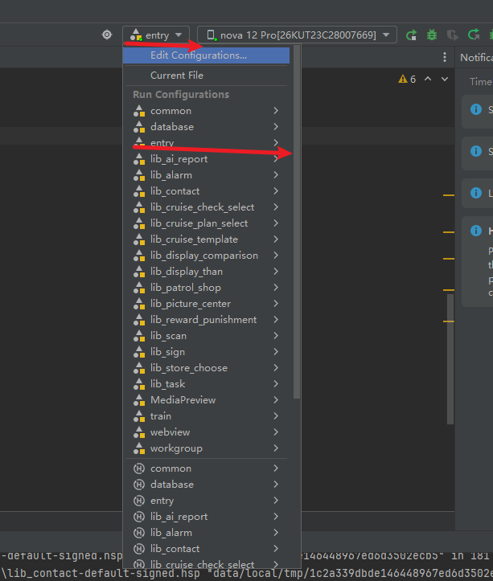

[toc]

## 01.环境配置所遇问题

### 1.1 项目结构需要升级

- 现象描述：

  - ```
  Cause: The project structure and configuration require an upgrade. Solution: 1. Use Migrate Assistant to auto-upgrade the project structure and configuration. 2. Manually upgrade the project structure and configuration by following the instructions.
    ```

- 现象分析：这个错误提示表明你的 **HarmonyOS 项目结构或配置需要升级**

- 解决方法：**使用 Migrate Assistant**，DevEco Studio 提供了 **Migrate Assistant（迁移助手）**，可以自动升级项目配置，操作步骤如下：

  - **打开项目**，在 DevEco Studio 顶部菜单栏选择：
    - **Help > Migrate Assistant**（帮助 > 迁移助手）。
  - **选择需要升级的项目**，点击 **Migrate**（迁移）。
  - **等待自动升级完成**，并按照提示重新同步 Gradle（或 Hvigor）配置。
    - **重新编译项目**，检查是否解决。

### 1.2 找不到实机设备：

- 你需要先做以下的实机配置：https://blog.csdn.net/airyearth/article/details/135197983
- 除此之外，还需要完成以下任务：
  - 任务管理器中结束adb.exe
  - 登录华为：
    - 选择开发工具的“文件”—“Project Structure...”，
    - 打开项目配置选择“Project”—“Signing Configs”—“default”，
    - 点击页面中的“Sign In”按钮跳转到华为开发者登录页面完成登录，并允许开发工具访问回到开发工具，可以修改相关信息，也可以直接默认。
    - 点击“OK”完成配置

### 1.3 项目编译失败：'@Param' can only decorate member property. <ArkTSCheck>

- 分支错误，master分支被玩坏了，切成develop分支

### 1.4 实机上无法启动程序：

- 实机上无法启动程序：
  - 
- 现象分析：没有可以用来启动和登录的页面，你需要从主页面登录
- 解决方法：切换为entry，然后重编译就行
  - 