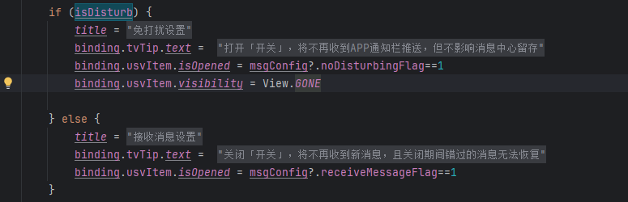

[toc]

- 入口位置：SettingActivity-----MessageSettingActivity.kt

## 01.MessageSettingActivity

### 1.1 视图逻辑

- 蛮容易搞懂的
- 最外层一个NestedScrollView，方便系统通知开启和未开启时显示两种状态(实测采用LinearLayout没啥区别)
  - 内层一个垂直的线性布局。从上到下依次是：
    - 一个RelativeLayout，内部包含ImageView和Text，显示顶部的通知设置
    - 一个CardView
      - 内部一个FrameLayout，背景为一个两种情况的图片
        - 内部一个RelativeLayout
          - 一个TextView，显示系统通知
          - 一个TextView显示可能错过重要信息通知（系统通知未启动时会显示出来）
          - 一个TextView显示已开启或未开启。
    - 一个TextView显示点击去开启的提示，系统通知未启动时会显示出来
    - 一个LinearLayout，包含消息免打扰和接收消息两个LinearLayout
      - 消息免打扰是个水平布局的LinearLyout，包含一个TextView和一个Image，TextView设置了drawLeft为对应图标
  - 

### 1.2 代码逻辑

- addEvents:

  - ```
    override fun addEvents() {
            mBinding.ivBack.setOnClickListener { finish() }
            mBinding.tvNotificationSystem.setOnClickListener {
                NotificationManagerUtils.goToNotificationManager2(this@MessageSettingActivity)
            }
            //消息免打扰
            mBinding.llDisturb.setOnClickListener {
                val bundle = Bundle()
                bundle.putBoolean(Constants.Prefs.TRANSIT_BOOLEAN, true)
                readyGo(ReceiveMessageSettingActivity::class.java,bundle)
            }
            //接收新消息通知
            mBinding.llReceiveMessage.setOnClickListener {
                readyGo(ReceiveMessageSettingActivity::class.java)
            }
        }
    ```

  - | 点击控件                 | 行为描述                                                     |
    | ------------------------ | ------------------------------------------------------------ |
    | **ivBack**               | 直接关闭当前 Activity（`finish()`）                          |
    | **tvNotificationSystem** | 跳转系统通知管理页（`NotificationManagerUtils.goToNotificationManager2`） |
    | **llDisturb**            | 携带参数跳转至消息免打扰设置页（`bundle.putBoolean(TRANSIT_BOOLEAN, true)`） |
    | **llReceiveMessage**     | 无参跳转至接收新消息通知设置页                               |

- initViews：沉浸式状态栏设计

  - ```
    ImmersionBar.with(this)
        .fitsSystemWindows(true)
        .statusBarColor(R.color.back_page)
        .statusBarDarkFont(true)
        .navigationBarColor(R.color.white)
        .navigationBarDarkIcon(true)
        .init()
    
    ```

  - 视觉规范：

    - 状态栏颜色与主界面一致（`R.color.back_page`）
    - 导航栏保持白色背景+深色图标

  - **适配原理**：通过 [ImmersionBar](https://github.com/gyf-dev/ImmersionBar) 库动态修改系统栏属性

- 通知状态动态更新

  - ```
    override fun onResume() {
        super.onResume()
        //系统方法获取是否拥有通知权限
        isOpenNotification = NotificationManagerCompat.from(mContext).areNotificationsEnabled()
        // 根据状态更新UI
        if (isOpenNotification) {
            // 启用状态UI配置
            mBinding.flNotificationStatus.background = ... 
            mBinding.tvLossWarning.visibility = View.GONE
            // 其他元素样式调整
        } else {
            // 禁用状态UI配置
            mBinding.flNotificationStatus.background = ...
            mBinding.tvLossWarning.visibility = View.VISIBLE
        }
    }
```
    
- **关键API**：`NotificationManagerCompat.areNotificationsEnabled()` 检测系统通知总开关
  
- UI策略：
  
    - **启用状态**：隐藏警告提示，使用灰色系降低视觉优先级
    - **禁用状态**：显示黄色警示文字，引导用户操作

## 02. 跳转系统通知管理页

- `NotificationManagerUtils.goToNotificationManager2(this@MessageSettingActivity)`

- 其实就是启动一个系统的Activity：

  - ```
    fun goToNotificationManager2(mContext: Context) {
            val intent = Intent()
            try {
                if (Build.VERSION.SDK_INT >= Build.VERSION_CODES.O) {
                    intent.action = Settings.ACTION_APP_NOTIFICATION_SETTINGS
                    //这种方案适用于 API 26, 即8.0（含8.0）以上可以用
                    intent.putExtra(Settings.EXTRA_APP_PACKAGE, mContext.packageName)
                    intent.putExtra(Settings.EXTRA_CHANNEL_ID, mContext.applicationInfo.uid)
                } else {
                    //这种方案适用于 API21——25，即 5.0——7.1 之间的版本可以使用
                    intent.putExtra("app_package", mContext.packageName)
                    intent.putExtra("app_uid", mContext.applicationInfo.uid)
                }
                mContext.startActivity(intent)
            } catch (e: Exception) {
                intent.action = Settings.ACTION_APPLICATION_DETAILS_SETTINGS
                intent.data = Uri.fromParts("package", mContext.packageName, null)
                mContext.startActivity(intent)
            }
        }
    ```

- 这个应该不用自己写。

## 03.ReceiveMessageSettingActivity_免打扰和消息设置页面

- 消息免打扰和接收消息页面复用这一个页面

- 继承关系：

  - ```
    class ReceiveMessageSettingActivity :
        BaseMvpBindingActivity<IReceviceMessgaeSettingView, ReceviceMessageSettingPresenter, ActivityReceiveMessageSettingBinding>(),
        IReceviceMessgaeSettingView 
    ```

  - 继承自BaseMvpBindingActivity，是MVP结构，对应的View是IReceviceMessgaeSettingView；Presenter是ReceviceMessageSettingPresenter；ViewBinding是ActivityReceiveMessageSettingBinding；

  - 实现了IReceviceMessgaeSettingView接口

### 3.1 视图逻辑：

- 线性垂直布局，包含三个部分，上方的toolbar，中间的TextView，下方的RecyclerView
  - 

- RecyclerView中子条目视图：
  - LinearLayout中一个TextView，一个ImageView
  - 

### 3.2 代码逻辑

- onCreate阶段：先处理当前的onCreate事件，然后调用父类的。

  - ```
        @Override
        protected void onCreate(Bundle savedInstanceState) {
    
            mContext = this;
            presenter = createPresenter();
            getPresenter().attachView((V) this);
            getPresenter().setContext(getApplicationContext());
            getPresenter().created();
    
            Intent intent = getIntent();
            if (intent != null) {
                Bundle bundle = intent.getExtras();
                if (bundle != null) {
                    getIntentData(bundle);
                }
            }
            super.onCreate(savedInstanceState);
        }
    ```

  - 创建Presenter，将其与View关联。然后解析传递的Bundle

  - 这里的getIntentData是如下，获取isDistrub

    - ```
          override fun getIntentData(bundle: Bundle) {
              isDisturb = bundle.getBoolean(Constants.Prefs.TRANSIT_BOOLEAN)
          }
      ```

  - 这个数据来源是MessageSettingActivity

    - ```
      //消息免打扰
      mBinding.llDisturb.setOnClickListener {
          val bundle = Bundle()
          bundle.putBoolean(Constants.Prefs.TRANSIT_BOOLEAN, true)
          readyGo(ReceiveMessageSettingActivity::class.java,bundle)
      }
      //接收新消息通知
      mBinding.llReceiveMessage.setOnClickListener {
          readyGo(ReceiveMessageSettingActivity::class.java)
      }
      ```

    - 他有两个点击事件，复用这一个页面，两者通过传递的Bundle进行区分。

- initView阶段：位于BaseActivity中的onCreate内部

  - 动态界面设置：通过 `isDisturb` 布尔值控制两种显示模式：

  - ```
    if (isDisturb) {
      // 勿扰模式界面
      title = getString(R.string.msg_disturb_setting)
      binding.tvTip.text = getString(R.string.turn_off_notification_bar_no_pushed_message_receive_no_affecte)
    } else {
      // 正常模式界面
      title = getString(R.string.receive_message_setting)
      binding.tvTip.text = getString(R.string.turn_off_no_message_receive_missed_messages_cannot_recovered)
    }
    
    ```

  - RecyclerView配置：创建 `FristMsgSettingAdapter` 并定义点击事件：

  - ```
    adapter = FristMsgSettingAdapter(this) { position ->
      val bundle = Bundle().apply {
        putBoolean(Constants.Prefs.TRANSIT_BOOLEAN, isDisturb)
        putSerializable(Constants.Prefs.TRANSIT_LIST, adapter.mList[position])
      }
      readyGo(SecondReceiveMessageSettingActivity::class.java, bundle)
    }
    ```

- onResume阶段

  - 每次界面可见时，刷新数据

    - ```
      override fun onResume() {
          super.onResume()
          presenter.getUserMessageConfig(this) // 每次界面可见时刷新数据
      }
      ```

  - 数据刷新流程：网络请求获取数据

    - ```
      MessageApi.instance.getMessageCofig(params, object : OnResponseCallback<...>() {
          override fun onSuccess(list) { view?.getMessageConfig(list) }       // 成功
          override fun onSuccessError(code, msg) { view?.getFailureMsg(msg) }// 业务错误
          override fun onFailure(code, msg) { view?.getFailureMsg(msg) }     // 网络错误
      })
      ```

  - 成功时刷新数据：getMessageConfig对应的是这个

    - ```
      public void refreshList(List<T> list) {
          mList.clear();
          mList.addAll(list);
          notifyDataSetChanged(); // 全局刷新
      }
      ```

- 子视图逻辑：

  - mList数据类型：

    - ```
      MessageConfigBean
      ├─ messageTypeId: Int          // 主分类ID
      ├─ name: String                // 分类名称
      ├─ childList: MutableList<Child>  // 子项列表
      └─ 状态标记 (勿扰/接收/重要性)
      
      Child
      ├─ messageTypeId: Int          // 当前项ID
      ├─ parentMessageTypeId: Int    // 父级ID
      ├─ childList: MutableList<Child>?  // 嵌套子项
      └─ 9个业务状态字段
      
      ```

    - ```
      /**
       * 创建人：yaoao
       * 创建日期：2024/6/15.8:27
       * 描述：
       * 修改人：
       * 迭代版本：
       * 迭代说明：
       */
      data class MessageConfigBean(
          val childList: MutableList<Child>,
          val messageTypeId: Int,
          val name: String,
          val noDisturbingFlag: Int,
          val receiveMessageFlag: Int,
          val importanceFlag: Int
      ):java.io.Serializable
      
      data class Child(
          val childList: MutableList<Child>?,
          val importanceFlag: Int,
          val messageTypeId: Int,
          val name: String,
          var noDisturbingFlag: Int,
          val parentMessageTypeId: Int,
          var receiveMessageFlag: Int,
          val topFlag: Int,
          val webMessageOpenFlag: Int,
          val code: String
      ):java.io.Serializable
      ```

  - 点击事件：

    - 传递数据，跳转至二级页面

    - ```
       // 传递当前是否处于勿扰模式的布尔值
       bundle.putBoolean(Constants.Prefs.TRANSIT_BOOLEAN, isDisturb)
       // 从适配器的数据源中按位置索引获取对应数据对象
       bundle.putSerializable(Constants.Prefs.TRANSIT_LIST, adapter.mList[position])
       // 携带参数跳转到新的 Activity
       readyGo(SecondReceiveMessageSettingActivity::class.java, bundle)
      ```


## 04.SecondReceiveMessageSettingActivity二级页面

- 他是消息免打扰和接收消息页面中RecycleView子视图的点击跳转的二级页面。

- 继承关系：

  - ```
    class ReceiveMessageSettingActivity :
        BaseMvpBindingActivity<IReceviceMessgaeSettingView, ReceviceMessageSettingPresenter, ActivityReceiveMessageSettingBinding>(),
        IReceviceMessgaeSettingView 
    ```

  - 继承自BaseMvpBindingActivity，是MVP结构，对应的View是IReceviceMessgaeSettingView；Presenter是ReceviceMessageSettingPresenter；ViewBinding是ActivityReceiveMessageSettingBinding；

  - 实现了IReceviceMessgaeSettingView接口

### 4.1 UI逻辑

- 垂直的线性布局
  - toolBar，显示顶部栏目，感觉不是必须的，可以通过LinearLayout替代。
  - TextView显示打开开关文字
  - RelativeLayout
    - TextView显示AI提醒
    - SwitchView显示单选按钮，他就是全局开关，点击会让子条目都开，再点击会都不开（选择性显示，如果是接收消息的子视图点击，那么会显示。消息免打扰不会显示）
  - RecyclerView存放多个可选项
  - 

### 4.2 代码逻辑

- 爷爷类BaseActivity的onCreate阶段：addEvents和initView（区分先后）

- addEvents：为上层的RelativeLayout的SwitchView显示单选按钮添加点击事件（也就是全局开关）

  - **开关打开时（toggleToOn）**：
    - 设置所有父项和子项的 **免打扰（noDisturbingFlag）** 或 **接收消息（receiveMessageFlag）** 标志为 `1`
    - 更新适配器状态并刷新列表
    - 通过 Presenter 提交配置变更到服务端
  - **开关关闭时（toggleToOff）**：
    - 将上述标志设为 `0`
    - 类似地更新 UI 并提交配置

- initViews：

  - 获取Intent中参数：

    - `isDisturb`：布尔值，决定当前是「免打扰设置」还是「消息接收设置」

    - `msgConfig`：就是上面传进来的mList。

    - ```
      isDisturb = intent.getBooleanExtra(Constants.Prefs.TRANSIT_BOOLEAN, false)
              intent.getSerializableExtra(Constants.Prefs.TRANSIT_LIST)?.let {
                  msgConfig = it as MessageConfigBean
              }
      ```

  - 全局开关初始化：也就是开关的可见性

    - 

  - 适配器配置：

    - ```
      adapter = SecondMsgSettingAdapter(this,isDisturb) {index,messageTypeId, flag,closeSecondParent, closeParent ->
                  if(isDisturb){
                      presenter.updateMessageConfig(this,messageTypeId,flag,null)          
                  }else{
                      presenter.updateMessageConfig(this,messageTypeId,null,flag)
                      if(closeSecondParent){
                          //binding.usvItem.isOpened = false
                          msgConfig?.childList?.get(index)?.messageTypeId?.let {
                              presenter.updateMessageConfig(this,
                                  it,null,0)
                          }
                      }
                      if(closeParent){
                          binding.usvItem.isOpened = false
                          adapter.updateAbleClick(binding.usvItem.isOpened)
                          msgConfig?.messageTypeId?.let {
                              presenter.updateMessageConfig(this,
                                  it,null,0)
                          }
                      }
                  }
      
              }
              binding.recycle.layoutManager = LinearLayoutManager(this)
              binding.recycle.adapter = adapter
              adapter.refreshList(msgConfig?.childList)
              adapter.updateAbleClick(binding.usvItem.isOpened)
      ```

- 子条目视图逻辑：

  - CardView
    - LinearLayout
      - RelativeLayout
        - TextView显示文本
        - UISwitchView显示单选按钮
      - RecyclerView 刚开始隐藏
      - View，显示分割线
      - LinearLayout
        - TextView显示展开文字
        - ImageView显示旁边的图片
  - 

- 子条目代码逻辑：

  - 视图绑定

    - ```
       super.onBindViewHolder(viewHolder, position)
              val holder = viewHolder as ViewHolder
              val bean = list[position]!!
              holder.binding.tvName.text = bean.name
              //holder.binding.recycle.visibility = View.GONE
              holder.binding.tvName.setCompoundDrawablesWithIntrinsicBounds(
                  ContextCompat.getDrawable(mActivity, NewMessageEnum.getDrawable(bean.code)), null, null, null)
              if(isDisturb && bean.code!=NewManagerConfig.OPERATION_ALARM){//告警单独显示三级
                  holder.binding.recycle.visibility = View.GONE
                  holder.binding.viewLine.visibility = View.GONE
                  holder.binding.llState.visibility = View.GONE
              }
      ```

  - 嵌套列表实现：

    - ```
      holder.binding.recycle.layoutManager = LinearLayoutManager(mActivity)
      val adapter = ThreeMsgSettingAdapter(...) // 三级设置适配器
      holder.binding.recycle.adapter = adapter
      adapter.refreshList(bean.childList) // 注入子级数据
      ```

  - 点击事件：

    - 展开点击事件

      - ```
        holder.binding.llState.setOnClickListener {
                    if(holder.binding.recycle.isVisible){
                        holder.binding.recycle.visibility = View.GONE
                        holder.binding.tvState.text = mActivity.getString(R.string.handover_expand)
                        holder.binding.ivState.setImageResource(R.drawable.ico_downarrow_gray)
                    }else{
                        holder.binding.recycle.visibility = View.VISIBLE
                        holder.binding.tvState.text = mActivity.getString(R.string.handover_unexpand)
                        holder.binding.ivState.setImageResource(R.drawable.ico_up_arrow)
                    }
        
                }
        ```

    - 全局按钮点击事件

      - ```
        holder.binding.usvItem.setOnStateChangedListener(object :
                    UISwitchView.OnStateChangedListener {
                    override fun toggleToOn(view: View?) {
                        if(childAbleClick||isDisturb) {
                            holder.binding.usvItem.isOpened = true
                            adapter.mList.forEach {
                                if (isDisturb) it.noDisturbingFlag = 1 else it.receiveMessageFlag = 1
                            }
                            adapter.updateAbleClick(if(isDisturb) !holder.binding.usvItem.isOpened else holder.binding.usvItem.isOpened)
                            adapter.notifyDataSetChanged()
                            callback(position,bean.messageTypeId, 1,false,false)
                        }
                    }
        
                    override fun toggleToOff(view: View?) {
                        if(childAbleClick||isDisturb) {
                            holder.binding.usvItem.isOpened = false
                            adapter.mList.forEach {
                                if (isDisturb) it.noDisturbingFlag = 0 else it.receiveMessageFlag = 0
                            }
                            adapter.updateAbleClick(if(isDisturb) !holder.binding.usvItem.isOpened else holder.binding.usvItem.isOpened)
                            adapter.notifyDataSetChanged()
                            if(isDisturb){
                                bean.noDisturbingFlag = 0
                            }else{
                                bean.receiveMessageFlag = 0
                            }
                            callback(position,bean.messageTypeId, 0,false,allClose())
                        }
                    }
                })
        ```

- 孙子条目视图逻辑：

  - 垂直的LinearLayout
    - RelativeLayout
      - TextView显示：AI提醒
      - SwitchView显示按钮
    - View显示下方的分割线
  - 

- 孙子条目代码逻辑：
  - 视图绑定显示
  - 点击事件