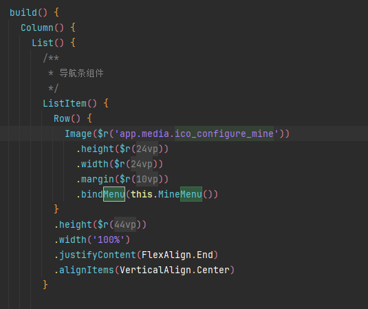

[toc]

## 01.问题

### 1.1 如何找到代码位置

- 现在我怎么找到按钮所在位置呢？

- 点击后显示如下日志：

  - ```
    05-20 14:01:16.529   15515-15620   C02805/com.ovop...InputKeyFlow  com.ovopark.wdz       I     [][OnPointerEvent:216] ac: down: 1054
    05-20 14:01:16.529   15515-15620   C02805/com.ovop...InputKeyFlow  com.ovopark.wdz       I     [P:D:1054][OnPointerEvent:572] id:1054 recv
    05-20 14:01:16.532   15515-15515   C04213/com.ovop...InputKeyFlow  com.ovopark.wdz       I     [] OnInputEvent(86): eid:26,InputId:1054,wid:62,ac:2
    05-20 14:01:16.532   15515-15515   C04219/com.ovo....wdz/WMSDecor  com.ovopark.wdz       W     [] GetDecorHeight(2342): Get app window decor height failed
    05-20 14:01:16.533   15515-15515   C03919/com.ovo...InputTracking  com.ovopark.wdz       I     [(-2:100000:singleton)] pointdown windowId: 62
    05-20 14:01:16.533   15515-15515   C03951/com.ovop...InputKeyFlow  com.ovopark.wdz       I     [(100000:100000:scope)] InputTracking id:1054, fingerId:0, type=0, inject=0, isPrivacyMode=0
    05-20 14:01:16.534   15515-15515   C03951/com.ovop...InputKeyFlow  com.ovopark.wdz       I     [(100000:100000:scope)] InputTracking id:1054, touch test hitted node info: fingerId: 0{ tag: Swiper, depth: 7 };{ tag: List, depth: 15 };
    05-20 14:01:16.534   15515-15515   C03951/com.ovop...InputKeyFlow  com.ovopark.wdz       I     [(100000:100000:scope)] InputTracking id:1054, touch test hitted recognizer type info: 
    05-20 14:01:16.534   15515-15515   C03919/com.ovo...InputTracking  com.ovopark.wdz       I     [(100000:100000:scope)] Hitted recognizer info is empty.
    05-20 14:01:16.534   15515-15515   C03915/com.ovo...wdz/AceSwiper  com.ovopark.wdz       I     [(100000:100000:scope)] Swiper HandleTouchDown
    05-20 14:01:16.535   15515-15515   C03919/com.ovo...InputTracking  com.ovopark.wdz       I     [(100000:100000:scope)] Consumed new event id=1054 in ace_container, lastEventInfo: id:1052
    05-20 14:01:16.535   15515-15515   C04213/com.ovop...InputKeyFlow  com.ovopark.wdz       I     [] ConsumePointerEventInner(906): InputId:1054,wid:62,pointId:0,srcType:2,rect:[0,0,1224,2776],notify:1
    05-20 14:01:16.568   15515-15651   C04500/com.ovo...dz/webadapter  com.ovopark.wdz       I     [display_manager_adapter_impl.cpp:74] refresh rate change is intercepted, previous refresh rate: 60, after: 120
    05-20 14:01:16.592   15515-15620   C02805/com.ovop...InputKeyFlow  com.ovopark.wdz       I     [][OnPointerEvent:216] ac: up: 1055
    05-20 14:01:16.592   15515-15620   C02805/com.ovop...InputKeyFlow  com.ovopark.wdz       I     [P:U:1055][OnPointerEvent:572] id:1055 recv
    05-20 14:01:16.592   15515-15515   C04213/com.ovop...InputKeyFlow  com.ovopark.wdz       I     [] OnInputEvent(86): eid:27,InputId:1055,wid:62,ac:4
    05-20 14:01:16.592   15515-15515   C03951/com.ovop...InputKeyFlow  com.ovopark.wdz       I     [(100000:100000:scope)] InputTracking id:1055, fingerId:0, type=1, inject=0, isPrivacyMode=0
    05-20 14:01:16.592   15515-15515   C03915/com.ovo...wdz/AceSwiper  com.ovopark.wdz       I     [(100000:100000:scope)] Swiper HandleTouchUp
    05-20 14:01:16.593   15515-15515   C03951/com.ovop...InputKeyFlow  com.ovopark.wdz       I     [(100000:100000:scope)] id: 0, log: 
    05-20 14:01:16.593   15515-15515   C03919/com.ovo...InputTracking  com.ovopark.wdz       I     [(100000:100000:scope)] Consumed new event id=1055 in ace_container, lastEventInfo: id:1052
    05-20 14:01:16.593   15515-15515   C04213/com.ovop...InputKeyFlow  com.ovopark.wdz       I     [] ConsumePointerEventInner(906): InputId:1055,wid:62,pointId:0,srcType:2,rect:[0,0,1224,2776],notify:1
    05-20 14:01:16.596   15515-15515   C01406/com.ovo....wdz/OHOS::RS  com.ovopark.wdz       E     FlushImplicitTransaction return, [renderServiceClient_:1, transactionData empty:1]
    05-20 14:01:17.159   15515-15800   C015B0/com.ovo....wdz/NETSTACK  com.ovopark.wdz       E     [epoll_multi_driver.cpp:75] epoll wait event 0 err: 11
    05-20 14:01:17.302   15515-15651   C04500/com.ovo...dz/webadapter  com.ovopark.wdz       I     [display_manager_adapter_impl.cpp:74] refresh rate change is intercepted, previous refresh rate: 120, after: 60
    05-20 14:01:17.398   15515-16977   C02504/com.ovo...wdz/thp_extra  com.ovopark.wdz       I     ThpExtraRunCommand[107]ver:5.0.9 ThpExtraRunCommand, cmd:THP_UpdateViewsLocation, param:thp#Location#979,2560,1224,2776#734,2560,979,2776#489,2560,734,2776#244,2560,490,2776#0,2560,245,2776#909,297,1152,540#1110,182,1191,263
    05-20 14:01:20.634   15515-16375   C015B0/com.ovo....wdz/NETSTACK  com.ovopark.wdz       E     [epoll_multi_driver.cpp:75] epoll wait event 0 err: 0
    05-20 14:01:21.594   15515-16984   C01719/com.ovopark.wdz/ffrt     com.ovopark.wdz       I     62:~WorkerThread:72 to exit, qos[4]
    05-20 14:01:22.160   15515-15800   C015B0/com.ovo....wdz/NETSTACK  com.ovopark.wdz       E     [epoll_multi_driver.cpp:75] epoll wait event 0 err: 11
    
    ```

  - 无用日志，无法找到对应的位置

- 在MinePage.ets中

  - 

### 1.2 是否新建Module

- 导师和我说消息页面如果是鸿蒙开发，需要新建一个module，因为其他页面也要用，也要跳进去，怎么理解啊?我该用什么类型的module
- feature下新建一个share？请问为什么？

### 1.3 视图逻辑

- 我该怎么处理这种卡片布局，再加上RelativeLayout呢？