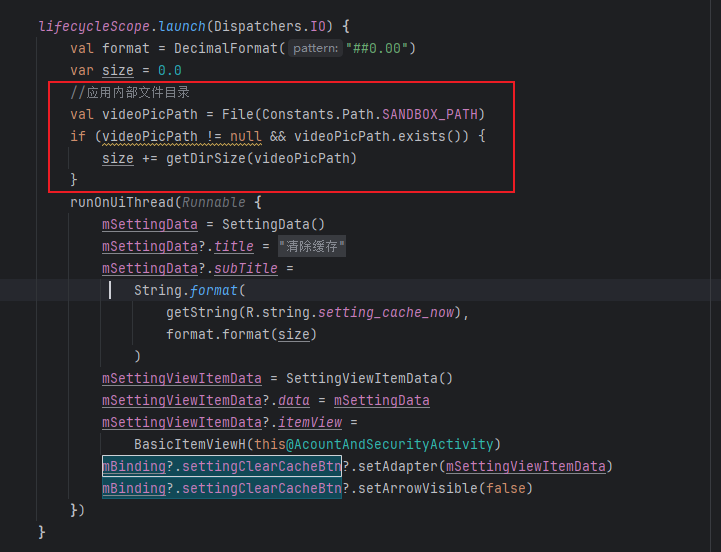
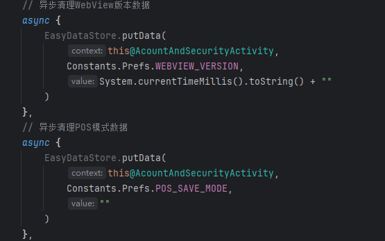
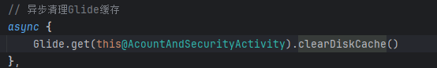
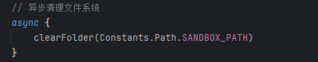
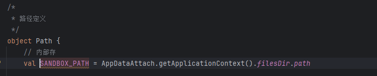
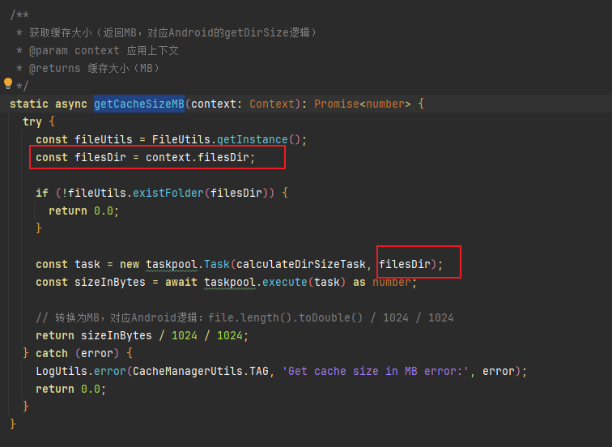

[toc]

## 01.功能概述

- **功能ID**：`FEAT-20250609-001`  
- **功能名称**：
- **目标版本**：v0.2.0
- **提交人**：@panruiqi  
- **状态**：
  - [x] ⌛ 设计中 /
  - [ ] ⌛ 开发中 / 
  - [ ] ✅ 已完成 / 
  - [ ] ❌ 已取消  
- **价值评估**：  
  - [x] ⭐⭐⭐⭐⭐ 核心业务功能  
  - [ ] ⭐⭐⭐⭐ 用户体验优化  
  - [ ] ⭐⭐⭐ 辅助功能增强  
  - [ ] ⭐⭐ 技术债务清理  
- **功能描述** 
  - 

## 02.需求分析

### 2.1 用户场景

- **主要场景**：  

  - 

- **边界场景**：  

### 2.2 功能范围

- ✅ 包含：
- ❌ 不包含：

## 03.技术方案

### 3.0 Android中代码分析

让我们来看看Android的已有的逻辑

首先是显示逻辑

- 遍历应用内部文件目录，记录缓存大小，然后设置上去。
  - 

然后是清理逻辑

- DataStore中设置数据
  - 
- 清除Glide缓存
  - 
- 清理文件系统
  - 

我们来看看这个异步清理文件系统

- 首先是路径
  - 
- 然后是清空的逻辑
  - 递归清空，调用文件的clear
  - 

### 3.0 鸿蒙中相关预分析

首先是显示的逻辑

- 

### 3.1 方案一

- 实现思路：
  - 处理filesDir下的文件
  - 
  - 问题：日志显示如下：实在是太小了
    [Worker] Found 2 items in /data/storage/el2/base/haps/entry/files
    [Worker] File 1: persistent_storage.lock (0 bytes)
    [Worker] File 2: persistent_storage (130 bytes)
    [Worker] Calculation completed. Total size: 130 bytes

### 3.2 方案二

- 实现思路：额外检测更多目录下的：计算并格式化完整缓存大小（包含tempDir、filesDir、cacheDir）
  - 

## 04.实现规划

### 4.1 技术选型

### 4.2 任务拆解

### 4.3 代码路径

## 05.兼容性设计

### 5.1 设备适配

### 5.2 冲突检查

## 06.测试方案

### 6.1 核心用例

### 6.2 性能指标

## 07.发布计划

### 7.1 阶段发布

### 7.2 回滚方案

## 08.文档记录

### 8.1 技术文档

### 8.2 用户文档

### 8.3 监控埋点

