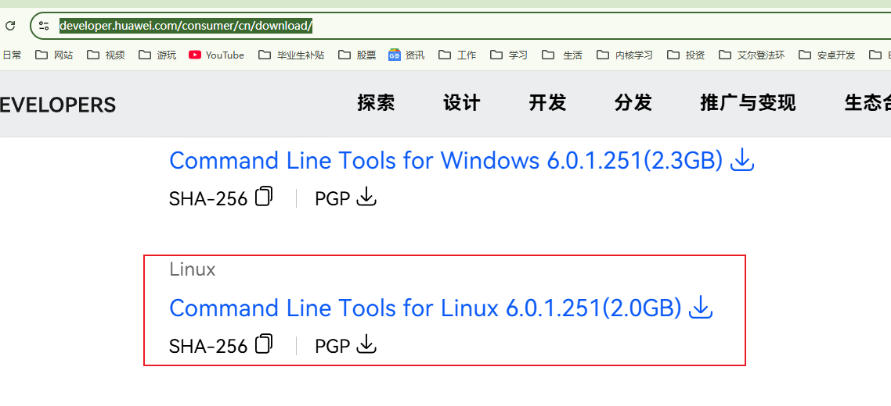
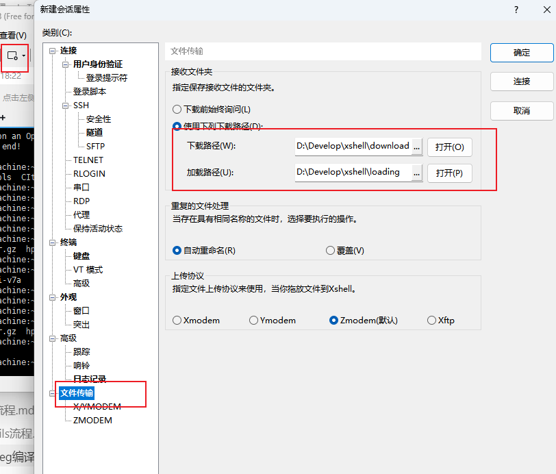
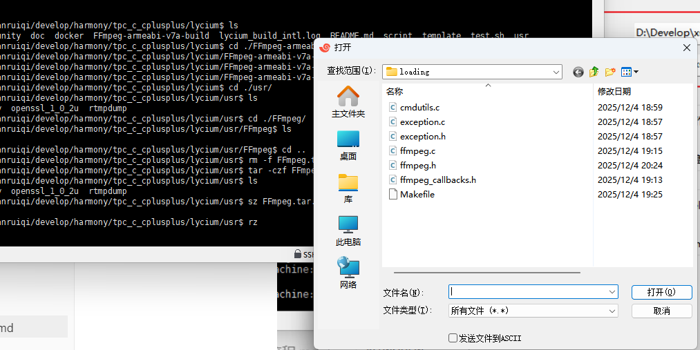
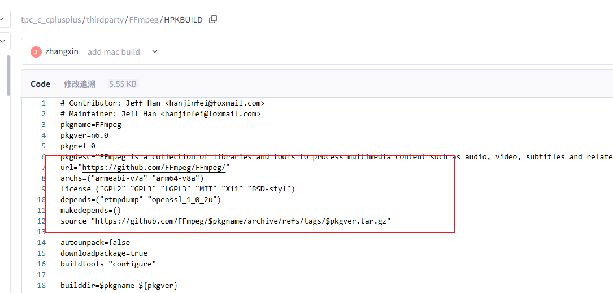
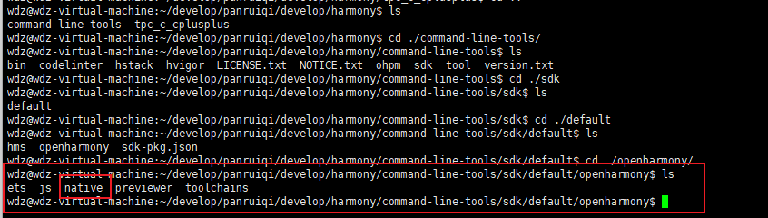
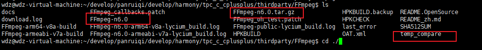
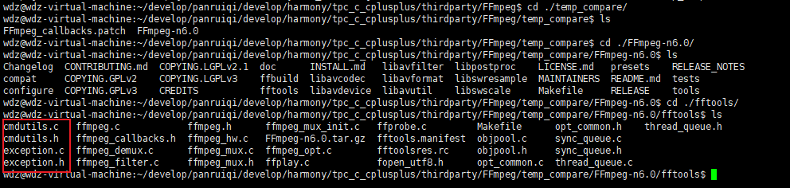
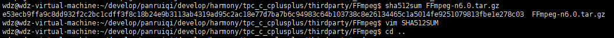
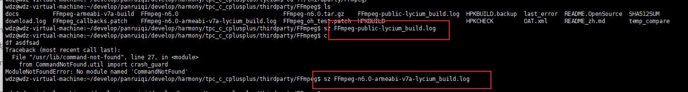
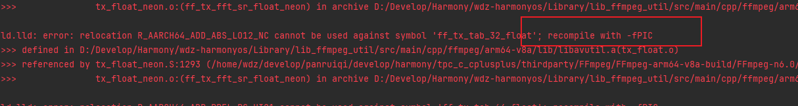

[toc]

## 前言

> 学习要符合如下的标准化链条：了解概念->探究原理->深入思考->总结提炼->底层实现->延伸应用"

## 01.学习概述

- **学习主题**：
- **知识类型**：
  - [ ] **知识类型**：
    - [ ] ✅Android/ 
      - [ ] ✅01.基础组件
      - [ ] ✅02.IPC机制
      - [ ] ✅03.消息机制
      - [ ] ✅04.View原理
      - [ ] ✅05.事件分发机制
      - [ ] ✅06.Window
      - [ ] ✅07.复杂控件
      - [ ] ✅08.性能优化
      - [ ] ✅09.流行框架
      - [ ] ✅10.数据处理
      - [ ] ✅11.动画
      - [ ] ✅12.Groovy
    - [ ] ✅音视频开发/
      - [ ] ✅01.基础知识
      - [ ] ✅02.OpenGL渲染视频
      - [ ] ✅03.FFmpeg音视频解码
    - [ ] ✅ Java/
      - [ ] ✅01.基础知识
      - [ ] ✅02.Java设计思想
      - [ ] ✅03.集合框架
      - [ ] ✅04.异常处理
      - [ ] ✅05.多线程与并发编程
      - [ ] ✅06.JVM
    - [ ] ✅ Kotlin/
      - [ ] ✅01.基础语法
      - [ ] ✅02.高阶扩展
      - [ ] ✅03.协程和流
    - [ ] ✅ 故障分析与处理/
      - [ ] ✅01.基础知识
    - [ ] ✅ 自我管理/
      - [ ] ✅01.内观
    - [ ] ✅ 业务逻辑/
      - [ ] ✅01.启动
      - [ ] ✅02.首页
      - [ ] ✅03.巡店
      - [ ] ✅04.云值守
      - [ ] ✅05.消息中心
      - [ ] ✅06.智控平台
- **学习来源**：
- **重要程度**：⭐⭐⭐⭐⭐
- **学习日期**：2025.
- **记录人**：@panruiqi

### 1.1 学习目标

- 了解概念->探究原理->深入思考->总结提炼->底层实现->延伸应用"

### 1.2 前置知识

- [ ] 

## 02.核心概念

### 2.1 业务痛点与需求


### 2.2 解决方案


### 2.3 基本特性


## 03.执行过程

### 3.0 工具准备

我们需要两个物件：

1. 官网编译工具链
2. FFmpeg源码

官网编译工具类：

- 地址
  - https://developer.huawei.com/consumer/cn/download/
  - 
- 存放入Linux中
  - Xshell配置下载和加载路径
  - 
  - 将下载下来的压缩包放置到加载路径中
  - 通过rz命令上传到Linux虚拟机
  - 

FFmpeg源码：

- 我们可以从官网下，也可以用鸿蒙提供的编译三方库的统一仓库：https://gitcode.com/openharmony-sig/tpc_c_cplusplus
- git clone拷贝到本地。
- 可是内部并没有FFmpeg源码啊？这个仓库没这么大啊，那么源码在哪？
  - 看懂了吗？配置了源码的官方仓库，从对应位置下载
  - 


 tpc_c_cplusplus

- 他用于存放已经适配OpenHarmony的C/C++三方库的适配脚本和OpenHarmony三方库适配指导文档、三方库适配相关的工具。
- 前开源的C/C++三方库编译方式多样化，以下为主流的几种交叉编译方式：
  - [cmake 编译构建](https://gitee.com/openharmony-sig/tpc_c_cplusplus/blob/master/docs/cmake_portting.md)。
  - [configure 编译构建方式](https://gitee.com/openharmony-sig/tpc_c_cplusplus/blob/master/docs/configure_portting.md)。
  - [make 编译构建](https://gitee.com/openharmony-sig/tpc_c_cplusplus/blob/master/docs/make_portting.md)。
  - 为了帮助开发者快速便捷的完成C/C++三方库交叉编译，我们开发了一套交叉编译框架[lycium](https://gitee.com/openharmony-sig/tpc_c_cplusplus/blob/master/lycium/README.md)，其涵盖了以上三种构建方式。

### 3.1 环境准备

OpenHarmony交叉编译环境配置

- 参考https://gitcode.com/openharmony-sig/tpc_c_cplusplus/blob/master/lycium/Buildtools/README.md
- cmake配置：
  - sudo apt install cmake
- Linux中配置 鸿蒙编译链的SDK环境
  - `lycium`支持的是C/C++三方库的交叉编译，SDK工具链只涉及到`native`目录下的工具，故OHOS_SDK的路径需配置成`native`工具的父目录，linux环境中配置SDK环境变量方法如下：
  - ` export OHOS_SDK=/home/wdz/develop/panruiqi/develop/harmony/command-line-tools/sdk/default/openharmony      # 此处SDK的路径使用者需配置成自己的sdk解压目录`
  - 

### 3.2 lycium 交叉编译框架学习

参考：https://gitcode.com/openharmony-sig/tpc_c_cplusplus/blob/master/lycium/README.md#1%E7%BC%96%E8%AF%91%E7%8E%AF%E5%A2%83%E5%87%86%E5%A4%87

ok，这个是编译其他自定义的三方库的教程。我们回过头来看看编译FFmpeg

### 3.3 FFmpeg编译

编译FFmpeg

- 在lycium目录下编译三方库

  ```shell
  cd lycium
  ./build.sh FFmpeg
  ```

- 三方库头文件及生成的库

  在lycium目录下会生成usr目录，该目录下存在已编译完成的32位和64位三方库

  ```shell
  FFmpeg/arm64-v8a   FFmpeg/armeabi-v7a
  ```

如何修改FFmpeg源码后再编译

- 找到源码压缩包并解压为新的文件temp_compare
  - FFmpeg-n6.0.tar.gz是源码压缩包，FFmpeg-n6.0时编译链处理的。temp_compare是我们自己解压缩的
  - 
- 我们这里进行了源码修改
  - 增加exception.c，修改cmdutils，ffmpeg，以及Makefile等
  - 

- 打包

  - ```
    # ========================================
    # 步骤 2: 重新打包（创建新的源码包）
    # ========================================
    cd temp_compare
    
    # 打包为新的 tar.gz（使用新名字，避免覆盖原文件）
    tar -czf FFmpeg-n6.0.tar.gz FFmpeg-n6.0/
    
    # 验证打包成功
    ls -lh FFmpeg-n6.0.tar.gz
    
    # 移动到上级目录
    mv FFmpeg-n6.0.tar.gz ..
    ```

- 删除上级的从远端url下载的压缩包

- 修改SHA512校验：通过sha512sum指令生成新的校验吗，并存放到SHA512sum文件中

  - 

  - ```
    wdz@wdz-virtual-machine:~/develop/panruiqi/develop/harmony/tpc_c_cplusplus/thirdparty/FFmpeg$ sha512sum FFmpeg-n6.0.tar.gz 
    e53ecb9ffa9c8dd932f2c2bc1cdff3f8c18b24e9b3113ab4319ad95c2ac18e77d7ba7b6c94983c64b103738c8e26134465c1a5014fe9251079813fbe1e278c03  FFmpeg-n6.0.tar.gz
    wdz@wdz-virtual-machine:~/develop/panruiqi/develop/harmony/tpc_c_cplusplus/thirdparty/FFmpeg$ vim SHA512SUM 
    wdz@wdz-virtual-machine:~/develop/panruiqi/develop/harmony/tpc_c_cplusplus/thirdparty/FFmpeg$ cd ..
    ```

- 编译FFmpeg，也就是上方刚开始的流程

### 3.4 编译过程中出错该怎么办？

出错时没有相关信息就去看这两个：

- 

这两个一般会显示相关的错误信息。


## 04. 编译原理

想要深度参与鸿蒙版本FFmpeg的编译并可以做到自己来修改，就需要了解其底层原理

### 4.1 底层原理

什么是交叉编译？

- 定义：

  - 本机编译：在 x86 电脑上编译，生成 x86 程序，在同一台电脑上运行 

  - 交叉编译：在 x86 电脑上编译，生成 ARM 程序，拿到手机/设备上运行

  - 如下图

  - ```
    ┌─────────────────────────────────────────────────────────────────┐
    │                        你的开发环境                              │
    │  ┌─────────────┐                      ┌─────────────────────┐   │
    │  │ Linux x86   │  ──编译──>           │ ARM 可执行文件       │   │
    │  │ (你的电脑)   │                      │ (给手机/设备用)      │   │
    │  └─────────────┘                      └─────────────────────┘   │
    │       主机(Host)                            目标(Target)         │
    └─────────────────────────────────────────────────────────────────┘
    ```

- 为什么需要交叉编译？

  - 手机/嵌入式设备性能弱，编译太慢
  - 开发环境在电脑上更方便

什么是PIC位置无关代码？

- 引子：我们看看这个日志，需要使用fPIC重编译
  
- 
  
- 那么我们遇到的问题时什么呢？

  - ```
    ┌─────────────────────────────────────────────────────────────────┐
    │                    程序加载到内存                                │
    ├─────────────────────────────────────────────────────────────────┤
    │                                                                 │
    │  【没有 PIC 的代码】                                             │
    │  代码里写死了地址：jump to 0x1000                                │
    │  问题：如果程序被加载到 0x2000 开始的位置，就跳错地方了！          │
    │                                                                 │
    │  【有 PIC 的代码】                                               │
    │  代码用相对地址：jump to (当前位置 + 100)                        │
    │  优点：无论程序加载到哪里，都能正确跳转                           │
    │                                                                 │
    └─────────────────────────────────────────────────────────────────┘
    ```

- 为什么 .so 动态库必须用 PIC？

  - 动态库会被多个程序共享，每个程序加载动态库的内存地址不同，所以动态库的代码必须是"位置无关"的

  - ```
    静态库(.a) ──链接到──> 动态库(.so)
        │                      │
        │                      └── 必须是 PIC
        │
        └── 如果静态库不是 PIC 编译的，链接就会失败！
    
    ```

- 因此我们需要启用C++的PIC配置，同时对于汇编，FFmpeg 6.0 的某些汇编代码没有写成 PIC 格式  。因此我们要--disable-asm --disable-neon  禁用汇编优化，全部用 C 代码实现（牺牲一点性能，换取兼容性） 

Shell脚本基础语法

- ```
  # 变量赋值（等号两边不能有空格！）
  name=FFmpeg
  
  # 使用变量
  echo $name          # 输出: FFmpeg
  echo ${name}        # 同上，更清晰
  echo "${name}-v1"   # 输出: FFmpeg-v1
  
  # 命令替换（执行命令并获取结果）
  today=$(date)       # 把 date 命令的输出存到变量
  
  # 特殊变量
  $@                  # 所有传入的参数
  $?                  # 上一条命令的返回值（0=成功，非0=失败）
  $OLDPWD             # 上一次所在的目录
  
  # 条件判断
  if [ "$var" == "value" ]; then
      echo "相等"
  fi
  
  # 重定向
  command > file      # 输出覆盖写入文件
  command >> file     # 输出追加到文件
  command 2>&1        # 把错误输出也重定向到标准输出
  command > file 2>&1 # 所有输出都写入文件
  ```

### 4.2 整体流程

HPKBUILD 是什么？

- 类似于CMakeList的包构建脚本，指引我们如何沟通鸿蒙版本FFmpeg

  - ```
    ┌─────────────────────────────────────────────────────────────────┐
    │                    Lycium 构建系统                               │
    ├─────────────────────────────────────────────────────────────────┤
    │                                                                 │
    │  Lycium 是一个为 OpenHarmony 交叉编译第三方 C/C++ 库的工具        │
    │                                                                 │
    │  类比：                                                          │
    │  - Android 用 Android.mk 或 CMakeLists.txt                      │
    │  - Arch Linux 用 PKGBUILD                                       │
    │  - Lycium 用 HPKBUILD                                           │
    │                                                                 │
    │  HPKBUILD = Harmony Package Build（鸿蒙包构建脚本）              │
    │                                                                 │
    └─────────────────────────────────────────────────────────────────┘
    
    ```

构建的生命周期

- 当你执行 ./build.sh FFmpeg 时，Lycium 会按顺序调用 HPKBUILD 中的函数：

  - ```
    ┌─────────────────────────────────────────────────────────────────┐
    │                     构建生命周期                                 │
    ├─────────────────────────────────────────────────────────────────┤
    │                                                                 │
    │   ┌──────────┐                                                  │
    │   │ 1.下载源码 │  ← 根据 source 变量下载 tar.gz                   │
    │   └────┬─────┘                                                  │
    │        ▼                                                        │
    │   ┌──────────┐                                                  │
    │   │2.prepare()│  ← 解压、打补丁、设置环境变量                     │
    │   └────┬─────┘    （还会先编译一个 host 版本）                    │
    │        ▼                                                        │
    │   ┌──────────┐                                                  │
    │   │ 3.build() │  ← 执行 configure + make，编译目标平台的库        │
    │   └────┬─────┘                                                  │
    │        ▼                                                        │
    │   ┌──────────┐                                                  │
    │   │4.package()│  ← 执行 make install，安装到指定目录              │
    │   └────┬─────┘                                                  │
    │        ▼                                                        │
    │   ┌──────────┐                                                  │
    │   │ 5.check() │  ← 运行测试验证（可选）                           │
    │   └──────────┘                                                  │
    │                                                                 │
    │   对于多架构（armeabi-v7a, arm64-v8a），会循环执行 2-5 步         │
    │                                                                 │
    └─────────────────────────────────────────────────────────────────┘
    
    ```

### 4.3 核心代码详解

元数据部分

- ```cmake
  # Contributor: Jeff Han <hanjinfei@foxmail.com>
  # Maintainer: Jeff Han <hanjinfei@foxmail.com>
  pkgname=FFmpeg                    # 包名
  pkgver=n6.0                       # 版本号
  pkgrel=0                          # 发布版本（同一版本的第几次打包）
  pkgdesc="FFmpeg is a collection..." # 包描述
  url="https://github.com/FFmpeg/FFmpeg/"  # 项目主页
  archs=("armeabi-v7a" "arm64-v8a") # 支持的目标架构（数组）
  license=("GPL2" "GPL3" ...)       # 许可证
  depends=("rtmpdump" "openssl_1_0_2u")  # 依赖的其他包
  makedepends=()                    # 编译时依赖（这里为空）
  source="https://github.com/..."   # 源码下载地址
  ```

  ```cmake
  autounpack=false      # 不自动解压（脚本手动控制解压）
  downloadpackage=true  # 需要下载源码包
  buildtools="configure" # 使用 configure 构建系统（不是 cmake）
  
  builddir=$pkgname-${pkgver}       # 构建目录名：FFmpeg-n6.0
  packagename=$builddir.tar.gz      # 源码包名：FFmpeg-n6.0.tar.gz
  source envset.sh                  # 引入环境设置脚本
  buildhost=true                    # 标记：是否需要编译 Host 版本
  arch=                             # 当前架构（后面会设置）
  ldflags=                          # 链接器参数（后面会设置）
  
  ```

prepare函数详解

- 这是准备阶段，分为两大部分：

- Host编译部分

  - ```
    prepare() {
        # 判断操作系统类型
        if [ "$LYCIUM_BUILD_OS" == "Linux" ]; then
            hostosname=linux
        elif [ "$LYCIUM_BUILD_OS" == "Darwi" ]; then  # Darwin = macOS
            hostosname=darwin
        else
            echo "System cannot recognize, exiting"
            return -1
        fi
    ```

  - ```
        # Host 编译（只执行一次）
        if [ $buildhost == true ]; then
            tar -zxf $packagename              # 解压源码
            cd $builddir                        # 进入源码目录
            
            # 配置 Host 版本
            ./configure --enable-static --enable-shared \
                --disable-doc --disable-htmlpages \
                --target-os=$hostosname \
                --disable-optimizations \       # 禁用优化（加快编译）
                --prefix=`pwd`/hostbuild \      # 安装到当前目录的 hostbuild/
                > $publicbuildlog 2>&1          # 输出重定向到日志
            
            $MAKE >> $publicbuildlog 2>&1       # 编译
            $MAKE install >> $publicbuildlog 2>&1  # 安装
            
            # 设置库搜索路径（让后续命令能找到刚编译的库）
            export LD_LIBRARY_PATH=`pwd`/hostbuild/lib:$LD_LIBRARY_PATH
            
            # 修改 Makefile，禁用某些测试
            sed -i.bak 's/include $(SRC_PATH)\/tests\/fate\/source.mak/#.../g' tests/Makefile
            
            $MAKE check >> $publicbuildlog 2>&1  # 运行测试
            ret=$?                               # 保存返回值
            buildhost=false                      # 标记已完成
            cd $OLDPWD                           # 返回原目录
        fi
    
    ```

- Target准备阶段

  - ```
        # 为目标架构创建独立的构建目录
        mkdir $pkgname-$ARCH-build              # 如：FFmpeg-arm64-v8a-build
        tar -zxf $packagename -C $pkgname-$ARCH-build  # 解压到该目录
        
        cd $pkgname-$ARCH-build/$builddir       # 进入源码目录
        patch -p1 < ../../FFmpeg_oh_test.patch  # 应用 OpenHarmony 补丁
        cd $OLDPWD
    
    ```

  - ```
        # 根据目标架构设置环境
        if [ $ARCH == "armeabi-v7a" ]; then
            setarm32ENV          # 设置 32 位 ARM 编译环境（设置 $CC 等）
            arch=arm             # FFmpeg 的架构参数
            ldflags="-L${OHOS_SDK}/native/sysroot/usr/lib/arm-linux-ohos"
        elif [ $ARCH == "arm64-v8a" ]; then
            setarm64ENV          # 设置 64 位 ARM 编译环境
            arch=aarch64
            ldflags="-L${OHOS_SDK}/native/sysroot/usr/lib/aarch64-linux-ohos"
        else
            echo "${ARCH} not support"
            return -1
        fi
    
        return $ret
    }
    
    ```

build() 函数详解，这是最关键的部分，执行交叉编译

- 编译配置

  - ```
    build() {
        cd $pkgname-$ARCH-build/$builddir
        
        # 配置 FFmpeg（这是一条很长的命令，我分开解释）
        PKG_CONFIG_LIBDIR="${pkgconfigpath}" \   # 设置 pkg-config 搜索路径
        ./configure "$@" \                        # $@ 是外部传入的额外参数
        --disable-neon \          # 禁用 ARM NEON 汇编优化
        --disable-asm \           # 禁用所有汇编优化
        --disable-x86asm \        # 禁用 x86 汇编（虽然是交叉编译，但以防万一）
        
        --enable-network \        # 启用网络功能
        --enable-librtmp \        # 启用 RTMP 协议支持
        --enable-openssl \        # 启用 OpenSSL（HTTPS 等）
        --enable-protocols \      # 启用各种协议
        
        --enable-static \         # 生成静态库 (.a)
        --enable-pic \            # 生成位置无关代码
        --disable-shared \        # 不生成动态库 (.so)
        --disable-doc \           # 不生成文档
        --disable-htmlpages \     # 不生成 HTML 文档
        --disable-programs \      # 不编译 ffmpeg/ffprobe 等程序（避免汇编问题）
    
        --enable-cross-compile \  # 启用交叉编译模式
        --target-os=linux \       # 目标操作系统（OpenHarmony 基于 Linux）
        --arch=$arch \            # 目标架构：arm 或 aarch64
        
        --cc=${CC} \              # C 编译器（如 arm-linux-ohos-clang）
        --ld=${CC} \              # 链接器（用同一个）
        --strip=${STRIP} \        # 符号剥离工具
        
        --host-cc="${CC}" \       # Host 编译器（用于编译构建时运行的工具）
        --host-ld="${CC}" \       # Host 链接器
        --host-os=linux \         # Host 操作系统
        --host-ldflags=${ldflags} \  # Host 链接参数
        
        --sysroot=${OHOS_SDK}/native/sysroot \  # 系统根目录（头文件、库的位置）
        
        --extra-cflags="-fPIC" \  # 额外的 C 编译参数：强制 PIC
        > $buildlog 2>&1          # 输出到日志
    
    ```

- 编译

  - ```
        $MAKE >> $buildlog 2>&1   # 执行 make 编译
        ret=$?                    # 保存返回值
        cd $OLDPWD
        return $ret
    }
    ```

  > 这里存在一个问题，我们要先进行一次Host编译，然后才是真正的编译。请问这是为什么？里面究竟有几次编译过程？
  >
  > - 为什么要先编译 Host 版本？
  >
  >   - ```
  >     ┌─────────────────────────────────────────────────────────────────┐
  >     │                    实际编译过程                                  │
  >     ├─────────────────────────────────────────────────────────────────┤
  >     │                                                                 │
  >     │  【第一次】Host 编译（只执行一次）                                │
  >     │  ├── 输入：FFmpeg 源码                                          │
  >     │  ├── 编译器：gcc (x86)                                          │
  >     │  └── 产出：                                                     │
  >     │       ├── x86 版本的 FFmpeg 库                                  │
  >     │       ├── x86 版本的 ffmpeg/ffprobe 可执行文件                   │
  >     │       └── x86 版本的测试工具（videogen, audiogen 等）            │
  >     │       （库 + 可执行文件 + 工具 是一起编译出来的，不是分开的）      │
  >     │                                                                 │
  >     │  【第二次】ARM64 交叉编译                                        │
  >     │  ├── 输入：FFmpeg 源码（同一份）                                 │
  >     │  ├── 编译器：aarch64-linux-ohos-clang                           │
  >     │  ├── 辅助：使用第一次编译的 x86 工具                             │
  >     │  └── 产出：arm64-v8a 的 .a 静态库 + .h 头文件                    │
  >     │                                                                 │
  >     │  【第三次】ARM32 交叉编译                                        │
  >     │  ├── 输入：FFmpeg 源码（同一份）                                 │
  >     │  ├── 编译器：arm-linux-ohos-clang                               │
  >     │  ├── 辅助：使用第一次编译的 x86 工具（复用）                      │
  >     │  └── 产出：armeabi-v7a 的 .a 静态库 + .h 头文件                  │
  >     │                                                                 │
  >     └─────────────────────────────────────────────────────────────────┘
  >     ```
  >
  >   - 所以，我们host编译是为了生成对应的Host版本的FFmpeg以及对应的交叉编译辅助工具
  >
  > - 那么整个过程的文件结构是怎样的？
  >
  >   - ```
  >     执行前：
  >     thirdparty/FFmpeg/
  >     ├── HPKBUILD              # 构建脚本
  >     ├── FFmpeg-n6.0.tar.gz    # 源码压缩包
  >     └── FFmpeg_oh_test.patch  # 补丁文件
  >     
  >     执行后：
  >     thirdparty/FFmpeg/
  >     ├── HPKBUILD
  >     ├── FFmpeg-n6.0.tar.gz
  >     ├── FFmpeg_oh_test.patch
  >     ├── FFmpeg-n6.0/                    # Host 编译目录
  >     │   ├── hostbuild/                  # Host 版本安装目录
  >     │   │   ├── bin/ffmpeg              # x86 版本的 ffmpeg
  >     │   │   └── lib/                    # x86 版本的库
  >     │   └── ...
  >     ├── FFmpeg-armeabi-v7a-build/       # ARM32 交叉编译目录
  >     │   └── FFmpeg-n6.0/
  >     │       └── ...
  >     └── FFmpeg-arm64-v8a-build/         # ARM64 交叉编译目录
  >         └── FFmpeg-n6.0/
  >             └── ...
  >     
  >     最终输出（在 lycium/usr/ 目录）：
  >     lycium/usr/FFmpeg/
  >     ├── armeabi-v7a/
  >     │   ├── include/                    # 头文件 (.h)
  >     │   │   ├── libavcodec/
  >     │   │   ├── libavformat/
  >     │   │   └── ...
  >     │   └── lib/                        # 静态库 (.a)
  >     │       ├── libavcodec.a
  >     │       ├── libavformat.a
  >     │       └── ...
  >     └── arm64-v8a/
  >         ├── include/
  >         └── lib/
  >     
  >     ```

Package函数详解

- ```
  package() {
      cd $pkgname-$ARCH-build/$builddir
      $MAKE install >> $buildlog 2>&1   # 安装到 --prefix 指定的目录
      cd $OLDPWD
  }
  ```

- make install 会：

  - 复制 .a 静态库到 lib/ 目录
  - 复制 .h 头文件到 include/ 目录
  - 复制 pkg-config 文件到 lib/pkgconfig/

 check() 函数详解（测试阶段）

- 这个函数比较复杂，主要做测试验证：

  - ```
    check() {
        cd $pkgname-$ARCH-build/$builddir
        
        # 修改 Makefile，禁用一些测试
        sed -i.bak 's/..fate-run.sh/#..fate-run.sh/g' tests/Makefile
        sed -i.bak 's/..source.mak/#..source.mak/g' tests/Makefile
        sed -i.bak 's/..ffprobe.mak/#..ffprobe.mak/g' tests/Makefile
        
        # 关键：用 Host 版本的 ffmpeg 替换 Target 版本
        mv ffmpeg ffmpeg.${ARCH}           # 备份 ARM 版本
        cp ../../$builddir/ffmpeg ./       # 复制 x86 版本过来
        
        # 尝试运行测试（最多重试 4 次）
        retrytimes=0
        while true; do
            $MAKE check >> $buildlog 2>&1
            if [ $? -eq 0 ]; then break; fi
            
            # 如果失败，复制更多 Host 工具
            copyhostbin base64
            copyhostbin audiomatch
            # ... 更多工具
            
            let retrytimes=$retrytimes+1
            if [ $retrytimes -gt 4 ]; then ret=1; break; fi
        done
        
        # 恢复 ARM 版本
        mv ffmpeg.${ARCH} ffmpeg
        # ...
    }
    ```

- 咦，看见了吧，我们的host版本的FFmpeg在此起作用，我们通过Host版本替换ARM版本进行测试，因为测试需要运行 ffmpeg 命令，但交叉编译出来的是 ARM 版本，无法在 x86 电脑上运行。

辅助函数

- 如下

  - ```
    # 复制 Host 版本的工具
    copyhostbin() {
        file=$1
        if [[ -f tests/$file ]] && [[ ! -f tests/$file.${ARCH} ]]; then
            mv tests/$file tests/$file.${ARCH}    # 备份 ARM 版本
            cp ../../$builddir/tests/$file tests/$file  # 复制 x86 版本
        fi
    }
    
    # 恢复编译环境
    recoverpkgbuildenv() {
        unset arch ldflags
        if [ $ARCH == "armeabi-v7a" ]; then
            unsetarm32ENV    # 清除 32 位环境变量
        elif [ $ARCH == "arm64-v8a" ]; then
            unsetarm64ENV    # 清除 64 位环境变量
        fi
    }
    
    # 清理构建目录
    cleanbuild() {
        rm -rf ${PWD}/${builddir} \
               ${PWD}/$pkgname-arm64-v8a-build \
               ${PWD}/$pkgname-armeabi-v7a-build
    }
    ```

  

## 05.深度思考

### 5.1 关键问题探究


### 5.2 设计对比


## 06.实践验证

### 6.1 行为验证代码


### 6.2 性能测试


## 07.应用场景

### 7.1 最佳实践


### 7.2 使用禁忌


## 08.总结提炼

### 8.1 核心收获


### 8.2 知识图谱


### 8.3 延伸思考


## 09.参考资料

1. []()
2. []()
3. []()

## 其他介绍

### 01.关于我的博客

- csdn：http://my.csdn.net/qq_35829566

- 掘金：https://juejin.im/user/499639464759898

- github：https://github.com/jjjjjjava

- 邮箱：[934137388@qq.com]

