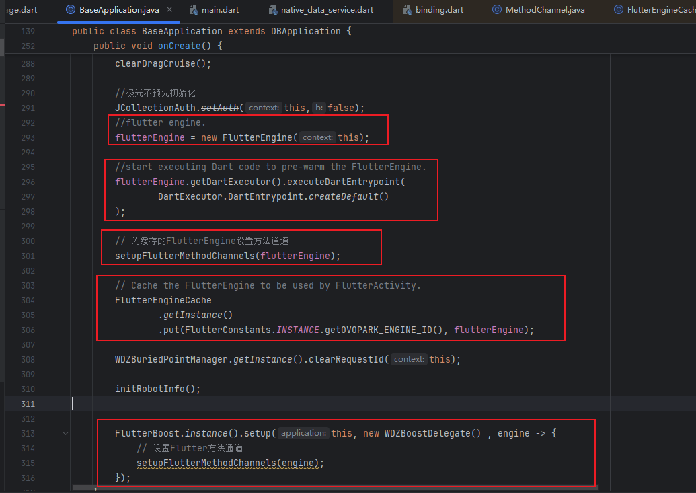
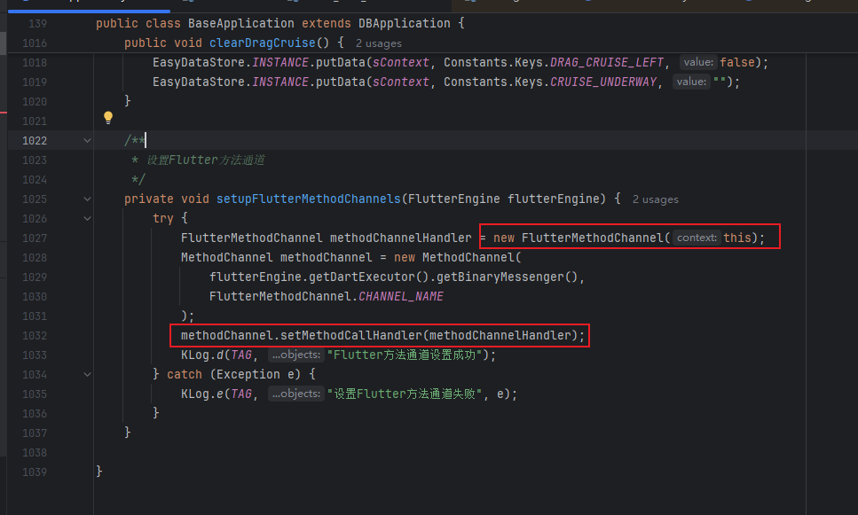
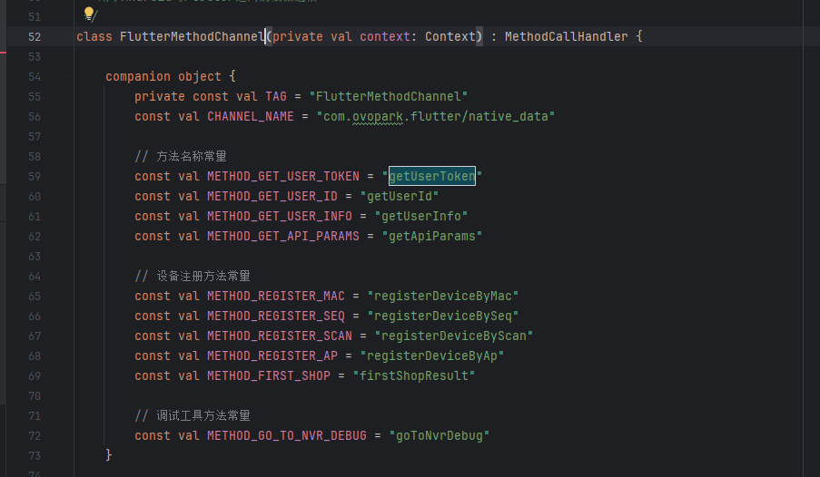
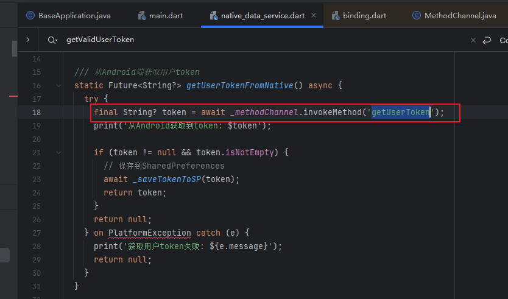
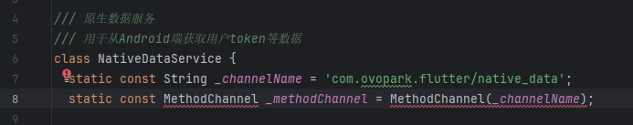
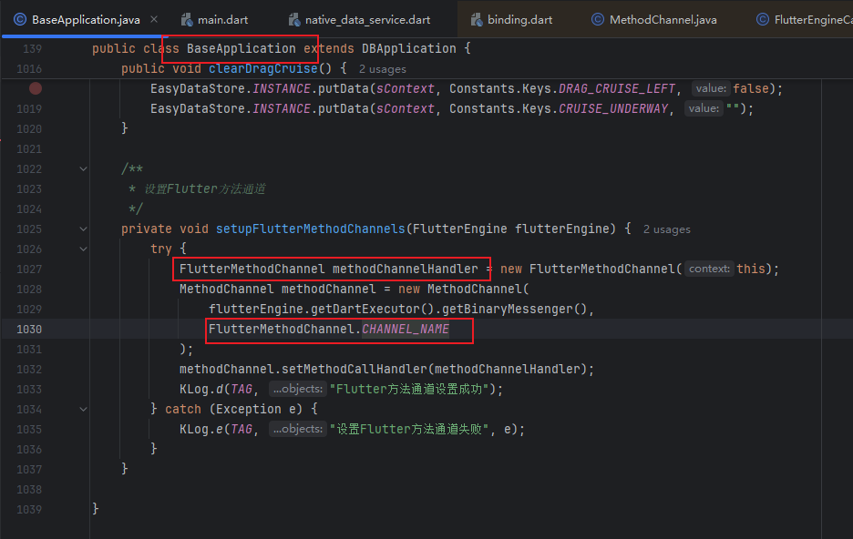
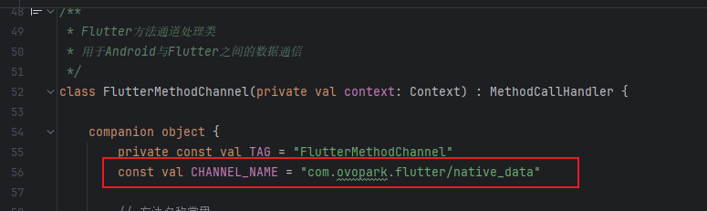

[toc]

## 前言

> 学习要符合如下的标准化链条：了解概念->探究原理->深入思考->总结提炼->底层实现->延伸应用"

## 01.学习概述

- **学习主题**：
- **知识类型**：
  - [ ] **知识类型**：
    - [ ] ✅Android/ 
      - [ ] ✅01.基础组件
      - [ ] ✅02.IPC机制
      - [ ] ✅03.消息机制
      - [ ] ✅04.View原理
      - [ ] ✅05.事件分发机制
      - [ ] ✅06.Window
      - [ ] ✅07.复杂控件
      - [ ] ✅08.性能优化
      - [ ] ✅09.流行框架
      - [ ] ✅10.数据处理
      - [ ] ✅11.动画
      - [ ] ✅12.Groovy
    - [ ] ✅音视频开发/
      - [ ] ✅01.基础知识
      - [ ] ✅02.OpenGL渲染视频
      - [ ] ✅03.FFmpeg音视频解码
    - [ ] ✅ Java/
      - [ ] ✅01.基础知识
      - [ ] ✅02.Java设计思想
      - [ ] ✅03.集合框架
      - [ ] ✅04.异常处理
      - [ ] ✅05.多线程与并发编程
      - [ ] ✅06.JVM
    - [ ] ✅ Kotlin/
      - [ ] ✅01.基础语法
      - [ ] ✅02.高阶扩展
      - [ ] ✅03.协程和流
    - [ ] ✅ 故障分析与处理/
      - [ ] ✅01.基础知识
    - [ ] ✅ 自我管理/
      - [ ] ✅01.内观
    - [ ] ✅ 业务逻辑/
      - [ ] ✅01.启动
      - [ ] ✅02.首页
      - [ ] ✅03.巡店
      - [ ] ✅04.云值守
      - [ ] ✅05.消息中心
      - [ ] ✅06.智控平台
- **学习来源**：
- **重要程度**：⭐⭐⭐⭐⭐
- **学习日期**：2025.
- **记录人**：@panruiqi

### 1.1 学习目标

- 了解概念->探究原理->深入思考->总结提炼->底层实现->延伸应用"

### 1.2 前置知识

- [ ] 

## 02.核心概念

### 2.1 业务痛点与需求

我们希望在我们的项目中使用Flutter，因此我们需要去进行相关的Flutter初始化和预热的方案

### 2.2 解决方案

### 2.3 基本特性

## 03.代码执行过程

### 3.0 BaseApplication中初始化

我们先来看看

- Flutter的初始化由5个部分组成，他们分别是：创建 FlutterEngine，执行 Dart 入口代码，设置 Flutter通道：FlutterMethodChannel（原生与 Flutter 通信），缓存 FlutterEngine (`FlutterEngineCache`)，初始化 FlutterBoost
  - 

首先是创建FlutterEngine

- FlutterEngine是什么？他是Flutter在Android上运行的引擎，你可以将他类比为： WebView 的“内核”。我们要执行 Dart 代码，我们要渲染 Flutter UI，我们还要管理 Flutter 框架与原生(Android)之间的通信，这都由他来处理和解决

其次是执行Dart入口

- 我们为什么要在这个阶段执行Dart入口方法呢？ 我们的目的是什么呢？
  - 第一次执行Dart代码时，会启动Dart VM，我们在这处理是为了做一个预热处理，如果你不在应用启动时执行 Dart 入口，而是等到用户第一次打开 Flutter 页面时才执行，会有明显的“白屏/卡顿”，预热后，Flutter 页面首开时只需 attach 到已有的引擎，UI 渲染非常快。
- 好，那这个方法我们里面实际执行了什么？
  - 
    - 

设置 FlutterMethodChannel（原生与 Flutter 通信）

- `setupFlutterMethodChannels(flutterEngine)` 主要是注册方法通道，使得 Android 端和 Flutter 端能够互相调用。
- Flutter 端通过 `MethodChannel` 调用 Android 方法，Android 端通过相同通道响应或调用 Flutter。

缓存 FlutterEngine (`FlutterEngineCache`)

- 避免每次启动 Flutter 页面都重新创建引擎（提升性能、减少闪屏）。
- 这样 `FlutterActivity` 或 `FlutterFragment` 可以直接复用这个引擎。

初始化 FlutterBoost

- FlutterBoost是什么？FlutterBoost 是由 **阿里巴巴开发的一套 Flutter 混合栈管理框架**，主要用于解决 Flutter 与原生(Android/iOS)页面共存、混合跳转的问题。
- 我们考量一下没有他存在的情况：
  - 在纯 Flutter App 中，所有页面都是 Flutter Widget，通过 Navigator 管理。
  - 在混合栈中（原生 + Flutter），你会遇到：
    - 原生页面 → Flutter 页面
    - Flutter 页面 → 原生页面
    - Flutter 页面 → Flutter 页面
  - 生命周期和路由栈如何保持一致？
- 因此，其目标是：在已有原生 App 中无缝集成 Flutter 页面，并支持原生与 Flutter 页面自由切换、返回、恢复

### 3.1 设置Flutter方法通道

但是

- 创建方法通道，设置方法通道的Handler：FlutterMethodChannel
  - 

- 来看看FlutterMethodChannel
  - 首先是一些名称常量的定义
  - 
  - 然后是最关键的onMethodCall方法的重写。将方法进行映射，然后执行Android原生的方法，并通过result返回，其实就是方法的映射表
  - 

ok，那问题来了，在 Flutter 侧，我们如何调用他？

- 我们可以看到这里通过_methodChannel.invokeMethod调用Android 的getUserToken方法
  - 
- 这里的_methodChannel，就是名称为com.ovopark.flutter/native_data的一个方法通道
  - 
- 好，那这个方法通道在哪里创建的呢?
  - 回到我们之前的BaseApplication中了
  - 
  - 通道name对应如下：
  - 
  - 

### 3.2 Flutter执行流

### 3.3 

### 3.4 

### 3.5 进一步思考

### 3.6 总结一下，整个数据的流转过程是什么样的?

## 04.底层原理

## 05.深度思考

### 5.1 关键问题探究

### 5.2 设计对比

## 06.实践验证

### 6.1 行为验证代码

### 6.2 性能测试

## 07.应用场景

### 7.1 最佳实践

### 7.2 使用禁忌

## 08.总结提炼

### 8.1 核心收获

### 8.2 知识图谱

### 8.3 延伸思考

## 09.参考资料

1. 
2. 
3. 

## 其他介绍

### 01.关于我的博客

- csdn：http://my.csdn.net/qq_35829566

- 掘金：https://juejin.im/user/499639464759898

- github：https://github.com/jjjjjjava

- 邮箱：[934137388@qq.com]

