[toc]

## 前言

> 学习要符合如下的标准化链条：了解概念->探究原理->深入思考->总结提炼->底层实现->延伸应用"

## 01.学习概述

- **学习主题**：
- **知识类型**：
  - [ ] **知识类型**：
    - [ ] ✅Android/ 
      - [ ] ✅01.基础组件
      - [ ] ✅02.IPC机制
      - [ ] ✅03.消息机制
      - [ ] ✅04.View原理
      - [ ] ✅05.事件分发机制
      - [ ] ✅06.Window
      - [ ] ✅07.复杂控件
      - [ ] ✅08.性能优化
      - [ ] ✅09.流行框架
      - [ ] ✅10.数据处理
      - [ ] ✅11.动画
      - [ ] ✅12.Groovy
    - [ ] ✅音视频开发/
      - [ ] ✅01.基础知识
      - [ ] ✅02.OpenGL渲染视频
      - [ ] ✅03.FFmpeg音视频解码
    - [ ] ✅ Java/
      - [ ] ✅01.基础知识
      - [ ] ✅02.Java设计思想
      - [ ] ✅03.集合框架
      - [ ] ✅04.异常处理
      - [ ] ✅05.多线程与并发编程
      - [ ] ✅06.JVM
    - [ ] ✅ Kotlin/
      - [ ] ✅01.基础语法
      - [ ] ✅02.高阶扩展
      - [ ] ✅03.协程和流
    - [ ] ✅ 故障分析与处理/
      - [ ] ✅01.基础知识
    - [ ] ✅ 自我管理/
      - [ ] ✅01.内观
    - [ ] ✅ 业务逻辑/
      - [ ] ✅01.启动
      - [x] ✅02.首页
      - [ ] ✅03.巡店
      - [ ] ✅04.云值守
      - [ ] ✅05.消息中心
      - [ ] ✅06.智控平台
- **学习来源**：
- **重要程度**：⭐⭐⭐⭐⭐
- **学习日期**：2025.
- **记录人**：@panruiqi

### 1.1 学习目标

- 了解概念->探究原理->深入思考->总结提炼->底层实现->延伸应用"

### 1.2 前置知识

- [ ] 

## 02.核心概念

### 2.1 业务痛点与需求

### 2.2 解决方案

### 2.3 基本特性

## 03.代码执行过程

### 3.0 引子_实际对应的页

好，今天我们要讲的是首页中的二楼页，我们先来看看他对应的手机中的实际的页

首先是我们的首页

- 二楼页位于我们首页的这个部分
  - 
  - 首页对应我们的HomeActivity中的HomeNewFragment，可以参考 [02. 首页_首页包含哪些模块.md](02. 首页_首页包含哪些模块.md) 
  - 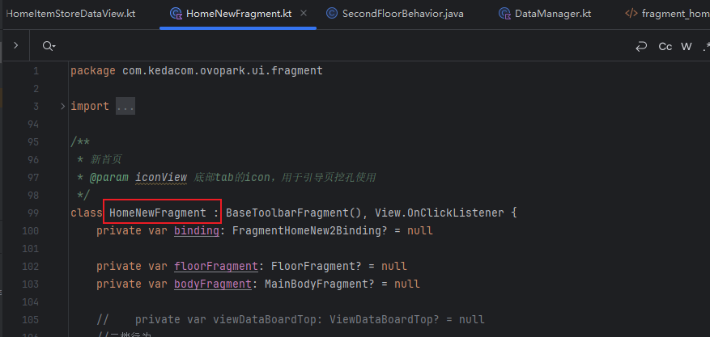
- 我们进行下拉操作
  - 
  - 这个过程中会使用到我们的滑动检测器，对应下面的在二楼，他会监听用户的滑动距离，到达一定距离去控制HomeNewFragment内部其他视图的隐藏，以及我们这个二楼页的显示，这个我们稍后再说
  - 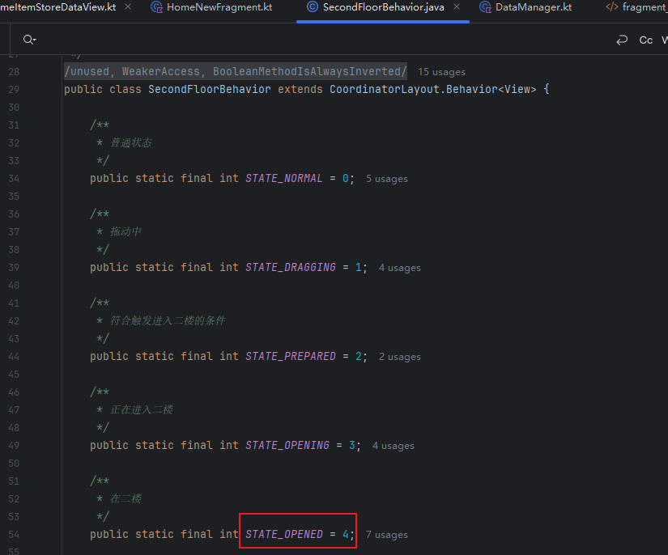
- 好，最后是我们的实际显示的二楼Fragment了
  - 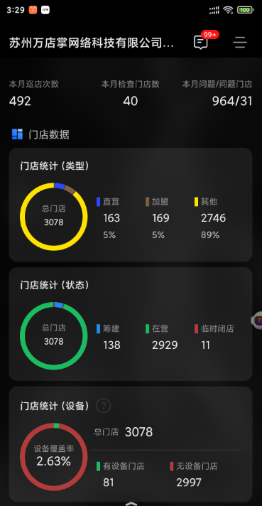
  - 对应这个fragment，FloorFragment
  - 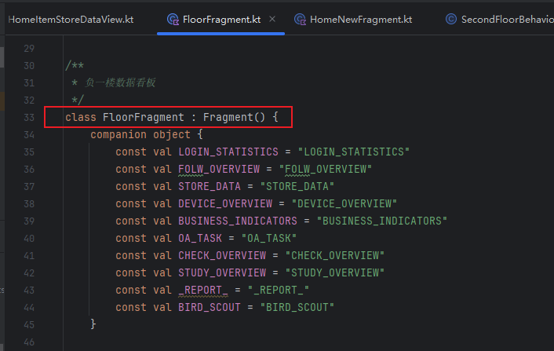

### 3.1 floorFragment添加阶段

首先是我们的添加阶段

- 将我们的floorFragment通过post，以及beginTransaction添加到我们的R.id.fl_floor上
  - 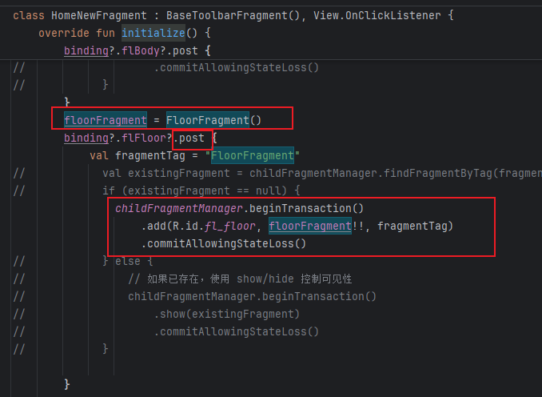
- 其是一个FrameLayout，对应如下fragment_home_new2.xml下
  - 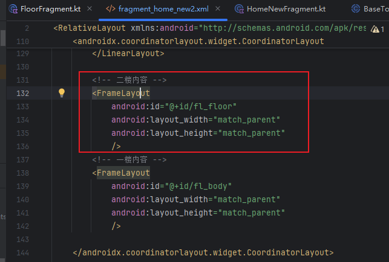

好了，现在想一想，我们把它添加进来了，然后呢？他刚开始会展示吗？如果展示，展示多少？数据呢？又是从哪拿的？先忽略这些问题。

### 3.2 floorFragment中子条目项的显示

floorFragment中会显示很多数据，仔细观察，他是由子条目项和条目项下的数据组成的

- 比如下面有一个大的子条目项：巡店概览，内部有三个小的：个人人效，门店得分率排名，门店分档，然后才是内部的子条目项下的数据
  - 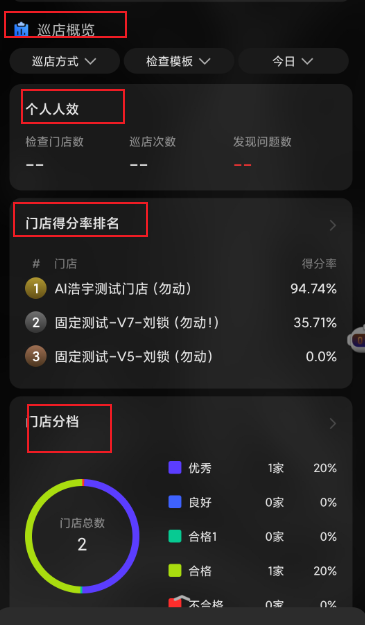

好，先来看floorFragment中条目项目的获取阶段

- initialize阶段执行getBoardTagList方法
  - 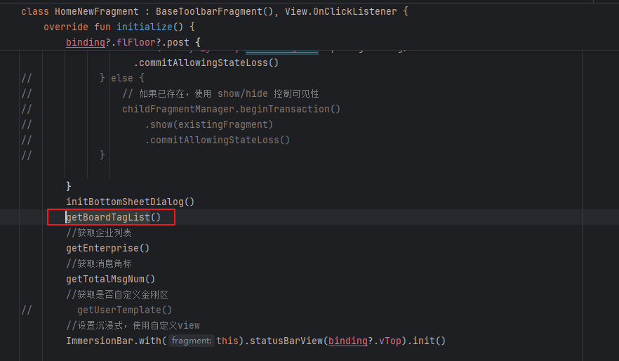

- 看看getBoardTagList方法，网络请求，将结果设置给floorFragment
  - 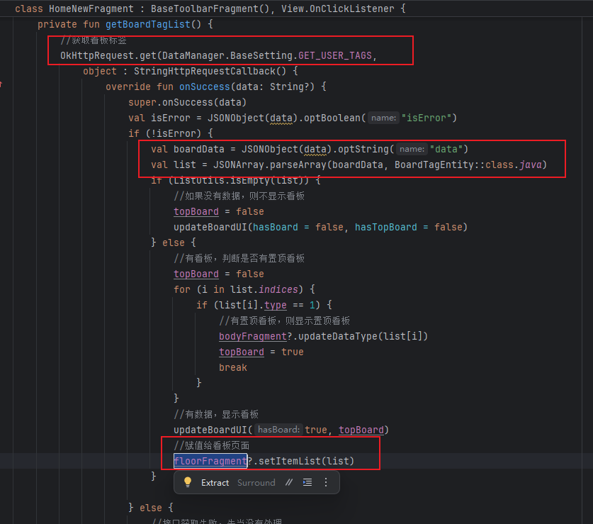
- 我们来看看这个过程：
  - 调用getUserTags接口，对应如下
  - 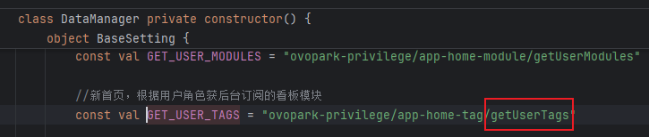
- 这个接口返回的数据是什么样的？
  - 我们可以看到，首先是我们的本月巡店次数，其没有children数据
  - 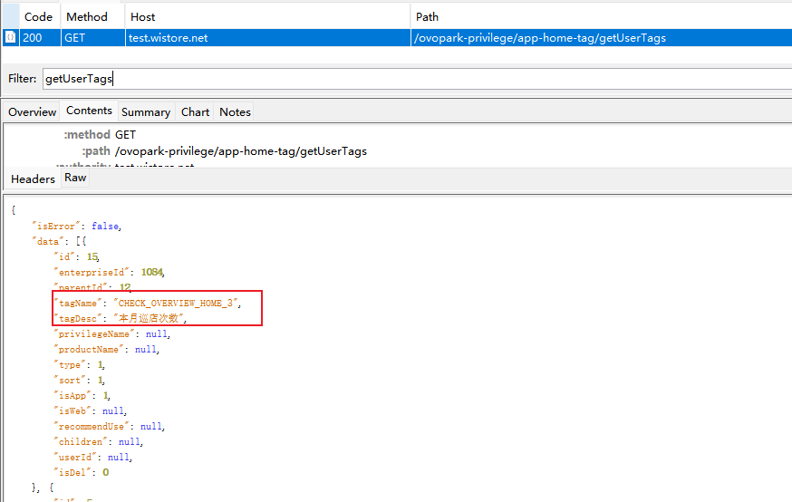
  - 对应我们的这个部分
  - 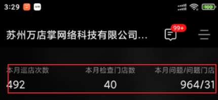
  - 然后是我们的巡店概览，包含我们的children：个人人效，门店分档等，门店检查比例，问题透视等
  - 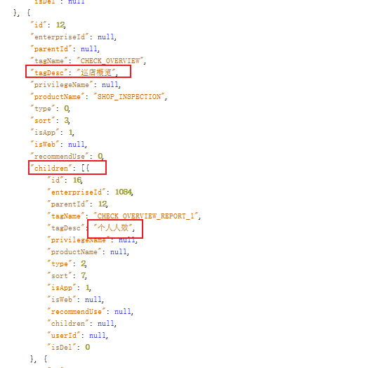
  - 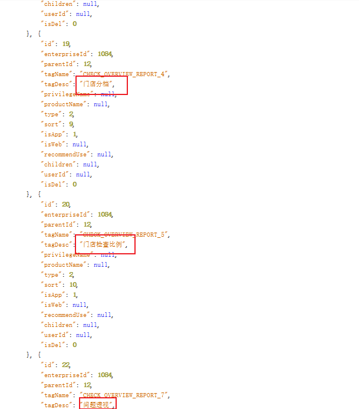
  - 对应这个
  - 
- ok，我们可以稍微总结一下
  - 我们这里获取了我们的标签实体，表明我们的floorFragment中有哪些标签数据
  - 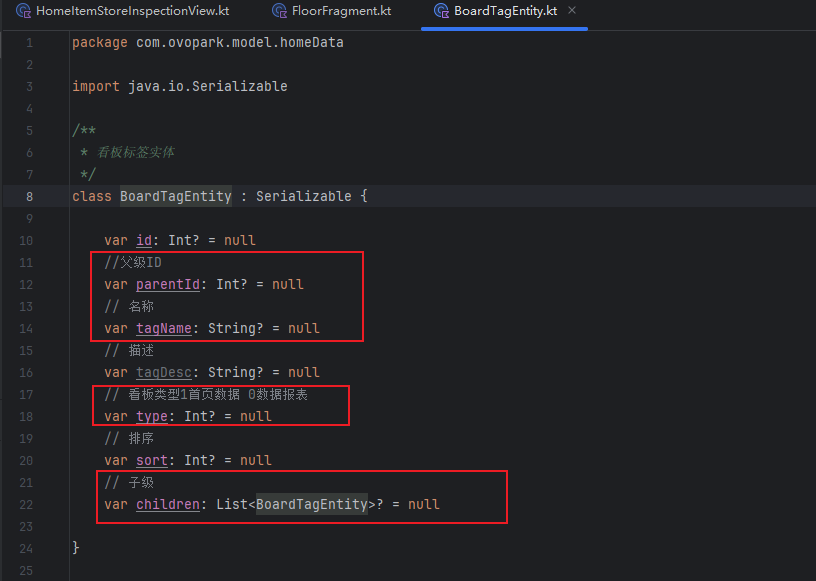

- 然后通过我们的floorFragment?.setItemList(list)赋值给我们的floorFragment

咦，这里的显示看板是什么意思？算了，过会看逻辑

- 代码
  - 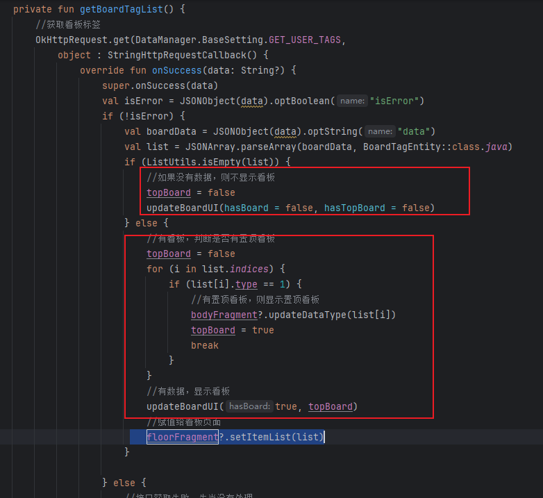
- 我猜测看板是这个
  - 

然后是子条目项的显示阶段

- 看看setItemList方法，设置列表，调用bindItemView
  - 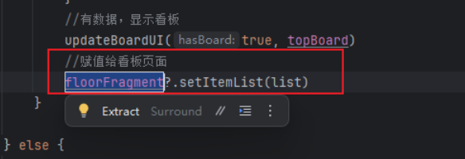
  - 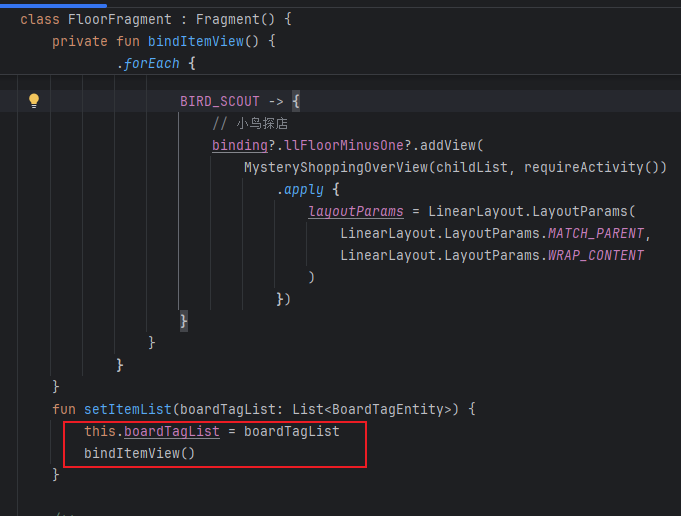
- 顺手来看看FloorFragment的onViewCreated，没啥好说，配置刷新控件和SmartRefreshLayout
  - 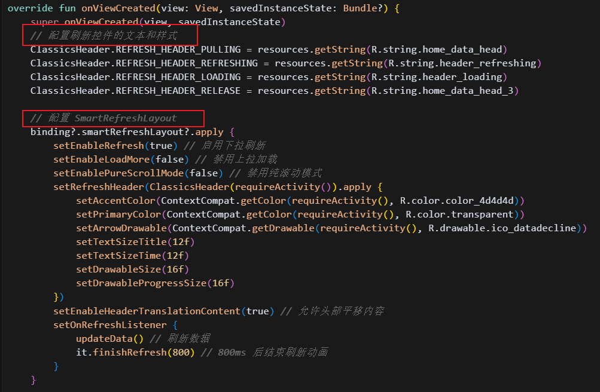
- ok，回看bindItemView
  - 首先处理置顶数据（type == 1）：优先显示置顶看板
  - 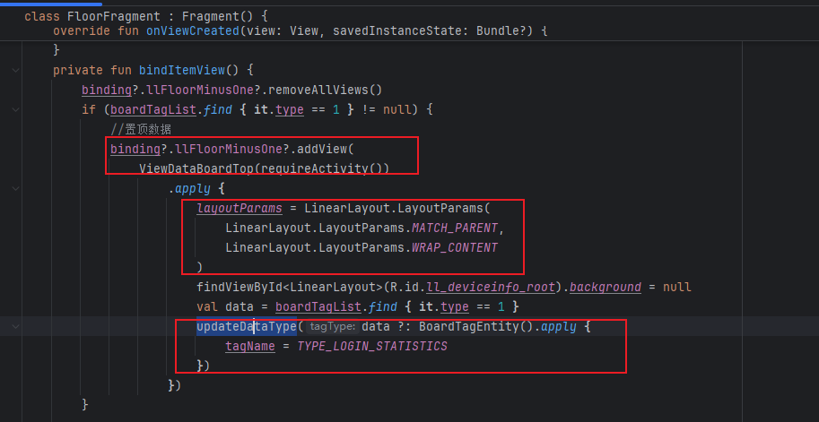
  - 这里的llFloorMinusOne是一个垂直的 LinearLayout
  - ok，然后处理其他的，过滤type = 0，排序，然后匹配添加
  - 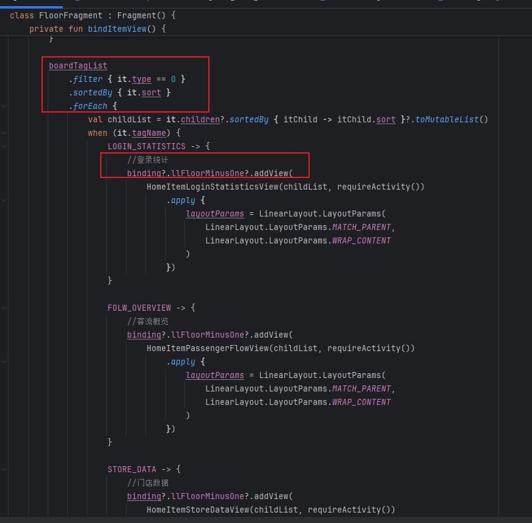
  - 其中巡店概览对应的是这个：HomeItemStoreInspectionView
  - 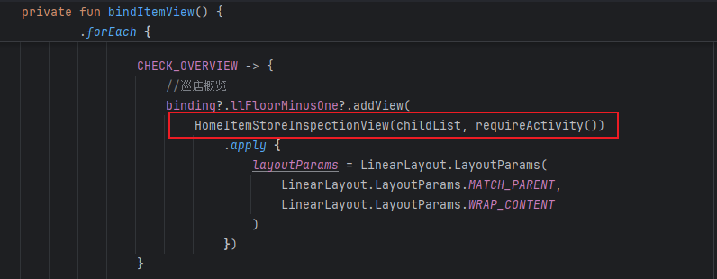

### 3.4 floorFragment请求数据

首先是数据请求的触发流程。

- 在initialize中调用initBehavior方法
  - 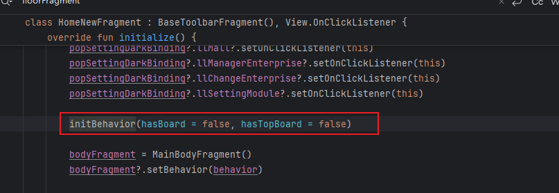
- initBehavior中调用floorFragment的updateData方法，
  - 

然后是调用流程

- 没啥好说的，依次调用Item，触发其getNetData
  - 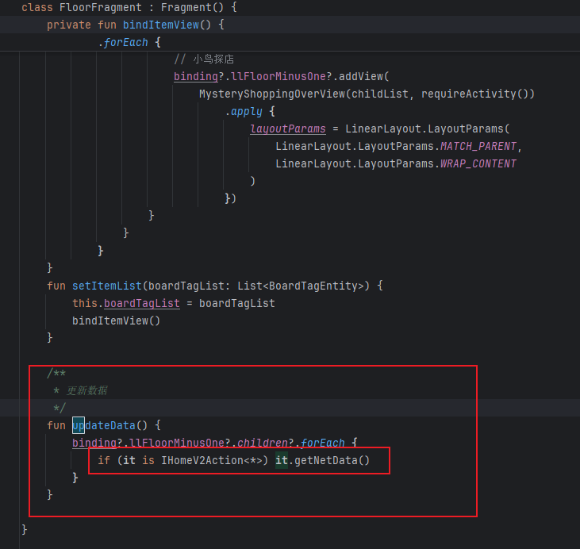

- 不对，还是要说一下的，这个getNetData是一个抽象接口，是我们上面的这些被添加的View所拥有的方法，所以我们这里是forEach，依次调用相关View的获取数据的方法
  - 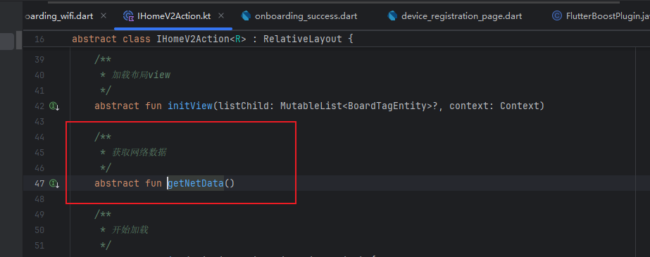
  - 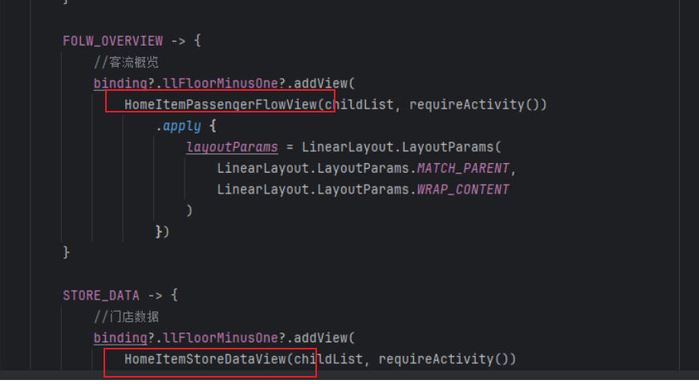

### 3.4 

### 3.5 

### 3.5 进一步思考

### 3.6 总结一下，整个数据的流转过程是什么样的?

## 04.底层原理

## 05.深度思考

### 5.0 存在的困惑

- 能否做首页看板的优化？这是一个很好的项目经历

- secondFloorBehavior是如何设计的？如何进行floorFragment的检测，控制其显示和消失的？以及最初的黑色块怎么显示的？他们为什么可以做到这么丝滑的？
  - 
- 视图的滑动显示逻辑是什么样的？这涉及到RecyclerView的底层原理（预测视图元素移动的位置？）
- addView到底做了什么？
  - 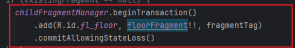

### 5.1 关键问题探究

### 5.2 设计对比

## 06.实践验证

### 6.1 行为验证代码

### 6.2 性能测试

## 07.应用场景

### 7.1 最佳实践

### 7.2 使用禁忌

## 08.总结提炼

### 8.1 核心收获

### 8.2 知识图谱

### 8.3 延伸思考

## 09.参考资料

1. 
2. 
3. 

## 其他介绍

### 01.关于我的博客

- csdn：http://my.csdn.net/qq_35829566

- 掘金：https://juejin.im/user/499639464759898

- github：https://github.com/jjjjjjava

- 邮箱：[934137388@qq.com]

