[toc]

## 前言

> 学习要符合如下的标准化链条：了解概念->探究原理->深入思考->总结提炼->底层实现->延伸应用"

## 01.学习概述

- **学习主题**：
- **知识类型**：
  - [ ] **知识类型**：
    - [ ] ✅Android/ 
      - [ ] ✅01.基础组件
      - [ ] ✅02.IPC机制
      - [ ] ✅03.消息机制
      - [ ] ✅04.View原理
      - [ ] ✅05.事件分发机制
      - [ ] ✅06.Window
      - [ ] ✅07.复杂控件
      - [ ] ✅08.性能优化
      - [ ] ✅09.流行框架
      - [ ] ✅10.数据处理
      - [ ] ✅11.动画
      - [ ] ✅12.Groovy
    - [ ] ✅音视频开发/
      - [ ] ✅01.基础知识
      - [ ] ✅02.OpenGL渲染视频
      - [ ] ✅03.FFmpeg音视频解码
    - [ ] ✅ Java/
      - [ ] ✅01.基础知识
      - [ ] ✅02.Java设计思想
      - [ ] ✅03.集合框架
      - [ ] ✅04.异常处理
      - [ ] ✅05.多线程与并发编程
      - [ ] ✅06.JVM
    - [ ] ✅ Kotlin/
      - [ ] ✅01.基础语法
      - [ ] ✅02.高阶扩展
      - [ ] ✅03.协程和流
    - [ ] ✅ 故障分析与处理/
      - [ ] ✅01.基础知识
    - [ ] ✅ 自我管理/
      - [ ] ✅01.内观
    - [ ] ✅ 业务逻辑/
      - [ ] ✅01.启动
      - [ ] ✅02.首页
      - [ ] ✅03.巡店
      - [ ] ✅04.云值守
      - [ ] ✅05.消息中心
      - [ ] ✅06.智控平台
- **学习来源**：
- **重要程度**：⭐⭐⭐⭐⭐
- **学习日期**：2025.
- **记录人**：@panruiqi

### 1.1 学习目标

- 了解概念->探究原理->深入思考->总结提炼->底层实现->延伸应用"

### 1.2 前置知识

- [ ] 

## 02.核心概念

### 2.1 业务痛点与需求

### 2.2 解决方案

### 2.3 基本特性

## 03.代码执行过程

### 3.0 引子_实际对应的页

在首屏看板中存在我们的巡店概览视图，其是LinearLayout的一个子视图

- 这是代码
  - 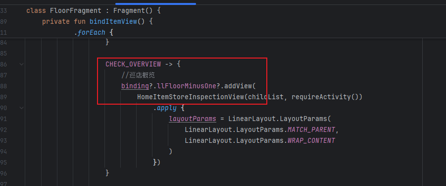
- 这是视图
  - 

这里为什么有巡店概览和另外的3个部分？回看 [02. 首页_二楼.md](02. 首页_二楼.md) ，我们从里面摘出一部分放到下面：

> 好，先来看floorFragment中条目项目的获取阶段
>
> - initialize阶段执行getBoardTagList方法
>   - 
>
> - 看看getBoardTagList方法，调用网络请求getUserTags，将结果设置给floorFragment
>   - 
> - 我们来看看这个过程：
>   - 调用getUserTags接口，对应如下
>   - 
> - 这个接口返回的数据是什么样的？
>   - 我们可以看到，首先是我们的本月巡店次数，其没有children数据
>   - 
>   - 对应我们的这个部分
>   - 
>   - 然后是我们的巡店概览，包含我们的children：个人人效，门店分档等，门店检查比例，问题透视等
>   - 
>   - 

ok，我们从哪开始看这段代码呢？就是HomeItemStoreInspectionView 的执行流程是什么样的呢？

HomeItemStoreInspectionView 的执行流程是这样的：

- FloorFragment 创建实例

  - 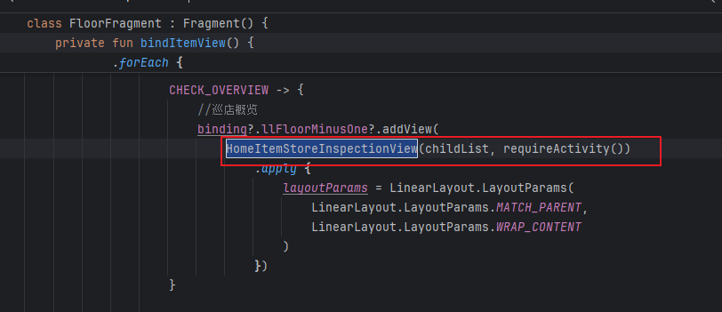

- 构造函数执行，调用父类 IHomeV2Action 的构造函数，父类构造函数内部应该会调用 initView(listChild, context)。

  - 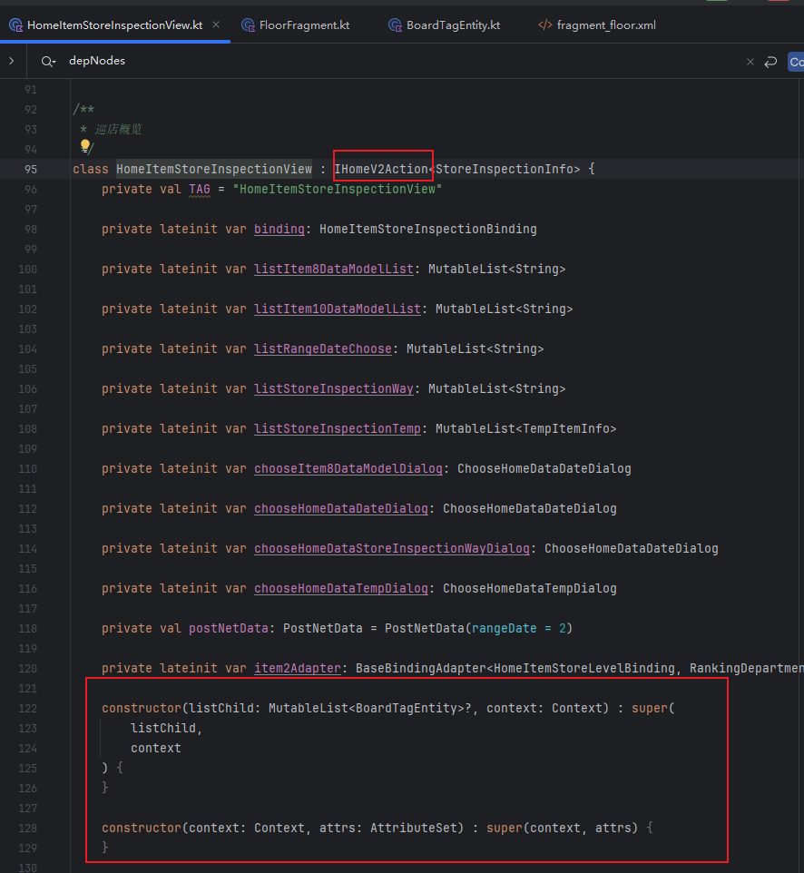

- 看看父类的构造函数

  - 因为在FloorFragment中创建的时候传递的是list和Context，所以最终走到这个initView的位置

  - 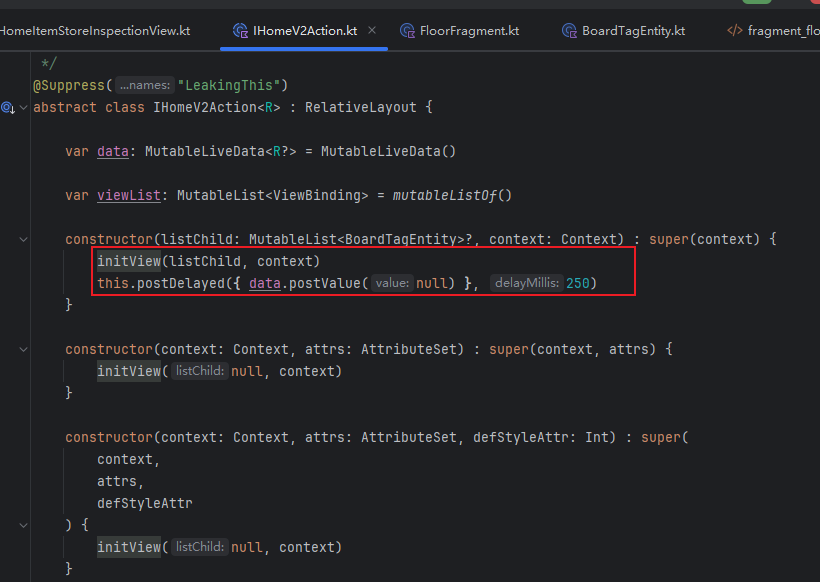

  - 也就是下面这个

  - 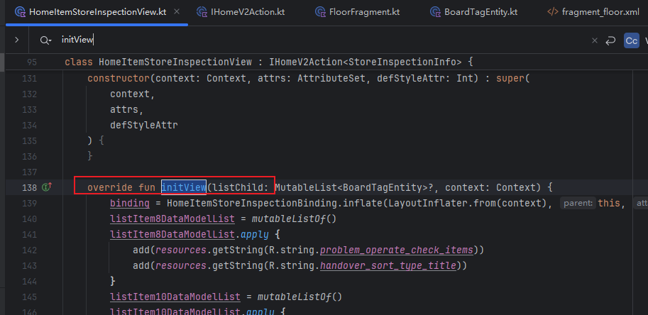

    

- 然后是被Fragment调用getNetData，这个getNetData是一个抽象接口，是我们上面的这些被添加的View所拥有的方法，所以我们这里是forEach，依次调用相关View的获取数据的方法
  
  - 

### 3.1 initView

initView 方法是一个复杂的初始化方法，我们慢慢来看吧。

第一部分：基础初始化阶段，负责绑定布局文件 和 初始化各种下拉选择列表的数据

- 绑定布局：创建并绑定 HomeItemStoreInspectionBinding

- 初始化下拉选择列表

  - listItem8DataModelList: 用于Screen8的数据视角选择（点检项/分类）
  - listItem10DataModelList: 用于Screen10的任务回顾类型（门店/人员）

  - listRangeDateChoose: 时间范围选择（上周/上月/今天/本周/本月）

  - listStoreInspectionWay: 巡店方式选择（全部/视频巡店/线下巡店/门店自查）

  - 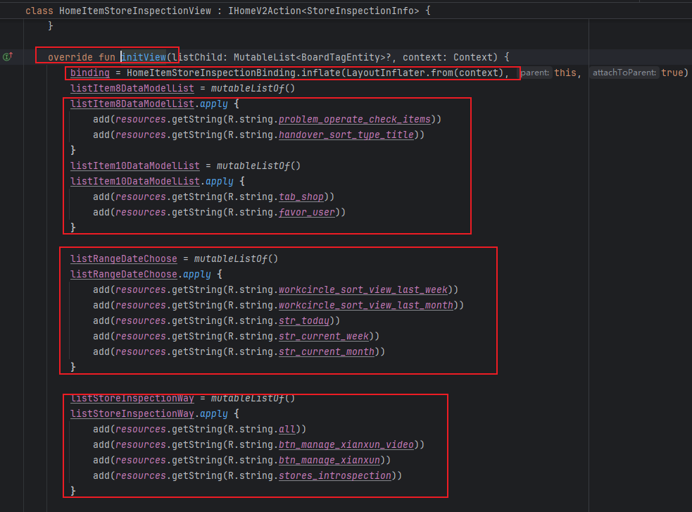

- 他们对应下面的：

  - 

第二部分：网络请求初始化。

- 我们分开来看，先看这个获取模板列表

  - 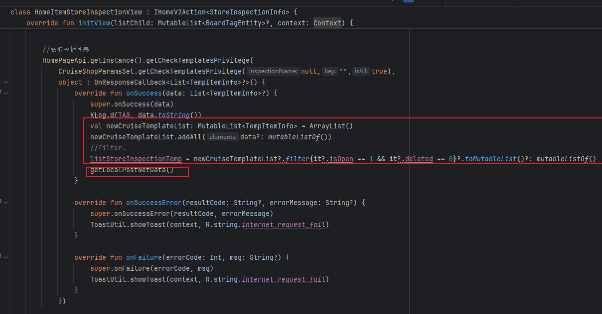
  - 接口API是这个
    - 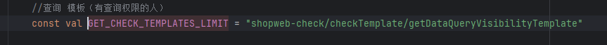
  - 他获取了巡店模板后先进行过滤。
    - it?.isOpen == 1：只保留已开放的模板
    - it?.deleted == 0：只保留未删除的模板
    - 只有开放且未删除的模板才能被用户选择使用
    - 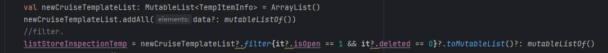
  - 然后调用本地数据恢复getLocalPostNetData()，这一块逻辑有点复杂，大致就是：用户重新打开应用时，尽可能保持之前的筛选条件，假如筛选模板被删除，也尽可能尝试恢复用户的选择。

- 然后我们来看看关键的获取组织架构信息

  - 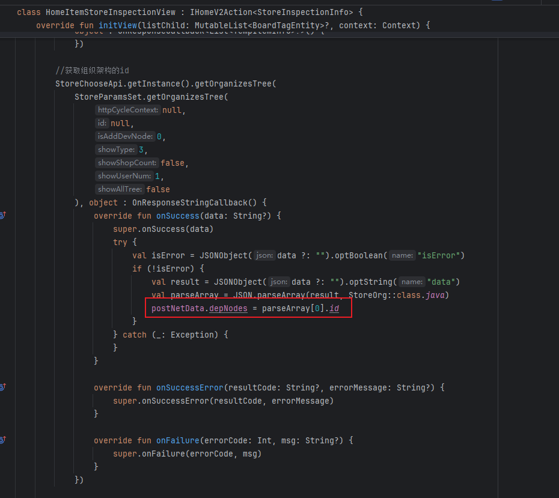
  - 这个获取到了id，并设置给我们的postNetData

- postNetData是这个巡店概览参数

  - 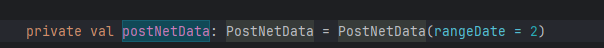

  - 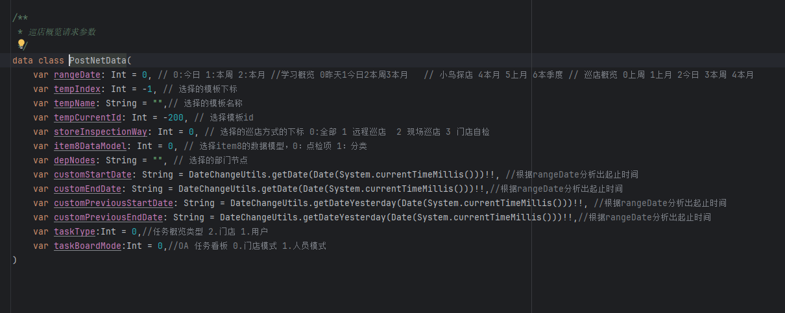

    

### 3.2 

### 3.3 

### 3.4 

### 3.5 进一步思考

### 3.6 总结一下，整个数据的流转过程是什么样的?

## 04.底层原理

## 05.深度思考

### 5.1 关键问题探究

### 5.2 设计对比

## 06.实践验证

### 6.1 行为验证代码

### 6.2 性能测试

## 07.应用场景

### 7.1 最佳实践

### 7.2 使用禁忌

## 08.总结提炼

### 8.1 核心收获

### 8.2 知识图谱

### 8.3 延伸思考

## 09.参考资料

1. 
2. 
3. 

## 其他介绍

### 01.关于我的博客

- csdn：http://my.csdn.net/qq_35829566

- 掘金：https://juejin.im/user/499639464759898

- github：https://github.com/jjjjjjava

- 邮箱：[934137388@qq.com]

