[toc]

## 前言

> 学习要符合如下的标准化链条：了解概念->探究原理->深入思考->总结提炼->底层实现->延伸应用"

## 01.学习概述

- **学习主题**：
- **知识类型**：
  - [ ] **知识类型**：
    - [ ] ✅Android/ 
      - [ ] ✅01.基础组件
      - [ ] ✅02.IPC机制
      - [ ] ✅03.消息机制
      - [ ] ✅04.View原理
      - [ ] ✅05.事件分发机制
      - [ ] ✅06.Window
      - [ ] ✅07.复杂控件
      - [ ] ✅08.性能优化
      - [ ] ✅09.流行框架
      - [ ] ✅10.数据处理
      - [ ] ✅11.动画
      - [ ] ✅12.Groovy
    - [ ] ✅音视频开发/
      - [ ] ✅01.基础知识
      - [ ] ✅02.OpenGL渲染视频
      - [ ] ✅03.FFmpeg音视频解码
    - [ ] ✅ Java/
      - [ ] ✅01.基础知识
      - [ ] ✅02.Java设计思想
      - [ ] ✅03.集合框架
      - [ ] ✅04.异常处理
      - [ ] ✅05.多线程与并发编程
      - [ ] ✅06.JVM
    - [ ] ✅ Kotlin/
      - [ ] ✅01.基础语法
      - [ ] ✅02.高阶扩展
      - [ ] ✅03.协程和流
    - [ ] ✅ 故障分析与处理/
      - [ ] ✅01.基础知识
    - [ ] ✅ 自我管理/
      - [ ] ✅01.内观
    - [ ] ✅ 业务逻辑/
      - [ ] ✅01.启动
      - [ ] ✅02.首页
      - [ ] ✅03.巡店
      - [ ] ✅04.云值守
      - [ ] ✅05.消息中心
      - [ ] ✅06.智控平台
- **学习来源**：
- **重要程度**：⭐⭐⭐⭐⭐
- **学习日期**：2025.
- **记录人**：@panruiqi

### 1.1 学习目标

- 了解概念->探究原理->深入思考->总结提炼->底层实现->延伸应用"

### 1.2 前置知识

- [ ] 

## 02.核心概念

### 2.1 业务痛点与需求

### 2.2 解决方案

### 2.3 基本特性

## 03.代码执行流

### 3.0 联系实际

ok，我们这个业务流程对应的是什么？

- 看下面的图片：这是点击门店下的视频设备，然后在回放模式中点击日期弹出的日历窗，里面可以看见日历，以及对应的某天的巡店情况，比如：红框中绿色的是现场巡店，橙色的是远程巡店。
  - 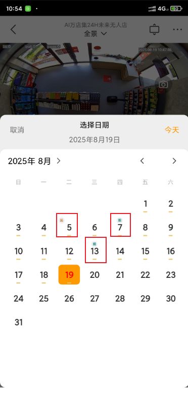
  - 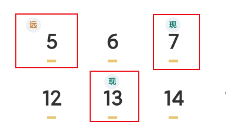

### 3.1 从日志开始，整体流程分析

首先是防抖机制：

- 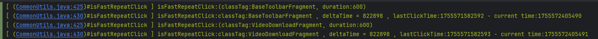

然后是巡店数据初始化

- 数据结构：日期~巡店类型，格式为 YYYY-MM-DD~状态

- 巡店类型：
  - nulllive：现场巡店
  - nullremote：远程巡店
  - 假：无巡店安排

- 下面是多条巡店记录，13号是live现场巡店，05是remote远程巡店，07也是现场巡店
  - 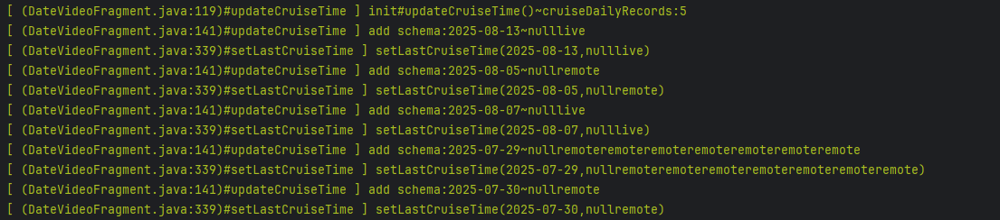
  - 他们对应下面的
  - 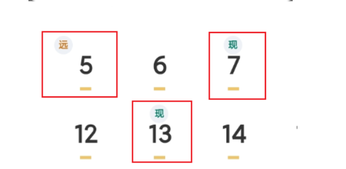

然后是日期设置与选择

- 设置当前选中的日期
  - 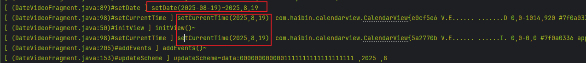
- 日历控件的选择事件被触发
  - 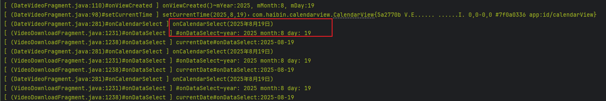

然后是巡店数据的传送

- 之前是获取数据，这里是设置数据
  - 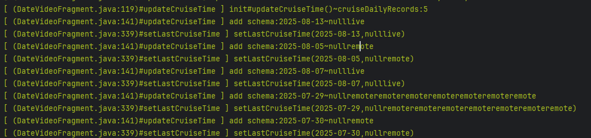

然后是日历视图的绘制逻辑

- 假代表啥也没有，nullremote代表是远程巡店，nulllive代表是现场巡店
  - 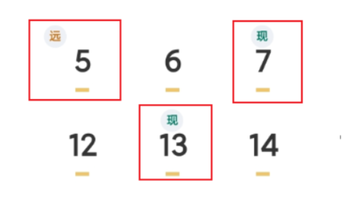
  - 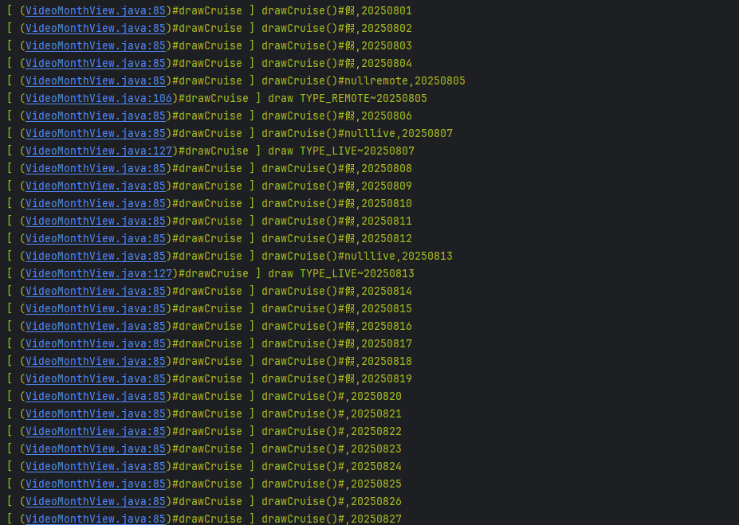

### 3.2 数据流是什么样的？

ok，我们大致有概念了，请问这里的数据流是什么样的？

首先是用户点击了切换按钮

- 按钮如下：
  - 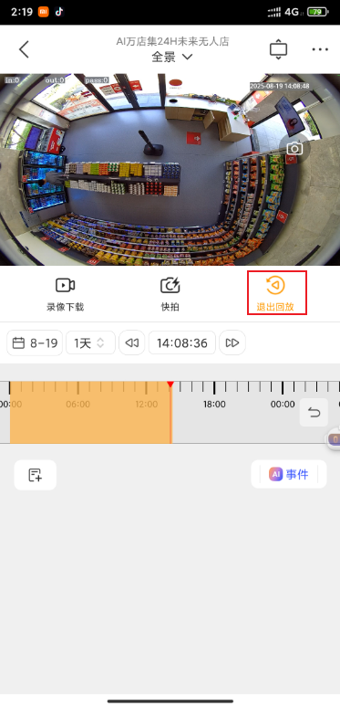
- 这个按钮时VideoActivity中的videoMendianDeviceManager，初始化状态为：
  - 初始化文字为回放
  - 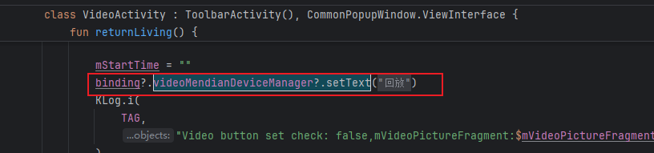
  - 点击后 为退出回放
  - 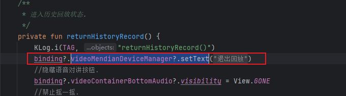
- ok，点击事件呢？
  - 首先是防抖，对应我们看到的CommonUtils的工具类
  - 然后是进入switchLivingHistory方法
  - 
  - 日志如
  - 

switchLivingHistory

- 直播回放切换方法，如果是回放页面，那么会调用VideoDownloadFragment.resetData()发起多个API请求，获取回放数据
  - 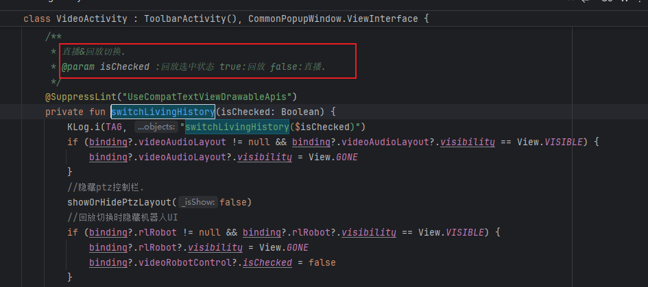
  - 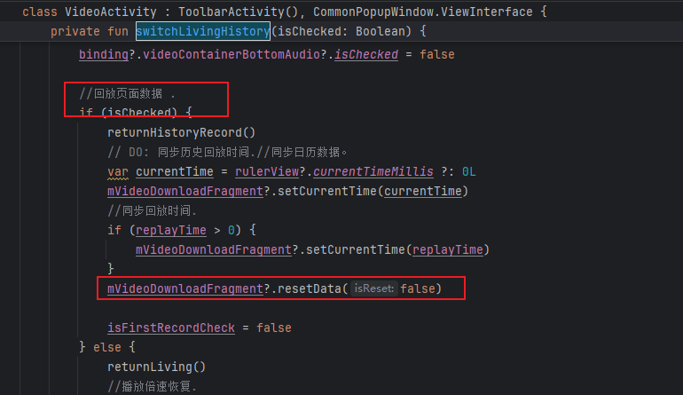

ok，前面是获取数据的入口，接下来我们看看真正的获取数据的过程

- 首先是resetData，调用getMonthData

  - 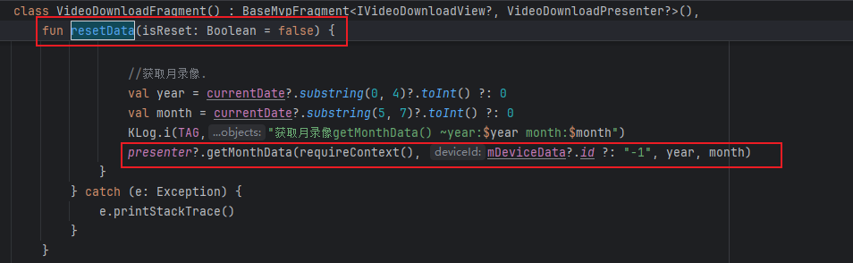

- getMonthData成功后调用getMonthDataSuccess

  - 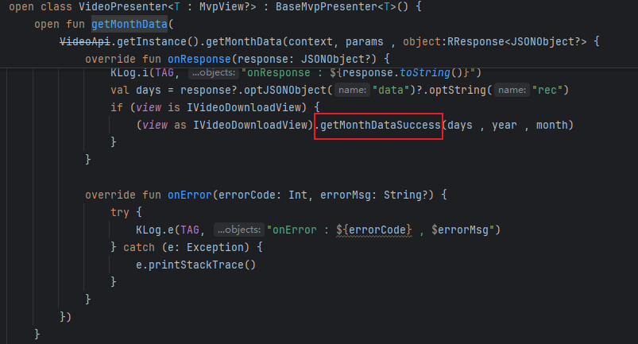

- ok，来到我们关键的getMonthRecordsData了

  - 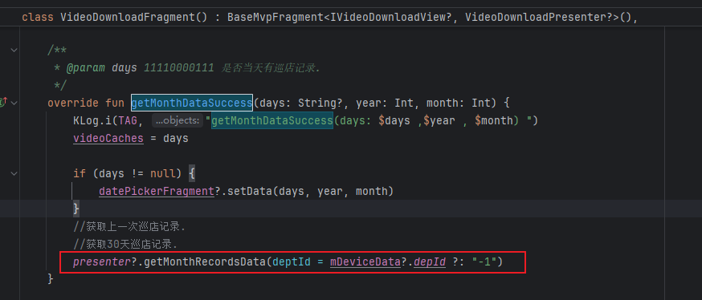
  - 调用presenter
  - 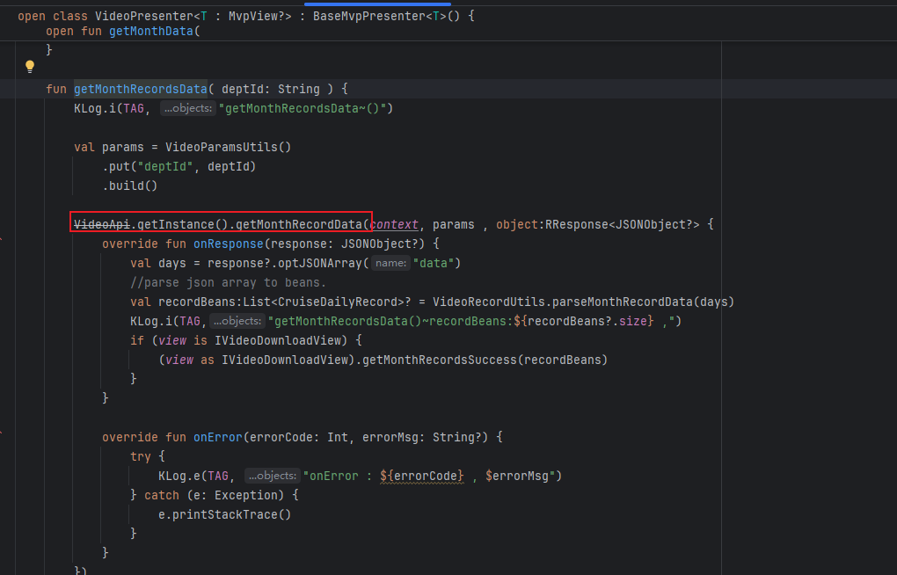
  - 往下调用
  - 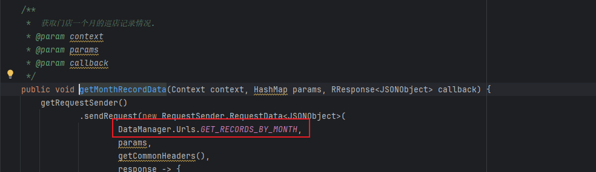
  - ok，最终的接口/shopweb-check/live-check-task-model/get30DayCheckTaskByDeptId
  - 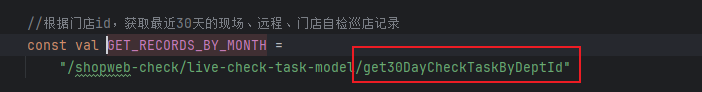

- API信息

  - 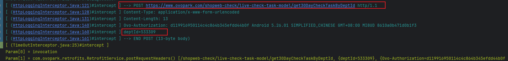

- 获取到的响应

  - 核心字段如下：

    - commitDate: 巡店提交日期

    - checkType: 巡店类型（0=现场live，1=远程remote）

    - isComplete: 完成状态（1=完成，4/5=其他状态）

    - score/totalScore: 巡店评分

  - 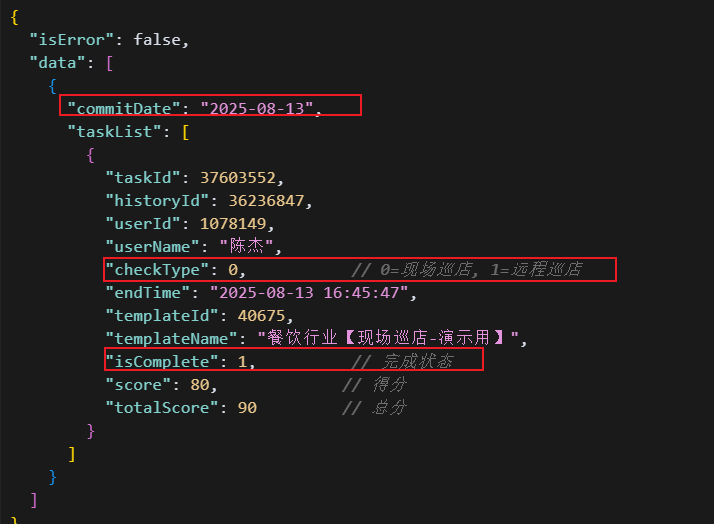

太棒了，我们拿到了最关键的数据了，然后呢？数据是如何进行转换的呢？

- 获取数据成功，打印日志，调用getMonthRecordSuccess方法
  - 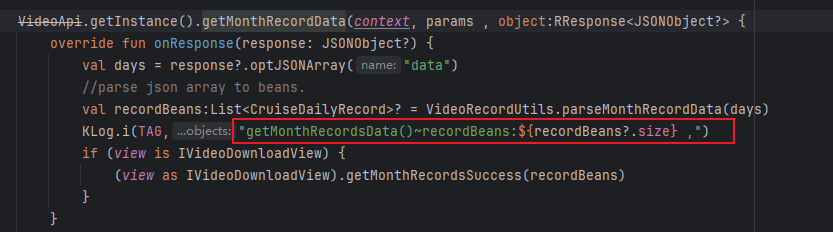
  - 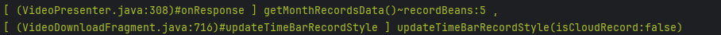
- 调用set30DaysSchema方法，进一步调用updateCruiseTime方法
  - 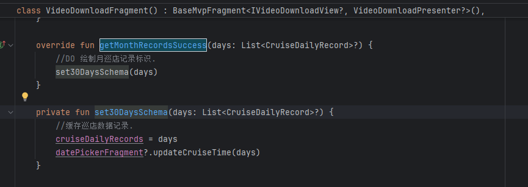
- updateCruiseTime方法中打印日志，同时添加remote，live，r&l等标记
  - 
  - 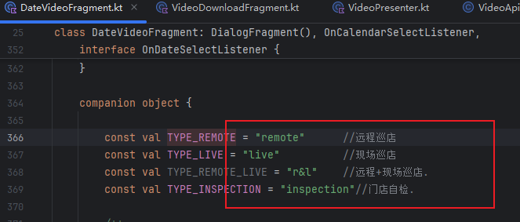
  - 也就是下面的日志，太棒了，我们终于回来了
  - 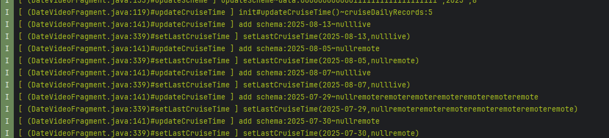

但是还缺少一个，日历的点击事件

- 先看日志
  - 

- 点击事件
  - 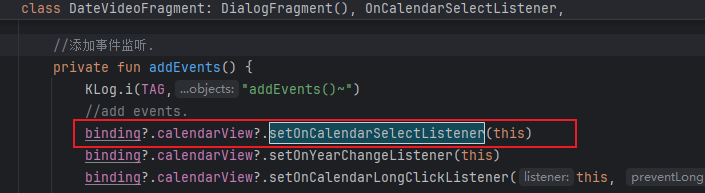
- 触发回调
  - 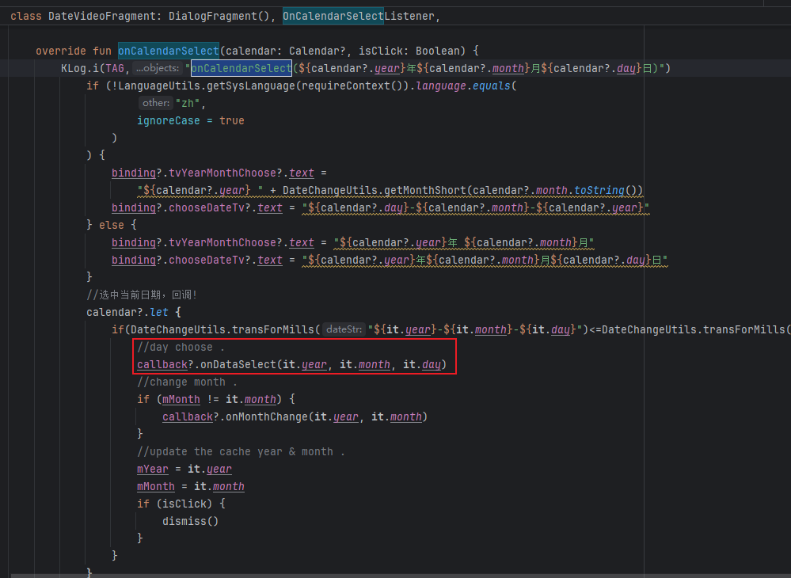
- 对应这个位置
  - 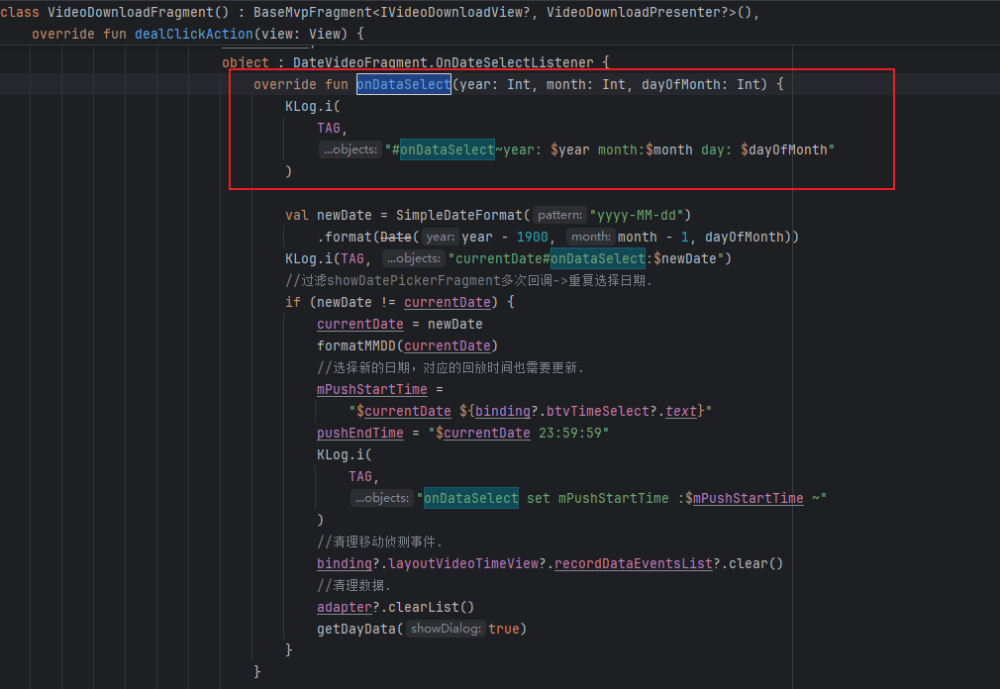

### 3.3 

### 3.4 

### 3.5 进一步思考

### 3.6 总结一下，整个数据的流转过程是什么样的?

## 04.底层原理

## 05.深度思考

### 5.1 关键问题探究

### 5.2 设计对比

## 06.实践验证

### 6.1 行为验证代码

### 6.2 性能测试

## 07.应用场景

### 7.1 最佳实践

### 7.2 使用禁忌

## 08.总结提炼

### 8.1 核心收获

### 8.2 知识图谱

### 8.3 延伸思考

## 09.参考资料

1. 
2. 
3. 

## 其他介绍

### 01.关于我的博客

- csdn：http://my.csdn.net/qq_35829566

- 掘金：https://juejin.im/user/499639464759898

- github：https://github.com/jjjjjjava

- 邮箱：[934137388@qq.com]

