[toc]

## 前言

> 学习要符合如下的标准化链条：了解概念->探究原理->深入思考->总结提炼->底层实现->延伸应用"

## 01.学习概述

- **学习主题**：
- **知识类型**：
  - [ ] **知识类型**：
    - [ ] ✅Android/ 
      - [ ] ✅01.基础组件
      - [ ] ✅02.IPC机制
      - [ ] ✅03.消息机制
      - [ ] ✅04.View原理
      - [ ] ✅05.事件分发机制
      - [ ] ✅06.Window
      - [ ] ✅07.复杂控件
      - [ ] ✅08.性能优化
      - [ ] ✅09.流行框架
      - [ ] ✅10.数据处理
      - [ ] ✅11.动画
      - [ ] ✅12.Groovy
    - [ ] ✅音视频开发/
      - [ ] ✅01.基础知识
      - [ ] ✅02.OpenGL渲染视频
      - [ ] ✅03.FFmpeg音视频解码
    - [ ] ✅ Java/
      - [ ] ✅01.基础知识
      - [ ] ✅02.Java设计思想
      - [ ] ✅03.集合框架
      - [ ] ✅04.异常处理
      - [ ] ✅05.多线程与并发编程
      - [ ] ✅06.JVM
    - [ ] ✅ Kotlin/
      - [ ] ✅01.基础语法
      - [ ] ✅02.高阶扩展
      - [ ] ✅03.协程和流
    - [ ] ✅ 故障分析与处理/
      - [ ] ✅01.基础知识
    - [ ] ✅ 自我管理/
      - [ ] ✅01.内观
    - [ ] ✅ 业务逻辑/
      - [ ] ✅01.启动
      - [ ] ✅02.首页
      - [ ] ✅03.巡店
      - [ ] ✅04.云值守
      - [ ] ✅05.消息中心
      - [ ] ✅06.智控平台
- **学习来源**：
- **重要程度**：⭐⭐⭐⭐⭐
- **学习日期**：2025.
- **记录人**：@panruiqi

### 1.1 学习目标

- 了解概念->探究原理->深入思考->总结提炼->底层实现->延伸应用"

### 1.2 前置知识

- [ ] 

## 02.核心概念

### 2.1 业务痛点与需求

### 2.2 解决方案

### 2.3 基本特性

## 03.代码执行过程

### 3.0 引子_实际对应的页

对应这个

- 

这里我们不会进行详细介绍，他的原理很容易搞明白。

分为以下几个主要的部分：

- 数据模型：allList、newAllList等用来存储筛选配置
- 委托模式：selectDelegate、timeDelegate、contactDelegate、templateDelegate
- 两种模式：isMyCruise（我的巡店）、myManage（我管辖的）
- 各种筛选参数：用户ID、模板ID、门店ID、审核人等
- 事件处理：EventBus处理各种选择结果

总结来说：上面视图的巡店方式，巡店状态等委托给Delegate处理。然后点击事件使用EventBus监听。

核心流程

- 初始化：加载配置、设置委托
- 模式切换：switchMyCruise()、switchManagerCruise()
- 权限控制：根据不同权限显示/隐藏选项
- 事件处理：处理用户选择、门店选择、模板选择等

### 3.1 先看看数据模型

- 没啥好说的
  - 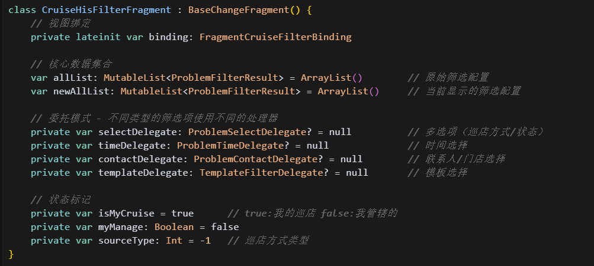

### 3.2 看看委托模式的设计

挑一个联系人委托 - 处理巡店人、审核人、门店、计划巡店选择

- 没啥好说的，配置其点击跳转的方法，选择计划巡店任务就readyGo(PlanTaskNameActivity::class.java)
  - 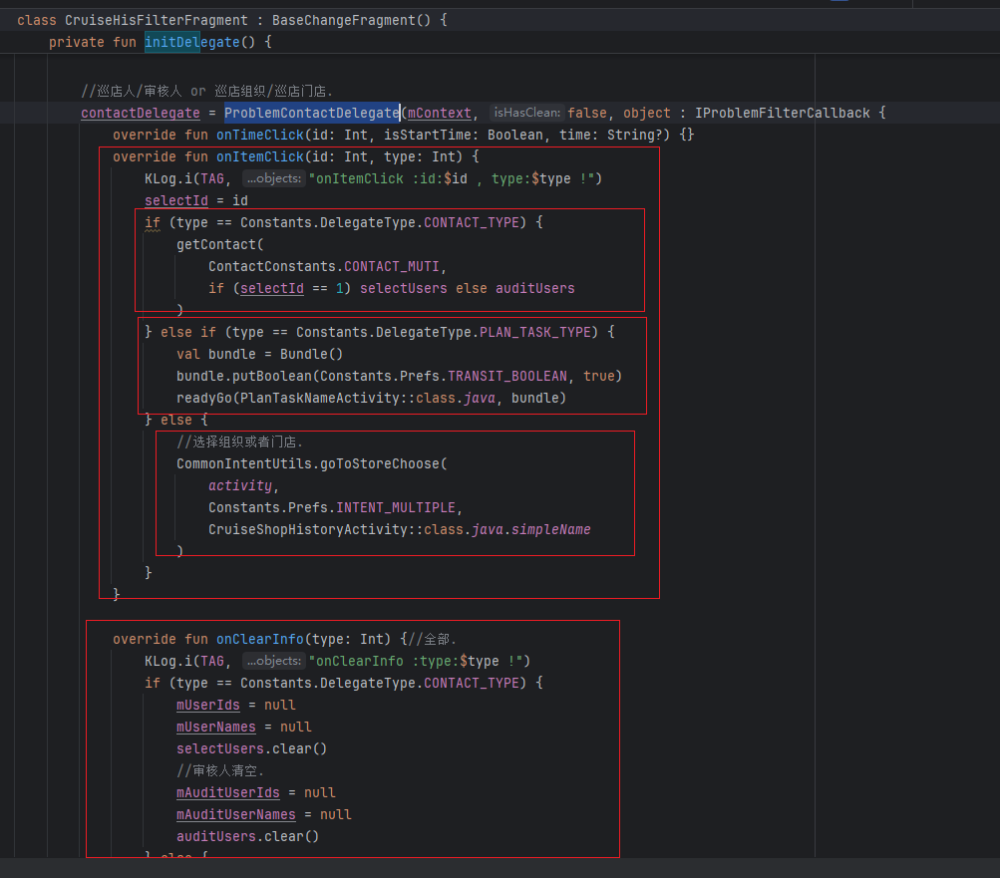

简要看一下ProblemContactDelegate内部

- 视图绑定 和 支持筛选的类型判断
  - 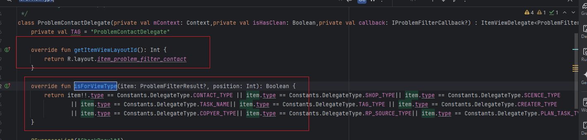
- UI布局就是这个
  - 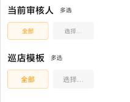
  - 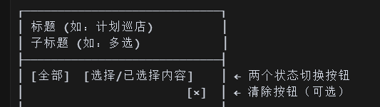
- 已选择状态：显示选择内容，高亮"选择"按钮；未选择状态：高亮"全部"按钮。唉，就是上面的高亮的全部按钮
  - 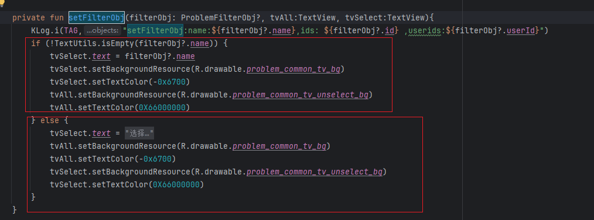
- 点击事件
  - 点击选择按钮，设置颜色，调用onItemClick。点击全部按钮，设置颜色，callback?.onClearInfo(result.type)  触发清空逻辑;
  - 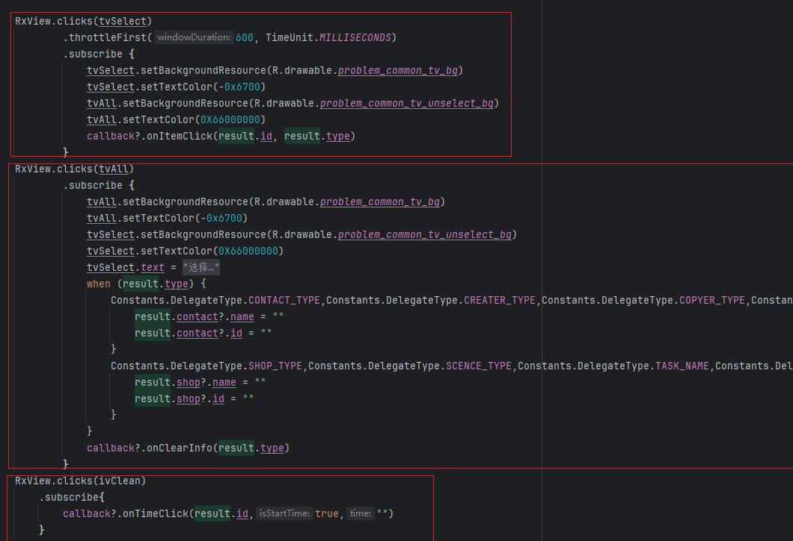
- 设置标题的逻辑
  - 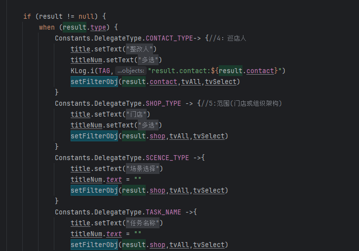
- 根据desc设置自定义的标题
  - 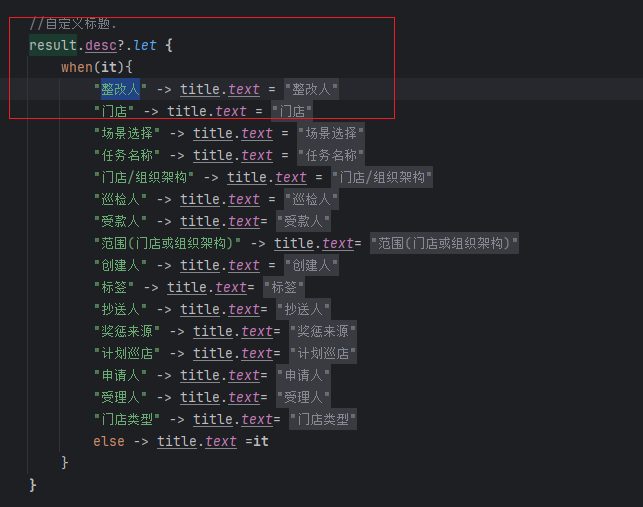

> 好，我现在没懂的是：
>
> 他会自动将adapter的数据转交给对应的Delegate，通过isForViewType判断吗？然后生成对应的视图？那么顺序呢？就是adapter.data的顺序？
>
> - 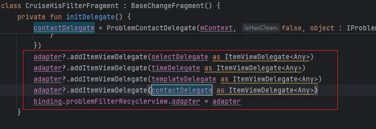
>
> 原理
>
> - 委托模式
>   - 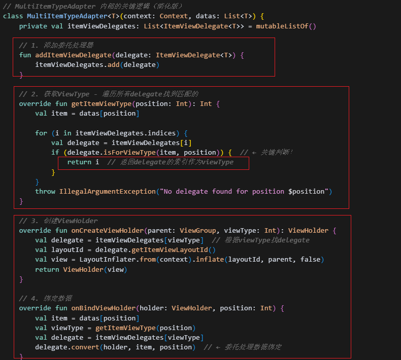
> - 大致流程这样：
>   - 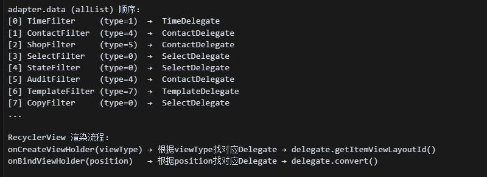

### 3.3 

### 3.4 

### 3.5 进一步思考

### 3.6 总结一下，整个数据的流转过程是什么样的?

## 04.底层原理

## 05.深度思考

### 5.1 关键问题探究

### 5.2 设计对比

## 06.实践验证

### 6.1 行为验证代码

### 6.2 性能测试

## 07.应用场景

### 7.1 最佳实践

### 7.2 使用禁忌

## 08.总结提炼

### 8.1 核心收获

### 8.2 知识图谱

### 8.3 延伸思考

## 09.参考资料

1. 
2. 
3. 

## 其他介绍

### 01.关于我的博客

- csdn：http://my.csdn.net/qq_35829566

- 掘金：https://juejin.im/user/499639464759898

- github：https://github.com/jjjjjjava

- 邮箱：[934137388@qq.com]

