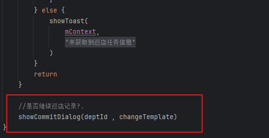
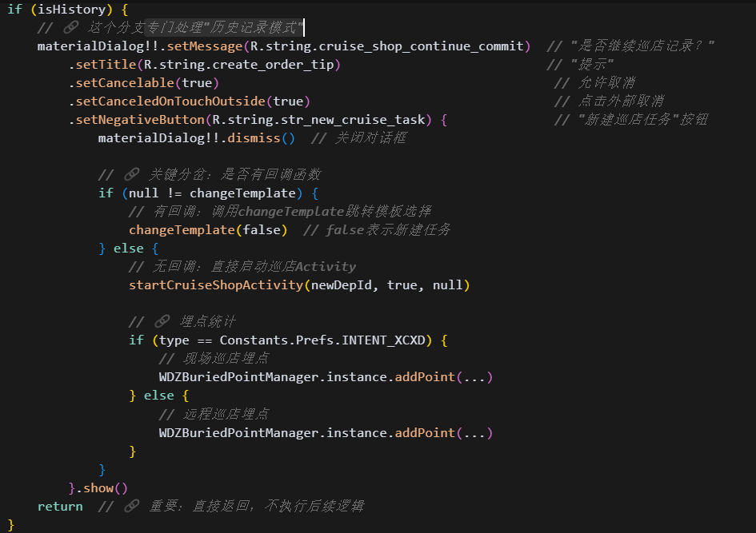
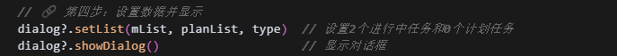

[toc]

## 前言

> 学习要符合如下的标准化链条：了解概念->探究原理->深入思考->总结提炼->底层实现->延伸应用"

## 01.学习概述

- **学习主题**：
- **知识类型**：
  - [ ] **知识类型**：
    - [ ] ✅Android/ 
      - [ ] ✅01.基础组件
      - [ ] ✅02.IPC机制
      - [ ] ✅03.消息机制
      - [ ] ✅04.View原理
      - [ ] ✅05.事件分发机制
      - [ ] ✅06.Window
      - [ ] ✅07.复杂控件
      - [ ] ✅08.性能优化
      - [ ] ✅09.流行框架
      - [ ] ✅10.数据处理
      - [ ] ✅11.动画
      - [ ] ✅12.Groovy
    - [ ] ✅音视频开发/
      - [ ] ✅01.基础知识
      - [ ] ✅02.OpenGL渲染视频
      - [ ] ✅03.FFmpeg音视频解码
    - [ ] ✅ Java/
      - [ ] ✅01.基础知识
      - [ ] ✅02.Java设计思想
      - [ ] ✅03.集合框架
      - [ ] ✅04.异常处理
      - [ ] ✅05.多线程与并发编程
      - [ ] ✅06.JVM
    - [ ] ✅ Kotlin/
      - [ ] ✅01.基础语法
      - [ ] ✅02.高阶扩展
      - [ ] ✅03.协程和流
    - [ ] ✅ 故障分析与处理/
      - [ ] ✅01.基础知识
    - [ ] ✅ 自我管理/
      - [ ] ✅01.内观
    - [ ] ✅ 业务逻辑/
      - [ ] ✅01.启动
      - [ ] ✅02.首页
      - [ ] ✅03.巡店
      - [ ] ✅04.云值守
      - [ ] ✅05.消息中心
      - [ ] ✅06.智控平台
- **学习来源**：
- **重要程度**：⭐⭐⭐⭐⭐
- **学习日期**：2025.
- **记录人**：@panruiqi

### 1.1 学习目标

- 了解概念->探究原理->深入思考->总结提炼->底层实现->延伸应用"

### 1.2 前置知识

- [ ] 

## 02.核心概念

### 2.1 业务痛点与需求

### 2.2 解决方案

### 2.3 基本特性

## 03.代码执行过程

### 3.0 引子_怎么走到这来的？

 先看这个的3.4  [03. 巡店_现场巡店门店选择逻辑.md](03. 巡店_现场巡店门店选择逻辑.md) 

先是点击事件

- 从这个位置点击子条目Item
  - 
- 这个点击事件会调用下面的，getPlanLiveTaskList，尝试获取计划巡店任务列表，获取成功后设置给planList；如果mList和planList都是空，也就是说没有正在进行中的巡店任务和计划中的巡店任务，那么去从模板中选择新的巡店任务
  - 
  - 如果计划巡店任务列表和进行中的巡店任务列表都不为空，则调用showCommitDialog显示Dialog 
  - 

ok，我们现在开始走分支了，先看看showCommitDialog，也就是有进行中的任务时

- showCommitDialog
  - 作用：当检测到门店有进行中任务时，询问用户是继续现有任务还是新建任务。
  - 分为两个部分，一个是：setDialog设置对话框样式；另一个是：专门处理"历史记录模式"的分支，这个应该是历史巡店的分支
  - 
  - 

setDialog，显示这个弹窗

- 显示这个弹窗
  - 
- 其实就是创建了一个CruiseUnderwayDialog
  - 
  - 设置弹窗的数据并显示
  - 
- CruiseUnderwayDialog，内部有一个适配器，可以显示相关的数据
  - 对应这个里面的Dialog
  - 
  - 

那么如果没有进行中的任务呢？

- 我们会执行changeTemplate，但是我们可以看到他是一个传递进来的lambda表达式。
  - 
- 他最终是我们这个的整个流程的发起者：门店经理检查传递进来的。
  - 
- ok，我们可以看到，这个方法中构建参数，然后根据权限有两个分支，一个是跳转到：CruiseSelectTemplateActivity::class.java,另一个则是：CruiseShopSubscribeChangeActivity::class.java,
  - 

我们先来看看CruiseShopSubscribeChangeActivity

- 因为我们实际点击是跳转到这里的
  - 
- 对应下面的页
  - 

### 3.1 用户操作概览

好，我们创建巡店任务，其实就是两个过程：

- 点击上下面的
  - 
- 进入到拍照页面，拍照完成后点击开始巡店
  - 
- 最后到创建好的巡店任务界面
  - 

### 3.2 

ok，我们先来看看CruiseShopSubscribeChangeActivity

- 因为我们实际点击是跳转到这里的
  - 
- 对应下面的页
  - 
- 嗯，内部有两个Fragment
  - 
- 我们这里的选择模板，对应的是这个templateFragment

ok，来看看templateFragment，首先是用户的点击事件，也就是点击了上面的子条目后的执行流

- 点击事件，因为需要签到走到isNeedSignInPhoto
  - 

- API检测是否需要拍照签到，onSuccess钟根据data的值去跳转到startCruiseShopActivity拍照签到检测方法，最后回finish当前activity
  - 

- startCruiseShopActivity中设置ARouter跳转的路径clazz

  - 这里满足条件：needSignPhoto = true (API检查返回需要签到)；signinPics 为空 (没有已有的签到图片)；isCreateTask = true (是创建新任务)

  - 

  - 所以走的是下面的路径

  - 

  - 最后通过ARouter，设置路径，跳转到对应的页

  - 

### 3.3 拍照签到逻辑

我们首先进入到CruiseShopSignActivity页

首先是他内部的初始化逻辑

- 一堆的获取intent
  - 
- 开始定位，这个无关主线，时间问题，暂时忽略
  - 

先看拍照逻辑

- 按钮点击事件
  - 
  - 

- 点击后触发takePhoto
- 首先是防抖，定位判断，等待上一次拍照结束，设置图片存放路径
  - 

- 然后是调用imageCapture.takePicture方法实际拍摄照片，传递回调，里面有个重要的回调：onImageSaved图片保存回调。内部会启动一个IO协程对图片进行额外的处理
  - 

> imageCapture.takePicture方法是什么？
>
> - 点进去，是个SDK
>   - 

- 好，我们详细看看协程中怎么处理这个已拍摄的图片的
- 首先是图片旋转逻辑
  - 
- 然后是图片的缩放逻辑
  - 
- 最后是图片的加水印
  - 
- 好，图片拍完了，接下来切换到Main的作用域，更新视图，隐藏拍照按钮，显示巡店开始button，然后将图片通过Glide加载
  - 
  - 最后也就是我们的这个样子
  - 

### 3.4 创建巡店任务

然后是开始巡店按钮的点击事件

- 触发goToCruise
  - 
  - 

看看goToCruise

- 首先防抖，然后判断有没有拍照图片，接着是对isEnable的判断
  - 

- 我们来看看对isEnable的判断
  - 
  - 定位失败，重新定位；正在定位则显示Toast
  - 
  - 如果是超出巡店范围，比较有意思，会显示Dialog，提示：位置超出门店签到范围，此时可以强制点击确定按钮开启巡店，此时会dismiss这个Dialog，然后调用asyncPutImageEventBus上传图片
  - 
  - 如果正常就是直接上传图片，不需要确定的逻辑
  - 

好，我们来看看asyncPutImageEventBus，好吧，暂时不看，只需要知道，OSS上传成功后，会通过EventBus发送 OssUploadEvent 事件。

我们来看看拍照Activity这里的OssUploadEvent处理方法

- event.isSuccess，成功则关闭上传进度对话框。 然后计算举例，最后调用createLiveCheckTask 创建巡店任务
  - 

好，我们来看看createLiveCheckTask

- 显示创建巡店记录门店坐标（？这是什么？）然后调用API，下面的这个API，尝试创建巡店任务
  - 
  - 

- 然后在这个API响应中，start阶段创建一个请稍后的Dialog；成功阶段解析isError字段，如果错误，那么会进一步解析code字段，调用handleCreateError处理错误码；如果没错误，那么会解析参数，调用startCruiseShop尝试跳转到主页面
  - 

然后我们来看startCruiseShop的创建巡店任务的跳转逻辑

- 没啥好说的，put一些参数。然后根据是否协调巡店，设置对应的clazz，然后设置intent，最后start启动。
  - 

我们这里最终是走到了CruiseShopChangeActivity中

- 这是日志
  - 
- 也就是下面的创建好的巡店任务界面
  - 

### 3.5 handleCreateError，处理巡店任务创建失败的情况

什么时候巡店任务会创建失败？比如我们下面的这个需求：

- 创建巡店任务，如果他的服务不在有效期内，那么我们会让其创建失败
  - 
  - 

看看handleCreateError的逻辑

- 调用CruiseShopUtils.createLiveCheckSuccessError，获得needBack 和 tips，tips用于设置message，根据needBack去选择是提示失败+切换模板选项还是只是普通的问题提示
  - 

好，关键在于CruiseShopUtils.createLiveCheckSuccessError，怎么获取needBack和tips

- 显示根据resultCode设置tips
  - 
- 然后根据巡店类型，执行对应的callback.invoke，没啥好说的
  - 

### 3.6 总结一下，整个数据的流转过程是什么样的?

## 04.底层原理

## 05.深度思考

### 5.1 关键问题探究

### 5.2 设计对比

## 06.实践验证

### 6.1 行为验证代码

### 6.2 性能测试

## 07.应用场景

### 7.1 最佳实践

### 7.2 使用禁忌

## 08.总结提炼

### 8.1 核心收获

### 8.2 知识图谱

### 8.3 延伸思考

## 09.参考资料

1. 
2. 
3. 

## 其他介绍

### 01.关于我的博客

- csdn：http://my.csdn.net/qq_35829566

- 掘金：https://juejin.im/user/499639464759898

- github：https://github.com/jjjjjjava

- 邮箱：[934137388@qq.com]

