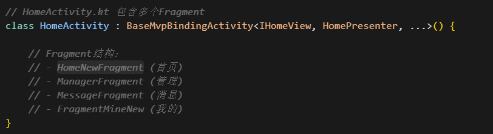
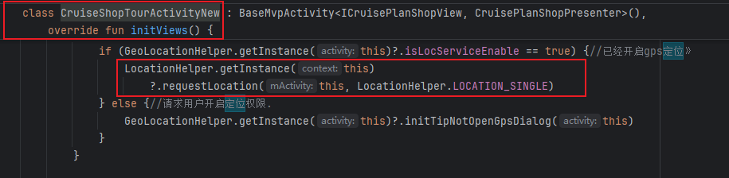
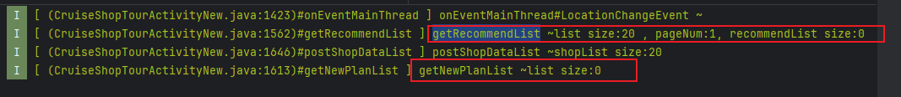

[toc]

## 前言

> 学习要符合如下的标准化链条：了解概念->探究原理->深入思考->总结提炼->底层实现->延伸应用"

## 01.学习概述

- **学习主题**：
- **知识类型**：
  - [ ] **知识类型**：
    - [ ] ✅Android/ 
      - [ ] ✅01.基础组件
      - [ ] ✅02.IPC机制
      - [ ] ✅03.消息机制
      - [ ] ✅04.View原理
      - [ ] ✅05.事件分发机制
      - [ ] ✅06.Window
      - [ ] ✅07.复杂控件
      - [ ] ✅08.性能优化
      - [ ] ✅09.流行框架
      - [ ] ✅10.数据处理
      - [ ] ✅11.动画
      - [ ] ✅12.Groovy
    - [ ] ✅音视频开发/
      - [ ] ✅01.基础知识
      - [ ] ✅02.OpenGL渲染视频
      - [ ] ✅03.FFmpeg音视频解码
    - [ ] ✅ Java/
      - [ ] ✅01.基础知识
      - [ ] ✅02.Java设计思想
      - [ ] ✅03.集合框架
      - [ ] ✅04.异常处理
      - [ ] ✅05.多线程与并发编程
      - [ ] ✅06.JVM
    - [ ] ✅ Kotlin/
      - [ ] ✅01.基础语法
      - [ ] ✅02.高阶扩展
      - [ ] ✅03.协程和流
    - [ ] ✅ 故障分析与处理/
      - [ ] ✅01.基础知识
    - [ ] ✅ 自我管理/
      - [ ] ✅01.内观
    - [ ] ✅ 业务逻辑/
      - [ ] ✅01.启动
      - [ ] ✅02.首页
      - [ ] ✅03.巡店
      - [ ] ✅04.云值守
      - [ ] ✅05.智控平台
- **学习来源**：
- **重要程度**：⭐⭐⭐⭐⭐
- **学习日期**：2025.
- **记录人**：@panruiqi

### 1.1 学习目标

- 了解概念->探究原理->深入思考->总结提炼->底层实现->延伸应用"

### 1.2 前置知识

- [ ] 

## 02.核心概念

### 2.1 业务痛点与需求

### 2.2 解决方案

### 2.3 基本特性

## 03.代码执行流

### 3.1 从HomeActivity开始进入现场巡店模块

首页界面结构

- 首页包含多个Fragment
  - 
- 其中HomeNewFragment内部拥有 *MainBodyFragment*，其内部会显示各个模块，我们这里设置其点击事件，通过Presenter处理模块跳转
  - 

模块跳转逻辑

- Presenter持有的模块跳转逻辑，如果是标准化模块会使用Utils工具类处理模块间跳转
  - 
- 详细跳转逻辑在工具类中，对于现场巡店模块，根据UI配置决定跳转到哪个Activity。新版UI，最终跳转到CruiseShopTourActivityNew中，如果是旧版的UI，那就跳到CruiseShopTour中
  - 

### 3.2 现场巡店模块数据显示

尝试获取定位

- initView阶段尝试获取定位 [02. study_定位获取逻辑.md](02. study_定位获取逻辑.md) 
  - 
  - 大致就是调用高德，注册监听，在监听中将位置信息通过EventBus发送出去，下面是位置监听的Listener
  - 

定位获取成功后加载数据

- 订阅LocationChangedEvent，然后调用 获取计划巡店列表的api 以及获取智能推荐门店列表的api
  - 
- 获取计划巡店列表的api
  - 
- 获取成功后打印size，并且设置给适配器
  - 
- 获取智能推荐门店列表的api
  - 
- 获取成功后添加到列表中
  - 
- 这里的数据添加是有不同的选项的，可以根据综合排序，距离优先，评分优先去处理（下面是cursor的，对应上面的 when(type) 的内容），最后还会调用postShopDataList尝试获取补充的详细的业务标签
  - 
- 还有获取门店标签信息，他的作用是给门店数据补充详细的业务标签信息，让门店列表显示更丰富的数据，就是补充下面的红框的数据
  - 
  - 提取门店列表，尝试获取门店列表下所有的数据
    - 
  - 获取成功后进行相关数据的处理
    - 
  - 比如，如果是综合排序，通过门店ID，补充相关的数据
    - 
  - 最后切换到主线程更新UI
    - 
- 他们的日志如下：
  - 

### 3.3 现场巡店模块门店列表中门店选择逻辑

首先是一个适配器内部的item的点击事件

- 点击的就大致是下面的位置
  - 

- 设置适配器的convert方法，
  - 
  - 内部包含下面的点击方法
  - 
  - 点击方法实际是什么样的呢？下面我们来介绍，首先是预处理的过程。

预处理

- 首先是埋点的统计
  - 
- 数据对象转换
  - 
- 门店状态检查
  - 
- 设置门店对象到Presenter
  - 
- 调用门店经理检查
  - 

ok，我们发现了，其实最终是调用门店经理检查，根据检查结果显示对应的Dialog，亦或是直接跳转到模板选择页

- getShopManager，尝试调用Presenter方法进行门店经理检查
  - 

- 分为几个步骤，首先显示等待的Dialog，就是转圈的那个；然后调用接口获取经理信息；获取成功后，关闭dialog；同时调用isShopInService获取营业时间结果
  - 
- isShopInService：如果是正常巡店模式，查询之前创建的任务列表，否则只查询一个任务
  - 
- getCruiseLiveTaskList 查询进行中的巡店任务列表，查询成功的话设置给mList；然后设置内部list 的deptId，同时查询计划巡店任务列表
  - 

- getPlanLiveTaskList，尝试获取计划巡店任务列表，获取成功后设置给planList；如果mList和planList都是空，也就是说没有正在进行中的巡店任务和计划中的巡店任务，那么去从模板中选择新的巡店任务
  - 
  - 如果计划巡店任务列表和进行中的巡店任务列表都不为空，则调用showCommitDialog显示Dialog 
  - 

- showCommitDialog
  - 作用：当检测到门店有进行中任务时，询问用户是继续现有任务还是新建任务。
  - 分为两个部分，一个是：setDialog设置对话框样式；另一个是：专门处理"历史记录模式"的分支，这个应该是历史巡店的分支
  - 
  - 

setDialog，显示这个弹窗

- 显示这个弹窗
  - 
- 其实就是创建了一个CruiseUnderwayDialog
  - 
  - 设置弹窗的数据并显示
  - 
- CruiseUnderwayDialog，内部有一个适配器，可以显示相关的数据
  - 对应这个里面的Dialog
  - 
  - 

## 04.底层原理

## 05.深度思考

### 5.1 关键问题探究

### 5.2 设计对比

## 06.实践验证

### 6.1 行为验证代码

### 6.2 性能测试

## 07.应用场景

### 7.1 最佳实践

### 7.2 使用禁忌

## 08.总结提炼

### 8.1 核心收获

### 8.2 知识图谱

### 8.3 延伸思考

## 09.参考资料

1. 
2. 
3. 

## 其他介绍

### 01.关于我的博客

- csdn：http://my.csdn.net/qq_35829566

- 掘金：https://juejin.im/user/499639464759898

- github：https://github.com/jjjjjjava

- 邮箱：[934137388@qq.com]

