[toc]

## 前言

> 学习要符合如下的标准化链条：了解概念->探究原理->深入思考->总结提炼->底层实现->延伸应用"

## 01.学习概述

- **学习主题**：
- **知识类型**：
  - [ ] **知识类型**：
    - [ ] ✅Android/ 
      - [ ] ✅01.基础组件
      - [ ] ✅02.IPC机制
      - [ ] ✅03.消息机制
      - [ ] ✅04.View原理
      - [ ] ✅05.事件分发机制
      - [ ] ✅06.Window
      - [ ] ✅07.复杂控件
      - [ ] ✅08.性能优化
      - [ ] ✅09.流行框架
      - [ ] ✅10.数据处理
      - [ ] ✅11.动画
      - [ ] ✅12.Groovy
    - [ ] ✅音视频开发/
      - [ ] ✅01.基础知识
      - [ ] ✅02.OpenGL渲染视频
      - [ ] ✅03.FFmpeg音视频解码
    - [ ] ✅ Java/
      - [ ] ✅01.基础知识
      - [ ] ✅02.Java设计思想
      - [ ] ✅03.集合框架
      - [ ] ✅04.异常处理
      - [ ] ✅05.多线程与并发编程
      - [ ] ✅06.JVM
    - [ ] ✅ Kotlin/
      - [ ] ✅01.基础语法
      - [ ] ✅02.高阶扩展
      - [ ] ✅03.协程和流
    - [ ] ✅ 故障分析与处理/
      - [ ] ✅01.基础知识
    - [ ] ✅ 自我管理/
      - [ ] ✅01.内观
    - [ ] ✅ 业务逻辑/
      - [ ] ✅01.启动
      - [ ] ✅02.首页
      - [ ] ✅03.巡店
      - [ ] ✅04.云值守
      - [ ] ✅05.消息中心
      - [ ] ✅06.智控平台
- **学习来源**：
- **重要程度**：⭐⭐⭐⭐⭐
- **学习日期**：2025.
- **记录人**：@panruiqi

### 1.1 学习目标

- 了解概念->探究原理->深入思考->总结提炼->底层实现->延伸应用"

### 1.2 前置知识

- [ ] 

## 02.核心概念

### 2.1 业务痛点与需求

### 2.2 解决方案

### 2.3 基本特性

## 03.代码执行过程

### 3.0 引子_设计思想

看看功能概述：实现了一个基于 OpenGL 的图片标注系统，用户可以在图片上绘制：

- ✅ 箭头：指向重点区域

- ✅ 矩形框：圈出关键内容

- ✅ 撤销/重做：可以单步撤销每个绘制的形状

那么我们的架构怎么设计的呢？

- 如下
  - 对于前台UI，我们由两个部分组成，一个是UI层底部提供对应的工具台，另一个是原图层上面的编辑层。
    - 工具台是通过Fragment实现的，可以通过切换Fragment来切换工具台。工具台中提供颜色选择，撤销/重做按钮等
    - 画布层，对应的是xml中的View，也就是原图层上面的编辑层，其用于接收触摸事件，协调绘制工具
  - 工具箱：则是在画布层接收用户点击产生触摸坐标后，调用我们的工具层相关画笔，将其转换为对应的顶点数据
  - 渲染引擎：负责和GPU沟通，将对应的顶点数据和纹理数据送入GPU，生成最终的OpenGL指令，控制GPU进行相关渲染操作
  - 命令层：记录历史执行的OpenGL命令，通过历史栈管理，支持 撤销/重做 操作
  - 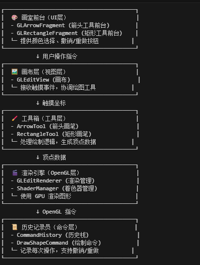

### 3.1 第一层_GLArrowFragment

 GLArrowFragment 层只是UI 控制器，不负责绘制逻辑。我们这里只看核心方法，其他的都忽略

先看看类声明和成员变量

- 类声明，继承自BaseEditFragment。是所有编辑工具的基类，其代表一个编辑工具。
  - 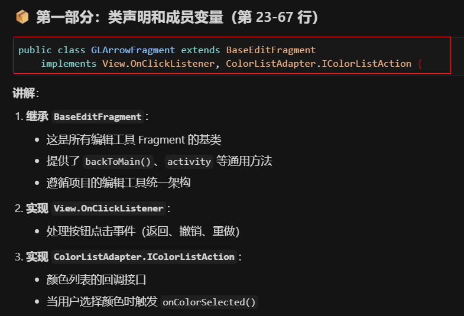

激活箭头工具

- 目的：初始化工作环境为箭头相关环境

- 执行时机：用户点击主菜单的"箭头"按钮，触发EditImageActivity.bottomGallery.setCurrentItem(11)，ViewPager 切换到 GLArrowFragment，触发 onShow()。
- 其实就是用户在UI层将工具台切换到箭头工具台，选择编辑模式为箭头编辑
  - 视图层切换为箭头工具，最终会调用到工具层（这个我们到工具层再看）
  - EditImageActivity 设置当前正在编辑的模式为 箭头模式
  - 显示画布层
  - 关键点只有视图切换到箭头工具
  - 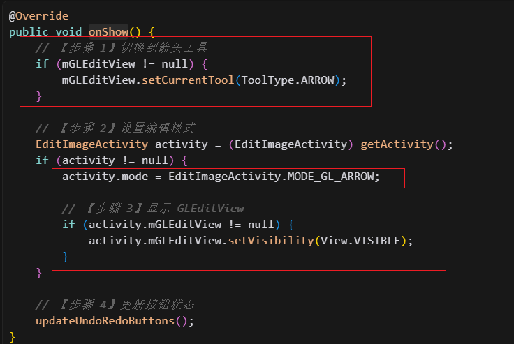

处理颜色选择

- 目的：将用户选择的颜色从 Android 格式转换为 OpenGL 格式。并设置给工具层
- 执行时机：用户点击UI层工具台中的颜色按钮后触发
- 第一步：颜色转换
  - 转换过程
  - 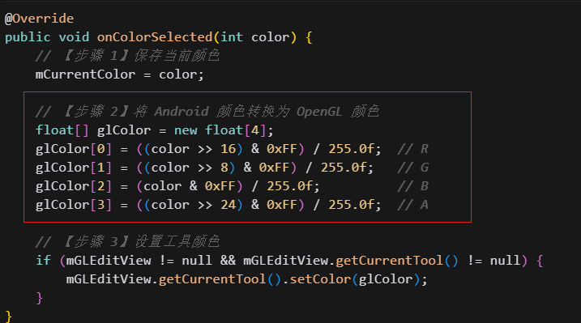
  - 转换原理：
  - 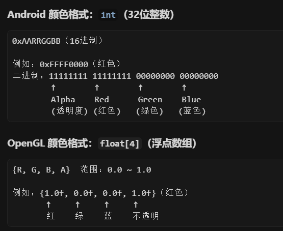
- 第二步：设置工具颜色
  - 上面调用mGLEditView.getCurrentTool().setColor(glColor);设置工具颜色
  - 这是调用链，具体过程后面看
  - 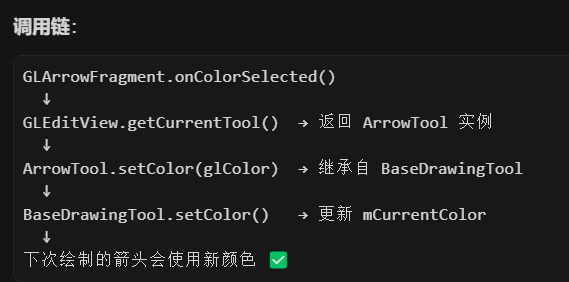

撤销和重做逻辑

- 目的：将用户点击的撤销操作，传递给操作栈，转换为OpenGL操作
  - 调用View层的undo，后面在看
  - 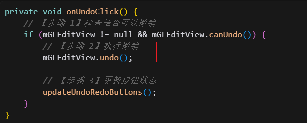
- 这是执行流程
  - 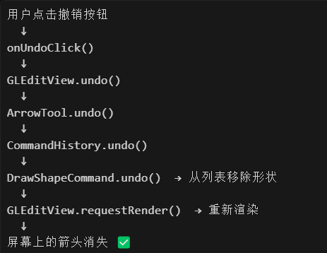

- 重做同理
  - 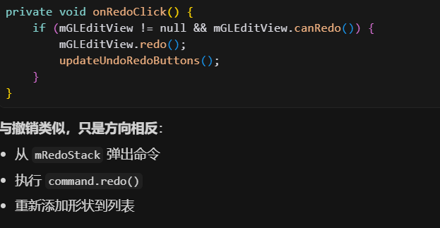
- 这里会更新按钮状态啊
  - 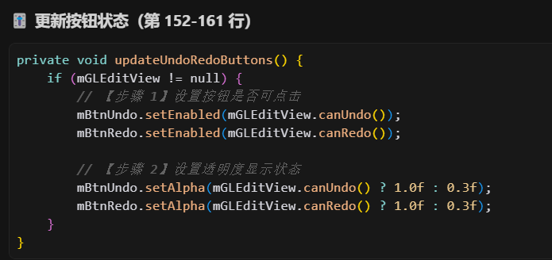
  - 既设置 enabled 又设置 alpha，实际效果如下
  - 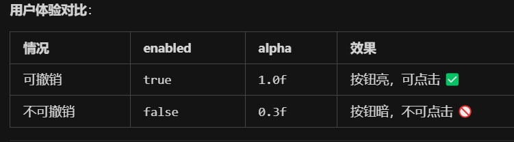

好，这是一个完整的执行流

- 如下：
  - 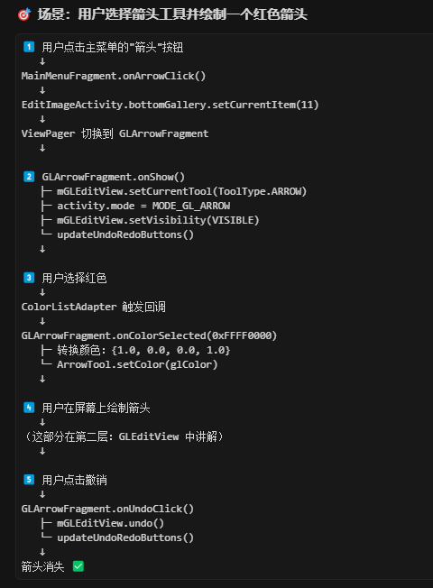

### 3.2 画布层（GLEditView）

他有以下职责：

- 作为GPU的渲染对象，显示GPU输出的图片和编辑效果
- 接收用户触摸事件，将其处理后转发给对应的工具层，最终生成对应的顶点数据和纹理数据
- 渲染流程控制，渲染更新

先看看他的类声明和成员变量

- 如下图
  - 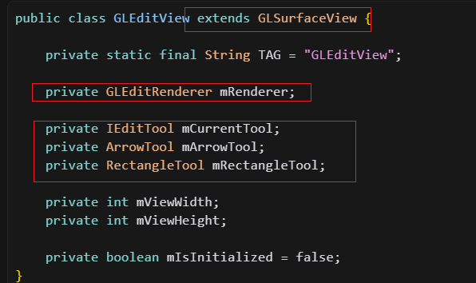
  - 继承自 GLSurfaceView
  - 拥有GLEditRenderer渲染器，就是渲染回调，不过这里我们添加了更多的职责，让其负责实际的渲染工作
  - 工具管理，通过策略模式切换当前使用的工具，箭头等工具都是实现IEditTool接口
  - 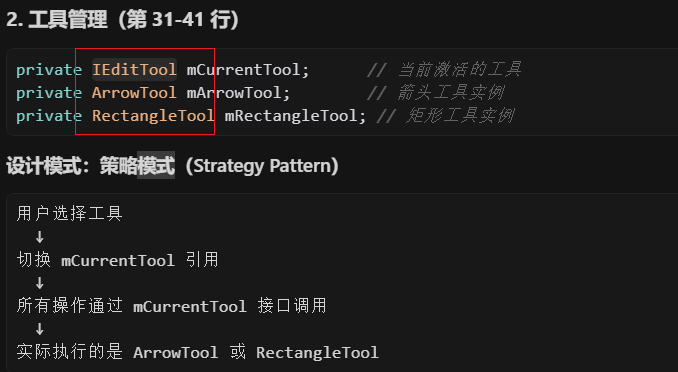

OpenGL环境初始化

- 第一步：init方法
  - 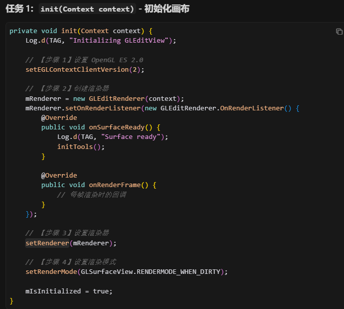
  - 设置OpenGL版本
  - 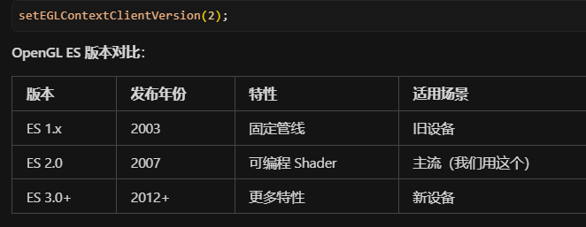
  - 创建渲染器，这个怎么说呢，我们后面再看。只需要记住，这里是添加了生命周期方法
  - 设置渲染模式
  - 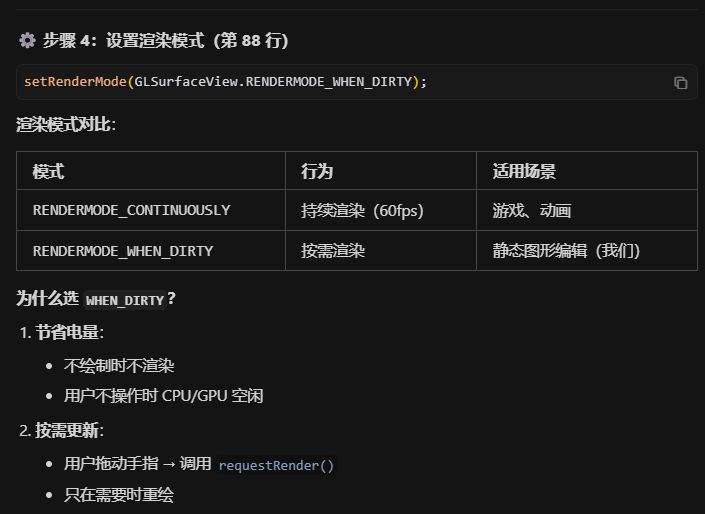
- 第二步：initTools() - 初始化工具实例
  - 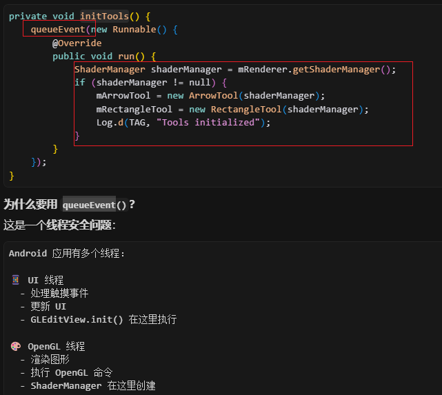
  - 核心是queueEvent，意思是将这个runnable任务投递到OpenGL线程的Looper中由其执行。具体的初始化我们后面看
  - 那么这是执行流
  - 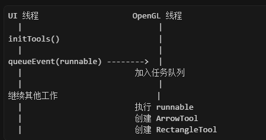

setCurrentTool_工具切换机制

- 我们上面GLArrowFragment，箭头工具UI中切换工具时会调用到我们这一层的setCurrentTool方法
- 这是代码逻辑
  - 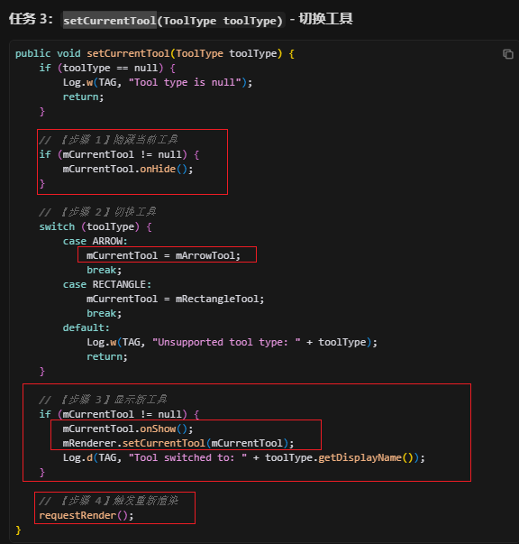
  - onHide隐藏旧工具
  - 切换工具引用：mCurrentTool = mArrowTool;，就是下面这样
  - 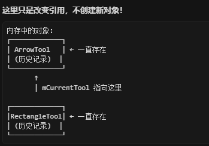
  - 显示新工具
  - 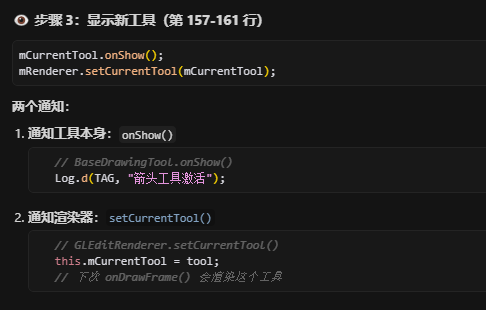

- 小结：他大概完成了下面的任务：内部切换工具引用，调用之前工具的onHide，调用当前工具的onShow。调用mRenderer层的setCurrentTool。

触摸事件处理

- onTouchEvent(MotionEvent event) - 处理触摸
  - 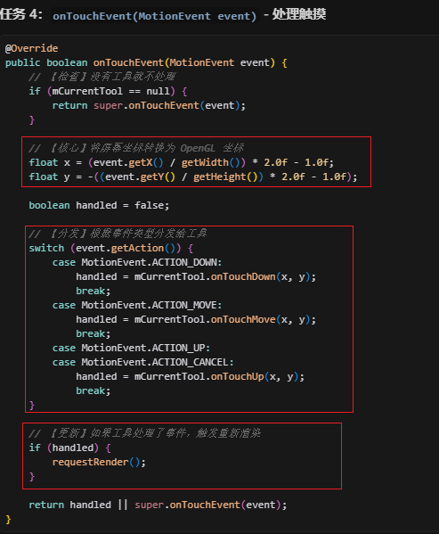
- 重点是坐标转换
  - 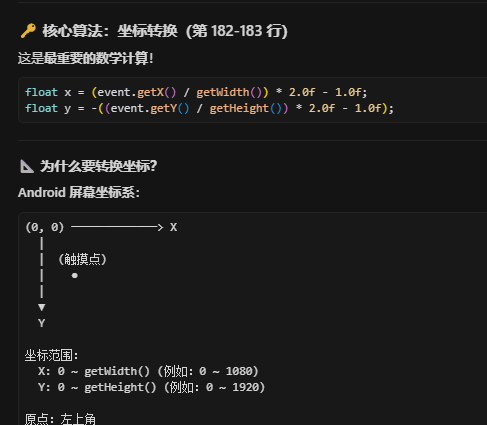
  - 举例
  - 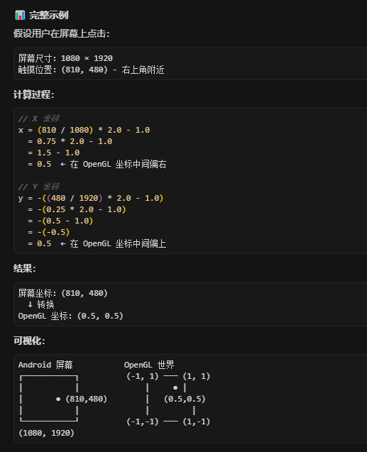
- 事件分发，执行流程如下
  - 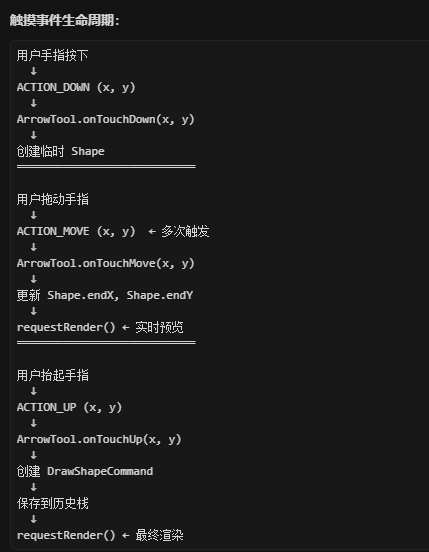
- requestRender() 触发渲染
  - 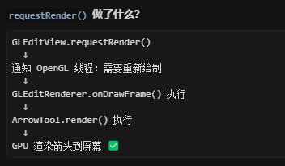

撤销/重做委托

- 这部分代码很简单，都是委托模式：
  - 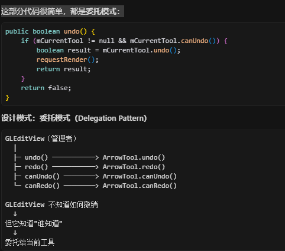

好，这是完整的触摸事件执行流

- 具体如下：
  - 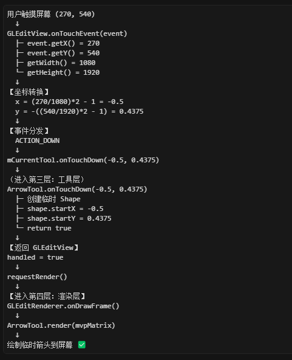

### 3.3 第三层_Tool Layer（工具层）

概念说明

- 如果说 GLEditView 是一个"画布"，那么这一层就是"画笔"。用户在画布上滑动手指，画笔根据不同的工具类型（箭头、矩形、圆形...），将触摸轨迹转换成具体的几何图形数据

- 好，我们来看看他的核心职责：
  - 接收触摸事件 → 从 GLEditView 接收 OpenGL 坐标系下的触摸点
  - 几何计算 → 根据起点和终点，计算出图形的所有顶点坐标
  - 数据存储 → 将绘制的图形保存到 shapeList，便于渲染和撤销
  - 渲染调用 → 在 render() 方法中，将所有图形的顶点数据传递给 GPU

- 在我们代码中，以绘制箭头为例，涉及的核心文件：
  - IEditTool.java - 工具接口（定义所有工具的通用行为，用于策略模式）
  - BaseDrawingTool.java -  绘图工具基类（实现通用的形状管理和命令历史）
  - Shape.java - 形状数据结构（存储一个图形的所有属性）
  - ArrowTool.java - 箭头工具具体实现（核心：箭头顶点生成算法）

好，我们先来看看Shape文件，用于描述一个图形，比如箭头工具中的一个箭头

- 核心字段就两个，起点坐标和终点坐标
  - 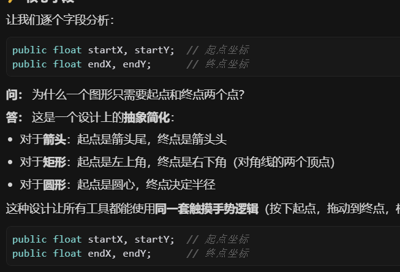

好，我们来接着看看IEditTool.java 工具接口，是工具箱层的规范

- 这个接口采用了策略模式（Strategy Pattern）的设计思想，具体：用户操作 → GLEditView（环境类） → IEditTool（策略接口） → ArrowTool/RectangleTool（具体策略）
- 生命周期
  - 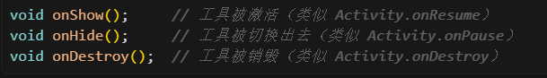
- 触摸事件消费
  - 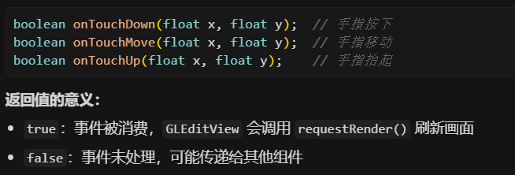
- 渲染方法（怎么理解这里的模型，视图和投影，其实你代码中看到过的）
  - 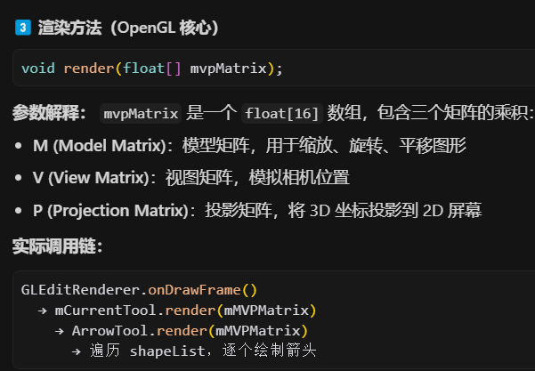
- 撤销/重做系统
  - 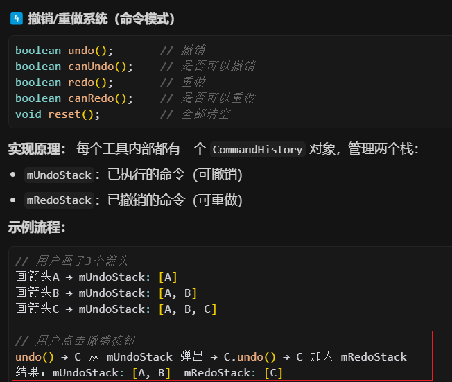

接着来看看BaseDrawingTool.java - 绘图工具基类

- 这是一个抽象基类，实现了 IEditTool 接口的大部分通用逻辑。核心思想： 提取所有几何绘图工具（箭头、矩形、圆形...）的共性，让子类只需专注于顶点生成算法和渲染逻辑
- 形状管理（同一个工具中，用户生成多个箭头）
  - 形状列表：mShapeList，用于记录多个历史绘制的箭头，当我们完成一次Down，Move，Up操作时会生成一个shape，down时new。up时存放进mShapeList中。
  - 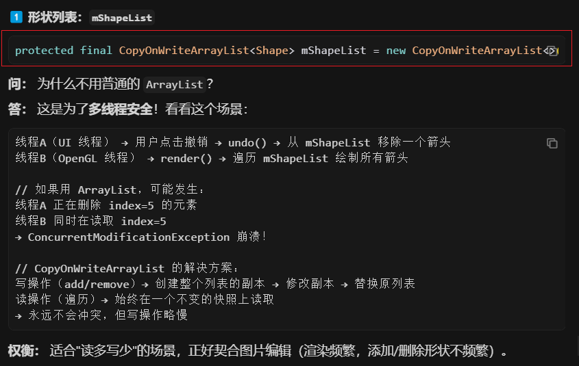
  -  当前形状：mCurrentShape
  - 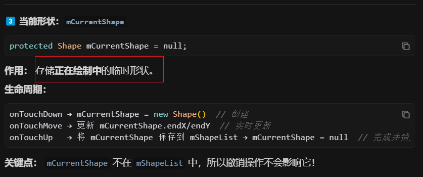

- 触摸事件，以绘制箭头为例
  - 按下时创建临时形状
  - 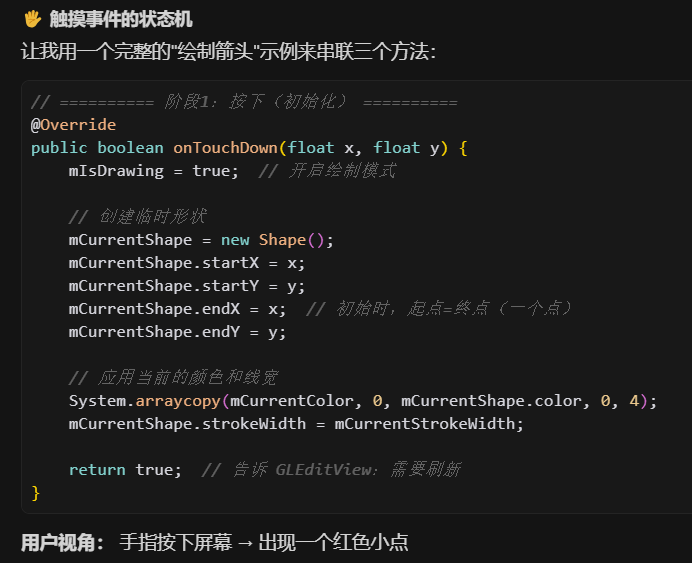
  - 移动时更新形状终点
  - 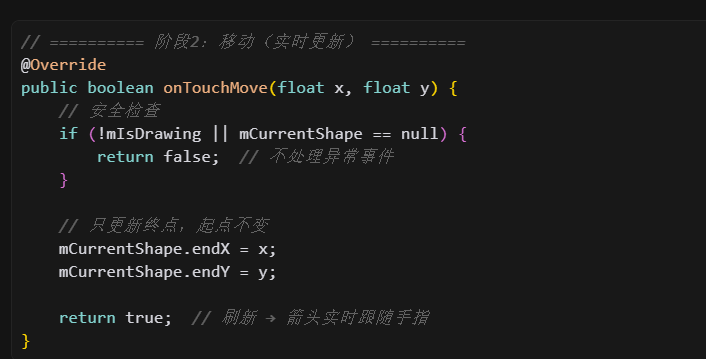
  - 好奇，抬起时不应该保存形状到形状列表中吗？这里好像是委托给命令层处理，后面在看
  - 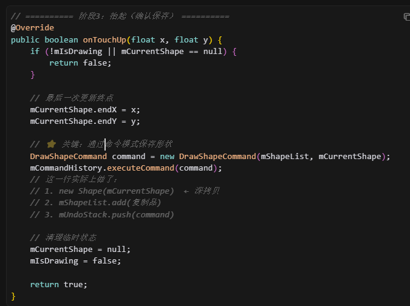
- 撤销/重做 处理
  - 历史命令。这个涉及到命令层，我们最后在看。
  - 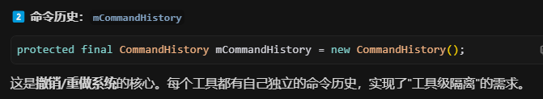
  - 重做采用代理模式，委托给命令历史处理
  - 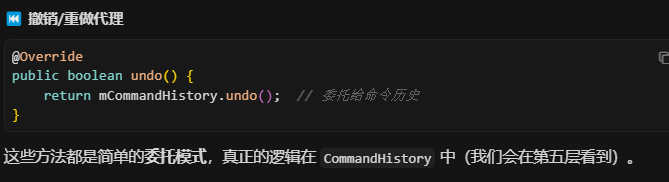

好，我们来看看ArrowTool_箭头工具

render渲染流程

- 步骤一：激活Shader程序
  - 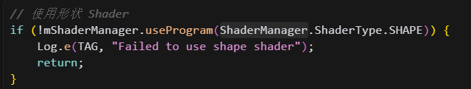
  - 这是其顶点着色器的代码，通过变化矩阵变化了图形结构
  - 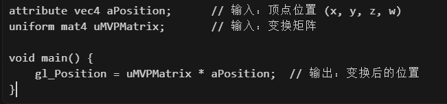
  - 这是片段着色器，用同一个颜色填充
  - 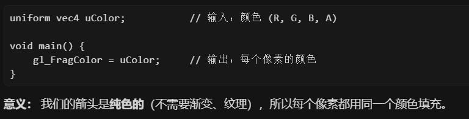
- 步骤二：：获取 Shader 变量的"句柄"，其实就是帮助我们在Java变量中引用GPU中Shader程序的变量
  - 因为 Shader 代码编译后，变量名会被替换成内部 ID。我们需要这些 ID 来传递数据给 GPU。
  - 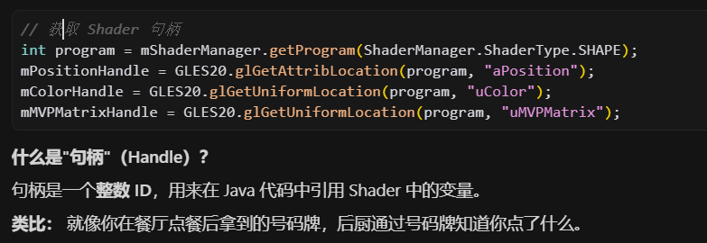
- 步骤三：遍历并渲染所有箭头
  - 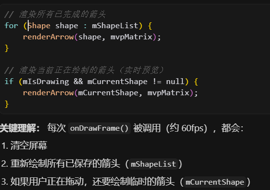

好，我们来看看监听的绘制工作

- 步骤一：生成着色器所需的数据并设置
  - 根据形状生成顶点坐标
  - 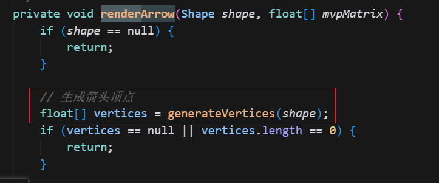
  - 顶点坐标put进Buffer中。其实本质数据时vertices通过generateVertices生成的，这里只不过起到转换的作用，转换为GPU中的存储方式，然后送入进去。
  - 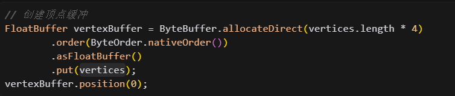
  - 数据设置给GPU中着色器程序
  - 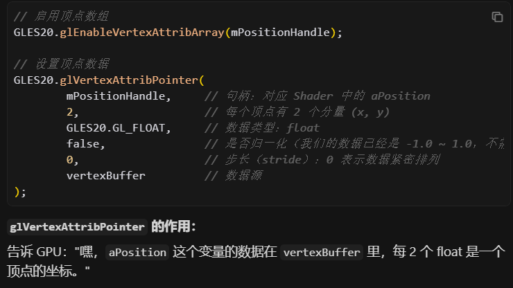
  - 这是对应的参数
  - 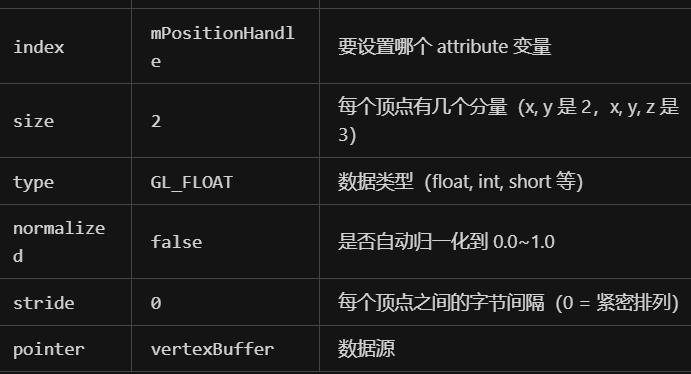
  - 设置uniform类型变量的参数
  - 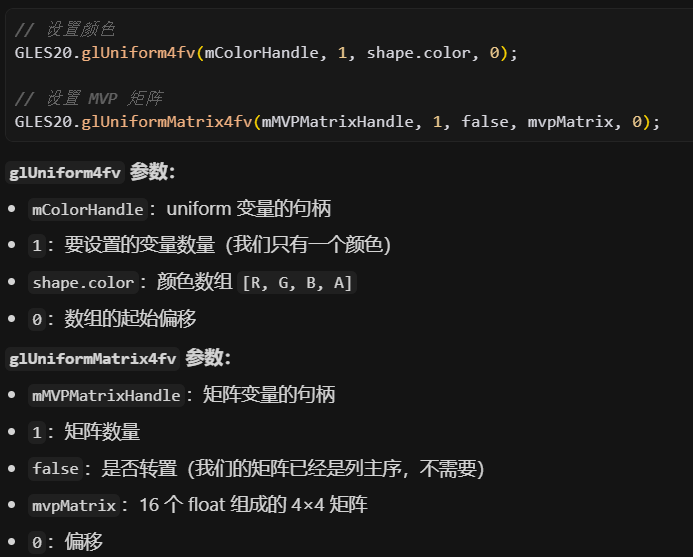

- 步骤二：绘制操作
  - 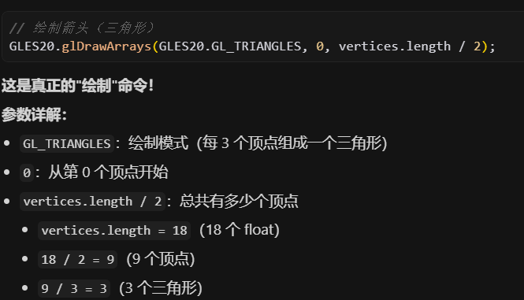
- 步骤三：清理状态
  - 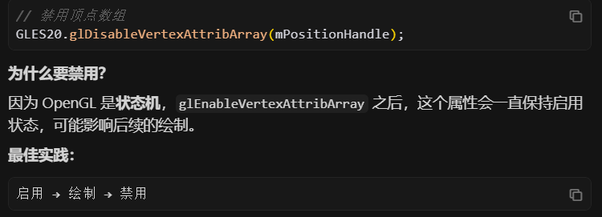

好，我们看了流程了，接下来看我们如何根据shape生成箭头的顶点坐标

### 3.4 第四层_渲染引擎层（Rendering Engine Layer）

我们先来看看他整个的核心的执行过程

- 过程如下：
  - 有5个重要的阶段。
  - Surface创建时，我们把耗时的初始化工作放在这一阶段
  - Surface尺寸变化，比如用户横竖屏时，我们需要修改计算我们的MVP矩阵，以适应视图变化
  - onDrawFrame每帧绘制时，清空屏幕，调用mCurrentTool.render绘制对应的箭头/矩形
  - setCurrentTool，很容易啊，更新mCurrentTool引用
  - release，释放相关的资源。
  - 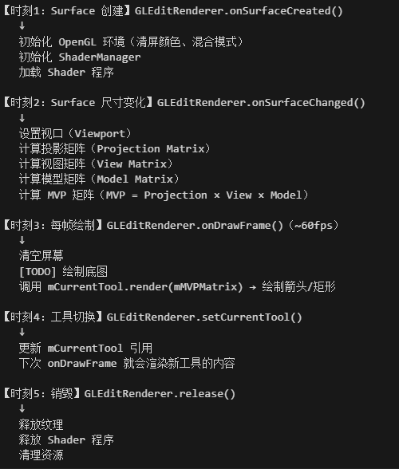

### 3.5 进一步思考

### 3.6 总结一下，整个数据的流转过程是什么样的?

## 04.底层原理

## 05.深度思考

### 5.1 关键问题探究

### 5.2 设计对比

## 06.实践验证

### 6.1 行为验证代码

### 6.2 性能测试

## 07.应用场景

### 7.1 最佳实践

### 7.2 使用禁忌

## 08.总结提炼

### 8.1 核心收获

### 8.2 知识图谱

### 8.3 延伸思考

## 09.参考资料

1. 
2. 
3. 

## 其他介绍

### 01.关于我的博客

- csdn：http://my.csdn.net/qq_35829566

- 掘金：https://juejin.im/user/499639464759898

- github：https://github.com/jjjjjjava

- 邮箱：[934137388@qq.com]

