[toc]

## 前言

> 学习要符合如下的标准化链条：了解概念->探究原理->深入思考->总结提炼->底层实现->延伸应用"

## 01.学习概述

- **学习主题**：
- **知识类型**：
  - [ ] **知识类型**：
    - [ ] ✅Android/ 
      - [ ] ✅01.基础组件
      - [ ] ✅02.IPC机制
      - [ ] ✅03.消息机制
      - [ ] ✅04.View原理
      - [ ] ✅05.事件分发机制
      - [ ] ✅06.Window
      - [ ] ✅07.复杂控件
      - [ ] ✅08.性能优化
      - [ ] ✅09.流行框架
      - [ ] ✅10.数据处理
      - [ ] ✅11.动画
      - [ ] ✅12.Groovy
    - [ ] ✅音视频开发/
      - [ ] ✅01.基础知识
      - [ ] ✅02.OpenGL渲染视频
      - [ ] ✅03.FFmpeg音视频解码
    - [ ] ✅ Java/
      - [ ] ✅01.基础知识
      - [ ] ✅02.Java设计思想
      - [ ] ✅03.集合框架
      - [ ] ✅04.异常处理
      - [ ] ✅05.多线程与并发编程
      - [ ] ✅06.JVM
    - [ ] ✅ Kotlin/
      - [ ] ✅01.基础语法
      - [ ] ✅02.高阶扩展
      - [ ] ✅03.协程和流
    - [ ] ✅ 故障分析与处理/
      - [ ] ✅01.基础知识
    - [ ] ✅ 自我管理/
      - [ ] ✅01.内观
    - [ ] ✅ 业务逻辑/
      - [ ] ✅01.启动
      - [ ] ✅02.首页
      - [ ] ✅03.巡店
      - [ ] ✅04.云值守
      - [ ] ✅05.消息中心
      - [ ] ✅06.智控平台
- **学习来源**：
- **重要程度**：⭐⭐⭐⭐⭐
- **学习日期**：2025.
- **记录人**：@panruiqi

### 1.1 学习目标

- 了解概念->探究原理->深入思考->总结提炼->底层实现->延伸应用"

### 1.2 前置知识

- [ ] 

## 02.核心概念

### 2.1 业务需求

录像下载功能迁移到鸿蒙，这个过程中可能要加一层水印

我们这个过程中要看Android的代码，尝试在鸿蒙中实现，同时要去考虑能否优化Android原有的逻辑


### 2.2 解决方案

Android中原有的FFmpegUtils，尝试优化和迁移他。

### 2.3 基本特性


## 03.Android_FFmpegUtil

### 3.0 核心执行原理

FFmpeg说明：

- FFmpeg 是一个强大的**命令行工具**，用于处理音视频文件。它本质上是一个 C/C++ 程序，有自己的 `main()` 函数，就像这样：
  - ```
    // FFmpeg 的 main 函数（简化版）
    
    int main(int argc, char **argv) {
        //解析命令行参数
        
        // 执行音视频处理
        
        // 返回执行结果
    }
    ```

- 在命令行中，我们这样使用 FFmpeg：

  - ```
    ffmpeg -i input.mp4 -vcodec copy -acodec aac output.mp4
    ```

Android中如何调用FFmpeg

- Android 应用无法直接执行命令行程序，但可以通过 **JNI（Java Native Interface）** 调用 FFmpeg 的 `main()` 函数。

- **这就是我们的FFmpegUtil的核心思路**：
  - **编译 FFmpeg 为 .so 库**：把 FFmpeg 编译成 Android 能加载的动态链接库
  - **封装 main 方法**：在 Native 层封装 FFmpeg 的 `main()` 函数
  - **传递参数**：从 Java 层传递命令参数（就像命令行参数一样）
  - **执行并回调**：Native 层执行 FFmpeg，通过 JNI 回调通知 Java 层进度

关键点就三个方面：1. Java层调Native。  2. Native层回调Java。  3. Java层的消费者生产者模型设计

### 3.1 生产者-消费者模型设计

FFmpeg 处理音视频是**耗时操作**，不能在主线程执行（会卡死 UI）。同时，可能有多个任务需要处理（如批量转换视频），需要一个机制来管理这些任务。

**生产者-消费者模型**是解决这类问题的经典方案：

- **生产者**：业务代码不断产生任务（如用户点击"转换"按钮）
- **消费者**：后台线程不断消费任务（执行 FFmpeg 处理）
- **缓冲区**：任务队列（存放待处理的任务）

看看项目中代码的角色

- FFmpegUtil中设计的角色
  - 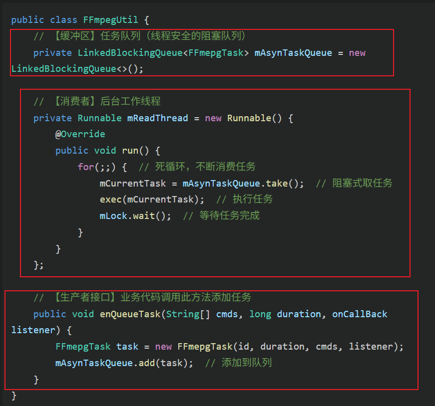

- 生产者：用户点击这个按钮，然后调用api获取对应的下载链接，并经过一系列检查后最终走到DownloadVideoService中
  - 生成对应的FFmpeg指令（也就是一个ffmpeg任务）
  - 将任务放入任务队列
  - 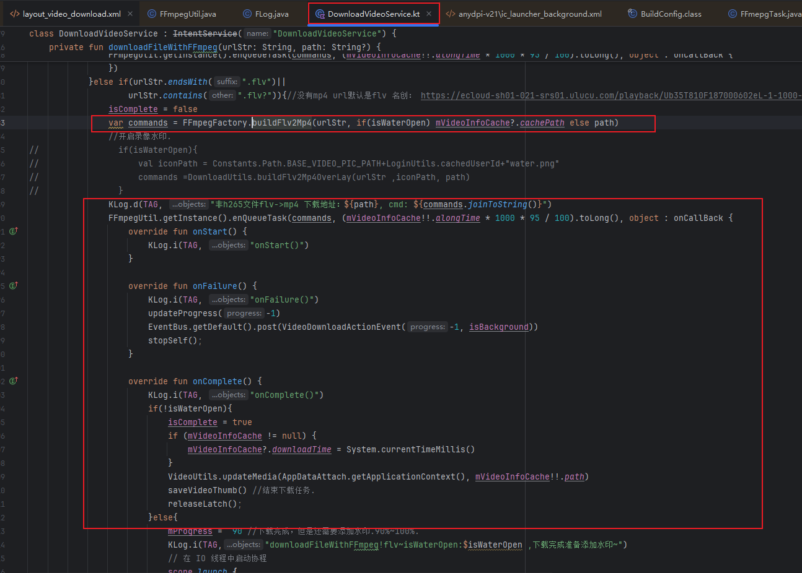

看看流程示意图

- 具体如下：用户，任务队列，后台消费线程是一个生产者消费者模型。消费者将任务通过委托模式交给Native层的线程执行ffmpeg指令。
  - 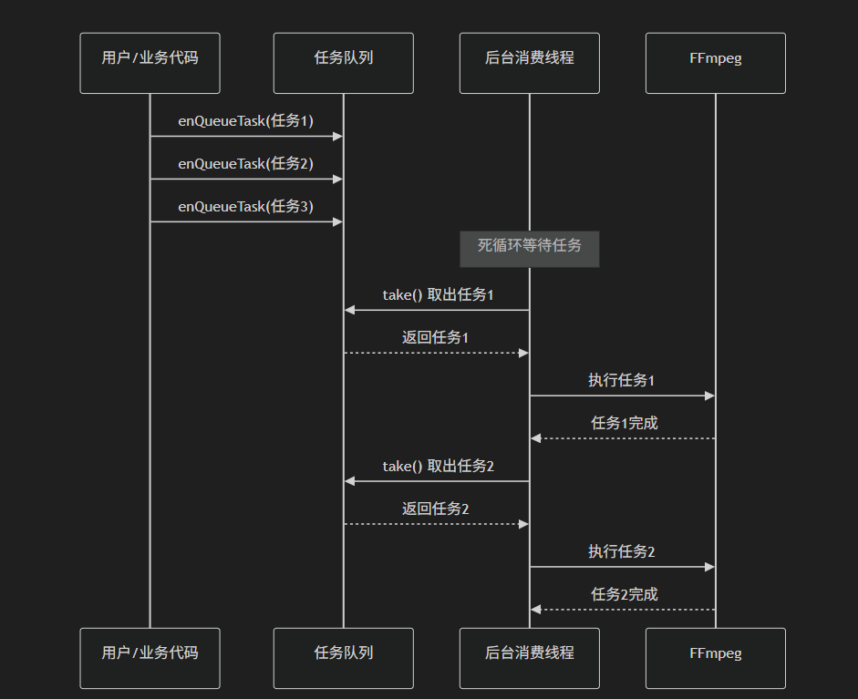

这里出现了第一个问题：

-  **调度线程和执行线程混在一起**：mReadThread既负责从队列取任务，又负责执行任务
-  **并发能力差**：单线程模型无法并发执行多个任务

### 3.2 Java层调Native

Java 如何找到 Native 方法

- 步骤一：**加载 Native 库**

  - 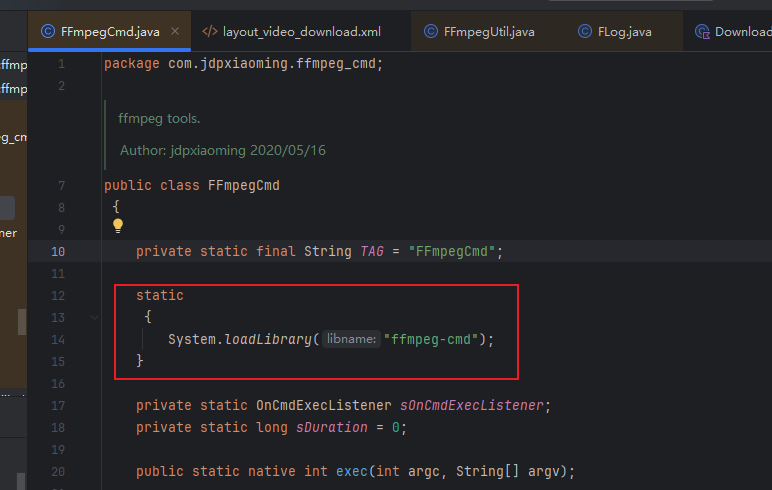

  >  **System.loadLibrary 做了什么？**
  >
  > - 在 Android 中查找 `libffmpeg-cmd.so` 文件（lib前缀和.so后缀是自动添加的）
  > - 调用 `dlopen()` 打开动态链接库
  > - 加载库中的所有符号（函数名）到内存
  > - JVM 会记录这个库已加载

- 第二步：**JNI 函数命名规则（动态链接)**

  - Native 层的函数名必须遵循 **严格的命名规则**：

    - ```
      Java_<包名>_<类名>_<方法名>
      ```

  - **转换规则**：

    - 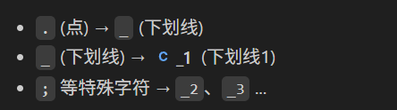

  - 代码中的实际例子

    - ```java
      // Java 层
      package com.jdpxiaoming.ffmpeg_cmd;  // 包名
      
      public class FFmpegCmd {  // 类名
          public static native int exec(int argc, String[] argv);  // 方法名
      }
      ```

  - 对应的 Native 函数名：

    - ```java
      // Native 层（ffmpeg_cmd.c）
      JNIEXPORT jint JNICALL
      Java_com_jdpxiaoming_ffmpeg_1cmd_FFmpegCmd_exec(JNIEnv *env, jclass clazz, 
                                                       jint cmdnum, jobjectArray cmdline)
      {
          // 函数实现
      }
      ```

  - 命名规则拆解

    - ```java
      Java_                              // 固定前缀
      com_jdpxiaoming_                  // 包名 com.jdpxiaoming
      ffmpeg_1cmd_                      // ffmpeg_cmd（下划线变成_1）
      FFmpegCmd_                        // 类名
      exec                              // 方法名
      ```

- 第三步：**JVM 如何找到函数？（动态链接过程）**

  - 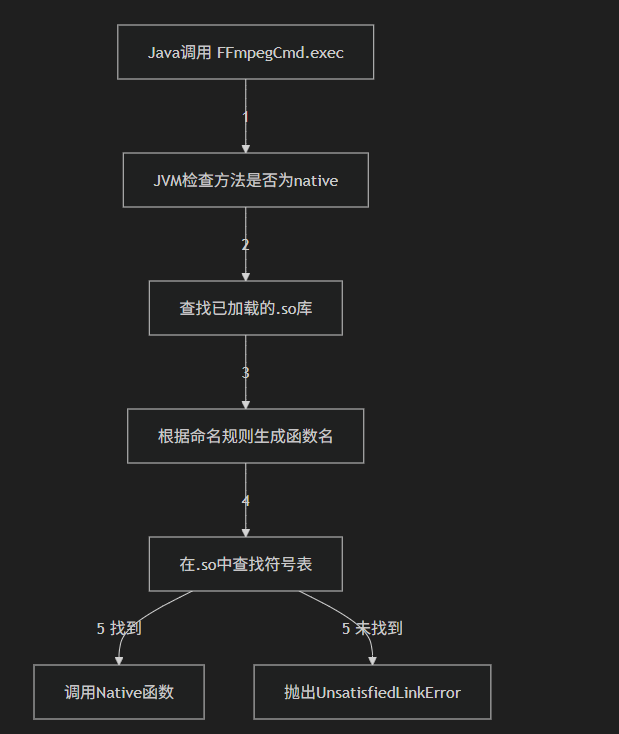

  - 详细步骤：

  - **第一次调用**：

    - JVM 检测到exec是 native方法

    - 根据包名、类名、方法名生成函数名：

      Java_com_jdpxiaoming_ffmpeg_1cmd_FFmpegCmd_exec

    - 在已加载的 `libffmpeg-cmd.so` 中查找这个符号

    - 找到后，建立**映射关系**并缓存

  - **后续调用**：

    - 直接使用缓存的映射，无需再次查找
    - 性能非常高效

- 第四步： **编译配置（CMakeLists.txt）**

  - 对应这个位置

  - 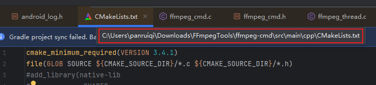

  - 这是执行思路

  - ```cmake
    # 创建共享库（.so 文件）
    add_library(
        ffmpeg-cmd          # 库名（生成 libffmpeg-cmd.so）
        SHARED              # 共享库类型
        ffmpeg_cmd.c        # 包含 JNI 函数的源文件
        ffmpeg_thread.c
        # ...
    )
    # 链接其他库
    target_link_libraries(
        ffmpeg-cmd
        ffmpeg              # FFmpeg 库
        android
        log
    )
    ```

### 3.3 Native层调用Java方法

简单看一下

FFmpeg 执行过程中，通过以下步骤回调 Java 层：

- 步骤一： **FFmpeg 进度回调（Native 层 → Java 层）**

  - ```c
    // ffmpeg_cmd.c
    // 时间进度回调
    void ffmpeg_progress(float progress) {
        JNIEnv *env;
        
        // ① 附加到当前线程，从 JVM 中取出 JNIEnv
        (*jvm)->AttachCurrentThread(jvm, (void **) &env, NULL);
        
        // ② 调用 Java 方法
        callJavaMethodProgress(env, m_clazz, progress);
        
        // ③ 完毕后脱离当前线程
        (*jvm)->DetachCurrentThread(jvm);
    }
    ```

  >  **关键点 ：AttachCurrentThread 的作用**
  >
  > - FFmpeg 在**子线程**执行，该线程不是 Java 创建的
  > - 要从 C/C++ 子线程回调 Java 方法，必须先**附加到 JVM**
  > - `AttachCurrentThread`: 让当前线程"注册"到 JVM，获取 `JNIEnv`
  > - `DetachCurrentThread`: 调用完成后"注销"，释放资源

- 步骤二：**调用 Java 静态方法**

  - ```c
    // ffmpeg_cmd.c
    void callJavaMethodProgress(JNIEnv *env, jclass clazz, float ret) {
        if (clazz == NULL) {
            LOGE("---------------clazz isNULL---------------");
            return;
        }
        
        // ① 获取方法 ID（通过方法名和方法签名）
        // 方法签名 "(F)V" 表示：参数是 float，返回值是 void
        jmethodID methodID = (*env)->GetStaticMethodID(env, clazz, "onProgress", "(F)V");
        
        if (methodID == NULL) {
            LOGE("---------------methodID isNULL---------------");
            return;
        }
        
        // ② 调用 Java 静态方法
        (*env)->CallStaticVoidMethod(env, clazz, methodID, ret);
    }
    ```

- Java 层接收回调

  - ```java
    // FFmpegCmd 中的静态回调方法（由 Native 层调用）
    public static void onProgress(float progress) {
        if (sOnCmdExecListener != null) {
            if (sDuration != 0) {
                // 根据总时长计算进度百分比
                sOnCmdExecListener.onProgress(progress / (sDuration / 1000) * 0.95f);
            } else {
                sOnCmdExecListener.onProgress(progress);
            }
        }
    }
    ```

### 3.4 一次完整的执行流

- 步骤一：生产者生产任务

  - ```java
    // 业务代码
    String[] cmds = FFmpegFactory.buildFlv2Mp4("input.flv", "output.mp4");
    FFmpegUtil.getInstance().enQueueTask(cmds, 30000, new FFmpegUtil.onCallBack() {
        @Override
        public void onStart() {
            // 任务开始
        }
        
        @Override
        public void onProgress(float progress) {
            // 进度更新：0.0 ~ 1.0
        }
        
        @Override
        public void onComplete() {
            // 任务完成
        }
        
        @Override
        public void onFailure() {
            // 任务失败
        }
    });
    ```

- 步骤二：任务入队

  - ```java
    public void enQueueTask(String[] cmds, long duration, onCallBack listener) {
        long id = SystemClock.currentThreadTimeMillis();
        FFmepgTask task = new FFmepgTask(id, duration, cmds, listener);
        mAsynTaskQueue.add(task);  // 添加到队列末尾
    }
    ```

- 步骤三：调度线程分发任务并消费任务

  - ```java
    private Runnable mReadThread = new Runnable() {
        @Override
        public void run() {
            for(;;) {
                synchronized (mLock) {
                    // 阻塞式取任务（队列为空会等待）
                    mCurrentTask = mAsynTaskQueue.take();
                    
                    if(null != mCurrentTask) {
                        // 执行任务
                        exec(mCurrentTask.getCmds(), 
                             mCurrentTask.getDuration(), 
                             mCurrentTask.callBacklistener);
                    }
                    
                    // 等待任务完成（通过 notify 唤醒）
                    mLock.wait();
                }
            }
        }
    };
    ```

- 步骤四：消费者通过委托模式，**调用 FFmpegCmd** 委托给native层执行

  - ```java
    private void exec(String[] cmds, long duration, onCallBack listener) {
        mCallbackListener = listener;
        
        FFmpegCmd.exec(cmds, duration, new FFmpegCmd.OnCmdExecListener() {
            @Override
            public void onSuccess() {
                mHandler.sendEmptyMessage(MSG_ON_START);
            }
            
            @Override
            public void onProgress(float progress) {
                mHandler.sendMessage(mHandler.obtainMessage(MSG_ON_PROGRESS, progress));
            }
            
            @Override
            public void onComplete() {
                mHandler.sendEmptyMessage(MSG_ON_COMPLETE);
            }
            
            @Override
            public void onFailure() {
                mHandler.sendEmptyMessage(MSG_ON_FAILURE);
            }
        });
    }
    ```

  - 委托给native层执行

  - ```java
    public class FFmpegCmd {
        // ① 声明 native 方法
        public static native int exec(int argc, String[] argv);
        
        public static void exec(String[] cmds, long duration, OnCmdExecListener listener) {
            sOnCmdExecListener = listener;  // 保存回调监听器
            sDuration = duration;
            exec(cmds.length, cmds);  // ② 调用 Native 方法
        }
    }
    ```

- 步骤五： Native 层接收调用（ffmpeg_cmd.c）

  - ```c
    // JNI 方法实现（Java 调用入口）
    JNIEXPORT jint JNICALL
    Java_com_jdpxiaoming_ffmpeg_1cmd_FFmpegCmd_exec(JNIEnv *env, jclass clazz, 
                                                     jint cmdnum, jobjectArray cmdline) {
        LOGE("Java_com_jdpxiaoming_ffmpeg_1cmd_FFmpegCmd_exec execute!!!");
        
        // ① 保存 JavaVM 和 Class 引用（用于后续回调）
        (*env)->GetJavaVM(env, &jvm);              // 获取 JavaVM（全局唯一）
        m_clazz = (*env)->NewGlobalRef(env, clazz); // 创建全局引用（防止被 GC 回收）
        
        // ② 转换 Java String[] 为 C char**
        char **argv = NULL;
        jstring *strr = NULL;
        
        if (cmdline != NULL) {
            argv = (char **) malloc(sizeof(char *) * cmdnum);
            strr = (jstring *) malloc(sizeof(jstring) * cmdnum);
            
            for (int i = 0; i < cmdnum; ++i) {
                strr[i] = (jstring)(*env)->GetObjectArrayElement(env, cmdline, i);
                argv[i] = (char *) (*env)->GetStringUTFChars(env, strr[i], 0);
            }
        }
        
        // ③ 新建线程执行 FFmpeg 命令（不阻塞 JNI 调用线程）
        ffmpeg_thread_run_cmd(cmdnum, argv);
        
        // ④ 注册 FFmpeg 执行完毕时的回调
        ffmpeg_thread_callback(ffmpeg_callback);
        
        free(strr);
        return 0;
    }
    ```

  > ⭐ **关键点 ：为什么要保存 JavaVM 和 Class 引用？**
  >
  > - `JavaVM`: 用于在**子线程**中获取 `JNIEnv`（每个线程都有独立的 JNIEnv）
  > - `m_clazz`: 用于调用 Java 层的**静态方法**（回调通知）
  > - `NewGlobalRef`: 创建**全局引用**，防止 Java 层的 Class 被 GC 回收

- 步骤六：Native层创建子线程执行 FFmpeg（ffmpeg_thread.c）

  - ```c
    pthread_t ntid;  // 线程 ID
    char **argvs = NULL;
    int num = 0;
    // 线程执行函数
    void *thread(void *arg) {
        int result = ffmpeg_exec(num, argvs);  // 调用 FFmpeg 的 main 函数
        return ((void *)0);
    }
    // 新建子线程执行 FFmpeg 命令
    int ffmpeg_thread_run_cmd(int cmdnum, char **argv) {
        num = cmdnum;
        argvs = argv;
        
        int temp = pthread_create(&ntid, NULL, thread, NULL);  // 创建 POSIX 线程
        if(temp != 0) {
            LOGE("can't create thread: %s", strerror(temp));
            return 1;
        }
        LOGI("create thread success");
        return 0;
    }
    ```

  > ⭐ **关键点 ：为什么要创建新线程？**
  >
  > - FFmpeg 执行是**耗时操作**（可能几秒到几分钟）
  > - 如果在 JNI 调用线程执行，会**阻塞** Java 层的调用线程
  > - 创建新线程后，JNI 方法可以立即返回，不阻塞 Java 层

- 步骤七：**FFmpeg 执行过程中回调**

  - ```c
    // ffmpeg_cmd.c
    // 时间进度回调
    void ffmpeg_progress(float progress) {
        JNIEnv *env;
        
        // ① 附加到当前线程，从 JVM 中取出 JNIEnv
        (*jvm)->AttachCurrentThread(jvm, (void **) &env, NULL);
        
        // ② 调用 Java 方法
        callJavaMethodProgress(env, m_clazz, progress);
        
        // ③ 完毕后脱离当前线程
        (*jvm)->DetachCurrentThread(jvm);
    }
    ```

- 步骤八：回调通过JNI调用Java静态方法

  - ```c
    // ffmpeg_cmd.c
    void callJavaMethodProgress(JNIEnv *env, jclass clazz, float ret) {
        if (clazz == NULL) {
            LOGE("---------------clazz isNULL---------------");
            return;
        }
        
        // ① 获取方法 ID（通过方法名和方法签名）
        // 方法签名 "(F)V" 表示：参数是 float，返回值是 void
        jmethodID methodID = (*env)->GetStaticMethodID(env, clazz, "onProgress", "(F)V");
        
        if (methodID == NULL) {
            LOGE("---------------methodID isNULL---------------");
            return;
        }
        
        // ② 调用 Java 静态方法
        (*env)->CallStaticVoidMethod(env, clazz, methodID, ret);
    }
    ```

- 步骤九：Java 层接收回调

  - ```java
    // FFmpegCmd 中的静态回调方法（由 Native 层调用）
    public static void onProgress(float progress) {
        if (sOnCmdExecListener != null) {
            if (sDuration != 0) {
                // 根据总时长计算进度百分比
                sOnCmdExecListener.onProgress(progress / (sDuration / 1000) * 0.95f);
            } else {
                sOnCmdExecListener.onProgress(progress);
            }
        }
    }
    public static void onComplete() {
        if (sOnCmdExecListener != null) {
            sOnCmdExecListener.onComplete();
        }
    }
    public static void onFailure() {
        if (sOnCmdExecListener != null) {
            sOnCmdExecListener.onFailure();
        }
    }
    ```

- 步骤十：**Handler 切换到主线程**

  - ```java
    @Override
    public boolean handleMessage(Message msg) {
        switch (msg.what) {
            case MSG_ON_START:
                if(null != mCallbackListener) mCallbackListener.onStart();
                break;
                
            case MSG_ON_PROGRESS:
                float currentTime = (float) msg.obj;
                if(null != mCallbackListener) mCallbackListener.onProgress(currentTime);
                break;
                
            case MSG_ON_COMPLETE:
                synchronized (mLock) {
                    if(null != mCallbackListener) mCallbackListener.onComplete();
                    mLock.notifyAll();  // 唤醒等待的消费线程，继续处理下一个任务
                }
                break;
                
            case MSG_ON_FAILURE:
                synchronized (mLock) {
                    if(null != mCallbackListener) mCallbackListener.onFailure();
                    mLock.notifyAll();
                }
                break;
        }
        return true;
    }
    ```

小结：他分为底层设计和上层设计，底层通过ffmpeg_cmd.so，借助native线程执行ffmpeg指令，然后通过JNI回调回Java层。上层设计了一个任务队列+分发消费线程，通过生产者消费者模型 + 委托模式处理。

## 04. 优化_其一

当前存在一个明显痛点：**视频加水印的整体耗时较长**。例如，一个 30 秒的视频，生成水印可能要接近 1 分钟。

- **为什么会这样？**
  - 因为我们现阶段完全依赖 FFmpeg，通过 CPU 进行纯软解+软编，再配合滤镜做水印混合。CPU 处理视频本身就不是最优路径，尤其在移动端，成本更高。

- 🔍 那我们应该如何优化？
  - 直觉上似乎可以尝试 **FFmpeg + 硬件加速**，例如启用 FFmpeg 的硬解 / GPU 滤镜。

- 但这里会遇到两个根本性问题：
  -  **稳定性不可控**
  - 我们依赖 `libffmpeg.so`，但无法完全了解其内部调度、线程模型、硬件适配。
     不同芯片、不同 ROM、不同驱动，硬件加速行为都不一致。

- 性能收益有限甚至不可预期
  - FFmpeg 的硬件加速实际上是靠“策略模式动态选择硬件 backend”，例如 MediaCodec、VAAPI、CUDA…
     而 Android 端它最终还是要**绕一圈再调用 MediaCodec / GPU**，并不是天然为移动设备优化的路径。

- 也就是说：
  - FFmpeg 的硬件加速 = 间接调用 Android 的硬件 API，并非最短路径
  -  整个链路长、黑盒多，不利于调优

 那我们能怎么做？回到第一性原则

- 视频水印生成其实可以拆解为 3 个步骤：
  - **解码视频（Video Decode）**
  - **对每一帧做水印混合（Overlay / Blend）**
  - **编码视频（Video Encode）**

拆开后发现：

- **解码 与 编码** = VPU（Video Processing Unit）
- **水印混合** = GPU（图形渲染非常擅长）

而 Android 本身就提供了对这两类硬件的**原生能力封装**：

- `MediaCodec` —— **直接调 VPU 做硬件解码/编码**
- `OpenGL / EGL / SurfaceTexture` —— **直接调 GPU 做水印渲染**

### 4.0 先看效果

环境：

- 硬件环境：小米8，2018年发布
- 视频信息：8.30MB， 1920* 1080px， 1分02s
  - 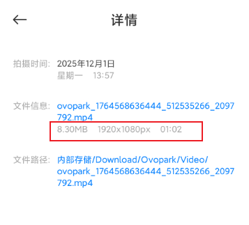


结果：

- 总耗时：12.744s。
  - 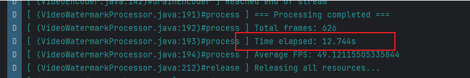

- 效果：截取一帧，中间位置的灰色的播放按钮就是我们要加的水印
  - 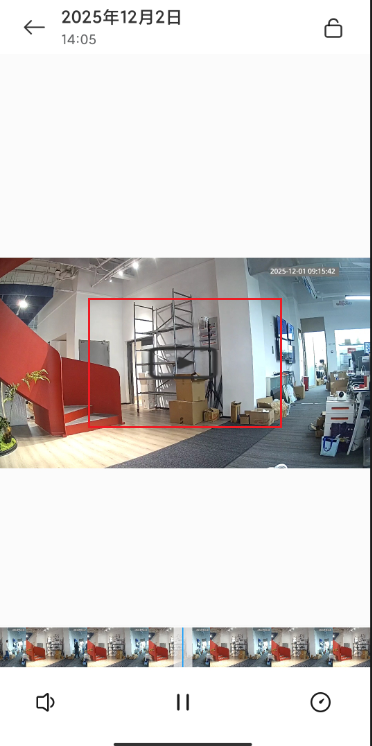

### 4.1 基础概念介绍

在看我们项目的原理之前，得先搞清楚编解码概念，OpenGL，EGL相关基础介绍？这里参考笔记： [02. 音视频_音视频基础_01.音视频基础.md](..\04. 学习_音视频\02. 音视频_音视频基础_01.音视频基础.md) 

解码概念：

- 解码的含义就是调用MediaCodec，其最终会借助硬件codec（vpu）或软件codec（纯CPU计算，如FFmpeg、libstagefright）将H264解码为YUV，将AAC解码后得到PCM数据。

- 怎么理解：H264到YUV，怎么理解MediaCodec，怎么理解AAC到PCM？

- 先看一些基础概念

  - 怎么理解H264 和 YUV之前的关系呢？

    - H.264是压缩编码格式，把YUV帧压缩成小数据流
    - 有帧内压缩（I帧）和帧间压缩（P/B帧）
    - YUV是未压缩的画面

  - 解码就是把H.264还原成YUV

    > H264如何压缩YUV帧？分为帧内压缩和帧间压缩
    >
    > - 帧内压缩：只压缩当前帧内部的冗余信息，不考虑前后帧。
    >
    >   - I帧（关键帧）就是用帧内压缩算法生成的。
    >
    >   - 原理：类似于JPEG图片压缩，把一张图片分块、变换、量化、编码，去除空间上的冗余（比如一片蓝天，很多像素颜色很接近）
    >
    > - 帧间压缩：利用前后帧之间的相似性，只记录变化的部分。
    >
    >   - P帧/B帧就是用帧间压缩算法生成的
    >   - 帧间压缩只记录“和前一帧/后一帧的差异”，不重复存储相同的内容，典型算法：帧差法（Frame Differencing），只保存像素的变化量
    >
    > - 所以，解码意思就是：
    >
    >   - 遇到I帧：I帧是完整帧，解码器可以直接把I帧解压缩还原成一张完整的YUV图像（不依赖其他帧）
    >   - 遇到P帧/B帧：先找到最近的I帧（或参考帧）的解压缩后的YUV数据，然后根据P/B帧的差异信息，叠加/修正，生成当前帧的YUV图像

  - MediaCodec 又是什么呢？

    - 他是 Android 提供的编解码统一接口（抽象层），提供标准化的API ，底层实现不用我们关心
      - 硬件codec（调用芯片内置的视频解码器，如GPU/DSP）
      - 软件codec（纯CPU计算，如FFmpeg、libstagefright）
      - 系统会自动选择最佳的方案。因此我们使用时只需要面向MediaCodec编程即可。

  - 同理，音频AAC解码后得到PCM数据

    > 那我有一个疑问了，如何抽帧做成显示的封面？
    >
    > 本质是抽出YUV，然后调用API转换为RGB，最终显示为bitmap。图片基本是RGB的样式，看前面，有YUV到RGB的转换

- 编码就是反过来的过程

OpenGL是什么？这里引用笔记： [03. 音视频_OpenGL_01.初步了解OpenGL ES.md](..\04. 学习_音视频\03. 音视频_OpenGL_01.初步了解OpenGL ES.md) 

- 前言：

  - 我们回顾之前的流程，整个视频的播放流程是什么样的呢？
  - 解码，渲染。我们前面看了解码了，我们有了对应的YUV帧，那么什么是渲染呢？
  - 渲染本质就是计算出每个像素该用什么样的色彩（RGB）。好，也就是把我们解码出的YUV帧解析为RGB帧。这个很容易，就是简单的加减乘除运算，这是他们的换算公式
    - 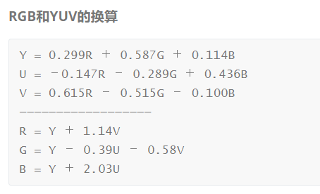

- 为什么要用OpenGL，OpenGL是什么？

  - 我们上面的渲染当然可以用cpu，但是如果是1980 * 1080这种百万，千万级别的像素，用cpu处理起来就太慢了，就像几个大学生不断做乘除题目。  幸好我们有gpu，许多个小学生， 让他们做乘除题目。用GPU来进行渲染实现硬件加速。
  - 我们跟cpu沟通容易，因为CPU可以直接执行机器语言（01指令），但GPU有自己专用的指令集，我们不能直接控制他们啊。OpenGL就是一个API，供我们访问控制GPU的API，我们可以通过他来控制GPU执行相关的渲染任务。


  - 好，现在引出了OpenGL ES概念，其全称：OpenGL for Embedded Systems，是OpenGL 的子集，是针对手机 PAD等小型设备设计的，删减了不必须的方法、数据类型、功能，减少了体积，优化了效率。

EGL呢？这里引用笔记： [03. 音视频_OpenGL_04.EGL.md](..\04. 学习_音视频\03. 音视频_OpenGL_04.EGL.md) 

- 想理解EGL，就得先理解OpenGL能做什么？

- OpenGL本质是一组GPU操作API，他负责控制GPU执行图形渲染计算。这里存在一个问题：OpenGL控制GPU执行渲染操作了。渲染的结果存放在哪？如果我们想显示在屏幕上该如何显示呢？

  - 所以EGL的作用就呼之欲出了，他是OpenGL渲染链路中的桥梁，用于连接OpenGL和Android窗口，让OpenGL渲染结果存放到什么位置，如果要显示交给谁去显示。

    - ```
      [应用层 Kotlin/Java]
              ↓
      [OpenGL ES API]  ← 只能操作GPU，生成图像数据
              ↓
          【EGL】      ← 桥梁/适配器
              ↓
      [Android窗口系统]
         ↓           ↓
      [Surface] → [SurfaceFlinger] → [显示设备]
      ```

  > 补充：
  >
  > 理解更新，后续我们的理解为：EGL不是我们上面理解的单纯的告知OpenGL，渲染的存放位置和显示的目标而已。他的职责是双重的，既有替OpenGL桥接窗口系统。又有替OpenGL管理Context
  >
  > 意义更新：同时这里也可以解释：为什么Android窗口和OpenGL的连接需要一个EGL做中间的适配层。因为OpenGL是跨平台的，但窗口系统是平台特定的，不同平台有自己独特的窗口系统，OpenGL根本不认识Android的窗口，所以需要EGL去封装底层的实现，向OpenGL提供平台无关的支持

- 我们这里的EGL用于控制其将渲染结果存放到离屏缓冲区域中，不在屏幕上显示，仅供MediaCodec编码使用

### 4.2 核心原理

视频水印生成的核心原理如下：

- 这是执行步骤
  - 使用 MediaCodec（硬件 VPU）进行视频解码。
  - 将解码输出到 SurfaceTexture，并生成 OES 纹理。
  - 使用 OpenGL（GPU）和 FBO，在渲染阶段把水印纹理叠加在解码帧上。
  - 使用 MediaCodec（硬件 encoder）将 GPU 渲染输出编码为 H.264/H.265 文件。
  -  输出视频保存到本地路径。

- 对应如下执行流

  - ```
    ┌─────────────┐
    │ 输入视频文件 │ <── MP4/H264/H265
    └──────┬──────┘
           │
           ▼
    ┌─────────────────────────┐
    │   MediaExtractor        │ <── 提取视频轨道
    │   提取编码数据           │
    └──────┬──────────────────┘
           │ 压缩数据
           ▼
    ┌─────────────────────────┐
    │   MediaCodec 解码器     │ <── 硬件解码
    │   (H264/H265 Decoder)   │
    └──────┬──────────────────┘
           │ 输出到 Surface
           ▼
    ┌─────────────────────────┐
    │   SurfaceTexture        │ <── 将解码帧转为OES纹理
    │   (OES 纹理)            │
    └──────┬──────────────────┘
           │ 纹理ID
           ▼
    ┌─────────────────────────┐
    │   OpenGL ES 渲染        │ <── GPU渲染
    │   - 采样OES纹理(视频帧) │
    │   - 采样2D纹理(水印)     │
    │   - Shader Alpha混合    │
    └──────┬──────────────────┘
           │ 渲染到 EGL Surface
           ▼
    ┌─────────────────────────┐
    │   MediaCodec 编码器     │ <── 硬件编码
    │   (H264 Encoder)        │
    │   从 inputSurface 读取  │
    └──────┬──────────────────┘
           │ 压缩数据
           ▼
    ┌─────────────────────────┐
    │   MediaMuxer            │ <── MP4封装
    │   写入文件               │
    └──────┬──────────────────┘
           │
           ▼
    ┌─────────────┐
    │ 输出视频文件 │ <── MP4/H264
    └─────────────┘
    ```

### 4.3 架构设计

这个Demo采用**分层架构**，每个模块职责单一、边界清晰：

```
┌─────────────────────────────────────────────────────────┐
│             VideoWatermarkTestActivity                  │ UI层
│           (测试页面、UI交互、进度展示)                    │
└────────────────────┬────────────────────────────────────┘
                     │ 启动
                     ▼
┌─────────────────────────────────────────────────────────┐
│          VideoWatermarkProcessor                        │ 编排层
│        (主流程控制、组件协调、线程管理)                   │
└────┬────────┬────────┬────────────┬────────┬───────────┘
     │        │        │            │        │
     ▼        ▼        ▼            ▼        ▼
┌─────────┐ ┌────────┐ ┌─────────┐ ┌──────┐ ┌───────────┐
│ Video   │ │ Video  │ │   GL    │ │ EGL  │ │  Texture  │ 核心层
│ Decoder │ │ Encoder│ │ Render  │ │Manager│ │  Helper   │
│(解码器) │ │(编码器)│ │(渲染器) │ │(EGL) │ │(纹理工具) │
└─────────┘ └────────┘ └────┬────┘ └──────┘ └───────────┘
                            │
                            ▼
                   ┌─────────────────┐
                   │ WatermarkShader │ Shader层
                   │  (着色器程序)   │
                   └─────────────────┘
                            │
                            ▼
                     硬件层，包含VPU，GPU
```

### 4.4 详细执行流

ok，我们上面介绍了整体的原理和底层执行过程，来结合代码实际看看核心执行流

先再次概览一下核心执行步骤

- ```mermaid
  graph LR
      A[输入MP4] --> B[MediaCodec解码]
      B --> C[SurfaceTexture<br/>OES纹理]
      C --> D[OpenGL+Shader<br/>叠加水印]
      D --> E[MediaCodec编码]
      E --> F[输出MP4]
      
      style B fill:#4ecdc4
      style C fill:#ffe66d
      style D fill:#95e1d3
      style E fill:#4ecdc4
      style F fill:#ff6b6b
  ```

  

- 5个关键步骤

  - **MediaCodec硬件解码** → 视频帧
  - **SurfaceTexture** → OES纹理（GPU显存）
  - **OpenGL Shader** → 叠加水印渲染
  - **MediaCodec硬件编码** → H.264压缩数据
  - **MediaMuxer** → 保存MP4文件

首先是编排层的主循环

- **文件**：`VideoWatermarkProcessor.kt` 的 `process()` 方法

  - ```java
    // 第三阶段：循环处理帧
    while (isRunning) {
        // ① 解码一帧
        val hasFrame = videoDecoder.decodeFrame()
        if (!hasFrame) break
        
        // ② 更新OES纹理
        surfaceTexture.updateTexImage()
        surfaceTexture.getTransformMatrix(texMatrix)
        
        // ③ OpenGL渲染（叠加水印）
        glRender.drawFrame(oesTextureId, texMatrix)
        
        // ④ 设置时间戳并提交给编码器
        val presentationTimeUs = videoDecoder.getCurrentPositionUs()
        eglManager.setPresentationTime(encoderSurface, presentationTimeUs * 1000)
        eglManager.swapBuffers(encoderSurface)
        
        // ⑤ 提取编码数据并写入文件
        videoEncoder.drainEncoder(false)
    }
    ```

- 这个不太好，顺序执行，应该还能优化，

关键步骤一：MediaCodec 硬件解码

- **文件**：`VideoDecoder.kt`

- 核心逻辑

  - ```java
    // init() - 初始化解码器，配置Surface输出
    fun init() {
        mediaExtractor = MediaExtractor().apply { setDataSource(inputPath) }
        
        // 找到视频轨道
        for (i in 0 until trackCount) {
            val format = mediaExtractor.getTrackFormat(i)
            if (format.getString(KEY_MIME)?.startsWith("video/") == true) {
                mediaExtractor.selectTrack(i)
                break
            }
        }
        
        // 创建解码器
        mediaCodec = MediaCodec.createDecoderByType(mime)
        
        // ⚠️ 关键：配置Surface输出模式（零拷贝到GPU）
        val surface = Surface(surfaceTexture)
        mediaCodec.configure(format, surface, null, 0)
        mediaCodec.start()
    }
    
    // decodeFrame() - 解码单帧
    fun decodeFrame(): Boolean {
        // 输入端：向解码器送入压缩数据
        val inputBufferId = mediaCodec.dequeueInputBuffer(TIMEOUT)
        if (inputBufferId >= 0) {
            val inputBuffer = mediaCodec.getInputBuffer(inputBufferId)
            val sampleSize = mediaExtractor.readSampleData(inputBuffer, 0)
            if (sampleSize > 0) {
                mediaCodec.queueInputBuffer(inputBufferId, 0, sampleSize, 
                    mediaExtractor.sampleTime, 0)
                mediaExtractor.advance()
            }
        }
        
        // 输出端：获取解码帧
        val outputBufferId = mediaCodec.dequeueOutputBuffer(bufferInfo, TIMEOUT)
        if (outputBufferId >= 0) {
            // 关键：true表示渲染到Surface（更新OES纹理）
            mediaCodec.releaseOutputBuffer(outputBufferId, true)
            return true
        }
        return true
    }
    ```

  - MediaCodec原理图，引用笔记 [02. 音视频_音视频基础_02.封装基础解码框架.md](..\04. 学习_音视频\02. 音视频_音视频基础_02.封装基础解码框架.md) 

    - 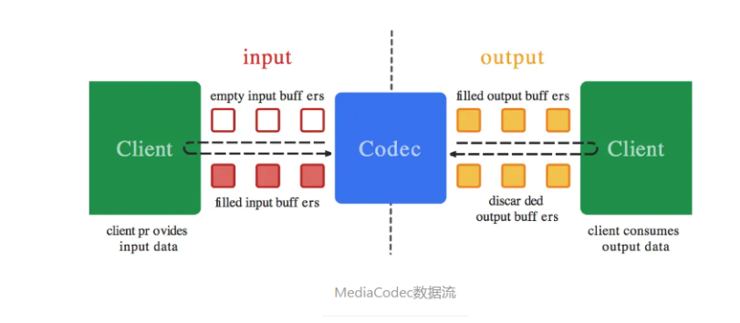

  - 这里配置输出模式，就是不要这个，直接送到这个Surface上。

  - 整个执行流就是：我们从inputBuffers申请一个buffer，他返回一个index，我们拿到之后，把数据送进去，MediaCodec自动执行处理（系统自动控制），将解码的结果送到outputbuffer中

  - 然后我们拿到数据直接送到surface上

这里要补充额外的知识，参考 [03. 音视频_OpenGL_01.初步了解OpenGL ES.md](..\04. 学习_音视频\03. 音视频_OpenGL_01.初步了解OpenGL ES.md) 

- 疑问一：Surface、SurfaceView、GLSurfaceView的关系

  - Surface本质是对BufferQueue的封装，BufferQueue是一个GraphicFrame队列。内部的每pop出来的一个都是一个GraphicFrame，可以存储一帧

    - 本质是跨进程的共享内存
    - 他是生产者-消费者模型，生产者：应用进程（Canvas/OpenGL绘制）。消费者：SurfaceFlinger（合成显示）
    - 通过Binder进程可以通知SurfaceFlinger读取数据显示到屏幕上（前后缓冲交换时）
    - 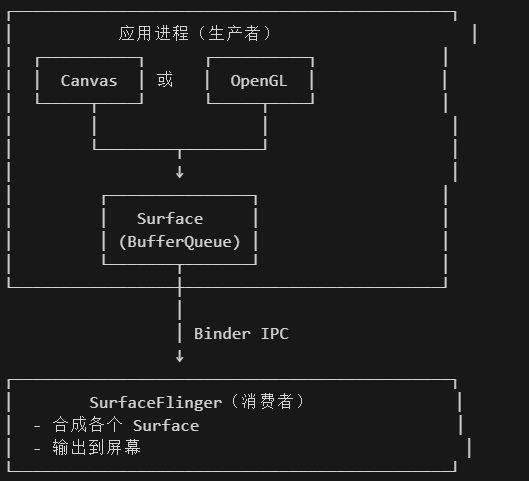

  - SurfaceView 是持有独立的Surface引用的View。他独立窗口层，不在View树绘制流程中，其使用子线程绘制，不阻塞主线程。

  - GLSurfaceView继承SurfaceView，在其基础上封装了GLThread - 独立的渲染线程，EGLHelper - EGL相关，Renderer回调 - 标准化生命周期。（这个详细的我们要在setRenderer中看），如下

    - ```java
      class GLSurfaceView : SurfaceView {
          // 继承自 SurfaceView，拥有独立 Surface
          
          // 新增的核心功能：
          private var mGLThread: GLThread  // 独立的 OpenGL 渲染线程
          private var mEGLHelper: EGLHelper  // EGL 上下文管理器
          private var mRenderer: Renderer  // 用户自定义渲染器
      }
      ```


关键步骤二：SurfaceTexture 生成 OES 纹理

- > 先补充一下基础知识，截取自 [03. 音视频_OpenGL_01.初步了解OpenGL ES.md](..\04. 学习_音视频\03. 音视频_OpenGL_01.初步了解OpenGL ES.md) 
  >
  > - 此时就要用到纹理和采样。我们可以把一张位图(Bitmap)的像素内容上传到 GPU，作为“采样源”，然后在片元着色器中使用接收到的被插值的纹理坐标从纹理中对应坐标获取颜色放置到对应的屏幕中的像素的位置上。这样我们就可以将图片上的色彩显示到屏幕上了。
  > - 比如：我们渲染一张图片，不知道屏幕的哪个位置显示什么颜色该怎么办，很简单，把它当作纹理上传，直接从图片上面采样（也就是捕捉颜色），然后配置对应屏幕坐标的像素显示对应色彩就行。

- 代码如下：

  - 核心逻辑

  - ```java
    // 创建OES纹理
    oesTextureId = TextureHelper.createOESTexture()
    
    // 创建SurfaceTexture（绑定到OES纹理）
    surfaceTexture = SurfaceTexture(oesTextureId).apply {
        setOnFrameAvailableListener { /* 帧可用回调 */ }
    }
    
    // 主循环中：更新纹理内容
    surfaceTexture.updateTexImage()  // 将最新解码帧更新到OES纹理
    surfaceTexture.getTransformMatrix(texMatrix)  // 获取纹理变换矩阵
    ```

  - TextureHelper.createOESTexture()

  - ```java
    fun createOESTexture(): Int {
        val textures = IntArray(1)
        GLES20.glGenTextures(1, textures, 0)
        val textureId = textures[0]
        
        // 绑定为OES纹理
        GLES20.glBindTexture(GLES11Ext.GL_TEXTURE_EXTERNAL_OES, textureId)
        
        // 设置纹理参数
        GLES20.glTexParameterf(GLES11Ext.GL_TEXTURE_EXTERNAL_OES, 
            GLES20.GL_TEXTURE_MIN_FILTER, GLES20.GL_LINEAR.toFloat())
        GLES20.glTexParameteri(GLES11Ext.GL_TEXTURE_EXTERNAL_OES,
            GLES20.GL_TEXTURE_WRAP_S, GLES20.GL_CLAMP_TO_EDGE)
        
        return textureId
    }
    ```

- 就不用看这么多，就只要知道：我们成功把解码出来的一帧（一个YUV帧）上传递GPU中作为一个纹理数据了，接下来可以从中采样了

关键步骤三：OpenGL Shader 渲染 叠加水印

- 渲染时调用GPU执行相关的程序

- > 先补充一下OpenGL 着色器语言 GLSL相关知识，截取自 [03. 音视频_OpenGL_01.初步了解OpenGL ES.md](..\04. 学习_音视频\03. 音视频_OpenGL_01.初步了解OpenGL ES.md) 
  >
  > - OpenGL提供的API让我们可以一定程度上控制GPU，比如：Update更新纹理图片等。但是，如果我们想控制GPU执行我们自定义的程序，该如何处理呢？这就需要GLSL语言了。我们可以通过OpenGL提供的API去控制GPU执行我们希望执行的GLSL程序。
  > - GLSL 类似 C 语言，但运行在 GPU 上。我们可以通过它来控制GPU“每个顶点怎么处理，每个像素怎么着色”。
  > - 我们要先理解两类着色器：顶点着色器和片元着色器，着色器本质就是代码
  >   - 顶点着色器 (Vertex Shader)用在 **世界坐标系** 中，用于决定“顶点在屏幕上的位置”，可以做平移、旋转、缩放、投影等操作。
  >   - 片元着色器 (Fragment Shader)对应 **纹理坐标系**，用于决定“每个像素显示什么颜色”，可以做纹理采样、光照、颜色混合。
  > - 我们来看看示例代码
  >   - 顶点着色器
  >     - 在顶点着色器中，传入了一个vec4的顶点坐标xyzw，然后直接传递给内建变量gl_Position，即直接根据顶点坐标渲染，不做位置变换。
  >     - 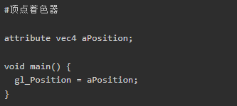
  >   - 片元着色器
  >
  >     - 在片元着色器中，直接给gl_FragColor赋值，依然是一个vec4类型的数据，这里表示rgba（Red，Green，Blue，Alpha透明度）颜色值，这里为完全不透明的红色。
  >
  >     - 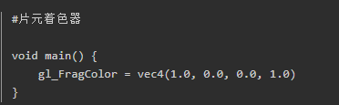
  >
  >   - 这样，两个简单的着色器串联起来后，每一个片元（像素）都会被填充为红色，最后屏幕会显示一个红色的画面。

- 看看代码

  - 渲染一帧的核心代码（这个其实就是告诉着色器程序相关数据位置地址在哪，然后调用着色器程序）

  - ```java
    // GLRender.drawFrame() - 渲染一帧
    fun drawFrame(oesTextureId: Int, transformMatrix: FloatArray) {
        GLES20.glClearColor(0f, 0f, 0f, 1f)
        GLES20.glClear(GLES20.GL_COLOR_BUFFER_BIT)
        
        GLES20.glUseProgram(programId)
        
        // 设置顶点和纹理坐标
        GLES20.glVertexAttribPointer(aPositionHandle, 2, GLES20.GL_FLOAT, 
            false, VERTEX_STRIDE, vertexBuffer)
        GLES20.glVertexAttribPointer(aTexCoordHandle, 2, GLES20.GL_FLOAT,
            false, VERTEX_STRIDE, texCoordBuffer)
        
        // 设置变换矩阵
        GLES20.glUniformMatrix4fv(uMVPMatrixHandle, 1, false, mvpMatrix, 0)
        GLES20.glUniformMatrix4fv(uTexMatrixHandle, 1, false, transformMatrix, 0)
        
        // 关键：绑定视频纹理（OES）
        GLES20.glActiveTexture(GLES20.GL_TEXTURE0)
        GLES20.glBindTexture(GLES11Ext.GL_TEXTURE_EXTERNAL_OES, oesTextureId)
        GLES20.glUniform1i(uVideoTextureHandle, 0)
        
        // 关键：绑定水印纹理（2D）
        if (watermarkTextureId != 0) {
            GLES20.glActiveTexture(GLES20.GL_TEXTURE1)
            GLES20.glBindTexture(GLES20.GL_TEXTURE_2D, watermarkTextureId)
            GLES20.glUniform1i(uWatermarkTextureHandle, 1)
            
            // 设置水印位置和大小
            GLES20.glUniform2f(uWatermarkPosHandle, 0.4f, 0.4f)  // 中心偏移
            GLES20.glUniform2f(uWatermarkSizeHandle, 0.2f, 0.2f)  // 20%大小
            GLES20.glUniform1i(uEnableWatermarkHandle, 1)
        }
        
        // 绘制全屏四边形
        GLES20.glDrawArrays(GLES20.GL_TRIANGLE_STRIP, 0, 4)
    }
    ```

  - 关键是着色器程序：计算坐标，在区域内，启用GPU的Alpha混合，将水印和原帧混合

  - ```java
    #extension GL_OES_EGL_image_external : require
    precision mediump float;
    
    varying vec2 vTexCoord;
    uniform samplerExternalOES uVideoTexture;  // 视频帧（OES）
    uniform sampler2D uWatermarkTexture;       // 水印（2D）
    uniform vec2 uWatermarkPos;                // 水印位置
    uniform vec2 uWatermarkSize;               // 水印大小
    uniform int uEnableWatermark;              // 是否启用
    
    void main() {
        // 采样视频帧
        vec4 videoColor = texture2D(uVideoTexture, vTexCoord);
        
        if (uEnableWatermark == 1) {
            // 计算水印局部坐标
            vec2 watermarkCoord = (vTexCoord - uWatermarkPos) / uWatermarkSize;
            
            // 判断是否在水印区域
            if (watermarkCoord.x >= 0.0 && watermarkCoord.x <= 1.0 &&
                watermarkCoord.y >= 0.0 && watermarkCoord.y <= 1.0) {
                
                vec4 watermarkColor = texture2D(uWatermarkTexture, watermarkCoord);
                
                // 核心：Alpha混合
                gl_FragColor = mix(videoColor, watermarkColor, watermarkColor.a);
            } else {
                gl_FragColor = videoColor;
            }
        } else {
            gl_FragColor = videoColor;
        }
    }
    ```

  - **Alpha混合公式**： 最终颜色 = 视频颜色 × (1 - α) + 水印颜色 × α，其中 `α` 是水印的透明度通道

  - 由此我们得到了插入水印的一帧了。

步骤五：MediaCodec 编码

- 初始化流程

  - ```java
    // VideoEncoder.init()
    fun init() {
        val format = MediaFormat.createVideoFormat("video/avc", width, height).apply {
            // 关键：Surface输入模式
            setInteger(KEY_COLOR_FORMAT, 
                MediaCodecInfo.CodecCapabilities.COLOR_FormatSurface)
            setInteger(KEY_BIT_RATE, bitRate)
            setInteger(KEY_FRAME_RATE, frameRate)
            setInteger(KEY_I_FRAME_INTERVAL, 1)
        }
        
        mediaCodec = MediaCodec.createEncoderByType("video/avc")
        mediaCodec.configure(format, null, null, CONFIGURE_FLAG_ENCODE)
        
        // 关键：创建inputSurface（OpenGL渲染目标）
        inputSurface = mediaCodec.createInputSurface()
        
        mediaCodec.start()
        mediaMuxer = MediaMuxer(outputPath, MUXER_OUTPUT_MPEG_4)
    }
    ```

- EGL设置GPU的渲染目标，讲渲染结果送入到编码器的inputSurface中

  - ```java
    // VideoWatermarkProcessor.process()
    
    // 为编码器的inputSurface创建EGL Surface
    val encoderSurface = eglManager.createWindowSurface(videoEncoder.inputSurface)
    eglManager.makeCurrent(encoderSurface)
    
    // 主循环中：提交渲染结果给编码器
    glRender.drawFrame(oesTextureId, texMatrix)  // OpenGL渲染
    eglManager.setPresentationTime(encoderSurface, timestampNs)  // 设置时间戳
    eglManager.swapBuffers(encoderSurface)  // 提交给编码器
    ```

- EGL将渲染结果提交到MediaCodec的这个inputBuffer中。MediaCodec处理这个，将编码结果送入outputBuffer中

  - 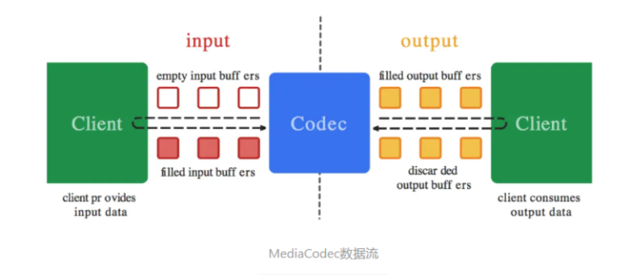

步骤六：提取编码数据并保存为MP4

- 提取编码数据并保存为mp4

  - ```java
    // VideoEncoder.drainEncoder()
    fun drainEncoder(endOfStream: Boolean) {
        if (endOfStream) {
            mediaCodec.signalEndOfInputStream()  // 通知结束
        }
        
        val bufferInfo = MediaCodec.BufferInfo()
        while (true) {
            val outputBufferId = mediaCodec.dequeueOutputBuffer(bufferInfo, TIMEOUT)
            
            when {
                outputBufferId == INFO_OUTPUT_FORMAT_CHANGED -> {
                    // 第一次：添加轨道并启动Muxer（黑屏原因可能在这）
                    videoTrackIndex = mediaMuxer.addTrack(mediaCodec.outputFormat)
                    mediaMuxer.start()
                    muxerStarted = true
                }
                outputBufferId >= 0 -> {
                    val outputBuffer = mediaCodec.getOutputBuffer(outputBufferId)
                    
                    if (bufferInfo.size != 0 && muxerStarted) {
                        outputBuffer.position(bufferInfo.offset)
                        outputBuffer.limit(bufferInfo.offset + bufferInfo.size)
                        
                        // 关键：写入MP4文件
                        mediaMuxer.writeSampleData(videoTrackIndex, outputBuffer, bufferInfo)
                    }
                    
                    mediaCodec.releaseOutputBuffer(outputBufferId, false)
                    
                    if ((bufferInfo.flags and BUFFER_FLAG_END_OF_STREAM) != 0) {
                        break  // 编码完成
                    }
                }
            }
        }
    }
    ```

- 这是执行过程

  - mediaMuxer就是负责把音视频打包成一个mp4这种混合文件

  - ```java
    // 1. 创建Muxer
    mediaMuxer = MediaMuxer(outputPath, MediaMuxer.OutputFormat.MUXER_OUTPUT_MPEG_4)
    
    // 2. 添加视频轨道（在INFO_OUTPUT_FORMAT_CHANGED时）
    videoTrackIndex = mediaMuxer.addTrack(mediaCodec.outputFormat)
    mediaMuxer.start()
    
    // 3. 循环写入编码数据
    mediaMuxer.writeSampleData(videoTrackIndex, outputBuffer, bufferInfo)
    
    // 4. 结束时停止
    mediaMuxer.stop()
    mediaMuxer.release()
    ```

- 核心就是将MediaCodec编好的H.264裸流封装成MP4容器格式

### 4.5 可以优化的地方

看看首先是编排层的主循环

- **文件**：`VideoWatermarkProcessor.kt` 的 `process()` 方法

  - ```java
    // 第三阶段：循环处理帧
    while (isRunning) {
        // ① 解码一帧
        val hasFrame = videoDecoder.decodeFrame()
        if (!hasFrame) break
        
        // ② 更新OES纹理
        surfaceTexture.updateTexImage()
        surfaceTexture.getTransformMatrix(texMatrix)
        
        // ③ OpenGL渲染（叠加水印）
        glRender.drawFrame(oesTextureId, texMatrix)
        
        // ④ 设置时间戳并提交给编码器
        val presentationTimeUs = videoDecoder.getCurrentPositionUs()
        eglManager.setPresentationTime(encoderSurface, presentationTimeUs * 1000)
        eglManager.swapBuffers(encoderSurface)
        
        // ⑤ 提取编码数据并写入文件
        videoEncoder.drainEncoder(false)
    }
    ```

- 存在的问题

  - ```
    [Main Thread]
        │
        ▼
    [Worker Thread]
        │
        ├── 循环 ──┐
        │  1. 解码一帧 (阻塞)
        │  2. 渲染一帧 (阻塞)
        │  3. 编码一帧 (阻塞)
        │  └───┘
    ```

  - CPU/GPU 无法重叠工作。

  - 解码器在等待渲染完成，渲染器在等待编码完成。

  - 吞吐量受限于最慢的环节（木桶效应）。

- 进阶设计

  - ```
    [Decoder Thread]      [Render Thread]       [Encoder Thread]
           │                     │                     │
           ▼                     ▼                     ▼
     生产解码帧 (Surface)   消费纹理/生产画面      消费编码数据 (Muxer)
           │                     │                     │
           │ Frame N+2           │ Frame N+1           │ Frame N
           │                     │                     │
    ```

  - 优点：

  - 并行处理：解码器处理第3帧时，渲染器在处理第2帧，编码器在处理第1帧。

  - 吞吐量提升：理论上 FPS 取决于最慢的那个环节，而不是三者之和。

### 4.6 其他的扩展场景

🌍 视频插水印Demo教学 - 扩展应用场景

> **核心观点**：这套 **MediaCodec + OpenGL + EGL** 的架构是 Android 视频处理的"万能钥匙"。
> 只要掌握了这套流水线，修改 **Shader** 或 **输入源**，就能实现各种抖音/剪映级的特效。

---

1. 🎨 视频滤镜与调色 (Video Filters)

**原理**：

- 结构完全不变。
- 仅修改 **Fragment Shader**。

**实现**：

- **黑白滤镜**：`gray = dot(color.rgb, vec3(0.299, 0.587, 0.114))`
- **怀旧滤镜**：调整 RGB 通道的混合比例。
- **LUT (Look-Up Table)**：加载一张 LUT 图片作为第二个纹理，通过颜色查找表实现电影级调色。

```glsl
// 简单的反色滤镜示例
gl_FragColor = vec4(1.0 - videoColor.rgb, videoColor.a);
```

---

2. ✂️ 视频裁剪与缩放 (Cropping & Resizing)

**原理**：

- 修改 **Vertex Shader** 或 **纹理坐标**。
- 修改 **Encoder** 的输出分辨率。

**实现**：

- **裁剪 (Crop)**：调整 `aTexCoord` 的范围。例如只取中间 0.2~0.8 的区域，实现画面放大/裁剪。
- **缩放 (Resize)**：保持纹理坐标不变，但初始化 Encoder 时设置更小的 `width/height`。
- **旋转/镜像**：修改 `uTexMatrix` 或顶点坐标顺序。

---

3. 🖼️ 画中画 (Picture-in-Picture)

**原理**：

- 引入 **多个纹理源**。

**实现**：

- **双视频叠加**：
  - 创建两个 `VideoDecoder`，分别输出到两个 OES 纹理。
  - 在 Shader 中同时采样两个 OES 纹理。
  - `gl_FragColor = mix(video1, video2, 0.5)` 或根据坐标分区显示。
- **摄像头 + 视频**：
  - 一个纹理来自 Camera Preview，一个来自视频文件。
  - 常见于"合拍"或"反应"类视频。

---

4. 📝 动态贴纸与字幕 (Dynamic Stickers)

**原理**：

- 水印纹理是**动态更新**的。

**实现**：

- **动态贴纸 (GIF/WebP)**：
  - 解析 GIF 每一帧。
  - 每渲染一帧视频，就调用 `GLUtils.texImage2D` 更新一次水印纹理的内容。
- **滚动字幕**：
  - 使用 Android `Canvas` 绘制文字到 `Bitmap`。
  - 将 `Bitmap` 上传为纹理。
  - 通过 Shader 修改纹理坐标实现滚动效果。

---

5. 🟩 绿幕抠图 (Chroma Key)

**原理**：

- 利用 Shader 识别特定颜色并透明化。

**实现**：

- 在 Fragment Shader 中计算当前像素颜色与目标颜色（如绿色）的距离。
- 如果距离小于阈值，则 `discard` 或设为透明。
- 将透明后的前景叠加到背景视频上。

```glsl
// 简单的绿幕抠图逻辑
float distance = length(videoColor.rgb - vec3(0.0, 1.0, 0.0)); // 纯绿
if (distance < 0.4) {
    gl_FragColor = vec4(0.0); // 透明
} else {
    gl_FragColor = videoColor;
}
```

---

6. 🔄 视频转码与压缩 (Transcoding)

**原理**：

- 利用编解码器的参数差异。

**实现**：

- **格式转换**：Decoder 解码 H.264 → Encoder 编码 H.265 (HEVC)。
- **码率压缩**：Encoder 初始化时设置更低的 `bitRate`。
- **帧率调整**：控制 Encoder 的输入帧率（丢帧或插帧）。

---

7. 💄 美颜与磨皮 (Beauty Face)

**原理**：

- 复杂的 Shader 算法（双边滤波、高斯模糊）。

**实现**：

- **磨皮**：在 Shader 中进行双边滤波（Bilateral Filter），保留边缘的同时模糊皮肤区域。
- **美白**：调整肤色区域的亮度。
- 通常需要结合 **人脸检测**（MediaPipe / ML Kit）来获取人脸关键点，只针对人脸区域处理。

---

🌟 总结

这套架构的核心价值在于：**它打通了 视频数据(MediaCodec) 与 图形处理(OpenGL) 的高速通道。**

| 场景       | 核心修改点                  | 难度  |
| ---------- | --------------------------- | ----- |
| **水印**   | Fragment Shader (叠加)      | ⭐     |
| **滤镜**   | Fragment Shader (颜色计算)  | ⭐     |
| **裁剪**   | Vertex Shader / Encoder参数 | ⭐⭐    |
| **画中画** | 多纹理输入                  | ⭐⭐⭐   |
| **绿幕**   | Fragment Shader (颜色识别)  | ⭐⭐⭐   |
| **美颜**   | 复杂Shader算法 + 人脸识别   | ⭐⭐⭐⭐⭐ |

您可以把这个 Demo 当作一个**视频处理引擎**的雏形，在这个基础上，想象力才是唯一的限制！🚀

## 05. 优化_其二

上面的是底层的优化，我们抛出了ffmpeg这个黑盒，将GPU等硬件的控制权通过系统提供的方法完全掌控在了我们手里。

接下来是上层架构的设计，我们当前底层保持之前的ffmpeg_cmd.so，借助native线程执行ffmpeg指令，然后通过JNI回调回Java层。

上层有哪些可以优化的地方呢？

调度模型

- 调度线程分发任务并执行任务

  - ```java
    private Runnable mReadThread = new Runnable() {
        @Override
        public void run() {
            for(;;) {
                synchronized (mLock) {
                    // 阻塞式取任务（队列为空会等待）
                    mCurrentTask = mAsynTaskQueue.take();
                    
                    if(null != mCurrentTask) {
                        // 执行任务
                        exec(mCurrentTask.getCmds(), 
                             mCurrentTask.getDuration(), 
                             mCurrentTask.callBacklistener);
                    }
                    
                    // 等待任务完成（通过 notify 唤醒）
                    mLock.wait();
                }
            }
        }
    };
    ```

- 如果参考OkHttp的实现， 截取自D:\Develop\Today-I-learned\Android\10. 流行框架\02. OkHttp.md

  - 03.发送请求

  - 我们注意到，在发送请求之前，需要调用newCall()方法，创建一个指向RealCall实现类的Call对象，**实际上RealCall包装了Request和OKHttpClient这两个类的实例。使得后面的方法中可以很方便的使用这两者**。

    - ```java
      client.newCall(req)
              .enqueue(new Callback(){
              })
      ```

  - 我们可以看看RealCall的上层接口Call：

    - ```java
      public interface Call extends Cloneable {
        Request request();
      
        Response execute() throws IOException;
      
        void enqueue(Callback responseCallback);
      
        void cancel();
      
        boolean isExecuted();
      
        boolean isCanceled();
      
        Call clone();
      
        interface Factory {
          Call newCall(Request request);
        }
      }
      ```

    - 基本上我们会用到的大部分操作都定义在这个接口里面了，可以说这个接口是OkHttp框架的操作核心。在构造完HttpClient和Request之后，我们只要持有Call对象的引用就可以操控请求了。

  - 我们继续按照上面的流程图来查看代码，发送请求时，将请求丢入请求队列，即调用realCall.enqueue();

    - ```java
      @Override 
      public void enqueue(Callback responseCallback) {
         synchronized (this) {
           if (executed) throw new IllegalStateException("Already Executed");
           executed = true;
         }
         captureCallStackTrace();
         
         //对代码做了一点结构上的转化，帮助阅读
         Dispatcher dispatcher=client.dispatcher()
         //从这里我们也能感觉到，我们应该全局维护一个OkHttpClient实例，
         //因为每个实例都会带有一个请求队列，而我们只需要一个请求队列即可
        
         dispatcher.enqueue(new AsyncCall(responseCallback));
        
         /*
         *这个AsyncCall类继承自Runnable
         *AsyncCall(responseCallback)相当于构建了一个可运行的线程
         *responseCallback就是我们期望的response的回调
        */
      }
       
      ```

  - 我们可以进入Dispatcher这个分发器内部看看enqueue()方法的细节，再回头看看AsyncCall执行的内容。

    - 如果当前请求数没有满，那么我们会从当前线程池中获取一个线程，执行请求。满了就加入到等待队列中。

    - ```java
      ...
      ...
        /**等待异步执行的队列 */
        private final Deque<AsyncCall> readyAsyncCalls = new ArrayDeque<>();
      
        /** Running asynchronous calls. Includes canceled calls that haven't finished yet. */
        private final Deque<AsyncCall> runningAsyncCalls = new ArrayDeque<>();
      
        /** Running synchronous calls. Includes canceled calls that haven't finished yet. */
        private final Deque<RealCall> runningSyncCalls = new ArrayDeque<>();
        ...
        ...
      
      
        synchronized void enqueue(AsyncCall call) {
          //如果正在执行的请求小于设定值，
          //并且请求同一个主机的request小于设定值
          if (runningAsyncCalls.size() < maxRequests &&
                  runningCallsForHost(call) < maxRequestsPerHost) {
                  
              //添加到执行队列，开始执行请求
            runningAsyncCalls.add(call);
            //获得当前线程池，没有则创建一个
            ExecutorService mExecutorService=executorService();
            //执行线程
            mExecutorService.execute(call);
            
          } else {
              //添加到等待队列中
            readyAsyncCalls.add(call);
          }
        }
      
      ```

  - 然后他的线程执行时会阻塞等待  等待队列中任务的到来，来了的话应该会通过epoll +eventfd触发一个信号，唤醒线程。

- 这个参考：D:\Develop\Today-I-learned\Android\03. 消息机制\01. 消息机制介绍.md

  - 02. 消息机制底层原理

    - 消息机制的核心不是消息队列本身，而是依赖 Linux 的 `epoll` 和 `eventfd` 实现的高效阻塞唤醒。
    - 我们设想一种情况，假如我主线程要进行UI的更新。
      - 如果我是一直循环等待，这种情况就是for无限循环，监听消息队列中消息的到来，每次到来进行视图的更新。它存在一个问题，就是这个主线程必定一直占据一个cpu核心。但是，它这个过程中大部分时间都在等待，没有执行实际的操作。
      - 另一种情况，我每隔一段时间被唤醒，然后检测消息队列中消息的到来。这种情况虽然提高了cpu利用率，但是存在一个问题，就是消息队列中消息没法及时处理，如果有紧急消息，这种情况显然不能满足？
      - 那么我们怎么解决呢？我们希望主线程既可以休眠提高cpu利用率，又可以在消息到来时及时响应，这依赖于Linux 的 `epoll` 和 `eventfd` 实现的高效阻塞唤醒。

    - 那么这个高效阻塞唤醒的过程是什么呢？
      - 主线程通过调用 epoll_wait() ，进入 wq 等待队列中，放弃自身时间片，进入睡眠状态。
      - 当工作线程写入消息时，eventfd被更新，触发系统调用，进入内核态
      - 内核线程检测到eventfd更新产生的这次系统调用后，将主线程从epoll的等待队列中唤醒，分配时间片，让其开始工作。
      - 这样我们通过加入等待队列实现了阻塞，提高了cpu利用率，然后当消息到来时，通过写入eventfd，将主线程唤醒，可以及时响应消息。我们付出的代价仅仅是线程的切换。

  - 03.消息机制实际流程

    - Android 的消息机制主要有三个组成部分，分别是：**消息队列**（`MessageQueue`）、**事件循环**（`Looper`）、以及 `Handler` 。消息队列用于存放消息，事件循环用于等待消息的到来，并进行消息的分发。Handler是消息的实际的执行者。

    - 它的整体流程概括为：消息轮询，消息入队，消息分发处理。

    - 3.1 消息队列的轮询

      - 主线程启动时创建 `Looper` 和 `MessageQueue`，调用 `Looper.loop()` 进入消息循环。

      - 消息循环过程主要是由 Looper 的 `loop()` 方法、MessageQueue 的 `next()` 方法、Native 层 `pollOnce()` 这三个方法组成。

        - 首先是从 Looper 的 loop() 方法开始的，loop() 方法中有一个死循环，死循环中会调用 MessageQueue 的 next() 方法尝试获取消息。如果获取到，`msg != null`，loop() 方法就会调用`msg.target.dispatchMessage(msg);` 方法分发消息。
        - 让我们来看看next方法，这是里面的核心。在 MessageQueue 的 next() 方法中，首先会调用 native层的PollOnce() JNI 方法，内部调用epoll_wait监听eventfd。没有消息到来，线程就会被阻塞。有的话线程会被唤醒，接着执行后续处理。
        - 线程被唤醒后：首先其不会立刻执行新消息，而是优先尝试找出需要优先执行的异步消息，如果没有，那么会判断这个新到来的消息是否到了要执行的时间可以执行，如果可以执行，那么返回给 Looper 处理。looper调用dispatchMessage分发消息给实际Handler处理。

      - ```java
        public static void loop() {
            final Looper me = myLooper();
            final MessageQueue queue = me.mQueue;
            for (;;) {
                Message msg = queue.next(); // 可能阻塞
                if (msg == null) return;
                msg.target.dispatchMessage(msg); // 分发消息
            }
        }
        queue.next()中调用pollOnce方法。
        // 主线程循环核心代码
        void Looper::pollOnce(int timeoutMillis) {
            int eventCount = epoll_wait(mEpollFd, mEvents, EPOLL_MAX_EVENTS, timeoutMillis);
            
            for (int i = 0; i < eventCount; i++) {
                if (mEvents[i].data.fd == mEventFd) {
                    // 唤醒事件到来
                    eventfd_t value;
                    eventfd_read(mEventFd, &value); // 清空eventfd计数器
                    processMessageQueue();
                }
            }
        }
        
        ```

  - 3.2 工作线程发送消息

    - **工作线程的消息发送**：工作线程收到来自系统服务的请求后，会将该请求封装为消息，并将其插入到消息队列中。内部会调用nativeWake，触发eventfd_write（），经过内核的eventfd和epoll机制后，会唤醒阻塞线程。

    - ```java
      boolean enqueueMessage(Message msg, long when) {
          synchronized (this) {
              // 插入消息到队列
              if (needWake) {
                  nativeWake(mPtr); // 触发 eventfd_write()
              }
          }
      }
      ```

扩展FFmpeg指令

- 这里的代码如下

  - ```java
        /**
         *  flv to mp4 .
         * @param inputPath
         * @param outputPath
         * @return
         */
        public static String[] buildFlv2Mp4(String inputPath ,String outputPath){
            String[] commands = new String[8];
            commands[0] = "ffmpeg";
            commands[1] = "-i";
            commands[2] = inputPath;
            commands[3] = "-vcodec";
            commands[4] = "copy";
            commands[5] = "-acodec";
            commands[6] = "aac";
            commands[7] = outputPath;
            return commands;
        }
    
    ```

- 太固定了，可以拓展一些选项，让用户可以一定程度上选择FFmpeg的配置。

没有真正的多线程

- 代码
  - 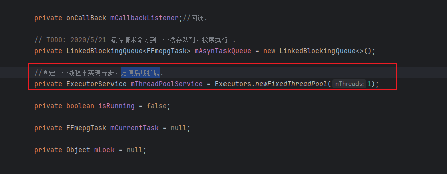
- 可以参考上面的OkHttp的线程池模式
- 因为比如我们要批量处理视频加水印的过程，就可以创建多个native层的线程执行FFmpeg的任务，这个是单线程的。

## 05.深度思考

### 5.1 关键问题探究


### 5.2 设计对比


## 06.实践验证

### 6.1 行为验证代码


### 6.2 性能测试


## 07.应用场景

### 7.1 最佳实践


### 7.2 使用禁忌


## 08.总结提炼

### 8.1 核心收获


### 8.2 知识图谱


### 8.3 延伸思考


## 09.参考资料

1. []()
2. []()
3. []()

## 其他介绍

### 01.关于我的博客

- csdn：http://my.csdn.net/qq_35829566

- 掘金：https://juejin.im/user/499639464759898

- github：https://github.com/jjjjjjava

- 邮箱：[934137388@qq.com]

